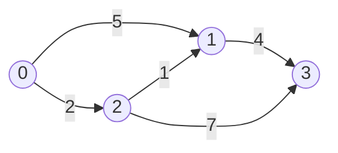

# 📘 Clase 10: Grafos — Conceptos Básicos y Representaciones

**Materia:** Algoritmos y Estructuras de Datos (AyED) — UNLP 2026  
**Temas:** Definición de grafos, terminología, representaciones en memoria (Matriz de adyacencia vs. Lista de adyacencia), y análisis de complejidades espacial y temporal.

---

> 💡 **¿Qué es un Grafo?**  
> Un grafo $G = (V, A)$ es una estructura matemática compuesta por un conjunto no vacío de **vértices (o nodos)** $V$, y un conjunto de **aristas (o arcos)** $A$ que conectan pares de vértices. Se utiliza para modelar relaciones entre objetos (redes sociales, mapas de ciudades, redes de computadoras, dependencias de software, etc.).

---
---

# Parte A: Terminología y Clasificación

## ⚙️ Conceptos Clave
* **Grafo Dirigido (Digrafo):** Las aristas tienen una dirección definida. Si hay una arista del nodo $u$ al nodo $v$, denotada $(u, v)$, se puede viajar de $u \to v$ pero no necesariamente de $v \to u$.
* **Grafo No Dirigido:** Las aristas son relaciones bidireccionales simétricas. La arista se denota $\{u, v\}$.
* **Grafo Pesado (Valorado):** Cada arista tiene asociado un valor numérico (peso, costo, distancia o capacidad).
* **Camino (Path):** Secuencia de vértices $v_1, v_2, \dots, v_k$ tales que existe una arista entre cada elemento sucesivo.
  * **Camino Simple:** Todos sus vértices son distintos (no se repiten nodos).
  * **Ciclo:** Camino donde el primer y último vértice son el mismo ($v_1 = v_k$).
* **Conectividad:**
  * En grafos **no dirigidos**: El grafo es **conexo** si existe un camino entre cualquier par de vértices.
  * En grafos **dirigidos**:
    * **Fuertemente Conexo:** Si existe un camino dirigido entre cualquier par de vértices en ambas direcciones ($u \to v$ y $v \to u$).
    * **Débilmente Conexo:** Si el grafo sería conexo si ignoramos la dirección de las aristas.
* **Grado de un Vértice ($d(v)$):**
  * En grafos **no dirigidos**: Cantidad de aristas incidentes en él.
  * En grafos **dirigidos**:
    * **Grado de Entrada (In-degree):** Cantidad de aristas que llegan al nodo.
    * **Grado de Salida (Out-degree):** Cantidad de aristas que salen del nodo.

---
---

# Parte B: Representación de Grafos en Memoria

Para representar un grafo de $V$ vértices y $E$ aristas en la computadora, existen dos estructuras clásicas:

## 1. Matriz de Adyacencia
Es una matriz bidimensional $M$ de tamaño $V \times V$ donde la celda $M[i][j]$ representa la existencia o el peso de una arista entre el vértice $i$ y el vértice $j$.

```text
Si el grafo es no pesado:
M[i][j] = 1 (si existe arista) o 0 (si no existe)

Si el grafo es pesado:
M[i][j] = peso (si existe arista) o ∞ / 0 (si no existe)
```

### 📦 Ejemplo: Grafo Dirigido Pesado y su Matriz



**Matriz resultante ($5 \times 5$, asumiendo costo $0$ para no-conexión):**

| | 0 | 1 | 2 | 3 |
|---|---|---|---|---|
| **0** | 0 | 5 | 2 | 0 |
| **1** | 0 | 0 | 0 | 4 |
| **2** | 0 | 1 | 0 | 7 |
| **3** | 0 | 0 | 0 | 0 |

* **Propiedad en No Dirigidos:** La matriz de adyacencia de un grafo no dirigido es siempre **simétrica** respecto a la diagonal principal.

---

## 2. Lista de Adyacencia
Consiste en un arreglo o lista de tamaño $V$, donde cada posición $i$ apunta a una lista enlazada que contiene los vértices adyacentes a $i$ (los nodos a los que apunta directamente).

### 📦 Ejemplo: Lista de Adyacencia del mismo grafo
```text
[0] ──► (1, peso: 5) ──► (2, peso: 2)
[1] ──► (3, peso: 4)
[2] ──► (1, peso: 1) ──► (3, peso: 7)
[3] ──► (vacío)
```

---
---

# Parte C: Comparativa y Complejidad Asintótica

La elección de la estructura de datos tiene un impacto directo en la memoria y el rendimiento del algoritmo:

## 📊 Tabla Comparativa de Complejidades
Sea $V$ el número de vértices y $E$ el número de aristas del grafo:

| Operación / Recurso | Matriz de Adyacencia | Lista de Adyacencia | ¿Cuál gana? |
|---|---|---|---|
| **Espacio de Memoria** | $\mathcal{O}(V^2)$ | $\mathcal{O}(V + E)$ | **Lista** (si el grafo es disperso) |
| **Insertar Vértice** | $\mathcal{O}(V^2)$ (redimensionar matriz) | $\mathcal{O}(1)$ (agregar a lista/arreglo) | **Lista** |
| **Insertar Arista $(u, v)$** | $\mathcal{O}(1)$ | $\mathcal{O}(1)$ (insertar al inicio de lista) | **Empate** |
| **Eliminar Arista $(u, v)$** | $\mathcal{O}(1)$ | $\mathcal{O}(d(u))$ (buscar en lista enlazada) | **Matriz** |
| **¿Existe arista $(u, v)$?** | $\mathcal{O}(1)$ | $\mathcal{O}(d(u))$ (recorrer lista de $u$) | **Matriz** |
| **Obtener adyacentes de $u$** | $\mathcal{O}(V)$ (recorrer fila completa) | $\mathcal{O}(d(u))$ (recorrer su lista) | **Lista** (muy superior para DFS/BFS) |

---

## 💡 Criterio de Selección para el Parcial

* **Grafo Disperso (Sparse):** Pocas aristas ($E \ll V^2$). La gran mayoría de las celdas en la matriz serían ceros. **Se debe usar Lista de Adyacencia** para ahorrar memoria y permitir recorridos rápidos. (La mayoría de los ejercicios prácticos de la cátedra caen en esta categoría).
* **Grafo Denso (Dense):** Muchas aristas ($E \approx V^2$). La matriz está casi llena. **Se prefiere Matriz de Adyacencia** por su simplicidad y acceso constante $\mathcal{O}(1)$ para consultas de aristas, ya que el ahorro de memoria de la lista se anula por el overhead de los punteros.

---
---

## 🧠 Preguntas Típicas de Examen

1. **¿Qué sucede al eliminar un vértice en una Lista de Adyacencia?**  
   No basta con borrar la lista del vértice eliminado. Hay que recorrer las listas de **todos** los demás vértices para eliminar cualquier arista entrante al vértice borrado. Su costo es $\mathcal{O}(V + E)$.
2. **Si represento un grafo no dirigido con Matriz de Adyacencia, ¿cuál es el grado de un vértice $u$?**  
   Es la suma de los valores $1$ en la fila (o columna) $u$. Se calcula en tiempo $\mathcal{O}(V)$.
3. **¿Cuál es el espacio de memoria que requiere un grafo no dirigido en Listas de Adyacencia?**  
   Requiere un arreglo de tamaño $V$ y un total de $2E$ nodos en las listas (ya que cada arista se representa dos veces: en la lista de $u$ y en la de $v$). El espacio es $\mathcal{O}(V + 2E) = \mathcal{O}(V + E)$.

---
*Próxima Clase: [Clase 11 y 12: Recorridos de Grafos en JAVA (DFS y BFS)](Clase11_12.md)*
