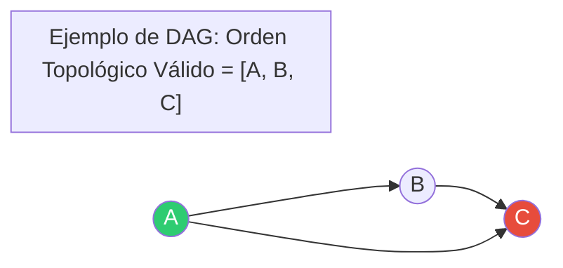

# 📘 Clase 13: Grafos — Orden Topológico

**Materia:** Algoritmos y Estructuras de Datos (AyED) — UNLP 2026  
**Temas:** Definición de Orden Topológico, Grafos Dirigidos Acíclicos (DAGs), Algoritmo basado en DFS (Pila), Algoritmo de Kahn (Grados de entrada), y detección de ciclos.

---

> 💡 **¿Qué es el Orden Topológico?**  
> Es una ordenación lineal de los vértices de un grafo dirigido tal que, para cada arista dirigida $(u, v)$, el vértice $u$ aparece **antes** que el vértice $v$ en la ordenación.
>  
> * **Metáfora:** Imagina las materias de tu carrera universitaria. Si *AyED* es correlativa de *OO2*, el orden topológico garantiza que cursarás *AyED* antes que *OO2*.

---
---

# Parte A: Requisitos y Aplicaciones

## ⚙️ El Grafo debe ser un DAG (Directed Acyclic Graph)
El orden topológico **solo existe si el grafo cumple dos condiciones**:
1. **Dirigido:** Las aristas deben tener dirección (para establecer precedencia).
2. **Acíclico:** **No debe tener ciclos**. Si existiera un ciclo (ej. la materia A requiere a la B, la B requiere a la C, y la C requiere a la A), sería imposible empezar a cursar cualquiera de ellas.



## 🎯 Aplicaciones Clásicas
* **Planificación de Tareas:** Ordenar procesos donde algunos dependen de la finalización de otros.
* **Sistemas de Compilación:** Determinar en qué orden compilar archivos fuente con dependencias (ej. `Maven`, `Gradle` o `Make`).
* **Instalación de paquetes en Linux:** Resolver dependencias de librerías (`apt-get`, `npm`).

---
---

# Parte B: Algoritmo Basado en DFS

Es el método más sencillo si ya conocemos DFS. Utiliza una **Pila (Stack)** para ir almacenando los nodos en orden inverso.

## ⚙️ Idea del Algoritmo
1. Inicializamos un arreglo de `visitados` en falso y una `Pila`.
2. Para cada nodo no visitado en el grafo, llamamos a una función auxiliar `dfsTopologico`.
3. En la función recursiva:
   * Marcamos el nodo actual como visitado.
   * Recorremos todos sus adyacentes no visitados.
   * **Paso Clave:** Una vez que terminamos de procesar todos los descendientes del nodo actual (al salir de la recursión), **apilamos el nodo**.
4. Al terminar el recorrido general, vaciamos la pila. El orden de salida de la pila es el **Orden Topológico**.

---

## 💻 Código en Java (DFS + Pila)

```java
import java.util.ArrayList;
import java.util.List;
import java.util.Stack;
import tp5.ejercicio1.Graph;
import tp5.ejercicio1.Vertex;
import tp5.ejercicio1.Edge;

public class OrdenTopologicoDFS {

    public static <T> List<T> ordenarTopologicamente(Graph<T> grafo) {
        List<T> resultado = new ArrayList<>();
        if (grafo == null || grafo.isEmpty()) return resultado;

        boolean[] visitados = new boolean[grafo.getSize()];
        Stack<Vertex<T>> pila = new Stack<>();

        // Procesar todos los vértices del grafo
        for (Vertex<T> v : grafo.getVertices()) {
            if (!visitados[v.getPosition()]) {
                ordenarHelper(grafo, v, visitados, pila);
            }
        }

        // Vaciar la pila en la lista de resultados
        while (!pila.isEmpty()) {
            resultado.add(pila.pop().getData());
        }

        return resultado;
    }

    private static <T> void ordenarHelper(Graph<T> grafo, Vertex<T> actual, 
                                          boolean[] visitados, Stack<Vertex<T>> pila) {
        visitados[actual.getPosition()] = true;

        for (Edge<T> arista : grafo.getEdges(actual)) {
            Vertex<T> vecino = arista.getTarget();
            if (!visitados[vecino.getPosition()]) {
                ordenarHelper(grafo, vecino, visitados, pila);
            }
        }

        // Al retornar de la recursión, sabemos que todas las dependencias 
        // de 'actual' ya están procesadas, por lo tanto lo metemos en la pila.
        pila.push(actual);
    }
}
```

---
---

# Parte C: Algoritmo de Kahn (Basado en BFS y Grados de Entrada)

Es una alternativa iterativa muy elegante que simula el proceso de ir "eliminando" nodos que ya no tienen dependencias pendientes.

## ⚙️ Idea del Algoritmo
1. Calculamos el **Grado de Entrada (In-Degree)** de cada vértice del grafo y lo guardamos en un arreglo.
2. Metemos en una **Cola** todos los vértices que tienen grado de entrada igual a $0$ (nodos sin dependencias previas).
3. Mientras la cola no esté vacía:
   * Desencolamos un nodo $u$ y lo agregamos al resultado.
   * Para cada vecino $v$ de $u$:
     * Decrementamos su grado de entrada en $1$ (es equivalente a eliminar el nodo $u$ y sus aristas).
     * Si el grado de entrada de $v$ llega a $0$, encolamos $v$.
4. **Detección de Ciclos:** Si la lista de resultados final tiene menos elementos que el tamaño del grafo, significa que el grafo **contiene un ciclo** (quedaron nodos con grado de entrada $> 0$ imposibles de encolar).

```text
Arreglo Grados Entrada inicial: [A:0, B:1, C:2]
1. Encolar A (grado 0).
2. Procesar A: sacamos A. Vecinos de A: B y C. 
   Decrementamos: B:0, C:1.
3. Como B llegó a 0, encolamos B.
4. Procesar B: sacamos B. Vecinos de B: C.
   Decrementamos: C:0. Encolamos C.
5. Procesar C: sacamos C.
Cola Vacía. Resultado: [A, B, C]
```

## 📊 Complejidad
Ambos métodos (DFS y Kahn) tienen una complejidad temporal óptima de **$\mathcal{O}(V + E)$** en listas de adyacencia.

---
---

## 🧠 Preguntas Rápidas de Examen

1. **¿El orden topológico de un DAG es único?**  
   **No necesariamente.** Un grafo puede tener múltiples órdenes topológicos válidos. Por ejemplo, si tienes las tareas "Ponerse medias" y "Ponerse pantalón", ambas deben hacerse antes que "Ponerse zapatos", pero el orden entre medias y pantalón no importa.
2. **¿Qué pasa si aplicamos Orden Topológico a un grafo con ciclos?**  
   * Con el método de Kahn, se detectará porque la cantidad de elementos devueltos será menor a $V$.
   * Con el método DFS, el resultado será incorrecto (inválido) a menos que se agregue explícitamente un algoritmo de detección de ciclos utilizando tres colores/estados para los nodos (no visitado, en proceso, terminado).

---
*Próxima Clase: [Clase 14: Caminos Mínimos (Dijkstra y Floyd)](Clase14.md)*
