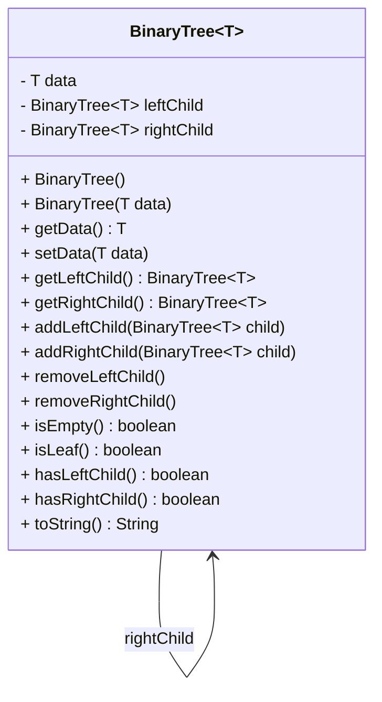
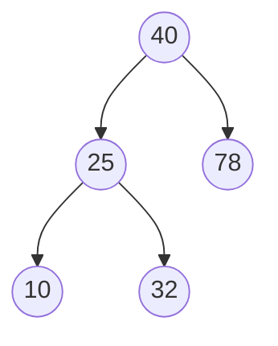
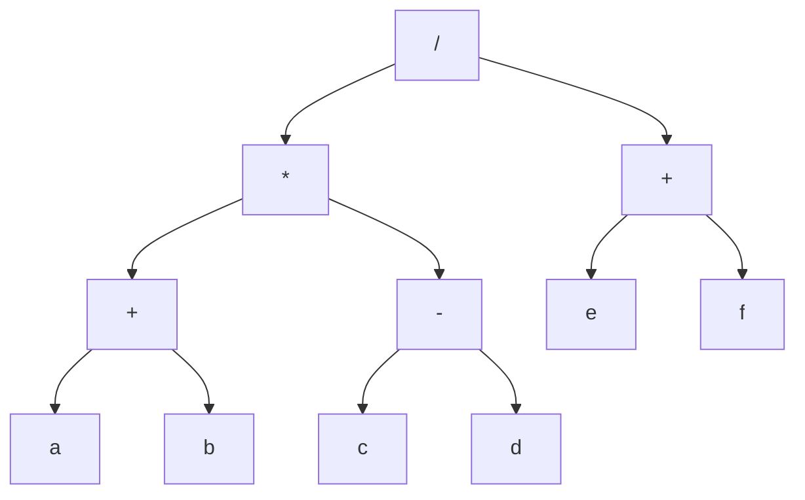
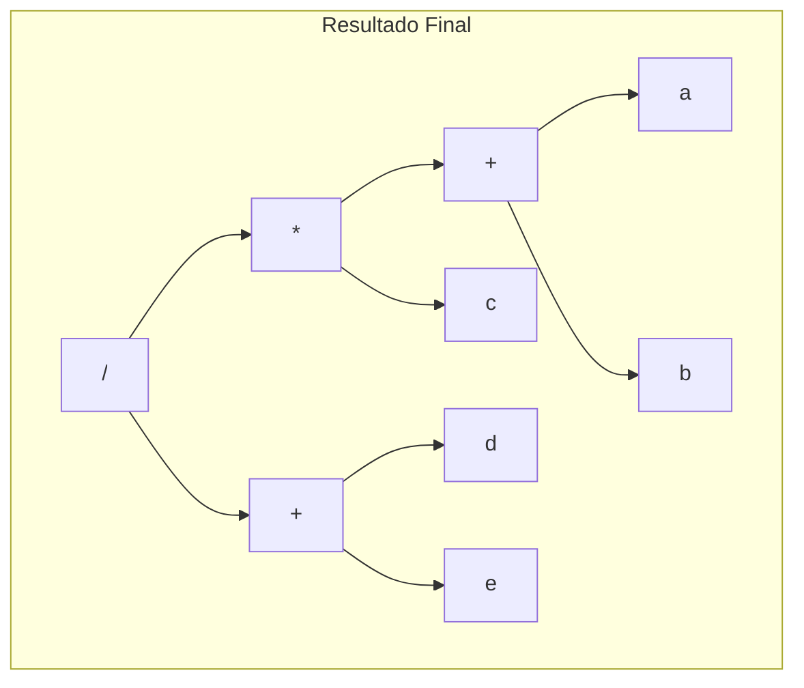
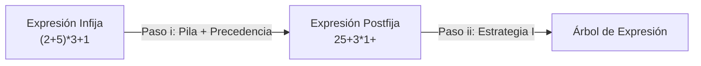
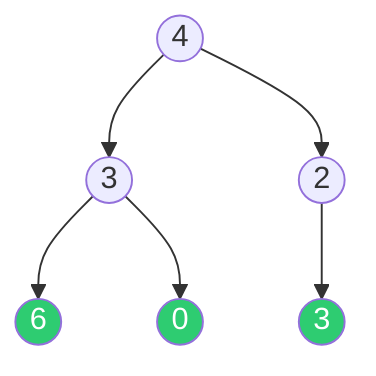

# 📘 Árboles Binarios y de Expresión en JAVA

**Materia:** Algoritmos y Estructuras de Datos (AyED) — UNLP 2026  
**Temas:** Implementación de BinaryTree en Java, Recorridos (Preorden, Inorden, Postorden, Por Niveles), Verificación de árbol lleno, Árboles de Expresión (construcción y evaluación), Problema Valencia Total

---

# Parte A: Implementación de BinaryTree en Java

## 🏗️ Estructura de la Clase BinaryTree

La clase `BinaryTree<T>` modela un árbol binario genérico. Cada nodo **es un árbol** en sí mismo (diseño recursivo), y contiene un dato y dos referencias a subárboles.



### 📦 Código Java Completo

```java
public class BinaryTree<T> {
    private T data;
    private BinaryTree<T> leftChild;   
    private BinaryTree<T> rightChild;
    
    public BinaryTree() {
        super();
    }

    public BinaryTree(T data) {
        this.data = data;
    }

    public T getData() {
        return data;
    }

    public void setData(T data) {
        this.data = data;
    }
   
    public BinaryTree<T> getLeftChild() {
        return leftChild;
    }

    public BinaryTree<T> getRightChild() {
        return rightChild;
    }

    public void addLeftChild(BinaryTree<T> child) {
        this.leftChild = child;
    }

    public void addRightChild(BinaryTree<T> child) {
        this.rightChild = child;
    }

    public void removeLeftChild() {
        this.leftChild = null;
    }

    public void removeRightChild() {
        this.rightChild = null;
    }

    public boolean isEmpty() {
        return (this.isLeaf() && this.getData() == null);
    }

    public boolean isLeaf() {
        return (!this.hasLeftChild() && !this.hasRightChild());
    }

    public boolean hasLeftChild() {
        return this.leftChild != null;
    }

    public boolean hasRightChild() {
        return this.rightChild != null;
    }

    @Override
    public String toString() {
        return this.getData().toString();
    }
}
```

> 💡 **Regla de oro:** Siempre preguntar `hasLeftChild()` / `hasRightChild()` **antes** de invocar `getLeftChild()` / `getRightChild()`. Si no, obtendremos un `NullPointerException`.

---

## 📦 Ejemplo: Creación de un Árbol

### Código de construcción

```java
BinaryTree<Integer> ab = new BinaryTree<Integer>(40);
BinaryTree<Integer> hijoIzquierdo = new BinaryTree<Integer>(25);
hijoIzquierdo.addLeftChild(new BinaryTree<Integer>(10));
hijoIzquierdo.addRightChild(new BinaryTree<Integer>(32));
BinaryTree<Integer> hijoDerecho = new BinaryTree<Integer>(78);
ab.addLeftChild(hijoIzquierdo);
ab.addRightChild(hijoDerecho);
```

### Árbol resultante



---

## ⚙️ Recorridos del Árbol Binario

Los cuatro recorridos fundamentales aplicados al árbol del ejemplo anterior:

| Recorrido | Orden de procesamiento | Resultado con el ejemplo |
|---|---|---|
| **Preorden** | Raíz → Izquierdo → Derecho | `40, 25, 10, 32, 78` |
| **Inorden** | Izquierdo → Raíz → Derecho | `10, 25, 32, 40, 78` |
| **Postorden** | Izquierdo → Derecho → Raíz | `10, 32, 25, 78, 40` |
| **Por Niveles** | Nivel 0, Nivel 1, Nivel 2... | `40, 25, 78, 10, 32` |

---

### ⚙️ Recorrido PreOrden (Dentro de BinaryTree)

```java
public class BinaryTree<T> {
    private T data;
    private BinaryTree<T> leftChild;
    private BinaryTree<T> rightChild;

    public void printPreorden() {
        System.out.println(this.getData());       // 1. Proceso la RAÍZ
        if (this.hasLeftChild()) {
            this.getLeftChild().printPreorden();    // 2. Recorro IZQUIERDO
        }
        if (this.hasRightChild()) {
            this.getRightChild().printPreorden();   // 3. Recorro DERECHO
        }
    }
}
```

---

### ⚙️ Recorrido PreOrden (Fuera de BinaryTree — en otra clase)

> *"¿Qué cambio se debería hacer si el método preorden() debe definirse en otra clase diferente al BinaryTree?"*

Se recibe el árbol como **parámetro** en lugar de usar `this`:

```java
public class BinaryTreePrinter<T> {
    public void preorden(BinaryTree<T> ab) {
        System.out.println(ab.getData());            // 1. Proceso la RAÍZ
        if (ab.hasLeftChild()) {
            this.preorden(ab.getLeftChild());         // 2. Recorro IZQUIERDO
        }
        if (ab.hasRightChild()) {
            this.preorden(ab.getRightChild());        // 3. Recorro DERECHO
        }
    }
}
```

---

### ⚙️ PreOrden que retorna una Lista (Fuera de BinaryTree)

> *"¿Qué cambio harías para devolver una lista con los elementos de un recorrido en preorden?"*

Se necesita un **método privado auxiliar** que acumule el resultado en una lista pasada por parámetro:

```java
package tp2.ejercicio1;
import java.util.List;
import java.util.LinkedList;

public class BinaryTreePrinter<T> {

    public List<T> preorden(BinaryTree<T> ab) {
        List<T> result = new LinkedList<T>();
        this.preorden_private(ab, result);
        return result;
    }

    private void preorden_private(BinaryTree<T> ab, List<T> result) {
        result.add(ab.getData());                              // 1. RAÍZ
        if (ab.hasLeftChild()) {
            preorden_private(ab.getLeftChild(), result);        // 2. IZQUIERDO
        }
        if (ab.hasRightChild()) {
            preorden_private(ab.getRightChild(), result);       // 3. DERECHO
        }
    }
}
```

En criollo: Como la recursión va "acumulando" resultados, la técnica es usar un método público que crea la lista vacía y delega el trabajo pesado a un método privado que va llenando esa misma lista en cada llamada recursiva.

---

### ⚙️ Recorrido por Niveles (BFS — dentro de BinaryTree)

Usa una **Cola** (`Queue`) y un centinela `null` para separar niveles:

```java
package tp1.ejercicio1;
import tp1.Queue;

public class BinaryTree<T> {
    // ...

    public void printLevelTraversal() {
        BinaryTree<T> ab = null;
        Queue<BinaryTree<T>> cola = new Queue<BinaryTree<T>>();
        cola.enqueue(this);
        cola.enqueue(null);  // Centinela de fin de nivel

        while (!cola.isEmpty()) {
            ab = cola.dequeue();
            if (ab != null) {
                System.out.print(ab.getData());
                if (ab.hasLeftChild()) {
                    cola.enqueue(ab.getLeftChild());
                }
                if (ab.hasRightChild()) {
                    cola.enqueue(ab.getRightChild());
                }
            } else if (!cola.isEmpty()) {
                System.out.println();    // Salto de línea entre niveles
                cola.enqueue(null);      // Nuevo centinela para el siguiente nivel
            }
        }
    }
}
```

En criollo: Se usa un `null` como "marca" para saber cuándo terminó un nivel completo. Cada vez que sacamos un `null` de la cola, sabemos que todos los nodos del nivel actual ya fueron procesados y los del próximo nivel ya están encolados.

---

### ⚙️ Verificar si un Árbol Binario es Lleno

> *"Dado un árbol binario de altura h, diremos que es un árbol lleno si cada nodo interno tiene grado 2 y todas las hojas están en el mismo nivel (h)."*

Se usa recorrido por niveles contando nodos por nivel y comparando con `2^nivel`:

```java
public boolean lleno() {
    BinaryTree<T> ab = null;
    Queue<BinaryTree<T>> cola = new Queue<BinaryTree<T>>();
    boolean lleno = true;
    int cant_nodos = 0;
    int nivel = 0;

    cola.enqueue(this);
    cola.enqueue(null);

    while (!cola.isEmpty() && lleno) {
        ab = cola.dequeue();
        if (ab != null) {
            if (ab.hasLeftChild()) {
                cola.enqueue(ab.getLeftChild());
                cant_nodos++;
            }
            if (ab.hasRightChild()) {
                cola.enqueue(ab.getRightChild());
                cant_nodos++;
            }
        } else if (!cola.isEmpty()) {
            // Terminó un nivel: verifico que tenga exactamente 2^nivel nodos
            if (cant_nodos == Math.pow(2, ++nivel)) {
                cola.enqueue(null);
                cant_nodos = 0;
            } else {
                lleno = false;
            }
        }
    }
    return lleno;
}
```

En criollo: recorro por niveles, y al terminar cada uno cuento cuántos hijos encolé. Si en el nivel `k` no hay exactamente `2^k` nodos, el árbol no es lleno.

---
---

# Parte B: Árboles de Expresión

## 🎯 Definición

Un **árbol de expresión** es un árbol binario asociado a una expresión aritmética donde:
- Los **nodos internos** representan **operadores** (`+`, `-`, `*`, `/`)
- Los **nodos externos (hojas)** representan **operandos** (`a`, `b`, `5`, etc.)

> 💡 **Ventaja:** No necesitan el uso de paréntesis — la precedencia queda implícita en la estructura del árbol.

### Aplicaciones
- En **compiladores** se usa para analizar, optimizar y traducir programas.
- **Evaluar expresiones** algebraicas o lógicas complejas de manera eficiente.
- Los árboles pueden almacenar expresiones algebraicas y a partir de ellos se puede generar notaciones sufijas, prefijas e infijas.

---

## 📊 Relación Recorridos ↔ Notaciones

Si tenemos un árbol de expresión con `(((a + b) * (c – d)) / (e + f))`:



| Recorrido | Notación | Resultado |
|---|---|---|
| **Inorden** | Infija | `(((a + b) * (c – d)) / (e + f))` |
| **Preorden** | Prefija (Polaca) | `/ * + a b - c d + e f` |
| **Postorden** | Postfija (Polaca Inversa) | `a b + c d - * e f + /` |

---

## ⚙️ Estrategia I: Construcción desde Expresión Postfija (con Pila)

### Pseudocódigo

```text
convertir(expr_posfija)
  crear una Pila vacía
  mientras (existe un carácter) hacer
    tomo un carácter de la expresión
    si es un operando  
        → creo un nodo y lo apilo
    si es un operador (lo tomo como la raíz de los dos últimos nodos creados)
        → creo un nodo R con ese operador 
          desapilo y lo agrego como hijo derecho de R
          desapilo y lo agrego como hijo izquierdo de R
          apilo R.
  desapilar → árbol de expresión final
```

### 📦 Ejemplo paso a paso: `ab+c*de+/`



| Paso | Carácter | Acción | Estado de la Pila |
|---|---|---|---|
| 1 | `a` | Operando → creo nodo, apilo | `[a]` |
| 2 | `b` | Operando → creo nodo, apilo | `[a, b]` |
| 3 | `+` | Operador → desapilo `b` (der), desapilo `a` (izq), armo nodo `+`, apilo | `[+]` |
| 4 | `c` | Operando → creo nodo, apilo | `[+, c]` |
| 5 | `*` | Operador → desapilo `c` (der), desapilo `+` (izq), armo nodo `*`, apilo | `[*]` |
| 6 | `d` | Operando → creo nodo, apilo | `[*, d]` |
| 7 | `e` | Operando → creo nodo, apilo | `[*, d, e]` |
| 8 | `+` | Operador → desapilo `e` (der), desapilo `d` (izq), armo nodo `+`, apilo | `[*, +]` |
| 9 | `/` | Operador → desapilo `+` (der), desapilo `*` (izq), armo nodo `/`, apilo | `[/]` |
| **FIN** | | Desapilo → **Raíz del árbol** | `[]` |

### 📦 Código Java: convertirPostfija

```java
public BinaryTree<Character> convertirPostfija(String exp) {
    Character c = null;
    BinaryTree<Character> result;
    Stack<BinaryTree<Character>> p = new Stack<BinaryTree<Character>>();

    for (int i = 0; i < exp.length(); i++) {
        c = exp.charAt(i);
        result = new BinaryTree<Character>(c);
        if ((c == '+') || (c == '-') || (c == '/') || (c == '*')) {
            // Es operador
            result.addRightChild(p.pop());
            result.addLeftChild(p.pop());
        }
        p.push(result);
    }
    return (p.pop());
}
```

---

## ⚙️ Estrategia II: Construcción desde Expresión Prefija (Recursiva)

### Pseudocódigo

```text
convertir(expr_prefija) 
  tomo primer carácter de la expresión
  creo un nodo R con ese carácter
  si el carácter es un operador  
    → agrego como hijo izquierdo de R: convertir(expr_prefija sin 1er carácter)
    → agrego como hijo derecho de R: convertir(expr_prefija sin 1er carácter)
  // es un operando
  devuelvo el nodo R
```

> *"Este proceso es posible ya que la expresión prefija está organizada en una forma en la que los operadores siempre aparecen antes de los operandos. Cuando se llega a las hojas, la recursión retorna y permite ir armando el árbol desde abajo hacia arriba."*

### 📦 Código Java: convertirPrefija

La expresión ejemplo es: `/*+abc+de`

```java
public BinaryTree<Character> convertirPrefija(StringBuffer exp) {
    Character c = exp.charAt(0);
    BinaryTree<Character> result = new BinaryTree<Character>(c);

    if ((c == '+') || (c == '-') || (c == '/') || c == '*') {
        // es operador
        result.addLeftChild(this.convertirPrefija(exp.delete(0, 1)));
        result.addRightChild(this.convertirPrefija(exp.delete(0, 1)));
    }
    // es operando
    return result;
}
```

> 💡 Se usa `StringBuffer` en vez de `String` porque necesitamos **mutar** (consumir caracteres con `delete`) la cadena original a medida que la recursión avanza. Si usaramos `String` (inmutable), cada llamada recursiva seguiría viendo la misma cadena.

---

## ⚙️ Estrategia III: Construcción desde Expresión Infija (Doble paso)

La estrategia para crear un árbol a partir de una expresión **infija** es más compleja. Se divide en **dos pasos**:



### Paso (i): Conversión de Infija a Postfija

**Pseudocódigo completo:**

```text
crear una Pila vacía
mientras (existe un carácter) hacer
  tomo un carácter de la expresión
  si es un operando → coloca en la salida
  si es un operador → se analiza su prioridad respecto del tope de la pila:
    si es un "(" → se apila
    si es un ")" → se desapila todo hasta el "(", incluido éste
    sino
      pila vacía u operador con > prioridad que el tope → se apila 
      operador con <= prioridad que el tope → se desapila, se manda a la salida
        y se vuelve a comparar el operador con el tope de la pila
// se terminó de procesar la expresión infija
Se desapilan todos los elementos llevándolos a la salida, hasta que la pila quede vacía.
```

### 📊 Tabla de Prioridades de Operadores

| Prioridad | Operadores |
|---|---|
| Alta | `^` (potencia) |
| Media | `*`, `/` |
| Baja | `+`, `-` |

> 💡 **Nota:** Los `( { [` se apilan siempre (como si tuvieran mayor prioridad) y a partir de ahí se considera como si la pila estuviera vacía.

### 📦 Ejemplo: `(2+5)*3+(10/5)` → `2 5 + 3 * 10 5 / +`

| Paso | Carácter | Acción | Pila | Salida |
|---|---|---|---|---|
| 1 | `(` | Se apila | `(` | |
| 2 | `2` | Operando → salida | `(` | `2` |
| 3 | `+` | Apilo (pila "vacía" por el `(`) | `( +` | `2` |
| 4 | `5` | Operando → salida | `( +` | `2 5` |
| 5 | `)` | Desapilo hasta el `(` | | `2 5 +` |
| 6 | `*` | Pila vacía → apilo | `*` | `2 5 +` |
| 7 | `3` | Operando → salida | `*` | `2 5 + 3` |
| 8 | `+` | `+` ≤ `*` → desapilo `*`, apilo `+` | `+` | `2 5 + 3 *` |
| 9 | `(` | Se apila | `+ (` | `2 5 + 3 *` |
| 10 | `10` | Operando → salida | `+ (` | `2 5 + 3 * 10` |
| 11 | `/` | Apilo (pila "vacía" por el `(`) | `+ ( /` | `2 5 + 3 * 10` |
| 12 | `5` | Operando → salida | `+ ( /` | `2 5 + 3 * 10 5` |
| 13 | `)` | Desapilo hasta el `(` | `+` | `2 5 + 3 * 10 5 /` |
| **FIN** | | Desapilo todo | | `2 5 + 3 * 10 5 / +` |

### Paso (ii): Aplicar Estrategia I
Con la expresión postfija `2 5 + 3 * 10 5 / +` ya podemos aplicar el algoritmo de la pila visto en la Estrategia I para construir el árbol.

---

## ⚙️ Evaluación de un Árbol de Expresión

Se recorre en **postorden** recursivo: primero se evalúan los hijos (operandos) y luego se aplica el operador de la raíz.

```java
public Integer evaluar(BinaryTree<Character> arbol) {
    Character c = arbol.getData();

    if ((c == '+') || (c == '-') || (c == '/') || c == '*') {
        // es operador → evalúo recursivamente ambos hijos
        int operador_1 = evaluar(arbol.getLeftChild());
        int operador_2 = evaluar(arbol.getRightChild());
        switch (c) {
            case '+': return operador_1 + operador_2;
            case '-': return operador_1 - operador_2;
            case '*': return operador_1 * operador_2;
            case '/': return operador_1 / operador_2;
        }
    }
    // es operando → convierto el carácter a número
    return Integer.parseInt(c.toString());
}
```

En criollo: La función mira un nodo. Si es un número, lo devuelve. Si es un operador (como `+`), primero le pide el resultado numérico a toda su rama izquierda, después a toda la derecha, y recién ahí los opera. Es la magia de la recursión postorden.

---
---

# Parte C: Problema Práctico — Valencia Total (SPOJ UCV2013J)

## 🎯 Enunciado

> *"El Sr. White ha observado que cada compuesto está hecho de moléculas que están unidas entre sí siguiendo la estructura de un árbol binario completo. Cada nodo del árbol almacena la valencia de una molécula. Se descarga como un stream de números enteros y se necesita obtener la valencia total de las hojas del árbol dado."*

**Input:** `6 4 3 2 6 0 3` → N=6 seguido de 6 valencias  
**Output:** `9` (suma de las hojas: `6 + 0 + 3 = 9`)

### Árbol resultante del ejemplo:



> Las hojas (en verde) son `6`, `0`, `3` → Valencia Total = **9**

---

## ⚙️ Creación del Árbol — Versión Iterativa (Por Niveles)

Dado que el stream llega en orden por niveles (como un árbol completo), se usa una **Cola** para irle asignando hijos de izquierda a derecha:

```java
public class ValenciaTotal {

    private static BinaryTree<Integer> createBinaryTreeIte(int[] stream) {
        if (stream.length <= 1) 
            return null;
        
        BinaryTree<Integer> root = new BinaryTree<>(stream[1]);
        Queue<BinaryTree<Integer>> queue = new Queue<>();
        queue.enqueue(root);
        int i = 2;

        while (i < stream.length) {
            BinaryTree<Integer> current = queue.dequeue();
            
            // hijo izquierdo
            current.addLeftChild(new BinaryTree<>(stream[i++]));
            queue.enqueue(current.getLeftChild());
            
            // hijo derecho
            if (i < stream.length) {
                current.addRightChild(new BinaryTree<>(stream[i++]));
                queue.enqueue(current.getRightChild());
            }
        }
        return root;
    }
}
```

### Mapeo del stream al árbol:

```text
Índices:  0    1    2    3    4    5    6
Stream:  [N]  [4]  [3]  [2]  [6]  [0]  [3]

Árbol:          1 (stream[1])
              /   \
           2         3
          / \       /
        4    5     6
```

---

## ⚙️ Creación del Árbol — Versión Recursiva

Como es un árbol **completo**, dado un nodo en posición `i`:
- **Hijo izquierdo** en posición `2*i`
- **Hijo derecho** en posición `2*i + 1`

```java
private static BinaryTree<Integer> createBinaryTreeRec(int[] stream, int i) {
    int dato = stream[i];
    BinaryTree<Integer> ab = new BinaryTree<Integer>(dato);
    
    if (2 * i < stream.length)
        ab.addLeftChild(createBinaryTreeRec(stream, 2 * i));
    if (2 * i + 1 < stream.length)
        ab.addRightChild(createBinaryTreeRec(stream, 2 * i + 1));
    
    return ab;
}
```

---

## ⚙️ Calcular la Valencia Total (Suma de Hojas)

```java
public static int calcularValencia(BinaryTree<Integer> arbol) {
    if (arbol.isLeaf())
        return arbol.getData();  // Caso base: es hoja → aporta su valor
    
    int suma = 0;
    if (arbol.hasLeftChild()) {
        suma = suma + calcularValencia(arbol.getLeftChild());
    }
    if (arbol.hasRightChild()) {
        suma = suma + calcularValencia(arbol.getRightChild());
    }
    return suma;
}
```

En criollo: Sólo las hojas aportan a la suma. Los nodos internos simplemente le preguntan a sus hijos "¿cuánto suman tus hojas?" y pasan el total para arriba.

---

## 📚 Recursos y Referencias

- **Cátedra:** *Algoritmos y Estructuras de Datos* — UNLP. 2026.
- PDFs elaborados por Prof. Alejandra Schiavoni y equipo.
- Problema **Valencia Total**: SPOJ.com — Problem UCV2013J
