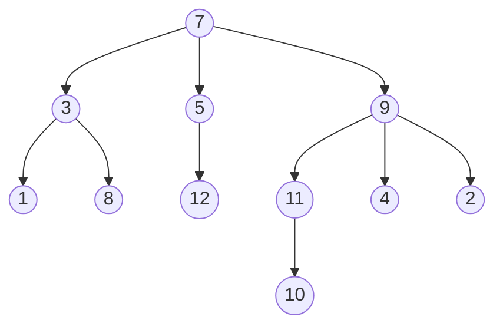
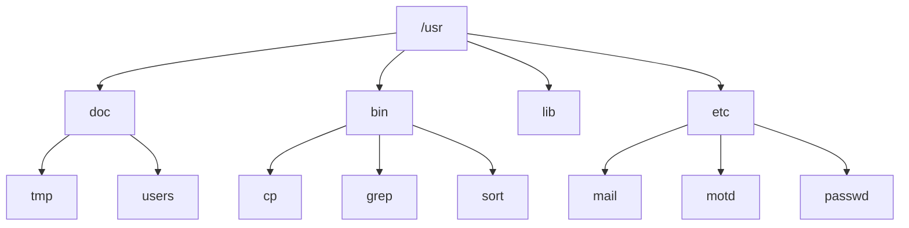
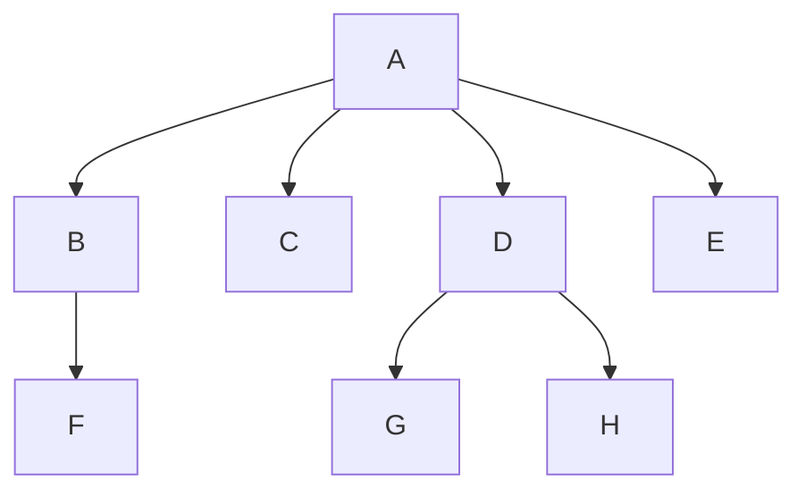
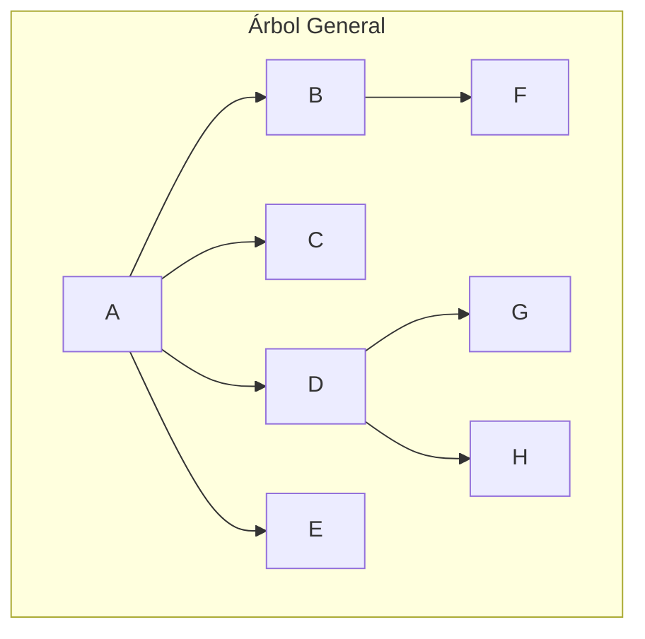
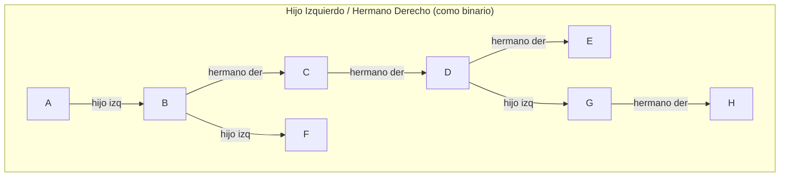

# 📘 Árboles Generales

**Materia:** Algoritmos y Estructuras de Datos (AyED) — UNLP 2026  
**Temas:** Definición de Árbol General, Terminología (Grado, Altura, Profundidad), Árbol Lleno y Completo (grado k), Representaciones en Memoria, Recorridos (Preorden, Inorden, Postorden, Por Niveles), Ejercicios

---

## 🎯 Definición

Un **árbol general** es una colección de nodos, tal que:
- Puede estar **vacía** (Árbol vacío).
- Puede estar formada por un nodo distinguido `R`, llamado **raíz**, y un conjunto de árboles `T1, T2, …, Tk` (k ≥ 0) llamados **subárboles**, donde la raíz de cada subárbol `Ti` está conectado a `R` por medio de una **arista**.

En criollo: A diferencia del árbol binario (máximo 2 hijos), un árbol general permite **cualquier cantidad de hijos** por nodo. Pensá en un sistema de archivos: una carpeta puede tener 0, 1, 5 o 100 subcarpetas.

### 📦 Ejemplo visual de un Árbol General



---

## 📊 Terminología

| Término | Definición | Ejemplo (con el árbol de arriba) |
|---|---|---|
| **Grado de un nodo** | El número de hijos del nodo. | Grado(7) = 3, Grado(5) = 1 |
| **Grado del árbol** | El grado del nodo con mayor grado. | Grado del árbol = max(3, 2, 1, 3, 1) = 3 |
| **Altura de un nodo** | Longitud del camino más largo desde ese nodo hasta una hoja. Las hojas tienen altura 0. | Altura(5) = 1, Altura(7) = ? |
| **Altura del árbol** | La altura del nodo raíz. | — |
| **Profundidad / Nivel** | Longitud del único camino desde la raíz hasta el nodo. La raíz tiene profundidad 0. | Profundidad(3) = 1, Profundidad(12) = 2 |

### 📦 Ejemplo: Preguntas sobre el árbol

Dado el árbol del ejemplo:

| Pregunta | Respuesta |
|---|---|
| ¿Cuál es la **altura** del nodo 3? | **3** (camino más largo: 3→8→...? en realidad depende, pero en el PDF: Altura(3) = 3) |
| ¿Cuál es la **profundidad** del nodo 12? | **2** (7 → 5 → 12) |
| ¿Cuál es el **grado** del árbol? | **4** (el nodo con más hijos tiene 4) |
| ¿Cuál es la **altura** del árbol? | **4** |

---

## ⚙️ Árbol Lleno y Completo (Grado K)

### Árbol Lleno

> *"Dado un árbol T de grado k y altura h, diremos que T es lleno si cada nodo interno tiene grado k y todas las hojas están en el mismo nivel (h)."*

Definición recursiva:
1. T es un nodo simple (→ árbol lleno de altura 0), **o**  
2. T es de altura h y **todos** sus sub-árboles son llenos de altura h-1.

### Árbol Completo

> *"Dado un árbol T de grado k y altura h, diremos que T es completo si es lleno de altura h-1 y el nivel h se completa de izquierda a derecha."*

---

## 📊 Fórmulas de Cantidad de Nodos

### Nodos por nivel en un árbol lleno de grado K

| Nivel | Cantidad de nodos |
|---|---|
| Nivel 0 | k⁰ = 1 |
| Nivel 1 | k¹ = k |
| Nivel 2 | k² |
| Nivel 3 | k³ |
| ... | ... |
| Nivel h | kʰ |

La cantidad total es la suma de una **serie geométrica** de razón k:

### Fórmula: Árbol Lleno de grado K y altura h

```text
N = k⁰ + k¹ + k² + ... + kʰ = (k^(h+1) - 1) / (k - 1)
```

### Fórmula: Árbol Completo de grado K y altura h

La cantidad de nodos varía entre un **mínimo** y un **máximo**:

| Caso | Fórmula | Explicación |
|---|---|---|
| **Mínimo** (1 solo nodo en nivel h) | `N = (kʰ + k - 2) / (k - 1)` | Es lleno hasta h-1, más 1 nodo extra en nivel h |
| **Máximo** (lleno completo) | `N = (k^(h+1) - 1) / (k - 1)` | Es directamente un árbol lleno |

> 💡 **Caso binario (k=2):** Lleno → `N = 2^(h+1) - 1`. Completo → entre `2ʰ` y `2^(h+1) - 1`.

En criollo: Para un árbol ternario (k=3) de altura 2, la progresión de nodos por piso sería: 1 → 3 → 9, dando un total de 13 nodos si es lleno. Un árbol completo tendría entre 4 y 13 nodos, según cuántos hijos haya en el último nivel.

---

## 🏗️ Ejemplos de Árboles Generales en la vida real

- ✅ **Organigrama de una empresa** (gerente → directores → empleados)
- ✅ **Árboles genealógicos**
- ✅ **Taxonomía que clasifica organismos** (Reino → Filo → Clase → ...)
- ✅ **Sistemas de archivos** (directorios y subdirectorios)
- ✅ **Organización de un libro** en capítulos y secciones

---

## 📦 Ejemplo: Sistema de Archivos como Árbol General



---
---

# Parte B: Representaciones en Memoria

¿Cómo almacenar un nodo que puede tener **cualquier** cantidad de hijos?

## 📊 Comparación de Representaciones

| Representación | Estructura del Nodo | Ventajas ✅ | Desventajas ❌ |
|---|---|---|---|
| **Lista de hijos (Arreglo)** | Dato + Array fijo de hijos | Acceso directo por índice | Desperdicio de espacio si pocos hijos |
| **Lista de hijos (Lista enlazada)** | Dato + Lista dinámica de hijos | Flexibilidad, sin desperdicio | Recorrido secuencial para acceder a un hijo |
| **Hijo Izquierdo / Hermano Derecho** | Dato + hijo izquierdo + hermano derecho | Se modela como árbol binario | Acceso al k-ésimo hijo requiere recorrer hermanos |

---

### 🏗️ Representación: Lista de hijos (con Arreglos)

Cada nodo tiene un identificador y un arreglo con las posiciones de sus hijos.



En esta representación, cada nodo almacena sus hijos en celdas contiguas de un array. Si el grado máximo del árbol es 4, se reservan 4 celdas por nodo, aunque tenga menos hijos.

---

### 🏗️ Representación: Lista de hijos (con Listas Enlazadas)

Cada nodo mantiene una **lista enlazada** donde cada elemento apunta a un hijo. Mayor flexibilidad ya que la lista crece dinámicamente.

---

### 🏗️ Representación: Hijo Más Izquierdo y Hermano Derecho

Técnica que permite **reducir todo árbol general a un árbol binario**:
- El puntero "izquierdo" apunta al **primer hijo** (el más a la izquierda).
- El puntero "derecho" apunta al **siguiente hermano** (el que está a su derecha en el mismo nivel).





En criollo: En vez de guardar "todos mis hijos", cada nodo solo conoce a su primer hijo y a su hermano de al lado. Para llegar al tercer hijo de A, tenés que: ir al primer hijo (B), luego saltar al hermano de B (C), luego al hermano de C (D). Es encadenamiento horizontal.

---
---

# Parte C: Recorridos en Árboles Generales

## 📊 Resumen de Recorridos

| Recorrido | Orden de procesamiento | Aplicación típica |
|---|---|---|
| **Preorden** | Proceso la raíz, luego **todos** los hijos (de izq a der) | Listar contenido de un directorio |
| **Inorden** | Proceso el primer hijo, luego la raíz, luego los restantes hijos | Menos usado en árboles generales |
| **Postorden** | Proceso **todos** los hijos, luego la raíz | Calcular tamaño de un directorio |
| **Por Niveles** | Proceso nivel por nivel (usando Cola) | Búsqueda en amplitud |

---

### ⚙️ Recorrido Preorden

Se procesa primero la **raíz** y luego los **hijos** de izquierda a derecha.

**Pseudocódigo:**
```text
preOrden():
   imprimir(dato)
   obtener lista de hijos
   mientras (lista tenga datos):
       hijo ← obtenerHijo
       hijo.preOrden()
```

**Código Java:**
```java
public void preOrden() {
    System.out.println(this.dato);           // 1. Proceso la raíz

    List<ArbolGeneral<T>> hijos = this.getHijos();
    for (ArbolGeneral<T> hijo : hijos) {
        hijo.preOrden();                      // 2. Recursión en cada hijo
    }
}
```

### 📦 Ejemplo con el sistema de archivos

```text
/usr
  doc
    tmp
    users
  bin
    cp
    grep
    sort
  lib
  etc
    mail
    motd
    passwd
```

---

### ⚙️ Recorrido Postorden

Se procesan primero **todos los hijos** y luego la **raíz**.

**Pseudocódigo:**
```text
postOrden():
   obtener lista de hijos
   mientras (lista tenga datos):
       hijo ← obtenerHijo
       hijo.postOrden()
   imprimir(dato)
```

**Código Java:**
```java
public void postOrden() {
    List<ArbolGeneral<T>> hijos = this.getHijos();
    for (ArbolGeneral<T> hijo : hijos) {
        hijo.postOrden();                     // 1. Recursión en cada hijo
    }
    System.out.println(this.dato);            // 2. Proceso la raíz AL FINAL
}
```

> 💡 **Caso de uso:** Calcular el **tamaño ocupado** por un directorio. Necesito saber primero cuánto pesan todos los archivos y subdirectorios internos antes de poder saber cuánto pesa el directorio completo.

---

### ⚙️ Recorrido Por Niveles (BFS)

**Pseudocódigo:**
```text
porNiveles():
   encolar(raíz)
   mientras cola no se vacíe:
       v ← desencolar()
       imprimir(dato de v)
       para cada hijo de v:
           encolar(hijo)
```

**Código Java:**
```java
public void porNiveles(ArbolGeneral<T> raiz) {
    Queue<ArbolGeneral<T>> cola = new Queue<>();
    cola.enqueue(raiz);

    while (!cola.isEmpty()) {
        ArbolGeneral<T> nodo = cola.dequeue();
        System.out.println(nodo.getDato());         // Proceso el nodo actual

        List<ArbolGeneral<T>> hijos = nodo.getHijos();
        for (ArbolGeneral<T> hijo : hijos) {
            cola.enqueue(hijo);                      // Encolo todos sus hijos
        }
    }
}
```

### 📦 Resultado del recorrido por niveles en el sistema de archivos

```text
Nivel 0: /usr
Nivel 1: doc, bin, lib, etc
Nivel 2: tmp, users, cp, grep, sort, mail, motd, passwd
```

---
---

# Parte D: Ejercicios

## 📦 Ejercicio 1: Escribir los recorridos

Dado un árbol general, escribir los recorridos preorden, inorden y postorden.

> 💡 Este ejercicio se resuelve aplicando mecánicamente los algoritmos vistos en las secciones anteriores.

---

## 📦 Ejercicio 2: Abeto Navideño (Codeforces — Problem B)

### Enunciado

> *"El vértice u se llama hijo del vértice v y el vértice v se llama padre del vértice u si existe una arista dirigida de v a u. El árbol tiene un vértice distinguido llamado raíz, que es el único vértice que no tiene padre. Un vértice se llama hoja si no tiene hijos y tiene padre."*
>
> *"Llamaremos **abeto** a un árbol si cada vértice no hoja tiene **al menos 3 hijos hojas**. Dado un árbol general, compruebe si es un abeto."*

### Input / Output

**Input:** Primera línea con `n` (cantidad de vértices, 3 ≤ n ≤ 1000). Siguientes n-1 líneas con el índice del padre del (i+1)-ésimo vértice.  
**Output:** `"Yes"` si es abeto, `"No"` si no lo es.

### 📦 Ejemplos

| Ejemplo | Input | Output | Explicación |
|---|---|---|---|
| 1 | `4` → padres: `1 1 1` | `Yes` | Raíz (1) tiene 3 hijos hojas ✅ |
| 2 | `7` → padres: `1 1 1 2 2 2` | `No` | Nodo 2 tiene 3 hijos hojas, pero nodo 1 tiene solo 0 hijos hojas (sus 3 hijos son internos) ❌ |
| 3 | `8` → padres: `1 1 1 1 3 3 3` | `Yes` | Nodo 1: 3 hijos hojas (2,4,5). Nodo 3: 3 hijos hojas (6,7,8) ✅ |

En criollo: Para que sea "abeto", todo nodo que no sea hoja tiene que estar rodeado de *al menos* 3 hojas directas. Si algún nodo interno tiene menos de 3 hijos que sean hojas, no es abeto.

---

## 📚 Recursos y Referencias

- **Cátedra:** *Algoritmos y Estructuras de Datos* — UNLP. 2026.
- PDFs elaborados por Prof. Alejandra Schiavoni y Prof. Catalina Mostaccio.
- Ejercicio **Abeto Navideño**: Codeforces — Problem B.
