# 📘 Colas de Prioridad — Heap Binaria

**Materia:** Algoritmos y Estructuras de Datos (AyED) — UNLP 2026  
**Temas:** Cola de Prioridad, Implementaciones posibles, Heap Binaria (Propiedad Estructural y de Orden), Representación en Arreglo, Operaciones Insert y DeleteMin (Percolate Up / Percolate Down), Operaciones adicionales (DecreaseKey, IncreaseKey, DeleteKey)

---

## 🎯 Definición

Una **cola de prioridad** es una estructura de datos que permite al menos dos operaciones:

| Operación | Descripción |
|---|---|
| **Insert** | Inserta un elemento en la estructura. |
| **DeleteMin** | Encuentra, recupera y **elimina** el elemento mínimo de la estructura. |

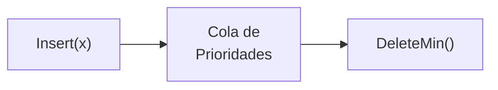

En criollo: A diferencia de una cola FIFO (primero que entra, primero que sale), en una cola de prioridad siempre sale primero **el elemento de mayor prioridad** (el más chico si es MinHeap, el más grande si es MaxHeap), sin importar cuándo entró.

---

## 🎯 Aplicaciones

- ✅ **Cola de impresión** (La impresión urgente del jefe sale antes que la tuya).
- ✅ **Sistema Operativo** (Scheduling: procesos críticos se atienden antes).
- ✅ **Algoritmos de Ordenación** (HeapSort).
- ✅ **Algoritmos de Grafos** (Dijkstra para caminos mínimos).

---

## 📊 Implementaciones Posibles

| Implementación | Costo del `Insert` | Costo del `DeleteMin` | Observaciones |
|---|---|---|---|
| **Lista Ordenada** | `O(N)` — lento, debe buscar su lugar | `O(1)` — el mínimo está al comienzo | Insertar es caro |
| **Lista Desordenada** | `O(1)` — lo meto al final | `O(N)` — debo buscar el mínimo | Borrar es caro |
| **Árbol Binario de Búsqueda** | `O(log N)` promedio | `O(log N)` promedio | Depende del balanceo |
| **Heap Binaria** | **`O(log N)` peor caso** | **`O(log N)` peor caso** | No usa punteros. Óptima. |

En criollo: La Heap es la solución perfecta porque ambas operaciones cuestan `O(log N)` en el peor caso, mientras que las listas siempre pierden en una de las dos.

---
---

# Parte B: Heap Binaria

## 🎯 Definición

Una **Heap Binaria** es una implementación de colas de prioridad que **no usa punteros** y permite implementar ambas operaciones con `O(log N)` operaciones en el peor caso.

Cumple con **dos propiedades** simultáneamente:

| Propiedad | Descripción |
|---|---|
| **Propiedad Estructural** | La heap debe ser un **árbol binario completo**. |
| **Propiedad de Orden** | Cada nodo es menor o igual (MinHeap) a sus hijos. |

---

## 🏗️ Propiedad Estructural

> *"Una heap es un árbol binario completo."*

**Recordatorio:**
- Un **árbol binario lleno** de altura h: los nodos internos tienen exactamente 2 hijos y las hojas tienen la misma profundidad.
- Un **árbol binario completo** de altura h: es un árbol binario lleno de altura h-1 y en el **nivel h los nodos se completan de izquierda a derecha**.

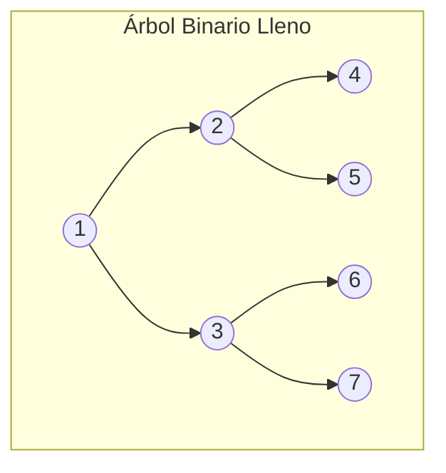

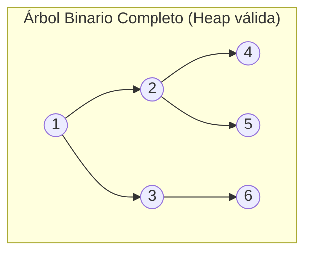

### Cantidad de nodos

El número de nodos `n` de un árbol binario completo de altura `h` satisface:

```text
2ʰ  ≤  n  ≤  (2^(h+1) - 1)
```

**Demostración:**
- Si el árbol es **lleno**: `n = 2^(h+1) - 1`
- Si **no** (mínimo en nivel h): `n = 2^(h-1+1) - 1 + 1 = 2ʰ`

> 💡 **Consecuencia clave:** La altura `h` del árbol es de **O(log n)**. Esto es lo que garantiza que Insert y DeleteMin sean logarítmicos.

---

## 🏗️ Representación en Arreglo (Sin Punteros)

Dado que un árbol binario completo es una estructura **regular** (sin huecos), puede almacenarse directamente en un **arreglo**, evitando la necesidad de punteros:

### Reglas de posicionamiento

| Elemento | Posición en el arreglo |
|---|---|
| **Raíz** | Posición `1` |
| **Hijo izquierdo** del nodo en posición `i` | Posición `2 * i` |
| **Hijo derecho** del nodo en posición `i` | Posición `2 * i + 1` |
| **Padre** del nodo en posición `i` | Posición `⌊i / 2⌋` |

### 📦 Ejemplo: Heap mapeada a Arreglo

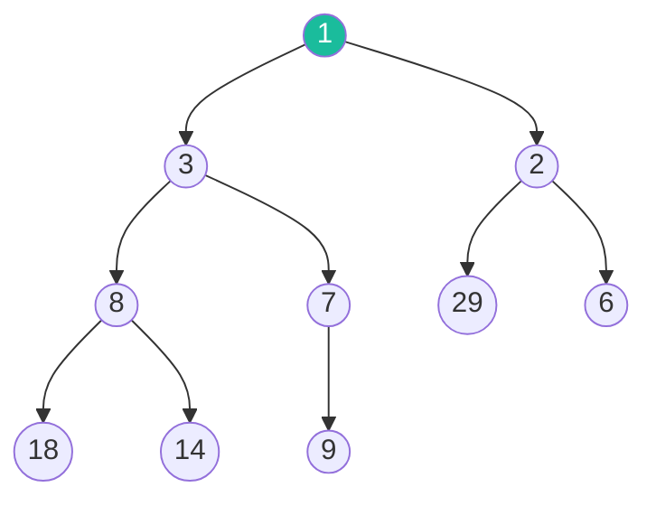

Mapeada al arreglo:

```text
Posición:  1    2    3    4    5    6    7    8    9    10
Dato:     [1]  [3]  [2]  [8]  [7]  [29] [6]  [18] [14] [9]
```

**Verificación:**
- Nodo `3` está en posición `2`. Su padre: `⌊2/2⌋ = 1` → nodo `1` ✅
- Nodo `8` está en posición `4`. Sus hijos: `2*4=8` → nodo `18`, `2*4+1=9` → nodo `14` ✅
- Nodo `7` está en posición `5`. Su hijo izq: `2*5=10` → nodo `9`. No tiene hijo der. ✅

---

## ⚙️ Propiedad de Orden

### MinHeap
- El elemento **mínimo** está almacenado en la raíz.
- El dato almacenado en cada nodo es **menor o igual** al de sus hijos.

### MaxHeap
- Se usa la propiedad inversa: el **máximo** está en la raíz.
- El dato almacenado en cada nodo es **mayor o igual** al de sus hijos.

> 💡 En esta materia se trabaja principalmente con **MinHeap**, pero los algoritmos son simétricos para MaxHeap (solo se invierte la comparación).

---

## 🏗️ Implementación de una Heap

Una heap `H` consta de:
- Un **arreglo** que contiene los datos.
- Un valor `tamaño` que indica el número de elementos almacenados.

| Ventaja | Descripción |
|---|---|
| ✅ | No se necesita usar punteros |
| ✅ | Fácil implementación de las operaciones |
| ✅ | Acceso al padre e hijos con aritmética simple |

---
---

# Parte C: Operación Insert (Filtrado Hacia Arriba)

## ⚙️ Algoritmo de Inserción

**Pasos:**
1. El dato se inserta como **último ítem** en la heap (primera posición libre).
2. La **propiedad de orden puede ser violada** (el nuevo es menor que su padre).
3. Se debe hacer un **filtrado hacia arriba** (*Percolate Up*) para restaurar la propiedad.

### 📦 Ejemplo Visual: Insertar el `1`

**Estado inicial:**

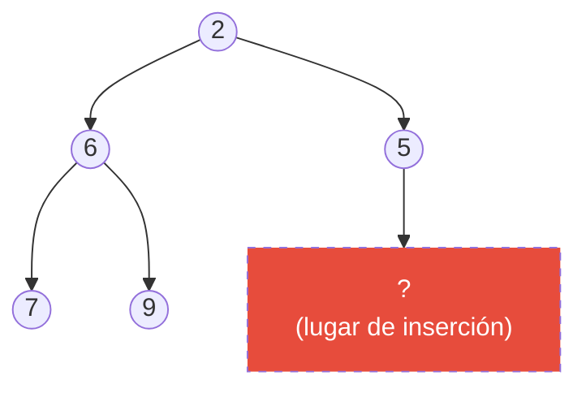

**Paso 1:** Inserto el `1` en la primera posición libre:

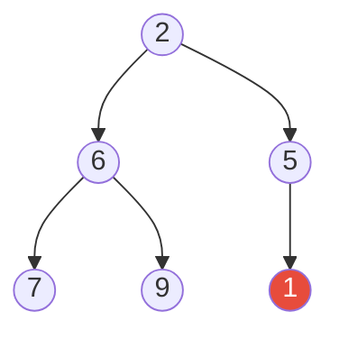

**Paso 2:** `1 < 5` (su padre) → **swap** → sube:

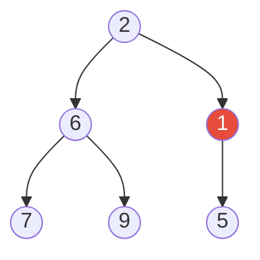

**Paso 3:** `1 < 2` (su padre, la raíz) → **swap** → sube:

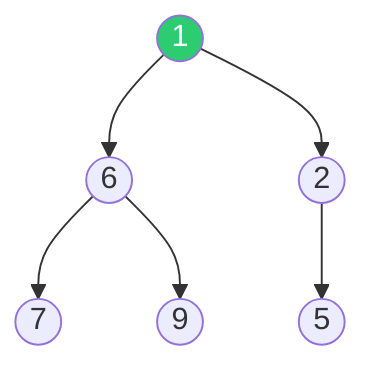

✅ **Propiedad restaurada.** El `1` es ahora la nueva raíz (mínimo).

---

## ⚙️ Percolate Up (Filtrado Hacia Arriba)

> *"El filtrado hacia arriba restaura la propiedad de orden intercambiando k a lo largo del camino hacia arriba desde el lugar de inserción. El filtrado termina cuando la clave k alcanza la raíz o un nodo cuyo padre tiene una clave menor."*

> 💡 Ya que el algoritmo recorre la **altura** de la heap, tiene **O(log n)** intercambios.

### Código: percolate_up

```text
percolate_up(Heap h, Integer i) {
    temp = h.dato[i];
    while (i/2 > 0 & h.dato[i/2] > temp) {
        h.dato[i] = h.dato[i/2];    // Bajo al padre
        i = i/2;                      // Subo la posición
    }
    h.dato[i] = temp;   // Ubicación correcta del elemento a filtrar
}
```

### Código: Insert (Versión 1 — todo en uno)

```text
insert(Heap h, Comparable x) {
    h.tamaño = h.tamaño + 1;
    n = h.tamaño;

    while (n/2 > 0 & h.dato[n/2] > x) {
        h.dato[n] = h.dato[n/2];    // Bajo al padre a la posición del hijo
        n = n/2;                      // Subo
    }
    h.dato[n] = x;   // Ubicación correcta de "x"
}
```

### Código: Insert (Versión 2 — usando percolate_up)

```text
insert(Heap h, Comparable x) {
    h.tamaño = h.tamaño + 1;
    h.dato[h.tamaño] = x;           // Inserto al final
    percolate_up(h, h.tamaño);      // Filtro hacia arriba
}
```

En criollo: Insert es como llegar último a una fila VIP. Te ponés atrás de todo, pero si tenés más prioridad que el que tenés adelante, le pedís que se corra. Y seguís avanzando hasta encontrar a alguien con más prioridad que vos.

---
---

# Parte D: Operación DeleteMin (Filtrado Hacia Abajo)

## ⚙️ Algoritmo de Eliminación del Mínimo

**Pasos:**
1. **Guardo** el dato de la raíz (es el mínimo que voy a devolver).
2. Tomo el **último elemento** de la heap y lo coloco en la raíz. Decremento el tamaño.
3. La **propiedad de orden se viola** (la raíz probablemente sea mayor que sus hijos).
4. Se debe hacer un **filtrado hacia abajo** (*Percolate Down*) para restaurar la propiedad.

### 📦 Ejemplo Visual: DeleteMin

**Estado inicial:**

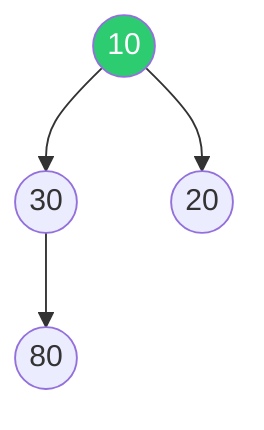

**Paso 1:** Guardo `10` (lo voy a devolver). Muevo el último nodo (`80`) a la raíz:

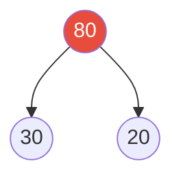

**Paso 2:** `80 > min(30, 20)` → swap con el **hijo menor** (`20`):

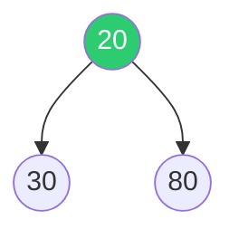

✅ **Propiedad restaurada.** El `20` es ahora la raíz (nuevo mínimo). Se retorna `10`.

---

## ⚙️ Percolate Down (Filtrado Hacia Abajo)

> *"El filtrado hacia abajo restaura la propiedad de orden intercambiando el dato de la raíz hacia abajo a lo largo del camino que contiene los hijos mínimos. El filtrado termina cuando se encuentra el lugar correcto dónde insertarlo."*

> 💡 Ya que el algoritmo recorre la **altura** de la heap, tiene **O(log n)** operaciones de intercambio.

### Código: percolate_down

```text
percolate_down(Heap h, int p) {
    candidato = h.dato[p];
    stop_perc = false;

    while (2*p <= h.tamaño) and (not stop_perc) {
        h_min = 2 * p;    // Asumo que el hijo izquierdo es el menor

        if h_min <> h.tamaño then           // Si existe el hijo derecho
            if (h.dato[h_min + 1] < h.dato[h_min])
                h_min = h_min + 1;           // El derecho es menor

        if candidato > h.dato[h_min] {       // Percolate down
            h.dato[p] = h.dato[h_min];       // Subo al hijo menor
            p = h_min;                        // Bajo la posición
        }
        else
            stop_perc = true;                 // Ya encontré su lugar
    }
    h.dato[p] = candidato;
}
```

### Código: delete_min (Versión 1 — todo en uno)

```text
delete_min(Heap h, Comparable e) {
    if (not esVacía(h)) {
        e = h.dato[1];                        // Guardo el mínimo
        candidato = h.dato[h.tamaño];         // Agarro el último
        h.tamaño = h.tamaño - 1;
        p = 1;
        stop_perc = false;

        while (2*p <= h.tamaño) and (not stop_perc) {
            h_min = 2 * p;                    // Buscar el hijo con clave menor
            if h_min <> h.tamaño              // Si existe hijo derecho, comparo
                if (h.dato[h_min + 1] < h.dato[h_min])
                    h_min = h_min + 1;

            if candidato > h.dato[h_min] {    // Percolate down
                h.dato[p] = h.dato[h_min];
                p = h_min;
            }
            else
                stop_perc = true;
        }
        h.dato[p] = candidato;
    }
}
```

### Código: delete_min (Versión 2 — usando percolate_down)

```text
delete_min(Heap h, Comparable e) {
    if (h.tamaño > 0) {                    // La heap no está vacía
        e = h.dato[1];                      // Guardo el mínimo
        h.dato[1] = h.dato[h.tamaño];      // Muevo el último a la raíz
        h.tamaño = h.tamaño - 1;
        percolate_down(h, 1);               // Filtro hacia abajo
    }
}
```

En criollo: DeleteMin es como el rey del castillo que se va. Agarras al último campesino de la fila y lo tirás al trono. Obviamente no pertenece ahí, así que lo vas hundiendo: lo comparás contra sus dos hijos, y lo swappeás con el más chiquito. Repetís hasta que el campesino encuentre su lugar correcto o llegue al fondo.

---
---

# Parte E: Operaciones Adicionales

## 📊 Otras Operaciones sobre la Heap

| Operación | Descripción | Algoritmo |
|---|---|---|
| **DecreaseKey(x, Δ, H)** | Decrementa la clave en la posición `x` de la heap `H` en una cantidad `Δ`. | Decrementar y hacer **Percolate Up** (el valor bajó, puede que deba subir). |
| **IncreaseKey(x, Δ, H)** | Incrementa la clave en la posición `x` de la heap `H` en una cantidad `Δ`. | Incrementar y hacer **Percolate Down** (el valor subió, puede que deba bajar). |
| **DeleteKey(x)** | Elimina la clave que está en la posición `x`. | Equivale a: `DecreaseKey(x, ∞, H)` + `DeleteMin(H)`. |

En criollo: Si alguien en la fila VIP sube de prioridad (`DecreaseKey`), lo movemos hacia adelante. Si baja de prioridad (`IncreaseKey`), lo mandamos atrás. Si directamente lo sacan de la fila (`DeleteKey`), le damos máxima prioridad para que llegue al frente y luego lo eliminamos.

---

## 📊 Resumen de Complejidades

| Operación | Complejidad |
|---|---|
| `Insert` | `O(log N)` |
| `DeleteMin` | `O(log N)` |
| `DecreaseKey` | `O(log N)` |
| `IncreaseKey` | `O(log N)` |
| `DeleteKey` | `O(log N)` |
| Acceso al mínimo (sin borrar) | `O(1)` — está en la raíz |

---

## 📚 Recursos y Referencias

- **Cátedra:** *Algoritmos y Estructuras de Datos* — UNLP. 2026.
- PDFs elaborados por Prof. Alejandra Schiavoni y Prof. Catalina Mostaccio.
