# 📘 Colas de Prioridad (Continuación) — BuildHeap y HeapSort

**Materia:** Algoritmos y Estructuras de Datos (AyED) — UNLP 2026  
**Temas:** Construcción de una Heap (inserción uno a uno vs BuildHeap), Algoritmo BuildHeap (filtrado hacia abajo), Eficiencia de BuildHeap (demostración O(n)), Ordenación con Heap (MinHeap con arreglo auxiliar), Algoritmo HeapSort (MaxHeap in-place)

---

> 💡 **Este resumen es continuación de [Clase6.md](Clase6.md)** donde se cubrieron: definición de cola de prioridad, implementaciones posibles, Heap Binaria (propiedades estructural y de orden), representación en arreglo, operaciones Insert (Percolate Up) y DeleteMin (Percolate Down), y operaciones adicionales.

---
---

# Parte A: Construcción de una Heap

## 🎯 El Problema

Tenemos una lista de `n` elementos desordenados y queremos **construir una heap** a partir de ellos. Existen **dos estrategias**:

| Estrategia | Complejidad Total | Descripción |
|---|---|---|
| **Insertar uno a uno** | `O(n log n)` | Se hacen `n` inserciones, cada una con filtrado hacia arriba (Percolate Up) de costo `O(log n)`. |
| **BuildHeap** | **`O(n)`** — lineal | Se colocan todos los elementos en un árbol binario completo y se filtran hacia abajo desde la mitad. |

En criollo: En vez de ir metiendo los elementos de a uno y acomodando cada vez (caro), es mucho más eficiente tirarlos todos de golpe en el árbol y después arreglar el desorden de abajo hacia arriba.

---

## 📦 Ejemplo: Construcción insertando uno a uno

**Entrada:** `8, 12, 9, 7, 10, 21, 6, 4` → Construir una **MinHeap**

### Paso a paso

**Insertamos 8:** (heap con un solo elemento)


**Insertamos 12:** 12 > 8, queda como hijo → no hay swap

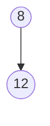

**Insertamos 9:** 9 > 8, queda como hijo derecho

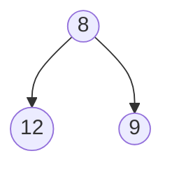

**Insertamos 7:** 7 < 12 → swap con padre. 7 < 8 → swap con raíz

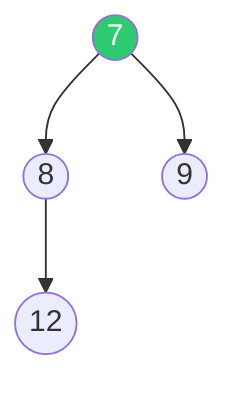

**Insertamos 10, 21:** quedan en sus posiciones (mayores que padres)

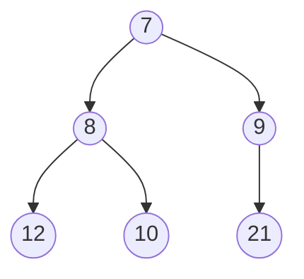

**Insertamos 6:** 6 < 9 → swap. 6 < 7 → swap con raíz

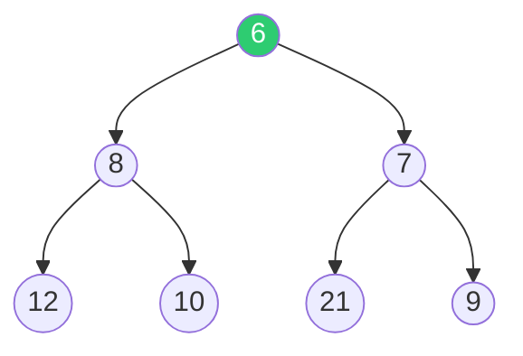

**Insertamos 4:** 4 < 12 → swap. 4 < 8 → swap. 4 < 6 → swap con raíz

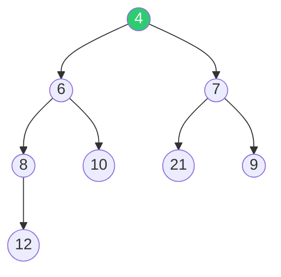

> 🧠 **Observación:** Cada inserción puede requerir hasta `O(log n)` swaps. Para `n` elementos → `O(n log n)` total. **BuildHeap lo hace en O(n).**

---
---

# Parte B: Algoritmo BuildHeap

## ⚙️ BuildHeap — Filtrado Hacia Abajo

**Motivación / ¿Cuándo se usa?:** Cuando tenés un conjunto de elementos y querés armar la heap de la forma más eficiente posible.

**Idea clave:**
1. Colocás **todos los elementos** en un arreglo formando un **árbol binario completo** (sin importar el orden).
2. Empezás a filtrar hacia abajo (**Percolate Down**) desde la posición `⌊tamaño/2⌋` hasta la posición `1`.

**¿Por qué desde tamaño/2?**
- Los nodos desde `⌊tamaño/2⌋ + 1` hasta `tamaño` son **hojas** → ya son heaps triviales (no tienen hijos).
- Solo necesitamos filtrar los **nodos que tienen al menos un hijo**.

**Para filtrar (MinHeap):**
1. Se elige el **menor de los hijos**.
2. Se compara el menor de los hijos con el **padre**.
3. Si el hijo es menor → **swap** y se sigue filtrando hacia abajo.

---

## 📦 Ejemplo: BuildHeap paso a paso

**Entrada:** `5, 8, 12, 9, 7, 10, 21, 6, 14, 4` → Construir una **MinHeap**

### Situación Inicial

Los elementos se colocan directamente en un árbol binario completo (desordenado):

```text
Posición:  1    2    3    4    5    6    7    8    9    10
Dato:     [5]  [8]  [12] [9]  [7]  [10] [21] [6]  [14] [4]
```

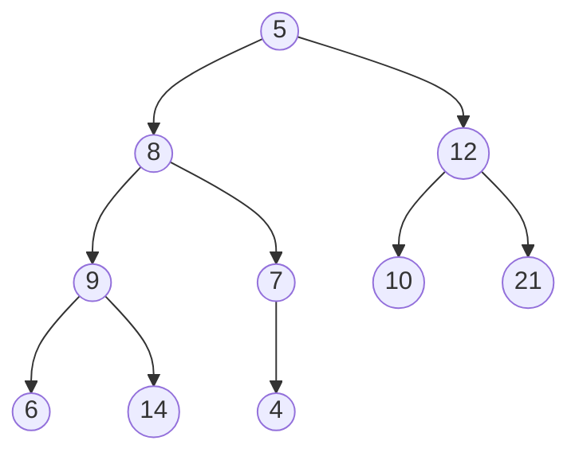

**Tamaño = 10** → Empezamos desde `i = ⌊10/2⌋ = 5`

---

### i = 5: Filtramos el nodo 7 (posición 5)

El nodo `7` tiene un solo hijo: `4`. Como `4 < 7` → **swap**.

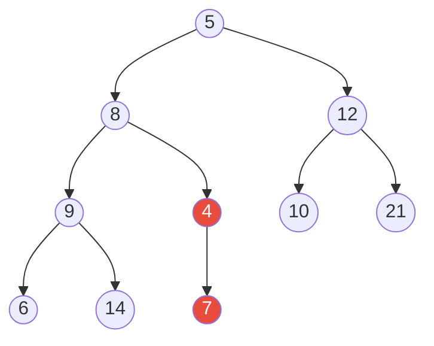

---

### i = 4: Filtramos el nodo 9 (posición 4)

El nodo `9` tiene hijos `6` y `14`. El menor es `6`. Como `6 < 9` → **swap**.

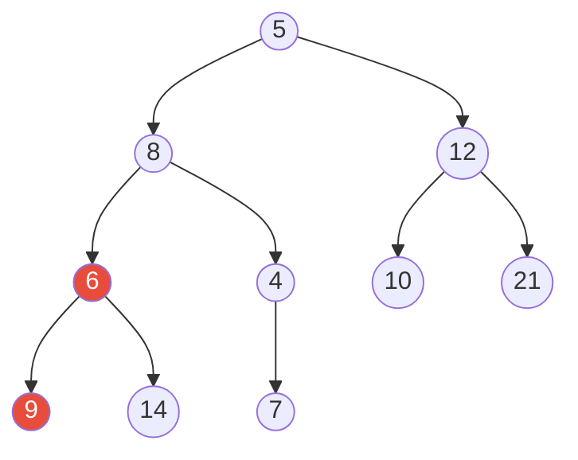

---

### i = 3: Filtramos el nodo 12 (posición 3)

El nodo `12` tiene hijos `10` y `21`. El menor es `10`. Como `10 < 12` → **swap**.

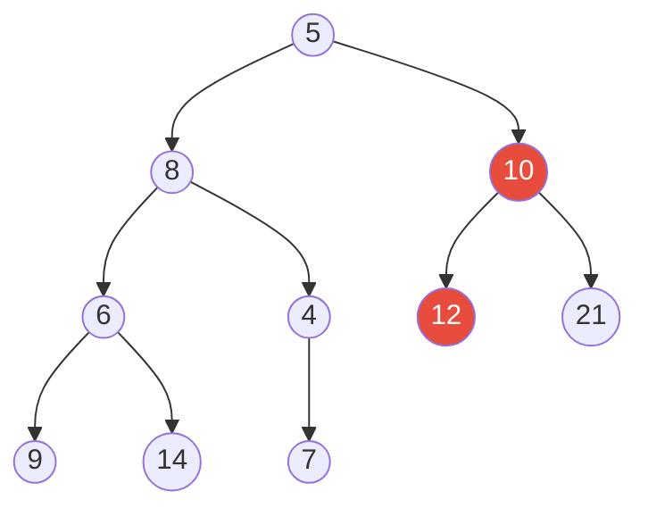

---

### i = 2: Filtramos el nodo 8 (posición 2)

El nodo `8` tiene hijos `6` y `4`. El menor es `4`. Como `4 < 8` → **swap** con `4`.

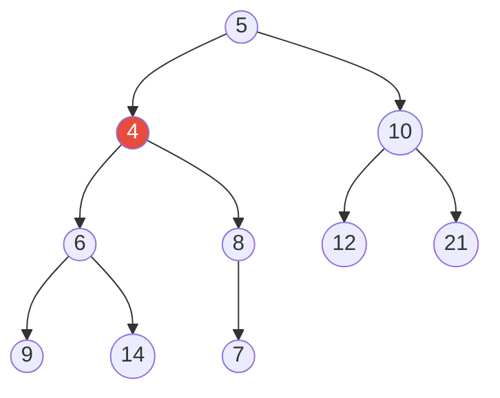

Ahora `8` bajó a posición 5. Sus hijos son `7`. Como `7 < 8` → **swap** de nuevo.


---

### i = 1: Filtramos el nodo 5 (la raíz)

El nodo `5` tiene hijos `4` y `10`. El menor es `4`. Como `4 < 5` → **swap**.

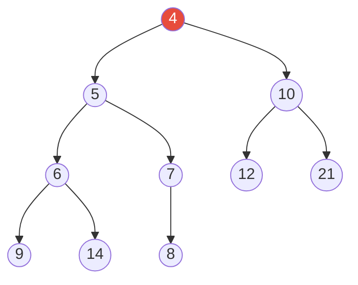

Ahora `5` bajó a posición 2. Sus hijos son `6` y `7`. Como `5 < 6` y `5 < 7` → **no hay más swaps**. ✅

### Resultado final del BuildHeap

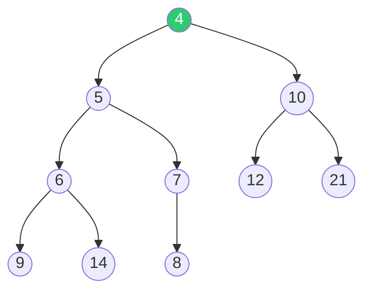

```text
Posición:  1    2    3    4    5    6    7    8    9    10
Dato:     [4]  [5]  [10] [6]  [7]  [12] [21] [9]  [14] [8]
```

✅ ¡**MinHeap válida!** Cada padre es menor o igual que sus hijos.

---
---

# Parte C: Eficiencia de BuildHeap

## 🎯 ¿Por qué BuildHeap es O(n)?

**Observación clave:** En el filtrado de cada nodo, recorremos su **altura**. Para calcular el costo total del algoritmo, debemos sumar las **alturas de todos los nodos** del árbol.

---

## ⚙️ Teorema

> *"En un árbol binario lleno de altura h que contiene 2^(h+1) – 1 nodos, la suma de las alturas de los nodos es: 2^(h+1) – 1 – (h + 1)"*

### Demostración

Un árbol tiene **2^i nodos de altura (h – i)**. La suma total de alturas es:

```text
S = Σ (i=0 hasta h) de 2^i × (h-i)

Expandiendo:
S = h + 2(h-1) + 4(h-2) + 8(h-3) + … + 2^(h-1)(1)    ... (A)
```

Multiplicamos ambos lados por 2:

```text
2S = 2h + 4(h-1) + 8(h-2) + 16(h-3) + … + 2^h(1)      ... (B)
```

Restamos (B) – (A):

```text
S = -h + 2 + 4 + 8 + 16 + … + 2^(h-1) + 2^h

Sumando 1 a ambos lados:
S + 1 = -h + 1 + 2 + 4 + 8 + … + 2^h
S + 1 = -h + (2^(h+1) – 1)

∴ S = 2^(h+1) – 1 – (h + 1)
```

---

## 💡 Conclusión sobre la eficiencia

| Observación | Descripción |
|---|---|
| **Árbol completo vs lleno** | Un árbol binario completo no es necesariamente lleno, pero el resultado obtenido es una **cota superior** de la suma de alturas. |
| **Cantidad de nodos** | Un árbol binario completo tiene entre `2^h` y `2^(h+1) - 1` nodos. |
| **Resultado** | El teorema implica que la suma de alturas es de **O(n)** donde `n` es el número de nodos. |
| **BuildHeap es lineal** | ✅ La operación BuildHeap tiene complejidad **O(n)**. |

En criollo: Aunque parezca raro, BuildHeap es **lineal** porque la mayoría de los nodos están en los niveles más bajos del árbol (las hojas) y esos se filtran poquito o nada. Los pocos nodos que están arriba (que son los que más se filtran) son muy pocos. Sumando todo, da lineal.

> 🧠 **Tip para el parcial:** Si te preguntan por qué BuildHeap es O(n) y no O(n log n), la clave es que **no todos los nodos se filtran log n posiciones**. Las hojas (la mitad de los nodos) no se filtran nada, y los nodos más altos (que se filtran más) son exponencialmente menos.

---
---

# Parte D: Ordenación con Heap

## 🎯 Dos Alternativas para Ordenar

Dado un conjunto de `n` elementos que queremos ordenar en **forma creciente**:

| Alternativa | Tipo de Heap | Espacio Extra | Complejidad |
|---|---|---|---|
| **a) MinHeap + arreglo auxiliar** | MinHeap | `O(n)` — necesita otro arreglo | `O(n log n)` |
| **b) HeapSort (in-place)** | **MaxHeap** | **O(1)** — ordena en el mismo arreglo | `O(n log n)` |

---

## ⚙️ Alternativa A: MinHeap + Arreglo Auxiliar

**Procedimiento:**
1. Construir una **MinHeap** con los elementos (usando BuildHeap).
2. Realizar `n` operaciones **DeleteMin**.
3. Ir guardando los elementos extraídos en **otro arreglo** (arreglo de salida).

| | Descripción |
|---|---|
| ✅ | Simple de entender e implementar. |
| ❌ | **Requiere el doble de espacio** (el arreglo de la heap + el arreglo de salida). |

### 📦 Ejemplo: Ordenar con MinHeap

**Entrada:** `50, 30, 18, 25, 22, 12`

**Paso 1:** Construir MinHeap:

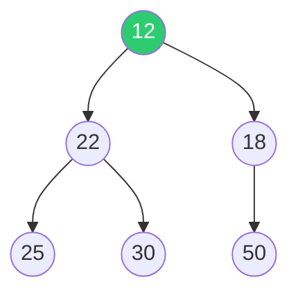

```text
Heap:    [12] [22] [18] [25] [30] [50]
Salida:  [  ] [  ] [  ] [  ] [  ] [  ]
```

**Paso 2:** DeleteMin → sale el `12`:

```text
Heap:    [18] [22] [50] [25] [30] [  ]
Salida:  [12] [  ] [  ] [  ] [  ] [  ]
```

**Paso 3:** DeleteMin → sale el `18`:

```text
Heap:    [22] [25] [50] [30] [  ] [  ]
Salida:  [12] [18] [  ] [  ] [  ] [  ]
```

**Paso 4:** DeleteMin → sale el `22`:

```text
Heap:    [25] [30] [50] [  ] [  ] [  ]
Salida:  [12] [18] [22] [  ] [  ] [  ]
```

Se sigue hasta vaciar la heap...

```text
Salida final: [12] [18] [22] [25] [30] [50]  ✅ ¡Ordenado!
```

---
---

# Parte E: Algoritmo HeapSort (In-Place)

## ⚙️ HeapSort

**Motivación:** Ordenar el arreglo **sin usar espacio extra**, aprovechando que al sacar el máximo de una MaxHeap, ese elemento ya no pertenece a la heap y podemos guardarlo "al final" del mismo arreglo.

**Pasos:**
1. Construir una **MaxHeap** con BuildHeap (los elementos quedan en el arreglo con el máximo en la raíz).
2. **Intercambiar** el primer elemento (máximo) con el **último** elemento de la heap.
3. **Decrementar** el tamaño de la heap (el máximo queda "fuera" de la heap, en su posición final).
4. **Filtrar hacia abajo** (Percolate Down) el nuevo elemento de la raíz para restaurar la MaxHeap.
5. Repetir pasos 2-4 hasta que la heap tenga tamaño 1.

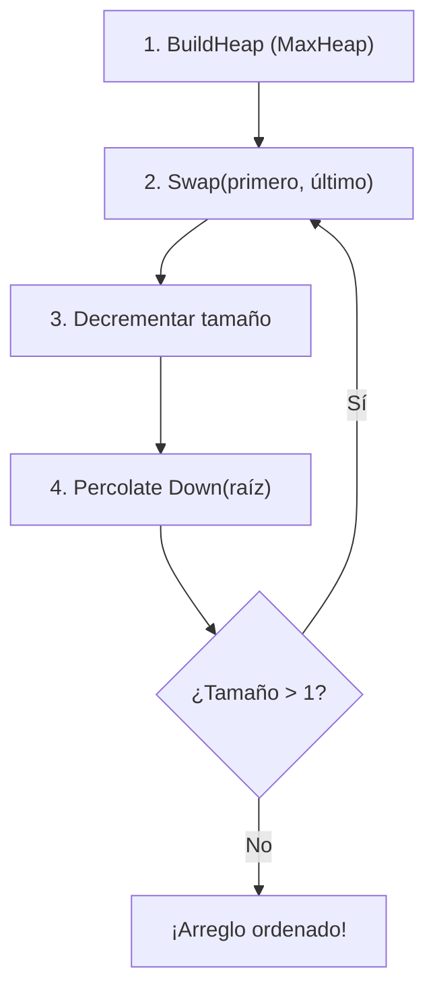

En criollo: HeapSort funciona así: armás una MaxHeap (el más grande queda arriba), sacás al más grande del trono y lo mandás al final del arreglo (ya está en su lugar definitivo). Achicás la heap, arreglás el desorden del trono, y repetís. Cada iteración el siguiente más grande va a su lugar. Al final, todo queda ordenado de menor a mayor.

---

## 📦 Ejemplo Completo: HeapSort

**Entrada:** `9, 50, 18, 30, 22, 12, 15, 25`

### Paso 0: Construir la MaxHeap

Después de aplicar BuildHeap con propiedad de **MaxHeap**:

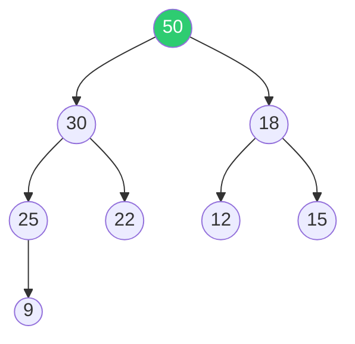

```text
Posición:  1    2    3    4    5    6    7    8
Dato:     [50] [30] [18] [25] [22] [12] [15] [9]
```

---

### Iteración 1: Sacar el 50

**Swap** posición 1 ↔ posición 8: intercambio `50` con `9`

```text
Antes:  [50] [30] [18] [25] [22] [12] [15] [9]
Swap:   [ 9] [30] [18] [25] [22] [12] [15] |50|
```

**Decrementar** tamaño de la heap a 7. El `50` queda **fuera** de la heap (en su posición final).

**Filtrar** el `9` hacia abajo:
- `9` tiene hijos `30` y `18`. Mayor hijo: `30`. Como `30 > 9` → swap.
- `9` tiene hijos `25` y `22`. Mayor hijo: `25`. Como `25 > 9` → swap.
- `9` no tiene más hijos → se detiene.

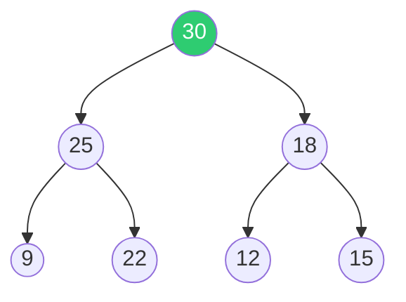

```text
Heap (tamaño 7): [30] [25] [18] [9] [22] [12] [15]  |  [50]
```

---

### Iteración 2: Sacar el 30

**Swap** posición 1 ↔ posición 7: intercambio `30` con `15`

```text
Swap:   [15] [25] [18] [9] [22] [12] |30| |50|
```

**Decrementar** tamaño a 6. **Filtrar** el `15`:
- Hijos: `25` y `18`. Mayor: `25`. Como `25 > 15` → swap.
- Hijos: `9` y `22`. Mayor: `22`. Como `22 > 15` → swap.

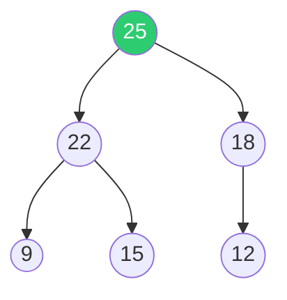

```text
Heap (tamaño 6): [25] [22] [18] [9] [15] [12]  |  [30] [50]
```

---

### Iteración 3: Sacar el 25

**Swap** posición 1 ↔ posición 6: intercambio `25` con `12`

```text
Swap:   [12] [22] [18] [9] [15] |25| |30| |50|
```

**Decrementar** tamaño a 5. **Filtrar** el `12`:
- Hijos: `22` y `18`. Mayor: `22`. Como `22 > 12` → swap.
- Hijos: `9` y `15`. Mayor: `15`. Como `15 > 12` → swap.

```mermaid
graph TD
    N1((22)) --> N2((15))
    N1 --> N3((18))
    N2 --> N4((9))
    N2 --> N5((12))
    style N1 fill:#2ECC71,color:#fff
```

```text
Heap (tamaño 5): [22] [15] [18] [9] [12]  |  [25] [30] [50]
```

---

### Iteración 4: Sacar el 22

**Swap** `22` con `12`. **Filtrar** el `12`:
- Hijos: `15` y `18`. Mayor: `18`. Como `18 > 12` → swap.

```mermaid
graph TD
    N1((18)) --> N2((15))
    N1 --> N3((12))
    N2 --> N4((9))
    style N1 fill:#2ECC71,color:#fff
```

```text
Heap (tamaño 4): [18] [15] [12] [9]  |  [22] [25] [30] [50]
```

---

### Iteración 5: Sacar el 18

**Swap** `18` con `9`. **Filtrar** el `9`:
- Hijos: `15` y `12`. Mayor: `15`. Como `15 > 9` → swap.

```mermaid
graph TD
    N1((15)) --> N2((9))
    N1 --> N3((12))
    style N1 fill:#2ECC71,color:#fff
```

```text
Heap (tamaño 3): [15] [9] [12]  |  [18] [22] [25] [30] [50]
```

---

### Iteración 6: Sacar el 15

**Swap** `15` con `12`. **Filtrar** el `12`:
- Hijo: `9`. Como `9 < 12` → no hay swap en MaxHeap.

```text
Heap (tamaño 2): [12] [9]  |  [15] [18] [22] [25] [30] [50]
```

---

### Iteración 7: Sacar el 12

**Swap** `12` con `9`.

```text
Heap (tamaño 1): [9]  |  [12] [15] [18] [22] [25] [30] [50]
```

### ✅ Resultado Final

```text
Posición:  1    2    3    4    5    6    7    8
Dato:     [9]  [12] [15] [18] [22] [25] [30] [50]
```

**¡Arreglo ordenado de forma creciente!** 🎉

```mermaid
graph TD
    subgraph "Heap conceptual final (tamaño 1)"
        N1((9))
    end
```

> 🧠 **¿Por qué MaxHeap para orden creciente?** Porque al intercambiar el máximo (raíz) con el último y achicando la heap, los elementos más grandes van quedando al final del arreglo. Al terminar, queda todo de menor a mayor.

---
---

# Parte F: Resumen de Complejidades

## 📊 Tabla Comparativa

| Operación / Algoritmo | Complejidad | Espacio Extra |
|---|---|---|
| **Construir Heap** (uno a uno) | `O(n log n)` | `O(1)` |
| **BuildHeap** (filtrado masivo) | **`O(n)`** | `O(1)` |
| **Ordenar con MinHeap** + arreglo auxiliar | `O(n log n)` | **`O(n)`** — necesita otro arreglo |
| **HeapSort** (MaxHeap in-place) | `O(n log n)` | **`O(1)`** — in-place |

---

## 🧠 Tips para Estudiar

| Concepto | Clave para recordar |
|---|---|
| **BuildHeap empieza en** | `i = ⌊tamaño/2⌋` y va **bajando** hasta `i = 1` |
| **BuildHeap usa** | **Percolate Down** (filtrado hacia abajo) |
| **BuildHeap es** | **O(n)** — lineal (no O(n log n)) |
| **HeapSort usa** | **MaxHeap** para ordenar de forma **creciente** |
| **HeapSort paso** | Swap raíz ↔ último → decrementar → Percolate Down |
| **HeapSort espacio** | **In-place** → O(1) espacio extra |
| **Diferencia clave** | MinHeap + arreglo auxiliar = doble espacio. HeapSort = sin espacio extra. |

---

## 📚 Recursos y Referencias

- **Cátedra:** *Algoritmos y Estructuras de Datos* — UNLP. 2026.
- PDFs elaborados por Prof. Alejandra Schiavoni y Prof. Catalina Mostaccio.
- **Resumen Parte 1 (Clase 6.1):** [Clase6.md](Clase6.md) — Cola de prioridad, Heap Binaria, Insert, DeleteMin, operaciones adicionales.
