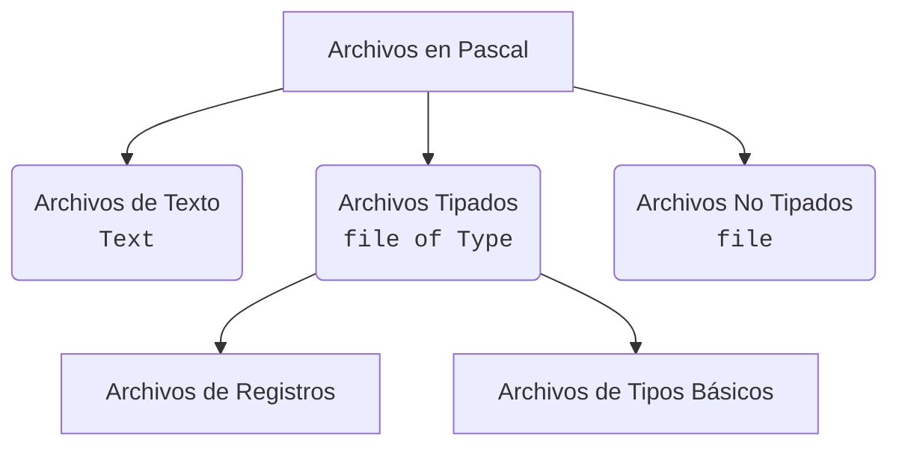

  

  
  
  

  

---

Repositorio de estudio personal para la materia **Fundamentos de Organización de Datos (FOD)**, correspondiente a la carrera Licenciatura en Sistemas / Analista en TIC (UNLP).  
**Docentes:** Cátedra de FOD

## 📖 Teoría

<table>
  <tr>
    <td width="900">
      <h3>📄 <a href="Teoria/Resumenes/Clase1.md">Clase 1: Introducción a Archivos y Operaciones Básicas</a></h3>
      <blockquote>Conceptos fundamentales sobre estructuras de archivos físicos y lógicos, y operaciones básicas.</blockquote>
      

        
        
        
      

    </td>
  </tr>
</table>

<table>
  <tr>
    <td width="900">
      <h3>📄 <a href="Teoria/Resumenes/Clase2.md">Clase 2: Algoritmia Clásica</a></h3>
      <blockquote>Técnicas de agregar, actualizar, merge y corte de control sobre archivos secuenciales.</blockquote>
      

        
        
        
      

    </td>
  </tr>
</table>

<table>
  <tr>
    <td width="900">
      <h3>📄 <a href="Teoria/Resumenes/Clase3.md">Clase 3: Arquitectura, Tipos y Eliminación de Archivos</a></h3>
      <blockquote>El viaje de un Byte, organización física y estructuración, manejo de bajas lógicas/físicas y recuperación del espacio.</blockquote>
      

        
        
        
      

    </td>
  </tr>
</table>

 

📁 [Ver Material Oficial de la Cátedra](Teoria/Material_Original/)

## 💻 Prácticas Resueltas

| # | Tema | Contenido | Link |
|:-:|---|---|:-:|
| **1** | Archivos y Operaciones Básicas | Práctica introductoria de operaciones sobre archivos, tipos de datos y algoritmia. | [📁](Practicas/Practica_1/) |

## 🗺️ Mapa de Tipos de Archivos

## 📝 Evaluaciones

Material de preparación extra, simulacros y resolución de exámenes pasados.

📁 [Abrir directorio de Evaluaciones](Evaluaciones/)

## 🛠️ Stack Tecnológico

  

  <b>Pascal</b> · <b>Algoritmia</b> · <b>Git & GitHub</b>

  

  Repositorio de uso personal y académico · Material de cátedra © sus respectivos autores
   
  Hecho con 🧡 por <a href="https://github.com/auwus21">@auwus21</a>

