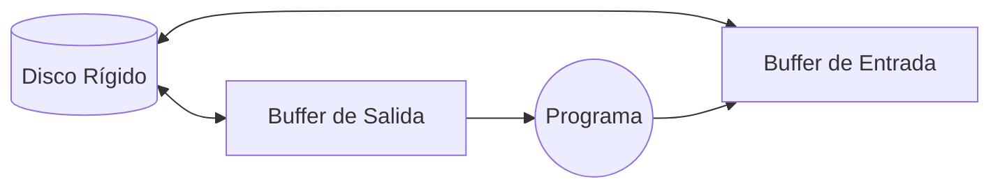

# 📘 Clase 1: Archivos, Topología y Operaciones Básicas

**Materia:** Fundamentos de Organización de Datos (FOD) — UNLP 2026  
**Temas:** Base de Datos, Topología de Discos, Buffers, Tipos de Acceso, Operaciones en Pascal

---

## Parte A: Persistencia y Organización Física

### 🎯 Bases de Datos y Almacenamiento

Una **Base de Datos** representa aspectos del mundo real (Universo de Discurso) y no debe confundirse con un conjunto aleatorio de datos.

> *"Es una colección de archivos diseñados para servir a múltiples aplicaciones. Una colección coherente de datos con significados inherentes, sustentados físicamente en archivos en dispositivos de almacenamiento persistente."*

En criollo: Para que sea base de datos, la info tiene que tener lógica y relación entre sí. Cuando la memoria RAM se queda corta o apagamos la PC, necesitamos enviar este Universo al almacenamiento persistente.

### 🏗️ Topología del Disco Rígido

Para comprender la persistencia de los objetos o archivos, debemos entender el Hardware del Almacenamiento Secundario. El disco rígido se divide en varias partes geométricas electromagnéticas:

| Componente | Descripción |
|---|---|
| **Plato** | Disco físico circular; un disco duro puede tener varios platos apilados. |
| **Superficie** | Cada plato tiene dos superficies (arriba y abajo) leídas por cabezales. |
| **Pista** | Círculos concéntricos trazados en una superficie donde se guardan los datos. |
| **Sector** | Porciones o "porciones de torta" en las que se divide una pista. |
| **Cilindro** | Conjunto de pistas que se alinean verticalmente a lo largo de todos los platos. |

### ⚙️ Organización Lógica

Un archivo es una secuencia de bytes para el disco duro, pero el software impone límites:
1. **Archivo de texto:** Pura secuencia ininterrumpida. No se determina fácil el inicio/fin.
2. **Campos:** La unidad más pequeña y lógicamente significativa.
3. **Registro:** Conjuntos cerrados de campos que agrupan a una entidad.

---

## Parte B: Acceso y Manipulación

### 📊 Tipos de Accesos a un Archivo

No todos los programas leen los discos de la misma manera:

| Tipo | Método de Búsqueda |
|---|---|
| **Secuencial Físico (Serie)** | Acceso a los registros uno tras otro rigurosamente en el orden de los bytes físicos en disco. |
| **Secuencial Indizado (Lógico)** | Acceso en secuencia pero dictado por una estructura externa ordenada por clave (como el índice de un libro). |
| **Directo** | Se salta matemáticamente al registro deseado ignorando por completo a sus predecesores. |

### 🧠 El Papel de los Buffers

El pasaje entre Disco y Programa es lento. Acá interviene el **Buffer de E/S**.

> *"El Buffer es una memoria intermedia (en RAM) gestionada por el Sistema Operativo, donde los datos residen provisoriamente hasta ser enviados masivamente al Almacenamiento."*


En criollo: Es como cargar una carretilla con ladrillos. En vez de llevar un byte por vez, llenamos el buffer, y el SO descarga toda la carretilla en el disco de un solo viaje, salvando inmenso tiempo del controlador mecánico.

---

## Parte C: Operaciones Básicas en Pascal

### 1. Dos Niveles: Lógico vs Físico
Para operar en Pascal, debemos armar un puente entre:
- Nombre lógico: La `variable` dentro de tu código (`arch_emp`).
- Nombre Físico: El archivo metido en el disco rígido (`C:\empleados.dat`).

Usamos la instrucción `Assign` para anclarlos:
```pascal
Type 
    emple = record
        nombre: string [20];
        edad: integer;
    end;
    empleado = file of emple;

Var arch_emp: empleado;
Begin
    Assign( arch_emp, 'C:\empleados.dat' );
End;
```

### 2. Apertura y Cierre
| Comando | Acción en Buffers |
|---|---|
| `Rewrite(arch)` | Puesta a cero. Crea el archivo vacío; si existe, ¡lo destruye y pisa! |
| `Reset(arch)` | Abre un archivo existente garantizando lectura y escritura sin borrar nada. |
| `Close(arch)` | Ordena purgar buffers y escribe la marca de Cierre/EOF definitiva en el último byte. |

### 3. Operaciones de Movimiento y Estado
Recordá preguntar `EOF` *antes* de intentar leer, para no tirar excepciones del sistema.
*   `Read(arch, var)` y `Write(arch, var)`: Comunican al Buffer en RAM, avanzando en +1 el puntero virtual.
*   `Seek(arch, posicion)`: Salta el puntero lógico. La primera posición **siempre es cero (0)**.
*   `FileSize(arch)` y `FilePos(arch)`.

---

## 📦 Ejemplos Fundamentales: Algoritmia Inicial

### Ejemplo 1: Crear un Archivo
Este algoritmo toma datos ciegamente del teclado hasta leer un `0` y los guarda.
```pascal
program Generar_Archivo;
type archivo = file of integer; 
var arc_logico: archivo; nro: integer; arc_fisico: string[12];     
begin
    write('Ingrese nombre:'); read(arc_fisico);
    assign(arc_logico, arc_fisico);
    rewrite(arc_logico); { Inicializa disco }
    
    read(nro);
    while nro <> 0 do begin
        write(arc_logico, nro); 
        read(nro);
    end;
    close(arc_logico);  { Grabamos marca de fin }
end.
```

### Ejemplo 2: Recorrido (Impresión Física)
Para mostrar lo que hicimos, usamos `reset` para no borrar el contenido.
```pascal
Procedure Recorrido(var arc_logico: archivo);
var  nro: integer;
begin
    reset(arc_logico); 
    while not eof(arc_logico) do begin
        read(arc_logico, nro); { Avanza a la derecha }
        write(nro);            { Presenta en pantalla }
    end;
    close(arc_logico);
end;
```

### Ejemplo 3: Actualizar In-Situ (Modificación)
Queremos recorrer e infundir un 10% de aumento a todos los salarios.
Dado que `Read` estira el puntero a la próxima variable, si hacemos `Write` directo, pisaríamos a la persona errónea. ¡Es vital corregir el puntero con `Seek(pos - 1)`!

```pascal
Procedure actualizar(Var Emp: empleados);
var E: registro;
begin
    Reset(Emp); 
    while not eof(Emp) do begin
        Read(Emp, E);           { puntero salta a POS=1 }
        E.salario := E.salario * 1.1;    
        
        Seek(Emp, filepos(Emp) - 1); { puntero retrocede a POS=0 }
        Write(Emp, E);          { Sobrescribe y de paso salta a POS=1 }
    end;
    close(Emp);
end;
```

---

## 📚 Recursos y Referencias
- **Cátedra FOD (UNLP):** *"Organización de Datos - Clase 1: Fundamentos y Básico"*. 2026.
- Resolucion y práctica: `https://asignaturas.info.unlp.edu.ar` (Extracción Moodle).
