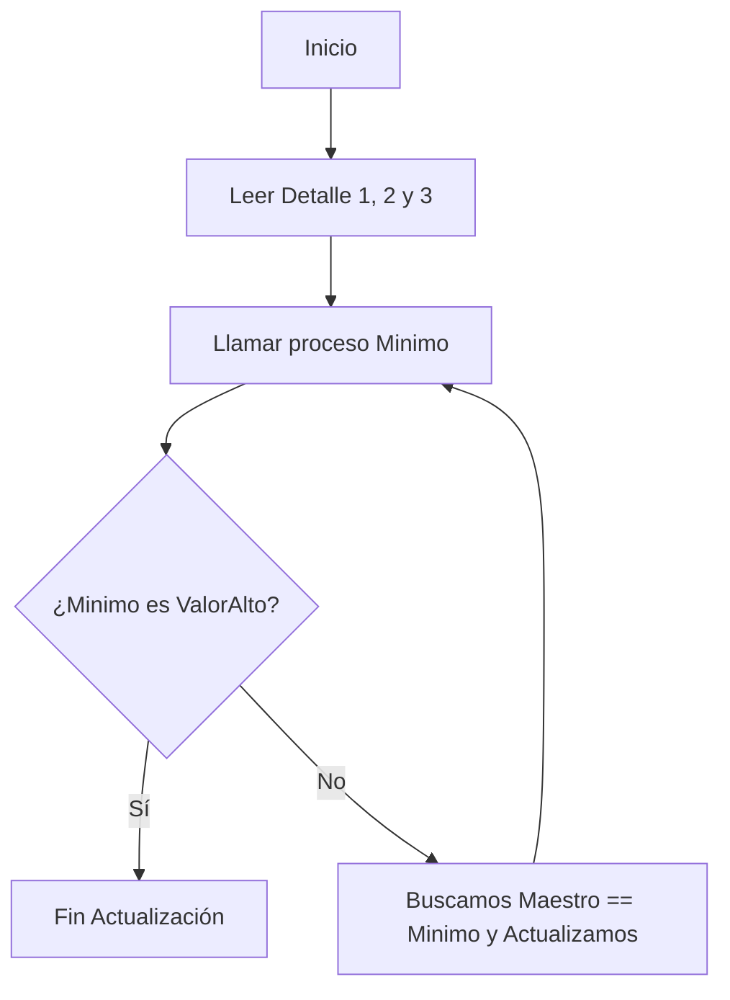

# 📘 Clase 2: Algoritmia Clásica de Archivos

**Materia:** Fundamentos de Organización de Datos (FOD) — UNLP 2026  
**Temas:** Algoritmia Clásica, Maestro-Detalle, Merge, Corte de Control, Agregar Elementos

---

## 🎯 Archivos y Algoritmia Clásica

Trabajar con almacenamiento secuencial requiere algoritmos particulares y estandarizados para solucionar operaciones corrientes cómo agregar nueva información, modificar conjuntos de datos, centralizar orígenes distribuidos y emitir reportes estadísticos. A esta serie de patrones se la llama **Algoritmia Clásica**.

En criollo: Como interactuar con archivos en RAM y enviarlos a disco mediante `if`/`while` se repite tanto para problemas como contabilidad, stock y descargas, el área estandarizó algoritmos muy rígidos y lógicos que resuelven los problemas sin reinventar la rueda todos los días.

---

## ⚙️ Agregar Datos a un Archivo Existente

**Motivación:** En lugar de reescribir e inicializar un archivo cada vez (lo cual perdería los datos antiguos), queremos agregar elementos ('append') justo donde terminó el archivo anteriormente.

**Pasos:**
1. Al abrir el archivo debemos usar `reset`.
2. Hacemos un corrimiento (`seek`) directo hacia la propia posición que equivale a su `filesize()`, que significa final del archivo.
3. Hacemos un `write` y cerramos.

**Ejemplo:**
```pascal
Procedure agregar (Var Emp: Empleados); 
var E: registro;
begin
    reset( Emp ); 
    seek( Emp, filesize(Emp)); { Nos saltamos hasta el EOF }
    
    leer(E); { Cargar de teclado }
    while E.nombre <> ' ' do begin
        write( Emp, E );     
        leer( E ); 
    end;
    close( Emp );
end;
```

---

## ⚙️ Actualización: Maestro - Detalle

El proceso de un Maestro-Detalle involucra un archivo principal de información que es actualizado a partir de los datos que vienen en otro archivo auxiliar, en base a una clave central.

| Componente | Rol / Responsabilidad |
|---|---|
| **Archivo Maestro** | Resume o almacena datos totalizados (ej. catálogo de stock y precio, datos de empleados). |
| **Archivo Detalle** | Colección de información "histórica" o de un momento en particular (ej. ventas diarias, horas extras, novedades). Su información se usará para alterar el maestro y dejar el sistema actualizado. |

### Precondiciones necesarias

1. Ambos archivos (maestro y detalle) están ordenados por el **mismo criterio / clave**.
2. Todos los objetos que aparecen en el detalle *deben existir* previamente en el archivo maestro.

### Variante: Un Maestro y Un Detalle
Un único detalle que se procesa. Si se pueden procesar múltiples registros del detalle en el mismo objeto del maestro, se debe iterar sobre el detalle acumulando todo antes de hacer el `seek` de alteración en el maestro.

```pascal
{ Proceso usando el patrón genérico con constantes como "9999" (valoralto) }
procedure leer (var archivo:detalle; var dato:v_prod);
begin
    if (not eof(archivo)) then 
        read (archivo, dato)
    else 
        dato.cod := valoralto; { Señuelo de fin de archivo }
end;

{ Lógica dentro del main }
reset (mae1);  
reset (det1);
leer(det1, regd); { Lee primero de todo el Detalle }

while (regd.cod <> valoralto) do begin
    read(mae1, regm);
    
    { Buscamos al registro maestro hasta que las claves de maestro y detalle coincidan }
    while (regm.cod <> regd.cod) do
        read (mae1, regm);
        
    { Mientras compartan la misma clave... }
    while (regm.cod = regd.cod) do begin
        regm.cant := regm.cant - regd.cv; { procesamos stock }      
        leer(det1, regd); 
    end;
    
    { Reubicamos el puntero y lo grabamos en disco }
    seek (mae1, filepos(mae1)-1);
    write(mae1, regm);
end;
```

### Variante: Un Maestro y N Detalles
Se utilizan múltiples Detalles a la vez (por ejemplo, actualizamos las sucursales Venta1, Venta2 y Venta3). El **Truco principal** es usar un método para sacar el **mínimo** en las claves actuales e iterar hasta que todos alcancen `valoralto`.



---

## ⚙️ Generación de Reportes: Corte de Control

**Motivación:** Es necesario generar listados y reportes estadísticos jerárquicos (ej: Total de la ciudad, luego de la provincia, luego del país). Lo hacemos aprovechando que la información ya se encuentra pre-ordenada estructuralmente.

**Precondiciones:**
1. El archivo maestro único se encuentra **ordenado** por las jerarquías que queremos totalizar (Ej: pre-ordenado por Provincia, luego Partido).

**Pasos:**
1. Obtenemos un `registro_actual` y creamos variables `ant_provincia` que imiten los datos del registro actual.
2. Mientras la provincia antigua coincida con la provincia actual iteramos. Dentro de ello hacemos lo mismo con otra capa (mientras partido antiguo coincida con partido actual iteramos), y procesamos los montos chicos.
3. En la transición en que las variables 'ant' ya no coinciden con las directas, "cortamos", emitimos un total parcial, e igualamos las variables a las nuevas.

```pascal
while ( regm.provincia <> valoralto) do begin
    ant_prov := regm.provincia;
    ant_partido := regm.partido;
    
    while (ant_prov = regm.provincia) and (ant_partido = regm.partido) do begin
        { Acumular totales locales de partido }
        t_varones := t_varones + regm.cant_varones; 
        leer (inst, regm); { avanzamos en el disco }
    end;
    
    { Aquí 'ant_partido <> regm.partido'. Emitimos reporte del PARTIDO }
    writeln ('Total Partido: ', t_varones);
    t_prov_var := t_prov_var + t_varones; { Sumamos al total externo de la pcia }
    
    t_varones := 0; { Reseteamos los totales locales }
    ant_partido := regm.partido;
    
    { Si también cambió la provincia, debemos emitir el reporte del total grande }
    if (ant_prov <> regm.provincia) then begin
        writeln ('Total Provincia: ', t_prov_var);
        t_prov_var := 0; 
        writeln ('Nueva Provincia a chequear: ', regm.provincia);
    end;
end;
```

---

## ⚙️ Merge de Archivos

**Motivación:** Involucra archivar el contenido similar proveniente de N archivos diferentes y consolidarlo o resumirlo todo en crear un **único archivo nuevo final** (un nuevo archivo maestro). Si bien es parecido a Maestro-Detalle, acá NO actualizamos algo viejo, sino que fabricamos algo *totalmente nuevo*.

**Precondiciones:**
1. Todos los archivos origen o detalles tienen la misma estructura de datos.
2. Todos los archivos base están ordenados utilizando el mismo criterio.

**Estrategia "Mínimo":**
A todas las sucursales o instancias que estamos leyendo se las somete de forma permanente a un módulo `minimo()`. Le pasaremos los registros que recién sacamos del buffer y el módulo decidirá **cuál de todos tiene la clave menor**, devolviendo ese y unicamente obligando a pedir un dato nuevo de esa misma fuente para que pueda competir por ser el próximo minimo en la iteración siguiente. Si no hay más registros de esa fuente en el disco, forzamos un valor ficticio alto `'zzzz'`/`9999` para que nunca gane la competencia sobre los menores.

```mermaid
sequenceDiagram
    participant Main
    participant Minimo
    participant D1 as Detalle 1
    participant D2 as Detalle 2
    participant D3 as Detalle 3

    Main->>Minimo: Minimo(D1, D2, D3)
    Minimo->>Main: Result: D2.cod es el menor
    Option D2 fue el Menor
    Main->>D2: read(det2, registro_nuevo2)
    Main->>Minimo: Minimo(D1, registro_nuevo2, D3)
```

---

## 📚 Recursos y Referencias

- **Cátedra FOD (UNLP):** *"Organización de Datos - Clase 2: Algoritmia Clásica"*. 2026.
- Oficial UNLP: Procedimiento, Minimos y Modelado `https://asignaturas.info.unlp.edu.ar`.
