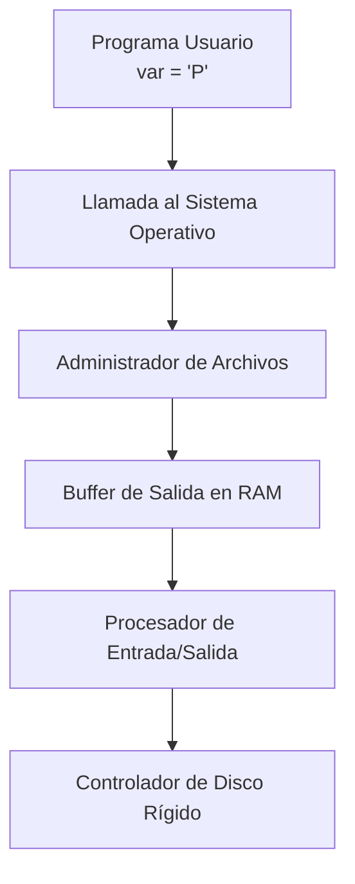

# 📘 Clase 3: Arquitectura, Tipos y Eliminación de Archivos

**Materia:** Fundamentos de Organización de Datos (FOD) — UNLP 2026  
**Temas:** Viaje del Byte, Archivo Lógico/Físico, Clasificación de Archivos y Registros, Claves y Performance, Bajas Lógicas y Físicas, Manejo de Espacios y Fragmentación.

---

## Parte A: Conceptos Arquitectónicos Básicos

### 🎯 Diferencia entre Memoria RAM y Almacenamiento Secundario

La **memoria primaria (RAM)** es veloz y de simple acceso, pero presenta tres grandes limitantes: es muy volátil (los datos se pierden al cortar la energía), tiene una capacidad limitada y un costo monetario más alto. Por consiguiente, es obligatorio recurrir al **almacenamiento secundario (Discos)**. 

> *"El acceso secundario es tan 'lento' que es imprescindible enviar y recuperar grandes agrupaciones de datos con 'inteligencia' para reducir al mínimo las llamadas a los discos".*

Esto obliga a organizar la información en **archivos**, entendidos en dos visiones claras:

| Concepto | Descripción |
|---|---|
| **Archivo Físico** | El que existe de verdad en el almacenamiento secundario. Es el archivo tal como lo conoce el Sistema Operativo, residiendo en pistas y sectores definidos por una FAT. |
| **Archivo Lógico** | La estructura tal cual es mapeada y vista por nuestro programa (ej. mediante una variable en Pascal). Nos libera de tener que lidiar con la posición del cilindro. |

---

## ⚙️ El Viaje de un Byte

**Motivación:** Comprender todo el aparato que se enciende cuando ejecutamos un simple `Write(archivo, byte)` en Pascal. Las fases están fuertemente delegadas a los administradores de bajo y abstracto nivel.

### Actores del Ecosistema

| Componente | Rol / Responsabilidad |
|---|---|
| **Sistema Operativo** | Recibe nuestro SysCall inicial desde el área de datos del programa y deriva el trabajo a un Administrador específico. |
| **Administrador de Archivos** | Evalúa la factibilidad. En sus **Capas Superiores** analiza la tabla de archivos abiertos (si es lectura/escritura). En las **Capas Inferiores** se comunica con la FAT para descubrir los componentes magnéticos de cilindros. Su rol principal es reubicar la orden al Procesador. |
| **Buffer de E/S** | Segmento lógico en memoria que acumula grupos enteros para minimizar latencias. Si no hay espacio, se debe forzar una escritura. |
| **Procesador de E/S** | Hardware hiper-independiente del microprocesador principal. Recibe la orden del Administrador para que el CPU pueda volver a ejecutar sus tareas sin freezarse. |
| **Controlador de Disco** | Entidad encargada puramente de operaciones electromagnéticas: Busca la Pista, busca el Sector de la superficie, y finaliza el viaje eléctrico. |

### ⚙️ Procedimiento Oficial (Protocolo de Transmisión del S.O.)

Cuando se dispara la sentencia:
1. El programa le pide al S.O. escribir del contenido de su variable.
2. El S.O. transfiere la posta al Administrador de Archivos.
3. El Administrador verifica la tabla de metadatos (derechos lógicos de Piel L/E).
4. El Administrador interroga a la FAT por la ruta real de cabezales.
5. El Administrador graba del registro de RAM al sector de su **Buffer asignado**.
6. Se envían instrucciones al Procesador de E/S para purgar ese Buffer.
7. El Procesador de E/S encuentra su brecha sin usar la CPU y lo transfiere al Controlador de disco asincrónicamente.
8. El Controlador alinea la cabeza lectora y transfiere bits uno a uno.

---

## Parte B: Organización Lógica y Rendimientos

### 🏗️ Clasificación de Registros y Campos

Un archivo desestructura o delimita su información para ser procesada. Un campo es la mínima unidad de significado. ¿Cómo determinamos dónde empieza o finaliza un campo?

#### Longitud Fija (Predecible)
El límite está programado rígidamente dentro de la lectura. Por ejemplo: toda cadena usa `string[100]`.
| | Descripción |
|---|---|
| ✅ | Facilidad brutal para accesos directos por tamaño (`Filepos * TamanoBytes`). Las lecturas son siempre las mismas constantes. |
| ❌ | Desperdicio monstruoso de bytes; rellenando las informaciones cortas con espacios o nulos para llenar el casillero prefijado. |

#### Longitud Variable (No Predecible)
El campo mide lo estríctamente justo, adaptando su forma como un acordeón (`string`). Requiere reglas para que la computadora no termine tragándose dos campos como si fueran uno solo:
1. **Indicadores de Longitud (prefijos):** Un byte entero es inserto automáticamente adelante del texto (`04Hola`).
2. **Delimitadores (sufijos):** Se interpone un carácter no usado que sirve de tope (`Hola#Mundo#`).
3. **Archivo Paralelo:** Un archivo con vectores con las direcciones de offsets precisas.

---

### 🔑 Claves y Forma Canónica

Una **Clave** permite dotar de identidad a un registro particular, buscando extraerlo en un `seek`. 

- **Clave Primaria (Univoca):** Jamás devuelve dos registros (DNI, Código de producto).
- **Clave Secundaria:** Propiedades agrupadoras comunes (País, Rubro, Sector).

Para evitar que se carguen "Agustín", " AGUSTIN", "Agustin ", se ideó la **Forma Canónica**.

**Motivación:** Estandarizar la forma final de cualquier clave y evitar duplicidades silenciosas.
**Procedimiento de inserción canónica:**
1. Al intentar guardar un nombre, derivar aplicando las reglas estándar de filtro (por ejemplo: `Todo a Mayúsculas` + `Trim right`).
2. Recién luego, somerterse a una lectura completa del dataset.
3. Si la llave procesada choca, se detiene la inserción inmediatamente. 

### 📊 Desempeño y Performance Básico (Costos O)

| Modos de Acceso | Rendimiento de Iteración | Pros / Contras |
|---|---|---|
| **Acceso Secuencial** | **O(n)**. Mejor caso = 0, Peor caso = n, Promedio = n/2. | ✅ Ideal para procesamiento Batch y liquidaciones en cadena.  ❌ Si tenemos 50,000 registros, el promedio de `25,000` iteraciones para 1 lectura individual es castigador. |
| **Acceso Directo (Offset)** | **O(1)**. El S.O. formula `Numero. de Registro * Tamaño`. | ✅ Salto instantáneo y espectacular. ❌ Solamente compatible estrictamente usando Longitudes Fijas garantizadas. |

> *"El acceso directo NO siempre es el más apropiado: Si debes emitir todos los cheques de la empresa, es infinitamente más sano leer secuencialmente el archivo del principio a fin utilizando su Buffer, que andar tirando tiros esporádicos al disco mediante Seek."*

---

## Parte C: Clases Operativas y Gestión de Bajas

### 🎯 Tipos de Archivo por "Frecuencia de Cambios"

| Tipo de Archivo | Descripción de Comportamiento | 
|---|---|
| **Estáticos** | Son archivos donde los datos persisten enormemente sin ser alterados o con pocas inserciones. Carecen de estructuras sofisticadas complejas auxiliares. | 
| **Volátiles** | Son archivos con un nivel de estrés altísimo que experimentan Bajas, Modificaciones y Altas (`ABM` / `CRUD`). Si o si van de la mano de un árbol B o índices fuertes si la velocidad de uso importa. |

### 🗑️ Gestión de la Eliminación (Las Bajas)

Toda estrategia de sustracción debe resolver dos problemas: **esconder lo borrado** e hipotéticamente **reactivar ese espacio muerto**.

| Variante de Baja | Procedimiento | Impacto |
|---|---|---|
| **Baja Lógica** | Consiste en marcar artificialmente el byte líder del registro con una estaca nula. (Ejemplo: insertando `*`). Todo sistema `Read()` debe esquivarlo. | ✅ Tiempo constante e insuperable, permitiendo deshacer errores temporalmente. ❌ Los volúmenes físicos del disco no decrecen ni en un misero byte jamás. |
| **Baja Física (Compactación)** | Obliga a clonar y pasar únicamente la data oficial que NO contenga un '*', formando un nuevo archivo sano y volcándolo encima del archivo antiguo arruinado. | ✅ Soluciona a la perfección la eficiencia de tiempos de `Filesize`. ❌ Extremadamente costoso, dejándolo solo para mantenimientos programados trimestrales "Por lotes". |

---

## 🏗️ Re-utilización de Espacio y Fragmentación (Reg. Variable)

Para mitigar los baches enormes de las bajas Lógicas, nació la reusabilidad mediante **Lógica de Pilas / Cadenas**: el archivo mantendrá en un encabezado escondido un NRR (Índice libre). 

**Procedimiento de Lista Enlazada de Borrados:**
1. Tenemos los datos: `1:alfa`, `2:beta`, `3:delta`. Cabecera = -1.
2. Damos de baja el 2. En `beta` marcamos su flag como eliminado (ej, su byte inicial va a `-1`). Ahora Cabecera = 2.
3. Si borramos el NRR `4` que agregamos con registro `gamma`, Cabecera dice `4`, y el NRR 4 tendrá un `-1` encadenado señalando "Andate al 2 papá". Pila = `4 -> 2 -> null`.
4. Cuando alguien pide insertar algo nuevo, el `seek` le arrebata el espacio a la Cabecera (4), y toma del puntero 4 su índice 2, poniéndolo de nueva Cabecera, reciclando los lugares viejos antes de extender el EOF.

Al poseer **Longitud Variable** (Un string 'Ramiro' devorando el agujero que dejó un 'Juan'), el "Insert" no entrará en el huequito viejo. El nuevo elemento "debe caber", sin excepciones. Esta odisea produce descalces métricos denominados **Fragmentaciones**.

### 🧩 Tipos de Fragmentación en BBDD

| Concepto | Definición Clave |
|---|---|
| ✅ **Fragmentación Interna** | Ocurre cuando forzamos el espacio a pesar de que "Sobra un cacho de bytes insignificante que queda de relleno". Ese cacho quedó metido dentro del registro pero el SO no lo puede ni usar ni leer. |
| ❌ **Fragmentación Externa** | Se presenta al dejar en el medio de todo el archivo secuencias desparramadas de espacios "no asignados" que son dolorosamente pymes, impidiendo que los nuevos inserts enanos quepan allí por estricto desperdicio en tierra de nadie. |

### 📊 Políticas de Ajuste de Espacio Variable

Para asignar un agujero de nuestra pila de borrados en el disco frente a un INSERT, existen 3 posturas fundamentales aplicadas por los motores DBMS:

| Política de Asignación | Funcionamiento Interno | Pro / Contra de la Fragmentación |
|---|---|---|
| **Primer Ajuste** *(First Fit)* | Barre la lista encadenada de espacios vacíos. Toma la mismísima primera ranura que logre alojar el byte entrante. Toma TODO el espacio aunque sobre, cerrando el trato de inmediato. | ✅ Rápido, no itera nada de más. ⛔ Produce inminente **Fragmentación Interna** por llevarse de yapa 5 bytes inútiles. |
| **Mejor Ajuste** *(Best Fit)* | Barre minuciosa y compulsivamente la lista completa midiendo todos y cada uno de los huecos. Entrega la victoria a aquél "huequito del tamaño más clavado al insert". | ✅ Extremadamente eficiente a nivel bits ocupados. ⛔ Requiere escáneres masivos y produce micro-fragmentaciones internas inútiles. |
| **Peor Ajuste** *(Worst Fit)* | Hace lo inverso a Best: busca el cráter hueco más colosal y grande originado de bajas que exista almacenado. Parte ese cráter a la mitad, usando únicamente lo que requiere y mandando el resto de vuelta al pool común. | ✅ Jamas desperdiciará memoria ajena adentro suyo al fraccionar y partir a la mitad. ❌ Produce letal **Fragmentación Externa**. |

---

### ⚠️ Peligros Silenciosos de la Modificación in-situ

Para cerrar el problema de la Organización, modificar `Update` un archivo variable y volátil trae severos problemas colaterales:

1. **Alteración Menor o Mayor**: Un update chico genera fragmentaciones. Si el Update es de tamaño Mayor al que teniamos, el archivo se crashea (ya no puede entrar ahí físicamente) y hay que borrarlo, mandarlo como baja local y tirarlo encadenado al final del EOF.
2. **Alteraciones en campos de Clave**: Si le damos el permiso al usuario de modificar el código / DNI, se arruina por completo todo el ordenamiento de Merge Secuenciales en el archivo que tanto costo nos dio!

---

## 📚 Recursos y Referencias

- **Cátedra FOD (UNLP):** *"Organización de Datos - Clase 3"*. Presentación oficial en PDF.
- Folk-Zoellick: *"Estructuras de Archivos"*. Referencias base para Ajustes y Pilas Lógicas.
