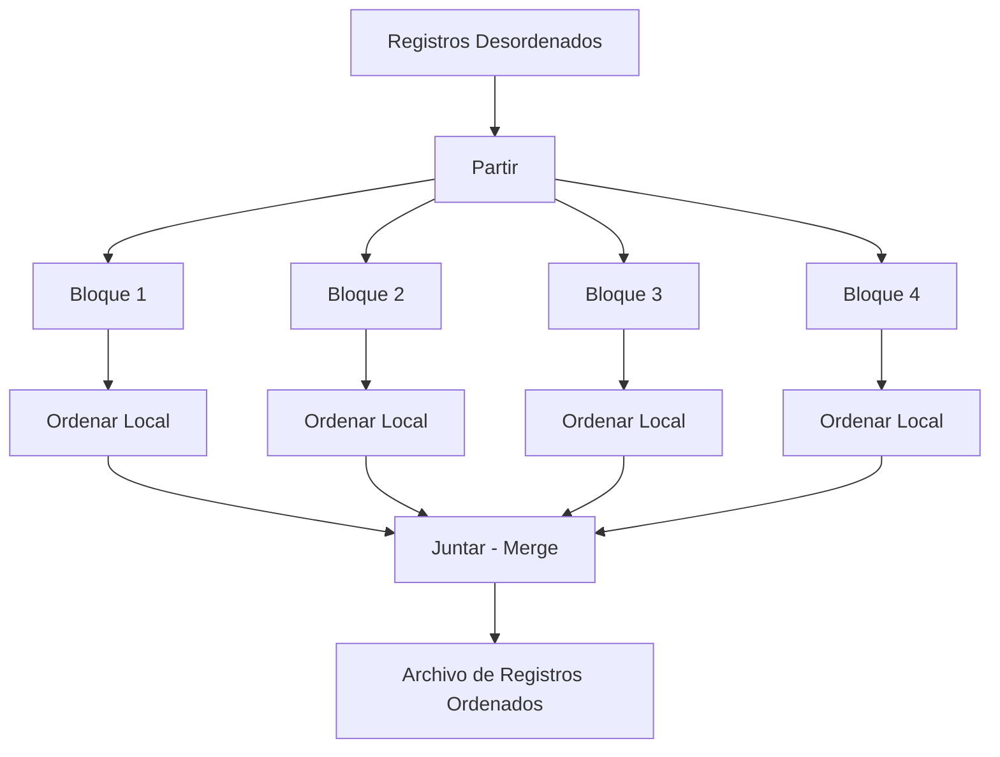

# 📘 Clase 4: Búsqueda y Clasificación de Archivos

**Materia:** Fundamentos de Organización de Datos (FOD) — UNLP 2026  
**Temas:** Búsqueda Secuencial y Binaria, Ordenamiento Externo, Archivos Grandes, Merge Sort.

---

## Parte A: Búsqueda de Información

### 🎯 Costo y Accesos

Cuando tratamos de encontrar un registro específico dentro de un archivo, la eficiencia (el "costo" computacional) se mide en dos factores principales:

1. **# de comparaciones:** Son las operaciones en memoria RAM (CPU vs Buffer). Se pueden mejorar algorítmicamente.
2. **# de accesos:** Son las operaciones mecánicas de lectura/escritura en disco. Es el cuello de botella.

| Estrategia | Eficiencia |
|---|---|
| **Acceso Directo (NRR)** | Extremadamente rápido si se conoce el Número Relativo de Registro previamente. |
| **Búsqueda Secuencial** | Lenta. Obliga a iterar disco y leer bloque por bloque desde el principio hasta encontrar el registro. |

Para evitar el drama de la Búsqueda Secuencial a ciegas, intentamos incorporar el **uso de Claves** y estructurar los archivos.

---

### ⚙️ Búsqueda Binaria (Archivos)

**Motivación:** Acotar drásticamente el espacio de búsqueda partiendo repetidamente el archivo a la mitad, hasta encontrar la clave.

**Precondiciones Vitales:**
1. El archivo debe estar **completamente ordenado por la Clave** de búsqueda.
2. Los registros deben ser estrictamente de **Longitud Fija** (para poder hacer un `seek` matemático hacia la posición media).

**Performance:**
Si `N` es la cantidad de registros en el archivo, el rendimiento de la búsqueda binaria se calcula en un orden matemático de **Log₂ N**.
> ✅ *Se mejora monumentalmente la performance en comparación al O(n) de la búsqueda secuencial.*
> ❌ *El costo recae en **mantener ordenado el archivo** cada vez que insertamos o modificamos un dato.*

---

## Parte B: Clasificación (Ordenamiento)

Para poder aplicar Búsqueda Binaria, vimos que el archivo debe estar ordenado. Pero ¿Cómo clasificamos (ordenamos) un archivo masivo almacenado en disco?

### Alternativas de Ordenamiento

| Método | Funcionamiento | Eficiencia y Límites |
|---|---|---|
| **En RAM** | Llevar todo el archivo completo a la Memoria Principal y usar `Quicksort/Mergesort`. | Altamente ineficiente o directamente **imposible** para archivos inmensos que saturan la RAM. |
| **Claves en RAM** | Traer solo los campos "Clave" y "NRR" a memoria RAM, ordenarlos allí, y luego reescribir el disco. | Mejor, pero si el archivo tiene millones de registros, ni siquiera el arreglo de claves cabrá en RAM. |
| **Ordenar sobre Disco** | Mover punteros y registros directamente en almacenamiento secundario. | Extremadamente ineficiente por la monumental cantidad de accesos electromecánicos al disco rígido requeridos. |

### 🏗️ Ordenamiento de Archivos Grandes (External Sort-Merge)

Cuando un archivo es **demasiado grande para caber en memoria RAM**, la alternativa indiscutida para clasificarlo es el patrón de **Partir, Ordenar y Juntar**.

**Procedimiento:**
1. **Partir:** Cortar el archivo original en fragmentos (chunks) más pequeños que sí entren cómodamente en la RAM.
2. **Ordenar:** Cargar cada fragmento en RAM, ordenarlo (ej: usando *Quicksort*) y guardarlo en el disco como un archivo temporal parcial.
3. **Juntar (Merge):** Realizar un proceso de *Merge N-way* tomando el primer elemento de cada archivo temporal y combinándolos hacia un gran archivo final completamente ordenado.

---

## 💡 Conclusiones Generales

| | Conclusión sobre la Evolución Teórica |
|---|---|
| ✅ | La **Búsqueda Binaria** mejora de manera indiscutible a la Búsqueda Secuencial, reduciendo dramáticamente las comparaciones. |
| ❌ | **Problemas subyacentes:** El número de accesos a disco baja notoriamente, pero nunca llega a ser "1" inmediato (O(1)) como en el Hashing. Acceder por el NRR requiere al menos una lectura final. |
| ❌ | **Costo de mantenimiento:** Ordenar y mantener el orden con *External Sort* es pesado. La clasificación en RAM es exclusiva para archivos pequeños. |
| 🚀 | **El Futuro (Arboles B):** Para mitigar el reordenamiento constante de *TODO* el archivo frente a nuevos insertos, es imperativo reorganizar los datos utilizando **métodos más eficientes e índices jerárquicos**, como los Árboles, que veremos en las próximas clases. |

---

## 📚 Recursos y Referencias

- **Cátedra FOD (UNLP):** *"Organización de Datos - Clase 4: Búsqueda y Clasificación"*. 2026.
