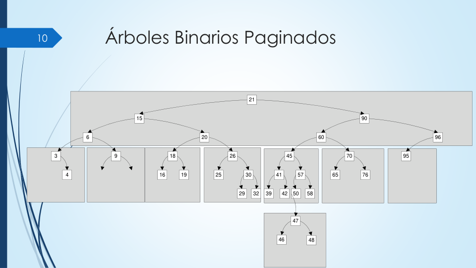
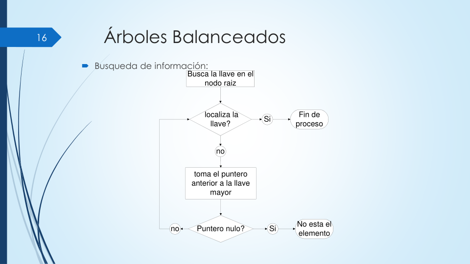
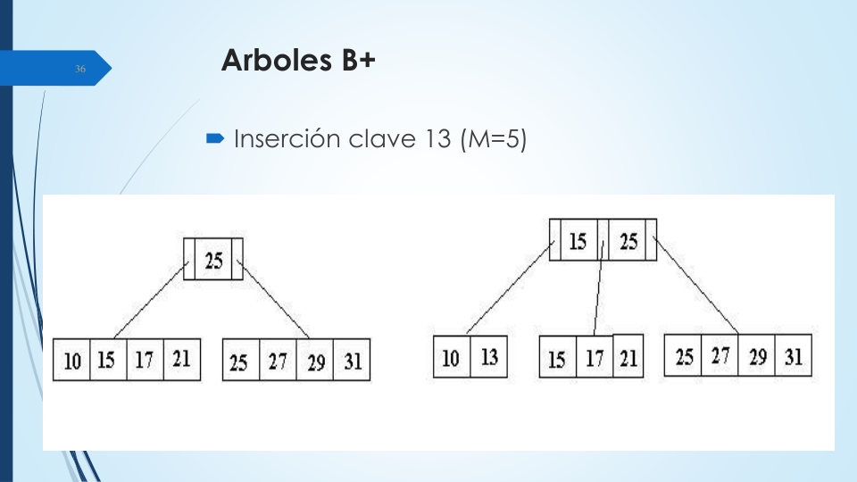

# 📘 Clase 6: Árboles y Estructuras Balanceadas

**Materia:** Fundamentos de Organización de Datos (FOD) — UNLP 2026  
**Temas:** Árboles Binarios, AVL, Multicamino, B-Trees, B* y B+.

---

## Parte A: Introducción a los Árboles en Disco

### 🎯 Motivación

En las clases anteriores vimos que los Índices arreglan el problema de la Búsqueda Secuencial, pero generan un nuevo problema: **mantener los índices ordenados en disco es excesivamente costoso**.

La solución es utilizar **Árboles**: Estructuras jerárquicas de datos que permiten localizar de forma rápida la información de un archivo, teniendo **intrínsecamente una búsqueda binaria** sin requerir un array contiguo.

---

### 1. Árboles Binarios Paginados

En un árbol binario estándar, cada nodo tiene a lo sumo dos sucesores (Hijo Izquierdo e Hijo Derecho). Su principal inconveniente es que **se desbalancean fácilmente** dependiendo del orden en que lleguen las claves (quedando como una lista enlazada asimétrica).

Además, existe un **problema de almacenamiento secundario (Disco)**: si cada nodo es un bloque en el disco, para bajar por el árbol haríamos muchísimas lecturas mecánicas. Para minimizar esto, aplicamos **Paginación**, agrupando varios nodos en un solo bloque o "página" física de memoria.

> *Ejemplo visual de paginación: Varios nodos lógicos (triángulos) son empaquetados dentro de un único nodo de disco (cuadrado gris).*

**¿Y los Árboles AVL?**
Son árboles binarios balanceados en altura (`BA(1)`). Mantienen la altura compensada mediante *Rotaciones* estrictas cada vez que se inserta un dato, pero su performance (`1.44 log₂(N+2)`) todavía peca de tener un alto grado de saltos a disco.

---

## Parte B: Árboles Multicamino

Para achicar severamente la altura del árbol (y con ello, achicar los "saltos electromecánicos" en disco), pasamos a los **Árboles Multicamino**. 
En vez de tener 1 sola clave por nodo que deriva a 2 hijos, generalizamos el concepto para que un nodo tenga **K punteros a hijos** y **K-1 llaves**.

> *Al colocar más claves dentro de la misma "Página/Bloque", el árbol se hace mucho más "ancho" y mucho menos "profundo".*

---

## Parte C: Árboles B (Balanceados)

Los **Árboles B** son la evolución final para Bases de Datos. Son árboles multicamino con una construcción especial **de forma ascendente (bottom-up)** que permite mantenerlos estrictamente balanceados a bajísimo costo computacional.

### Propiedades de un Árbol B (Orden M)
*   **M:** Máxima cantidad de hijos (punteros).
*   Ningún nodo tiene más de `M` hijos ni más de `M-1` claves.
*   Todo nodo (menos la raíz y las hojas) tiene como **mínimo** `⌈M/2⌉` hijos (siempre están a la mitad de su capacidad).
*   **Nivelación Perfecta:** Todos los nodos hoja (terminales) aparecen exactamente al mismo nivel (altura igual).

> *Estructura interna: Cada nodo posee celdas alternadas entre Punteros (Hijos) y Datos (Claves). Se muestra una tabla simulando la RAM que almacena los punteros lógicos y los NRR físicos.*

**¿Por qué son tan rápidos? (Performance)**
Si armamos un árbol con un Orden de M=512 (es decir, cada bloque del disco rígido puede guardar 511 claves), y tenemos 1 Millón de registros, la altura máxima del árbol será de solo `3.37`. 
👉 **Con solo 4 lecturas electromecánicas al disco, encontramos cualquier registro entre 1 Millón.**

---

## Parte D: Variantes Avanzadas (B* y B+)

### 🌳 Árboles B*
Son un Árbol B estricto donde se exige que **cada nodo esté lleno por lo menos en sus 2/3 partes** (en lugar de la mitad 1/2 del Árbol B normal). Retrasa la necesidad de dividir páginas, mejorando la densidad espacial.

### 🌳 Árboles B+
El rey de los motores de bases de datos relacionales modernos.
*   **Diferencia Fundamental:** Todos los registros (los datos reales) **solo residen en las Hojas**.
*   Los nodos internos son puramente "punteros guía" de enrutamiento.
*   **Conjunto de Secuencias:** Todas las hojas están enlazadas horizontalmente (como una lista doblemente enlazada). Esto permite hacer **Búsquedas Secuenciales Masivas** rapidísimas saltando de hoja en hoja sin tener que volver a subir a la raíz.

> *Mecánica de división en Árbol B+: Cuando una hoja se llena, se divide en dos, la clave media "sube" al nodo padre para rutear, pero a su vez se mantiene "abajo" en la nueva hoja derecha para no perder el dato real.*

---

## 📚 Recursos y Referencias

- **Cátedra FOD (UNLP):** *"Organización de Datos - Clase 6: Árboles y Arboles B/B+"*. 2026.
