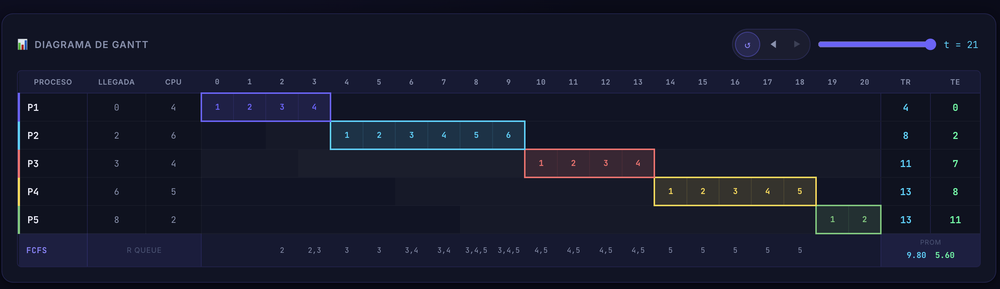
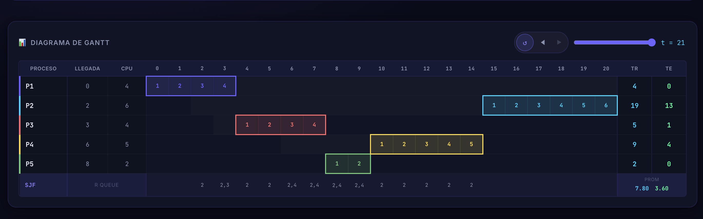
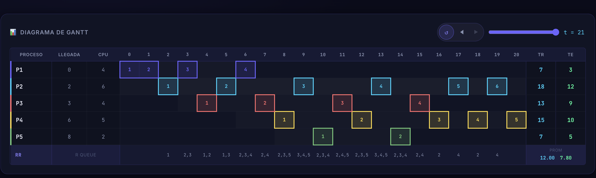
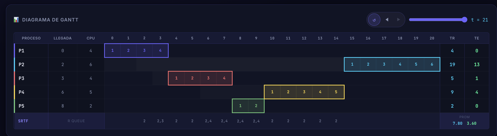

# 💻 Resolución Práctica 2: Planificación y Memoria

**Materia**: Introducción a los Sistemas Operativos (ISO)

---

<b>1. Algoritmos de Scheduling (Planificación)</b>

**a. Funcionamiento básico**
- **FCFS**: Atiende por orden de llegada. No apropiativo.
- **SJF**: Ejecuta primero el más corto.
- **Round Robin (RR)**: Reparte el tiempo en turnos forzados (*Quantum*). Equitativo.
- **Prioridades**: Ejecuta primero el de mayor prioridad.

**b. Parámetros exigidos**
- **RR**: Valor del `Quantum` (q).
- **SJF**: Estimación predictiva de la próxima `Ráfaga`.
- **Prioridades**: Valor numérico de `Prioridad`.

**c. Casos de uso ideales**
- **FCFS / SJF**: Sistemas *Batch* (por lotes pesados).
- **Round Robin**: Sistemas interactivos / de usuario final.
- **Prioridades**: Sistemas de *Tiempo Real (RTOS)* o misiones críticas.

**d. Pros y Contras rápidos**
- **FCFS**: ✔️ Justo, simple. ❌ "Efecto Convoy" (los pesados traban la cola).
- **SJF**: ✔️ Mínima espera promedio. ❌ Riesgo de inanición para trabajos masivos.
- **RR**: ✔️ Ágil, sin monopolios. ❌ Alto `overhead` por constante cambio de contexto.
- **Prioridades**: ✔️ Respeta jerarquías. ❌ Riesgo de inanición si no hay "aging" (envejecimiento).

**e. y f. Fórmulas vitales (TR y TE)**
- **TE (Espera)**: Tiempo congelado en la Cola de Listos.
- **TR (Retorno)**: Vida total del proceso (desde que nace hasta que muere).
- **TPE y TPR**: Suma total de los TE/TR dividida la cantidad $N$ de procesos totales.

**g. Tiempo de Respuesta**
- Tiempo desde que ingresa a la cola hasta que se ejecuta **por primera vez**.

---

<b>3. Ejercicio 3: Lote de procesos y Gantt</b>

### a. Diagramas de Gantt
*(Simulación gráfica del lote).*

**i. FCFS (First Come First Served)**  

**ii. SJF (Shortest Job First)**  

**iii. Round Robin (q=1)**  

**iv. Round Robin (q=6)**  

### b. Resultados Matemáticos (TR y TE)

| Algoritmo | J1 | J2 | J3 | J4 | J5 | **TPR** | **TPE** |
|---|---|---|---|---|---|---|---|
| **FCFS** | 4 / 0 | 8 / 2 | 11 / 7 | 13 / 8 | 13 / 11 | **9.8** | **5.6** |
| **SJF** | 4 / 0 | 19 / 13 | 5 / 1 | 9 / 4 | 2 / 0 | **7.8** | **3.6** |
| **RR (q=1)** | 5 / 1 | 18 / 12 | 12 / 8 | 15 / 10 | 8 / 6 | **11.6** | **7.4** |
| **RR (q=6)** | 4 / 0 | 8 / 2 | 11 / 7 | 13 / 8 | 13 / 11 | **9.8** | **5.6** |

### c. Análisis de resultados
- **SJF** aplasta a los demás matemáticamente (mejor TPE/TPR) porque resuelve rápido las tareas chicas, pero deja colgado al trabajo más pesado J2.
- **RR(6)** termina rindiendo mágicamente idéntico a **FCFS** porque su quantum de *6* le permite a todas las tareas terminar en un único saque.
- **RR(1)** arroja el peor rendimiento de todos, ya que estira absurdamente las devoluciones con cortes constantes.

### d. Importancia del Quantum
Si elegís un quantum gigante $\rightarrow$ obtenés FCFS. Si elegís un quantum microscópico $\rightarrow$ desperdiciás CPU de puro esfuerzo de cambio de contexto.

### e. ¿Quantum Alto sí o no?
- **Sí**: En súper servidores *Batch* donde necesitás exprimir la potencia del CPU al `100%` en cálculos grandes sin pausas `overhead`.
- **No**: En compus de escritorio porque rompe la fluidez y hace parecer que todo se traba esperando a terminar.

---

<b>4. Ejercicio 4: Variante SRTF (Shortest Remaining Time First)</b>

### a. Diagrama de Gantt

### b. ¿Qué ventaja ofrece SRTF frente a otros algoritmos?
- ✔️ **Respuesta interactiva instantánea**: Al ser un modelo *Apropiativo*, si llega repentinamente un trabajito corto (ej. una operación de teclado), el SO pisa el freno, suspende el bloque masivo pesado que estuviese corriendo e inserta el corto. 
- ✔️ **Mínimo TPE absoluto**: A diferencia del humilde SJF, acá no se comete el pecado de ignorar una ráfaga entrante menor. Es el algoritmo matemático que garantiza por excelencia el menor Tiempo Promedio de Espera posible en escenarios de arribos dinámicos.

---
