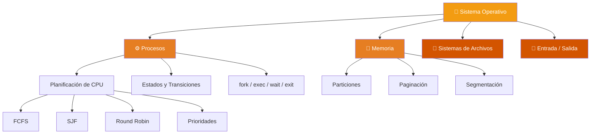

  

  
  
  
  

  

---

Repositorio de estudio personal para la materia **Introducción a los Sistemas Operativos (ISO)**, correspondiente a la carrera Licenciatura en Sistemas / Analista en TIC (UNLP).  
**Docentes:** Cátedra de la Facultad de Informática UNLP

 

## 📖 Resúmenes de Teoría

Cada resumen incluye explicaciones estructuradas, diagramas extraídos de las diapositivas y conceptos clave del Sistema Operativo. Hacé click en cualquier tema para abrirlo.

 

<!-- ═══════════════ TEMA 1 ═══════════════ -->

<table>
  <tr>
    <td width="900">
      <h3>📄 <a href="Teoria/Resumenes/Intro_1_Que_es_un_SO.md">Tema 1 — Parte 1: ¿Qué es un SO?</a></h3>
      <blockquote>Definición, perspectivas, objetivos, componentes y servicios del Sistema Operativo.</blockquote>
      

        
        
        
      

    </td>
  </tr>
</table>

<table>
  <tr>
    <td width="900">
      <h3>📄 <a href="Teoria/Resumenes/Intro_Anexo_Arquitectura.md">Tema 1 — Anexo: Arquitectura de Computadoras</a></h3>
      <blockquote>Elementos básicos, registros, ciclo de instrucción e interrupciones.</blockquote>
      

        
        
        
      

    </td>
  </tr>
</table>

<table>
  <tr>
    <td width="900">
      <h3>📄 <a href="Teoria/Resumenes/Intro_2_Modos_Proteccion_Syscalls.md">Tema 1 — Parte 2: Modos, Protección y System Calls</a></h3>
      <blockquote>Modos Kernel/Usuario, protección de memoria, E/S y CPU, llamadas al sistema.</blockquote>
      

        
        
        
      

    </td>
  </tr>
</table>

<table>
  <tr>
    <td width="900">
      <h3>📄 <a href="Teoria/Resumenes/Intro_Anexo_Syscalls.md">Tema 1 — Anexo: Syscalls en Detalle</a></h3>
      <blockquote>Programación directa de syscalls, Hello World en ASM, diferencias x86 vs x86-64.</blockquote>
      

        
        
      

    </td>
  </tr>
</table>

<!-- ═══════════════ PROCESOS 1 ═══════════════ -->

<table>
  <tr>
    <td width="900">
      <h3>📄 <a href="Teoria/Resumenes/Procesos_1.md">Tema 2: Procesos - Parte 1</a></h3>
      <blockquote>Definición de proceso, componentes, PCB, espacio de direcciones y cambio de contexto.</blockquote>
      

        
        
        
        
      

    </td>
  </tr>
</table>

<!-- ═══════════════ PROCESOS 2 ═══════════════ -->

<table>
  <tr>
    <td width="900">
      <h3>📄 <a href="Teoria/Resumenes/Procesos_2.md">Tema 2: Procesos - Parte 2</a></h3>
      <blockquote>Planificación de CPU, colas, schedulers, estados y transiciones de procesos.</blockquote>
      

        
        
        
        
        
      

    </td>
  </tr>
</table>

<!-- ═══════════════ PROCESOS 3 ═══════════════ -->

<table>
  <tr>
    <td width="900">
      <h3>📄 <a href="Teoria/Resumenes/Procesos_3.md">Tema 2: Procesos - Parte 3</a></h3>
      <blockquote>Creación y terminación de procesos, relación padre-hijo, fork, execve y syscalls.</blockquote>
      

        
        
        
        
      

    </td>
  </tr>
</table>

<!-- ═══════════════ CONTEXT SWITCH ═══════════════ -->

<table>
  <tr>
    <td width="900">
      <h3>📄 <a href="Teoria/Resumenes/Context_Switch_Round_Robin.md">Cambio de Contexto en Round Robin</a></h3>
      <blockquote>Análisis detallado de qué ocurre durante un context switch en un algoritmo Round Robin.</blockquote>
      

        
        
        
      

    </td>
  </tr>
</table>

 

> 📂 **Material oficial de cátedra (PDFs):** [Abrir directorio](Teoria/Material_Original/)

---

 

## 💻 Prácticas Resueltas

| # | Tema | Contenido | Link |
|:-:|---|---|:-:|
| **1** | Comandos Básicos de Linux | GNU/Linux, Shell, File System, procesos, permisos, scripting | [📁](Practicas/Resolucion_Practica_1.md) |
| **2** | Planificación y Memoria | Algoritmos de scheduling (FCFS, SJF, RR, Prioridades), TR, TE, TPR, TPE | [📁](Practicas/Resolucion_Practica_2.md) |

---

 

## 🗺️ Mapa de Temas del SO

---

 

## 📝 Evaluaciones

Material de preparación extra, simulacros y resolución de exámenes pasados.

📁 [Abrir directorio de Evaluaciones](Evaluaciones/)

---

 

## 🛠️ Stack Tecnológico

  

  <b>Linux</b> · <b>Bash</b> · <b>Vim</b> · <b>Git & GitHub</b>

---

  

  Repositorio de uso personal y académico · Material de cátedra © sus respectivos autores
   
  Hecho con 🧡 por <a href="https://github.com/auwus21">@auwus21</a>

