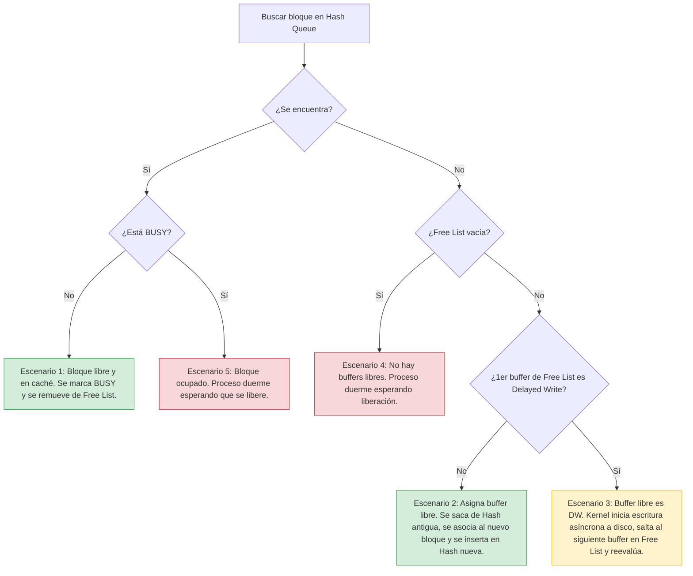

# 📘 Tema 6: Caché de Disco (Buffer Cache en UNIX System V)

**Materia:** Introducción a los Sistemas Operativos (ISO) — UNLP 2026  
**Temas:** Caché de disco, Estructura del Buffer Cache, Headers y Buffers, Hash Queues, Free List, Estados de los Buffers y los 5 Escenarios de Búsqueda de Bloques.

---

<details>
<summary><b>🧠 Parte 1: Conceptos de Caché de Disco y Algoritmos de Reemplazo</b></summary>

## 🎯 ¿Qué es el Caché de Disco (Disk Cache)?
El caché de disco consiste en un conjunto de **buffers en memoria principal (RAM)** reservados para el almacenamiento temporal de bloques lógicos del disco.
*   **Objetivo principal:** **Minimizar la frecuencia de acceso al disco físico**, reduciendo la latencia de Entrada/Salida al servir los datos directamente desde la RAM.

---

## 💡 Alternativas para Compartir Bloques
Cuando un proceso solicita un bloque que ya está cargado en el caché, el kernel del SO puede manejarlo de dos formas:
1.  **Copia de datos:** Copiar el bloque desde el espacio de caché de la RAM al espacio de direcciones privado del usuario. 
    *   *Desventaja:* No permite compartir la información en tiempo real de forma eficiente y genera copias redundantes en memoria RAM.
2.  **Memoria compartida:** Permitir que múltiples procesos accedan de forma directa y compartida al mismo buffer de memoria gestionado por el Kernel.
    *   *Ventaja:* Evita redundancias y optimiza la concurrencia, pero requiere mecanismos estrictos de sincronización y bloqueo de buffers.

---

## 🔄 Estrategias de Reemplazo de Búfer
Dado que el espacio reservado para el caché es limitado, el kernel necesita un algoritmo de reemplazo para decidir qué bloque desalojar cuando se requiere cargar información nueva desde el disco:

*   **LRU (Least Recently Used - Menos Recientemente Usado):** 
    *   Es la estrategia estándar. Organiza los buffers en una lista de punteros ordenados temporalmente.
    *   El buffer al principio de la lista representa el que hace más tiempo que no se usa (el candidato a ser desalojado).
    *   Cuando un buffer es referenciado o se carga con nuevos datos, se mueve al **final de la lista** (el más recientemente usado).
    *   *Nota:* No se mueven los datos físicamente en la memoria RAM, únicamente se reacomodan los punteros de la lista.
*   **LFU (Least Frequently Used - Menos Frecuentemente Usado):** 
    *   Lleva un contador de accesos en el header del búfer.
    *   Cuando se necesita un búfer libre, se desaloja aquel que posea el menor número de referencias acumuladas.

</details>

<br>

<details>
<summary><b>⚙️ Parte 2: Estructura del Buffer Cache de UNIX System V</b></summary>

El módulo de **Buffer Cache** es un servicio global del kernel. Es completamente independiente del sistema de archivos concreto (ext3, FAT, etc.) y de los controladores de dispositivos de hardware.

## 🏗️ Partes de un Buffer
El espacio de memoria asignado por el kernel durante la inicialización se divide en dos componentes:

```
+-------------------------------------------------------------+
|  BUFFER HEADER (Metadatos: Dispositivo, Bloque, Punteros)   |
+-------------------------------------------------------------+
                              |
                              v (Apunta a)
+-------------------------------------------------------------+
|  BUFFER DE DATOS (Área en RAM con los bytes del bloque)     |
+-------------------------------------------------------------+
```

1.  **Header (Cabecera):** Contiene la información administrativa que modela al búfer. Ocupa un espacio fijo de control.
2.  **Buffer en sí:** El bloque físico en memoria RAM donde realmente se copian los datos del disco.

### 📋 Campos del Header:
*   **Número de dispositivo** e **Identificador del Bloque**: Clave única que mapea qué bloque de qué disco está cargado en este búfer.
*   **Estado:** Banderas de control del búfer (ocupado, libre, escribiendo, etc.).
*   **Puntero de datos:** Dirección de memoria RAM donde se ubica el búfer físico asociado.
*   **Punteros de Hash Queue:** Dos punteros para la lista doblemente enlazada de su cola de Hash.
*   **Punteros de Free List:** Dos punteros para la lista doblemente enlazada de la lista de libres.

---

## 📊 Estructuras de Organización del Kernel

### 1️⃣ Hash Queues (Colas de Hash)
Para optimizar las búsquedas de bloques y evitar recorrer secuencialmente miles de cabeceras en memoria, el kernel organiza los headers usando una función hash basada en `(Nº Dispositivo, Nº Bloque)`.
*   Los buffers que devuelven el mismo valor hash se agrupan en una cola doblemente enlazada.
*   El kernel busca una función hash de alta dispersión para mantener las colas lo más cortas posibles.
*   **¡Regla clave!** El header de un búfer **siempre** se encuentra en una Hash Queue, independientemente de su estado.

### 2️⃣ Free List (Lista de Libres)
Es una lista doblemente enlazada organizada bajo la política **LRU** que agrupa todos los buffers que **no están en uso** (disponibles para ser reutilizados).
*   Un búfer está en la Free List si su estado es *Free* (disponible), incluso si contiene datos válidos de una lectura anterior.
*   Si un proceso termina de usar un bloque, su header se inserta al **final de la Free List** (marcado como el más recientemente usado).
*   Si el kernel necesita asignar un búfer para cargar un bloque nuevo, siempre lo toma de la **cabeza de la Free List** (el menos recientemente usado).

---

## 🚦 Estados de un Búfer
*   **Busy (Ocupado):** El búfer está bloqueado por un proceso que actualmente lee o escribe datos en él. Ningún otro proceso puede acceder a él.
*   **Free (Disponible):** Está libre para ser reclamado o reasignado. Se encuentra en la Free List.
*   **I/O en progreso:** Indica que el búfer está bloqueado temporalmente porque se están transfiriendo sus datos desde o hacia el disco físico.
*   **Delayed Write (DW - Escritura Demorada):** El contenido del búfer fue modificado en RAM por un proceso, pero el kernel aún no ha copiado esos cambios de vuelta al disco físico. El bloque en disco está desactualizado ("sucio").

</details>

<br>

<details>
<summary><b>🔄 Parte 3: Algoritmo de Búsqueda y Recuperación (Los 5 Escenarios)</b></summary>

Cuando un proceso necesita acceder a un bloque de disco, el kernel ejecuta el algoritmo `getblk` para buscar el búfer en la caché. Pueden ocurrir exactamente **5 escenarios**:



---

### 1️⃣ Escenario 1: El bloque está en su Hash Queue y está libre (en la Free List)
Es el escenario ideal (Cache Hit sin conflictos):
1.  El kernel localiza el header del búfer en la Hash Queue correspondiente.
2.  Verifica que el búfer está libre (se encuentra en la Free List).
3.  **Acción:** Remueve el búfer de la Free List (reacomodando los punteros LRU), lo marca como **Busy** (Ocupado) y se lo entrega al proceso.

### 2️⃣ Escenario 2: El bloque no está en la Hash Queue y hay buffers libres
Ocurre cuando hay que traer el bloque desde el disco (Cache Miss):
1.  El kernel busca el bloque en las Hash Queues y no lo encuentra.
2.  Va a la Free List y toma el **primer búfer disponible** (el de la cabeza, el menos recientemente usado).
3.  **Acción:** 
    *   Remueve el búfer de su antigua Hash Queue y lo reasigna al nuevo par `(Dispositivo, Bloque)`.
    *   Lo inserta en la Hash Queue que le corresponde según el nuevo hash.
    *   Lo marca como **Busy** e inicia la Entrada/Salida para leer los datos del disco al búfer.
    *   El proceso queda bloqueado esperando la lectura de hardware.

### 3️⃣ Escenario 3: El bloque no está en la Hash Queue y el búfer libre tomado está marcado como Delayed Write (DW)
El kernel intenta reutilizar un búfer libre, pero contiene datos modificados que aún no se salvaron en disco:
1.  El kernel no encuentra el bloque en la Hash Queue.
2.  Toma el primer búfer libre de la Free List, pero nota la bandera **Delayed Write** activa.
3.  **Acción:**
    *   El kernel inicia inmediatamente la **escritura asíncrona a disco** del contenido de este búfer.
    *   El búfer no se puede reasignar todavía (está ocupado escribiendo).
    *   El kernel **no espera a que termine de escribir**; en su lugar, avanza al **siguiente búfer libre** de la Free List para asignárselo al proceso original.
    *   Una vez que se complete la escritura a disco del bloque DW, este se limpia y se coloca al principio de la Free List (LRU) para su futuro uso.

### 4️⃣ Escenario 4: El bloque no está en la Hash Queue y la Free List está vacía
Saturación de memoria caché:
1.  El kernel no encuentra el bloque en las Hash Queues.
2.  Revisa la Free List y descubre que está completamente vacía (todos los buffers del sistema están marcados como Busy).
3.  **Acción:**
    *   El proceso se **bloquea y se pone a dormir** a la espera de que cualquier búfer se libere globalmente.
    *   Cuando un búfer es liberado por otro proceso, este despierta a todos los procesos en espera.
    *   El proceso despierta y **debe reiniciar todo el algoritmo** (ya que otro proceso pudo haber cargado el bloque que buscaba mientras este dormía).

### 5️⃣ Escenario 5: El bloque está en la Hash Queue pero está ocupado (Busy)
Colisión de procesos por el mismo recurso:
1.  El kernel localiza el bloque en la Hash Queue.
2.  Verifica el estado del búfer y descubre que está marcado como **Busy** (actualmente en uso por otro proceso).
3.  **Acción:**
    *   El proceso se bloquea y **se va a dormir** en espera de la liberación de ese búfer específico.
    *   Cuando el proceso dueño libera el búfer, despierta a todos los que esperaban por él.
    *   El proceso despierta y **debe volver a buscarlo** en la Hash Queue desde el inicio.

</details>
