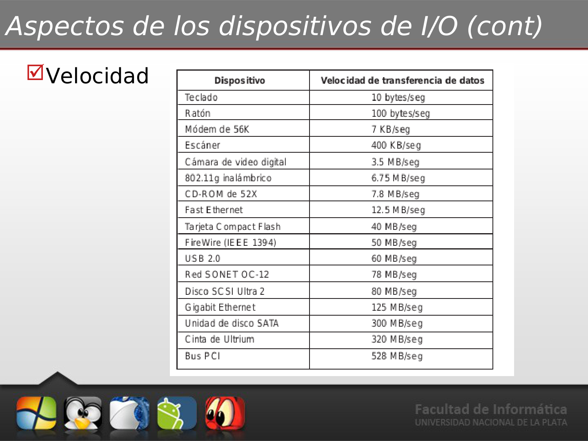
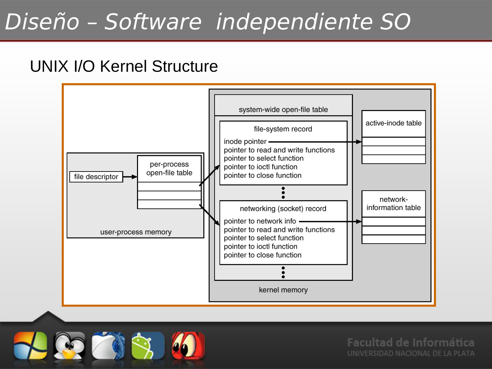
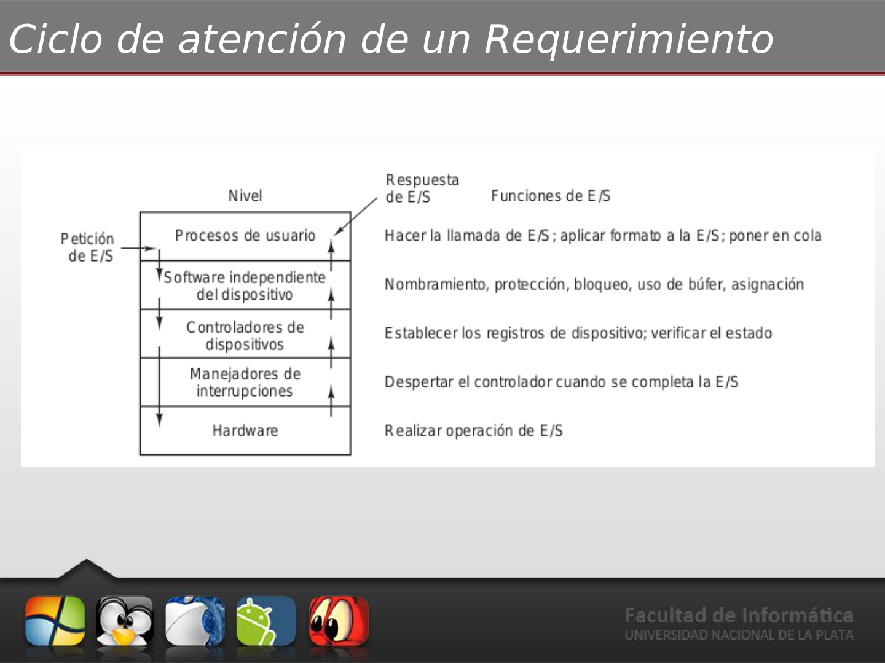
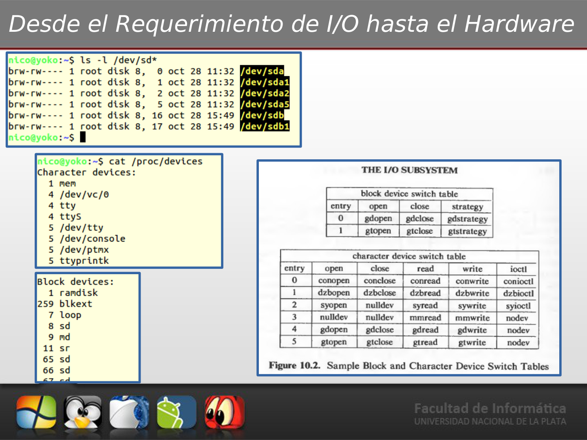
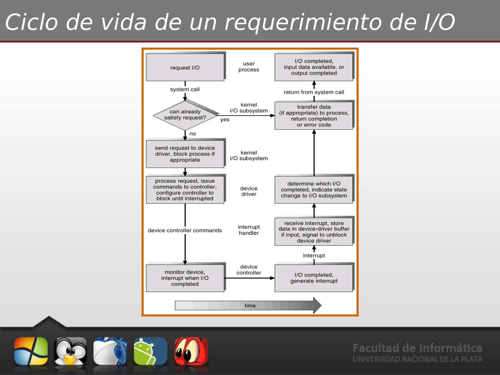

# 📘 Tema 4: Subsistema de Entrada / Salida (E/S)

**Materia:** Introducción a los Sistemas Operativos (ISO) — UNLP 2026  
**Temas:** Clasificación de dispositivos, Capas de software de E/S, Metas del subsistema, Drivers, Ciclo de vida de una petición, Optimización de performance, DMA, Buffering, Spooling.

---

<details>
<summary><b>🔌 Parte 1: Entrada / Salida (Conceptos, Estructura, Drivers y Ciclo de Peticiones)</b></summary>

## 🎯 Responsabilidades del SO en E/S

El subsistema de Entrada/Salida es el encargado de comunicar al procesador y la memoria con el mundo exterior (periféricos). Sus responsabilidades principales son:
- **Controlar los dispositivos físicos**: Generar comandos de bajo nivel, procesar interrupciones de hardware y gestionar errores de transferencia.
- **Proporcionar una interfaz limpia y abstracta**: Ocultar la complejidad de los controladores al programador de aplicaciones.

### ⚠️ Problemas de la E/S
El SO debe lidiar con:
1. **Heterogeneidad extrema**: Un teclado funciona de manera totalmente diferente a un disco rígido o una placa de red.
2. **Diferencias de velocidad**: La CPU corre a nanosegundos; los dispositivos mecánicos o de red pueden tardar milisegundos.
3. **Evolución constante**: El soporte para nuevos tipos de hardware debe ser flexible y modular.

---

## 🏗️ Clasificación y Aspectos de los Dispositivos de E/S

Los periféricos se catalogan según varios atributos físicos y operacionales:

### 1️⃣ Unidad de Transferencia
- **Dispositivos por Bloques (ej: Discos Rígidos, SSDs)**:
  - Almacenan información en bloques de tamaño fijo.
  - Permiten lecturas, escrituras y búsquedas (`Read`, `Write`, `Seek`) de bloques específicos de forma independiente.
- **Dispositivos por Carácter (ej: Teclados, Mouses, Puertos Serie)**:
  - Envían o reciben un flujo continuo de caracteres, sin estructura de bloques.
  - No son direccionables ni admiten búsquedas. Sus operaciones principales son leer/escribir caracteres (`get`, `put`).

### 2️⃣ Forma de Acceso
- **Secuencial**: Los datos deben leerse en orden (ej: cintas magnéticas de backup).
- **Aleatorio (Random)**: Se puede acceder a cualquier posición directamente (ej: discos).

### 3️⃣ Compartición y Permisos
- **Tipo de acceso**:
  - *Acceso Compartido*: Varios procesos leen/escriben concurrentemente (ej: Disco Rígido).
  - *Acceso Exclusivo*: Solo un proceso puede controlarlo a la vez (ej: Impresora).
- **Permisos**:
  - *Read Only* (Solo lectura): CD-ROM.
  - *Write Only* (Solo escritura): Pantalla / Impresora.
  - *Read/Write* (Lectura y Escritura): Discos.

### 4️⃣ Velocidades de Transferencia
La diferencia de velocidad entre periféricos y CPU es masiva, abarcando varios órdenes de magnitud:



---

## 🎯 Metas y Servicios del Subsistema de E/S

El SO implementa servicios para unificar y optimizar el acceso al hardware:

### 1. Generalidad e Interfaz Uniforme
Es deseable que el desarrollador no sepa cómo funciona el motor del disco o la lógica del teclado. Las rutinas de bajo nivel deben abstraer los detalles específicos exponiendo una interfaz estandarizada con llamadas uniformes: `open()`, `close()`, `read()`, `write()`, `lock()`, `unlock()`.

### 2. Eficiencia (Multiprogramación)
Dado que los dispositivos son lentos, el SO implementa multiprogramación para suspender los procesos que esperan operaciones de E/S, liberando la CPU para ejecutar otros hilos de ejecución activos.

### 3. Planificación (Scheduling)
El SO reordena la cola de peticiones de E/S pendientes para optimizar el rendimiento del dispositivo (por ejemplo, los algoritmos de planificación de disco que minimizan el movimiento del cabezal).

### 4. Buffering (Almacenamiento Intermedio)
Consiste en copiar temporalmente los datos en una zona de memoria RAM (*Buffer*) durante la transferencia.
- **Soluciona diferencias de velocidad**: El productor escribe rápido en el buffer y el consumidor lee a su propio ritmo.
- **Adapta tamaños y formatos**: Junta datos dispersos para enviarlos como un único bloque grande o viceversa.

### 5. Caching
Mantiene copias de datos accedidos recientemente en memoria RAM rápida para evitar lecturas repetitivas al lento almacenamiento secundario.

### 6. Spooling (Simultaneous Peripheral Operations On-Line)
Permite gestionar la concurrencia en dispositivos de **acceso exclusivo** (como impresoras). En lugar de dejar que un proceso bloquee la impresora, el SO intercepta la salida, la guarda temporalmente en un archivo en disco (*Spool*) y una cola del sistema se encarga de enviarla a la impresora de forma secuencial.

### 7. Manejo de Errores
El SO procesa los errores físicos (sectores dañados, pérdidas de conexión) de forma transparente o devuelve códigos de error claros al proceso. También mantiene registros históricos (*Logs*).

---

## 🔄 Formas de realizar la E/S en Software

### 🛑 E/S Bloqueante (Blocking)
El proceso que solicita la E/S es suspendido (pasa al estado *Bloqueado*) hasta que la operación se completa físicamente.
- **Pros**: Fácil de usar y de entender para el programador.
- **Contras**: Detiene la ejecución del proceso por completo.

### ⚡ E/S No Bloqueante (Non-blocking)
La llamada al sistema inicia la E/S y retorna inmediatamente con los datos que estén disponibles (o un indicador de que aún no hay datos).
- **Pros**: Permite que el proceso siga ejecutando código concurrente.
- **Ejemplos**:
  - Interfaz gráfica (GUI) que escucha teclado/mouse en un bucle continuo sin freezarse.
  - Reproductor de video que lee frames de disco mientras renderiza los anteriores en pantalla.

---

## 🧱 Arquitectura y Diseño de E/S en Capas

El software de E/S está estructurado jerárquicamente para maximizar la portabilidad e independencia:

```
+-------------------------------------------------+
|   Software a nivel de usuario (Librerías, demonios) |
+-------------------------------------------------+
|   Software independiente del SO (Buffers, cache) |
+-------------------------------------------------+
|   Controladores de Dispositivos (Drivers)       |
+-------------------------------------------------+
|   Manejadores de Interrupciones                 |
+-------------------------------------------------+
|   Hardware (Controladoras, Dispositivos)         |
+-------------------------------------------------+
```

### 1️⃣ Capa de Usuario
Implementa librerías estándar (ej: `stdio.h` en C con `printf`/`scanf`) y procesos demonio especiales (como el *Spooler* de impresión).

### 2️⃣ Software Independiente del SO
Brinda los servicios generales comunes a todos los dispositivos: interfaz uniforme de llamadas, direccionamiento abstracto, buffering, caché, asignación exclusiva y planificación general.



### 3️⃣ Controladores de Dispositivos (Device Drivers)
Contienen el **código específico y dependiente del hardware** para gestionar un tipo de periférico.
- **Función**: Traducir comandos abstractos del kernel (`read`) en secuencias de comandos de bajo nivel para los registros de la controladora del hardware.
- Se cargan dinámicamente en el espacio del Kernel (como módulos).
- Permiten que fabricantes agreguen nuevo hardware sin necesidad de modificar o recompilar el núcleo del SO.

> 🐧 **En Linux**, existen tres tipos de drivers principales: **Carácter** (I/O serie/teclado), **Bloque** (discos con almacenamiento en búfer) y **Red** (puertos sockets).
> Se implementan como módulos que deben registrar al menos las funciones `init_module` (instalación) y `cleanup_module` (desinstalación), además de exponer operaciones estándar (`open`, `release`, `read`, `write`, `ioctl`). El acceso al hardware se hace leyendo/escribiendo bytes en los puertos indicados en `<asm/io.h>`.

### 4️⃣ Manejadores de Interrupciones (Interrupt Handlers)
Reciben las interrupciones del hardware cuando un dispositivo termina su transferencia. Su tarea es salvar los registros (contexto mínimo), despachar la interrupción al driver correspondiente y despertar al proceso bloqueado.

---

## 🛠️ Ciclo de Atención de una Petición de E/S

Veamos la traza completa desde que un programa solicita leer un archivo del disco hasta que los datos llegan a su memoria:



### 📝 Paso a Paso Físico y Lógico
1. El proceso invoca una llamada al sistema bloqueante (`read()`).
2. El **software independiente del SO** mapea la ruta del archivo y delega al filesystem la traducción de nombres a bloques lógicos de disco.
3. El **Driver** traduce estos bloques lógicos a sectores físicos del disco (cilindro, pista, sector) y escribe comandos específicos en los registros del controlador.
4. El proceso es enviado a la cola de **Bloqueados** y la CPU se entrega a otra tarea.
5. El **Controlador del Dispositivo** de disco lee los datos físicamente.
6. Al finalizar la lectura, la placa genera una **Interrupción de Hardware**.
7. El **Manejador de Interrupciones** intercepta la señal, salva registros y cede el control a la rutina del driver.
8. El driver copia los bytes leídos desde los registros/buffers del controlador hacia la memoria RAM (espacio del Kernel y luego de Usuario).
9. El driver marca los datos como disponibles y el planificador mueve al proceso de vuelta a la cola de **Listos** (Ready).
10. El proceso reanuda su ejecución recibiendo el control de la CPU tras retornar de la llamada al sistema.



---

## 📈 Rendimiento y Optimización de E/S

La Entrada/Salida es el factor que más degrada la performance de un sistema. Consume recursos valiosos debido a:
- El uso intensivo de la CPU para procesar los drivers e interrupciones.
- Los continuos cambios de contexto (*Context Switches*) al bloquear y reactivar procesos.
- La saturación del bus de memoria para copiar datos repetidamente entre las capas de hardware, buffers del kernel y el espacio de usuario.



### 🚀 Técnicas de Optimización
1. **Reducir cambios de contexto**: Procesar datos en bloques grandes en lugar de byte por byte.
2. **Minimizar las copias de datos**: Utilizar transferencias directas o mapeo de memoria.
3. **Bajar la frecuencia de interrupciones**:
   - Usar controladoras más inteligentes.
   - Usar transferencias grandes de datos.
   - Emplear **Polling (Espera Activa)** en situaciones de altísima velocidad de red donde sabemos que el dato estará listo inmediatamente, evitando la sobrecarga de la interrupción.
4. **Usar DMA (Direct Memory Access)**: Incorporar un chip inteligente auxiliar que se encarga de transferir datos del periférico directo a la RAM física sin intervención continua de la CPU, interrumpiendo a la CPU únicamente cuando la transferencia completa del bloque ha finalizado.

</details>
