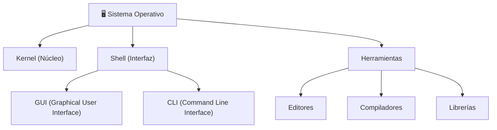

# 📘 Tema 1 — Parte 1: ¿Qué es un Sistema Operativo?

**Materia:** Introducción a los Sistemas Operativos (ISO) — UNLP 2026  
**Temas:** Definición de SO, Perspectivas, Objetivos, Componentes, Servicios

---

## 🎯 Definición

Un **Sistema Operativo (SO)** es un software que actúa como **intermediario** entre el usuario de una computadora y su hardware.

> *"Es software: necesita procesador y memoria para ejecutarse."*

En criollo: es el programa madre que arranca antes que todo, se queda siempre corriendo, y se encarga de que vos puedas usar la compu sin tener que hablarle directamente a los circuitos.

**Funciones generales:**
- Gestiona el hardware.
- Controla la ejecución de los procesos.
- Actúa como interfaz entre las aplicaciones y el hardware.

---

## 📊 Dos Perspectivas del SO

| Perspectiva | Dirección | Descripción |
|---|---|---|
| **Desde el usuario (Top-Down)** | De arriba hacia abajo | El SO **oculta** el hardware y presenta **abstracciones** más simples (archivos, ventanas, procesos). Prioriza la comodidad y *"amigabilidad"*. |
| **Desde el sistema (Bottom-Up)** | De abajo hacia arriba | El SO **administra los recursos de hardware** de uno o más procesos. Multiplexa en **tiempo** (CPU) y en **espacio** (memoria). |

En criollo: mirándolo desde arriba, el SO te simplifica la vida. Mirándolo desde abajo, el SO es un repartidor que administra la CPU, la memoria y los dispositivos para que todo funcione sin conflictos.

---

## ✅ Objetivos de un SO

| Objetivo | Descripción |
|---|---|
| **Comodidad** | Hacer más fácil el uso del hardware (PC, servidor, router, etc.). |
| **Eficiencia** | Hacer un uso más eficiente de los recursos del sistema. |
| **Evolución** | Permitir la introducción de nuevas funciones sin interferir con las anteriores. |

---

## 🏗️ Componentes de un SO

### Kernel (Núcleo)

Es el componente del SO que:
- Se encuentra **siempre en memoria principal**.
- Se encarga de la **administración de los recursos de hardware**.
- Implementa los servicios esenciales: manejo de memoria, manejo de CPU, administración de procesos, comunicación, concurrencia y gestión de E/S.

---

## ⚙️ Servicios de un SO

| Servicio | Detalle |
|---|---|
| **Administración del procesador** | Multiplexación de la carga de trabajo, imparcialidad (*fairness*), evitar bloqueos, manejo de prioridades. |
| **Administración de memoria** | Administración eficiente, memoria física vs. virtual, jerarquías de memoria, protección de programas concurrentes. |
| **Administración de almacenamiento** | Acceso a medios de almacenamiento externos, sistema de archivos. |
| **Administración de dispositivos** | Ocultamiento de dependencias de HW, administración de accesos simultáneos. |
| **Detección de errores** | Errores de HW internos/externos (memoria, CPU, dispositivos), errores de SW (aritméticos, acceso ilegal a memoria), incapacidad de conceder solicitudes. |
| **Interacción del usuario** | Shell (GUI / CLI). |
| **Contabilidad** | Recoger estadísticas de uso, monitorear rendimiento, anticipar necesidades de mejoras, facturar tiempo de procesamiento si es necesario. |

> 💡 **Observación:** Un SO es un software extenso y complejo. Es desarrollado por partes, donde cada una debe ser analizada entendiendo su función, cuáles son sus entradas y cuáles sus salidas.

---

## 📚 Recursos y Referencias

- **Stallings, William:** *"Sistemas Operativos: Aspectos internos y principios de diseño"*.
- **Silberschatz, Galvin, Gagne:** *"Conceptos de Sistemas Operativos"* (*Operating System Concepts*).
