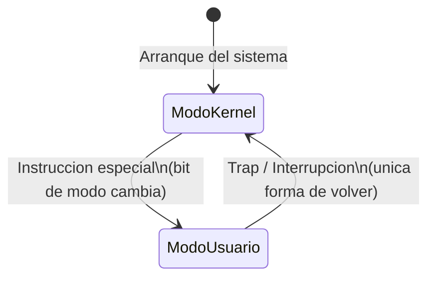
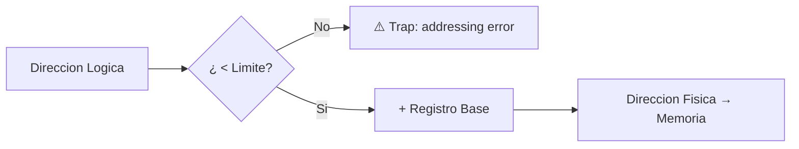
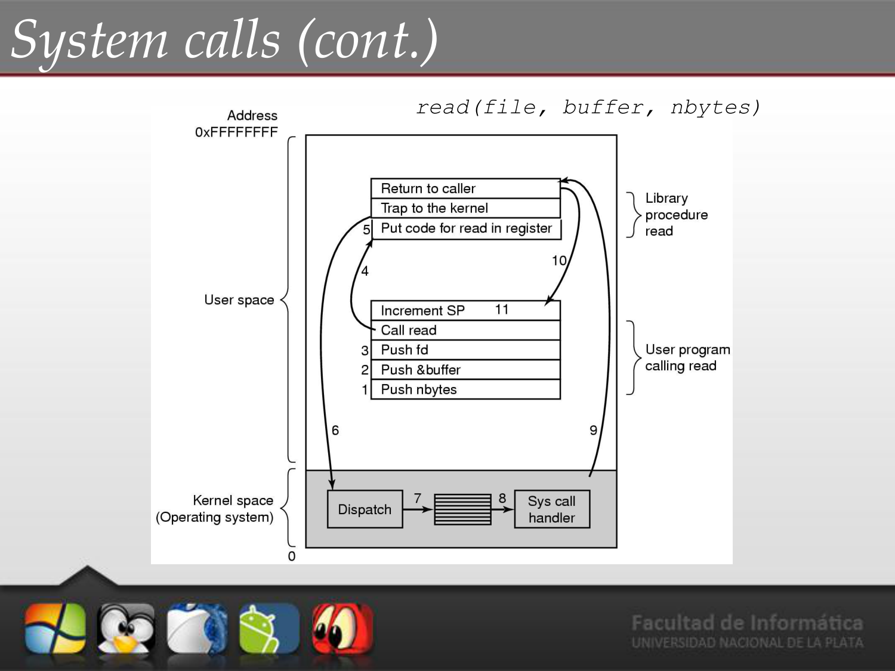
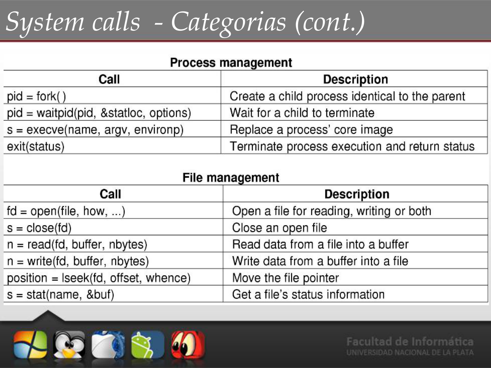

# 📘 Tema 1 — Parte 2: Modos de Ejecución, Protección y System Calls

**Materia:** Introducción a los Sistemas Operativos (ISO) — UNLP 2026  
**Temas:** Modos Kernel/Usuario, Protección de memoria, E/S y CPU, System Calls, Categorías

---

## 🎯 Problemas que un SO Debe Evitar

- Que un proceso **se apropie de la CPU**.
- Que un proceso intente ejecutar **instrucciones privilegiadas** (E/S, flags del procesador).
- Que un proceso intente **acceder a memoria fuera de su espacio** declarado.

Para ello, el SO debe:
- Gestionar el uso de la CPU.
- Detectar intentos de ejecución de instrucciones de E/S ilegales.
- Detectar accesos ilegales a memoria.
- Proteger el **vector de interrupciones** y las Rutinas de Atención de Interrupciones (RAI).

---

## 🏗️ Apoyo del Hardware

El SO **no puede** hacer todo solo; necesita que el hardware coopere con ciertos mecanismos:

| Mecanismo de HW | Función |
|---|---|
| **Modos de ejecución** | Define limitaciones en el conjunto de instrucciones ejecutables según el modo. |
| **Interrupción de Clock** | Evita que un proceso se apropie de la CPU indefinidamente. |
| **Protección de memoria** | Define límites de memoria accesibles por cada proceso (registros *base* y *límite*). |

---

## 📊 Modos de Ejecución: Kernel vs. Usuario



| Característica | Modo Kernel (Supervisor) | Modo Usuario |
|---|---|---|
| **¿Quién corre aquí?** | El kernel del SO. | Programas de usuario y el resto del SO. |
| **Instrucciones** | Acceso completo a **todas** las instrucciones, incluyendo las privilegiadas. | Solo un **subconjunto** de instrucciones permitidas. |
| **Memoria** | Puede acceder a **cualquier** espacio de direcciones y estructuras del kernel. | Solo puede acceder a su **propio** espacio de direcciones. |
| **HW** | Puede interactuar con el hardware. | **No puede** interactuar con el hardware directamente. |

**Reglas clave:**
1. Al **arrancar el sistema**, el bit de modo está en **modo supervisor**.
2. Cada vez que comienza a ejecutarse un proceso de usuario, se **pone en modo usuario** (mediante una instrucción especial).
3. La **única forma** de pasar a modo kernel es mediante un **trap o una interrupción**. No es el proceso de usuario quien hace el cambio.
4. Si un proceso de usuario intenta ejecutar instrucciones privilegiadas por su cuenta, el hardware lo detecta como **operación ilegal** y produce un **trap al SO**.

> 🧠 **Tip para estudiar:** En modo kernel se gestionan procesos, memoria, E/S e interrupciones. En modo usuario se ejecutan aplicaciones, debug, editores, compiladores — todo lo que no requiera acceso privilegiado.

---

### 📦 Ejemplo: Windows 2000

- El **modo núcleo** ejecuta los servicios ejecutivos.
- El **modo usuario** ejecuta los procesos de usuario.
- Si un programa se bloquea en **modo usuario** → a lo sumo se escribe un suceso en el registro.
- Si el bloqueo ocurre en **modo supervisor** → se genera la **BSOD** (*Blue Screen of Death*).

### 📦 Ejemplo: Intel 8088 y MS-DOS

- El procesador Intel **8088** no tenía modo dual de operación ni protección por hardware.
- En **MS-DOS**, las aplicaciones podían acceder directamente a las funciones básicas de E/S (sin protección alguna).

---

## ⚙️ Protección de Memoria

Se necesita **delimitar el espacio de direcciones** de cada proceso para que no acceda donde no le corresponde.

**Mecanismo:** Uso de un **registro base** y un **registro límite**, cargados por el kernel mediante instrucciones privilegiadas (solo en modo kernel).



En criollo: la CPU chequea que la dirección que pide el proceso esté dentro del rango permitido. Si se pasa, le frena el carro con un trap.

**Reglas de protección:**
- El kernel protege para que los procesos de usuario **no puedan acceder donde no les corresponde**.
- El kernel protege el espacio de direcciones de un proceso del acceso de **otros procesos**.

---

## ⚙️ Protección de la E/S

Las instrucciones de E/S se definen como **privilegiadas** y deben ejecutarse en **modo kernel**:
- Se gestionan en el kernel del SO.
- Los procesos de usuario realizan E/S **a través de llamadas al SO** (system calls) — es un servicio del SO.

---

## ⚙️ Protección de la CPU

Se usa una **interrupción por clock** para evitar que un proceso se apropie de la CPU:
- Se implementa a través de un **clock y un contador**.
- El kernel le da valor al contador, que se **decrementa con cada tick de reloj**.
- Al llegar a **cero**, el SO puede expulsar al proceso para ejecutar otro.

En criollo: le ponés un timer al proceso. Cuando se le acaba el tiempo, el SO lo saca de la CPU aunque no haya terminado.

---

## 🎯 System Calls (Llamadas al Sistema)

Las **System Calls** son la forma en que los programas de usuario **acceden a los servicios del SO**. Se ejecutan en **modo kernel**.

> *"Es la forma en que los programas de usuario acceden a los servicios del SO."*

En criollo: si tu programa quiere hacer algo que necesita tocar el hardware (leer un archivo, escribir en pantalla, terminar un proceso), no puede hacerlo solo — tiene que pedírselo al SO mediante una system call.

**Pasaje de parámetros:** Por **registros**, **bloques o tablas en memoria**, o la **pila** (*stack*).

```c
count = read(file, buffer, nbytes);
```



---

## 📊 Categorías de System Calls

| Categoría | Descripción |
|---|---|
| **Control de procesos** | Crear, terminar, señalizar procesos. |
| **Manejo de archivos** | Abrir, cerrar, leer, escribir archivos. |
| **Manejo de dispositivos** | Solicitar, liberar, leer, escribir en dispositivos. |
| **Mantenimiento de información** | Obtener/fijar hora, fecha, atributos del sistema. |
| **Comunicaciones** | Crear conexiones, enviar, recibir mensajes. |



---

## ⚙️ Cómo se Activa una System Call en Linux

**Procedimiento:**
1. Se indica el **número de syscall** que se quiere ejecutar.
2. Se cargan los **parámetros** en los registros correspondientes.
3. Se emite un aviso al SO (**trap/excepción**) para pasar a modo kernel.
4. El SO evalúa la syscall deseada y la ejecuta.

---

## 📚 Recursos y Referencias

- **Stallings, William:** *"Sistemas Operativos: Aspectos internos y principios de diseño"*.
- **Silberschatz, Galvin, Gagne:** *"Conceptos de Sistemas Operativos"* (*Operating System Concepts*).
