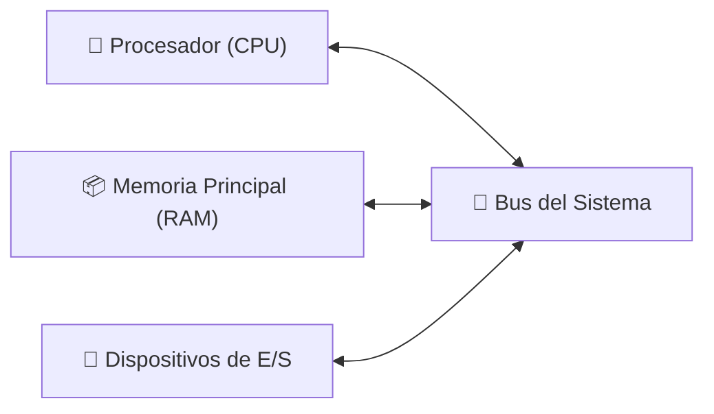

# 📘 Tema 1 — Anexo: Arquitectura de Computadoras

**Materia:** Introducción a los Sistemas Operativos (ISO) — UNLP 2026  
**Temas:** Elementos de una computadora, Registros, Ciclo de instrucción, Interrupciones

---

## 🏗️ Elementos Básicos de una Computadora

| Componente | Descripción |
|---|---|
| **Procesador (CPU)** | Ejecuta las instrucciones. |
| **Memoria Principal (RAM)** | Almacena datos y código de forma temporal. Es **volátil** (se borra al apagar). También llamada memoria *real* o *primaria*. |
| **Dispositivos de E/S** | Memoria secundaria (discos), equipamiento de comunicación, monitor, teclado, mouse. |
| **Bus del Sistema** | Red de comunicación física que conecta procesador, memoria y E/S. |

---

## ⚙️ Registros del Procesador

La CPU contiene memorias internas ultrarrápidas llamadas **registros**. Se clasifican en dos tipos:

### Visibles por el Usuario

Pueden ser referenciados por lenguaje de máquina y están disponibles para programas/aplicaciones.

| Tipo | Descripción |
|---|---|
| **De Datos** | Almacenan valores para operaciones del programa. |
| **De Direcciones** | Incluyen: *Index Pointer*, *Segment Pointer*, *Stack Pointer*. |

### De Control y Estado

Utilizados por rutinas privilegiadas del SO para controlar la ejecución de procesos.

| Registro | Función |
|---|---|
| **PC (*Program Counter*)** | Contiene la dirección de la **próxima instrucción** a ser ejecutada. |
| **IR (*Instruction Register*)** | Contiene la **instrucción actual** que se va a ejecutar. |
| **PSW (*Program Status Word*)** | Contiene códigos de resultado de operaciones, habilita/deshabilita interrupciones, e indica el **modo de ejecución** (Supervisor/Usuario). |

---

## ⚙️ Ciclo de Ejecución de Instrucción

El procesador ejecuta programas repitiendo cíclicamente dos pasos:

**Pasos:**
1. **Fetch:** El procesador lee (*fetch*) la instrucción desde la memoria: `(PC) → IR`. Luego el PC se incrementa para apuntar a la siguiente instrucción: `PC = PC + 4`.
2. **Execute:** La instrucción almacenada en el IR se decodifica y ejecuta.

### Categorías de Instrucciones

| Categoría | Descripción |
|---|---|
| **Procesador - Memoria** | Transfiere datos entre procesador y memoria. |
| **Procesador - E/S** | Transfiere datos desde/hacia periféricos. |
| **Procesamiento de Datos** | Operaciones aritméticas o lógicas sobre datos. |
| **Control** | Altera la secuencia de ejecución. |

### 📦 Ejemplo: Máquina Hipotética y Ejecución de Programa

---

## 🎯 Interrupciones

Las interrupciones **interrumpen el secuenciamiento normal** del procesador durante la ejecución de un proceso. Son necesarias porque los dispositivos de E/S son mucho **más lentos** que el procesador.

### Clases de Interrupciones

### Necesidades del SO respecto a interrupciones

- Postergar el manejo de una interrupción en momentos críticos.
- Atender en forma eficiente con la rutina adecuada según el dispositivo.
- Tener **varios niveles de interrupción** para distinguir entre alta y baja prioridad.

### Flujo de Control: Sin vs. Con Interrupciones

### Interrupt Handler

Es el programa (o rutina) que determina la **naturaleza de una interrupción** y realiza lo necesario para atenderla. Generalmente es parte del SO.

En criollo: cuando un dispositivo dice "¡terminé!", la CPU frena lo que estaba haciendo, va a correr el *interrupt handler* correspondiente, y después vuelve a lo suyo.

### Ciclo de Interrupción

**Procedimiento:**
1. El procesador chequea la existencia de interrupciones.
2. Si no existen interrupciones → la próxima instrucción del programa es ejecutada normalmente.
3. Si hay una interrupción pendiente → se suspende la ejecución del programa actual y se ejecuta la rutina de manejo de interrupciones (*interrupt handler*).

### Interrupciones No Enmascarables vs. Enmascarables

| Tipo | Descripción |
|---|---|
| **No Enmascarables** | Máxima urgencia. La CPU **no puede** negarse a atenderlas (ej: errores de memoria no recuperables). |
| **Enmascarables** | La CPU puede "apagarlas" temporalmente si está ejecutando una secuencia crítica de instrucciones. Son las que usan los controladores de dispositivo cuando necesitan servicio. |

### Múltiples Interrupciones Simultáneas

Dos estrategias principales:
1. **Deshabilitar interrupciones** mientras una ya está siendo procesada (atención en serie).
2. **Definir prioridades:** una interrupción de mayor nivel puede interrumpir al handler de una de menor nivel.

> 🧠 **Dato del vector de interrupciones de Intel:**
> - Posiciones **1 a 31**: no enmascarables (errores de condición).
> - Posiciones **32 a 255**: enmascarables (interrupciones de dispositivos).

---

## 📚 Recursos y Referencias

- **Stallings, William:** *"Sistemas Operativos: Aspectos internos y principios de diseño"*.
- **Silberschatz, Galvin, Gagne:** *"Conceptos de Sistemas Operativos"* (*Operating System Concepts*).
