# 📘 Tema 1: Introducción a los Sistemas Operativos

**Materia:** Introducción a los Sistemas Operativos (ISO) — UNLP 2026  
**Temas:** Definición de SO, Componentes de una computadora, Registros, Ciclo de instrucción, Interrupciones, Modos de ejecución, Protección, System Calls

---

# Parte A: ¿Qué es un Sistema Operativo?

## 🎯 Definición

Un **Sistema Operativo (SO)** es un software que actúa como **intermediario** entre el usuario de una computadora y su hardware.

> *"Es software: necesita procesador y memoria para ejecutarse."*

En criollo: es el programa madre que arranca antes que todo, se queda siempre corriendo, y se encarga de que vos puedas usar la compu sin tener que hablarle directamente a los circuitos.

**Funciones generales:**
- Gestiona el hardware.
- Controla la ejecución de los procesos.
- Actúa como interfaz entre las aplicaciones y el hardware.

---

## 📊 Dos Perspectivas del SO

| Perspectiva | Dirección | Descripción |
|---|---|---|
| **Desde el usuario (Top-Down)** | De arriba hacia abajo | El SO **oculta** el hardware y presenta **abstracciones** más simples (archivos, ventanas, procesos). Prioriza la comodidad y *"amigabilidad"*. |
| **Desde el sistema (Bottom-Up)** | De abajo hacia arriba | El SO **administra los recursos de hardware** de uno o más procesos. Multiplexa en **tiempo** (CPU) y en **espacio** (memoria). |

En criollo: mirándolo desde arriba, el SO te simplifica la vida. Mirándolo desde abajo, el SO es un repartidor que administra la CPU, la memoria y los dispositivos para que todo funcione sin conflictos.

---

## ✅ Objetivos de un SO

| Objetivo | Descripción |
|---|---|
| **Comodidad** | Hacer más fácil el uso del hardware (PC, servidor, router, etc.). |
| **Eficiencia** | Hacer un uso más eficiente de los recursos del sistema. |
| **Evolución** | Permitir la introducción de nuevas funciones sin interferir con las anteriores. |

---

## 🏗️ Componentes de un SO

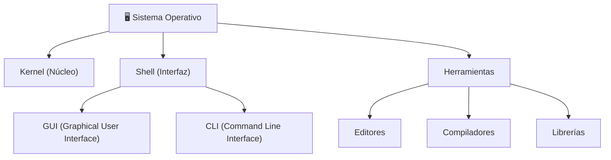
```mermaid
graph TD
    SO["🖥️ Sistema Operativo"]
    SO --> K["Kernel (Núcleo)"]
    SO --> S["Shell (Interfaz)"]
    SO --> H["Herramientas"]

    S --> GUI["GUI (Graphical User Interface)"]
    S --> CLI["CLI (Command Line Interface)"]

    H --> ED["Editores"]
    H --> COMP["Compiladores"]
    H --> LIB["Librerías"]
```

### Kernel (Núcleo)

Es el componente del SO que:
- Se encuentra **siempre en memoria principal**.
- Se encarga de la **administración de los recursos de hardware**.
- Implementa los servicios esenciales: manejo de memoria, manejo de CPU, administración de procesos, comunicación, concurrencia y gestión de E/S.

---

## ⚙️ Servicios de un SO

| Servicio | Detalle |
|---|---|
| **Administración del procesador** | Multiplexación de la carga de trabajo, imparcialidad (*fairness*), evitar bloqueos, manejo de prioridades. |
| **Administración de memoria** | Administración eficiente, memoria física vs. virtual, jerarquías de memoria, protección de programas concurrentes. |
| **Administración de almacenamiento** | Acceso a medios de almacenamiento externos, sistema de archivos. |
| **Administración de dispositivos** | Ocultamiento de dependencias de HW, administración de accesos simultáneos. |
| **Detección de errores** | Errores de HW internos/externos (memoria, CPU, dispositivos), errores de SW (aritméticos, acceso ilegal a memoria), incapacidad de conceder solicitudes. |
| **Interacción del usuario** | Shell (GUI / CLI). |
| **Contabilidad** | Recoger estadísticas de uso, monitorear rendimiento, anticipar necesidades de mejoras, facturar tiempo de procesamiento si es necesario. |

> 💡 **Observación:** Un SO es un software extenso y complejo. Es desarrollado por partes, donde cada una debe ser analizada entendiendo su función, cuáles son sus entradas y cuáles sus salidas.

---
---

# Parte B: Arquitectura de Computadoras (Anexo)

## 🏗️ Elementos Básicos de una Computadora

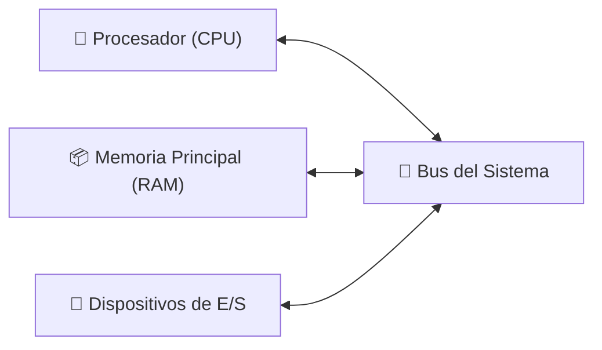
```mermaid
graph LR
    CPU["🔲 Procesador (CPU)"]
    MEM["📦 Memoria Principal (RAM)"]
    IO["🔌 Dispositivos de E/S"]
    BUS["🔗 Bus del Sistema"]

    CPU <--> BUS
    MEM <--> BUS
    IO <--> BUS
```

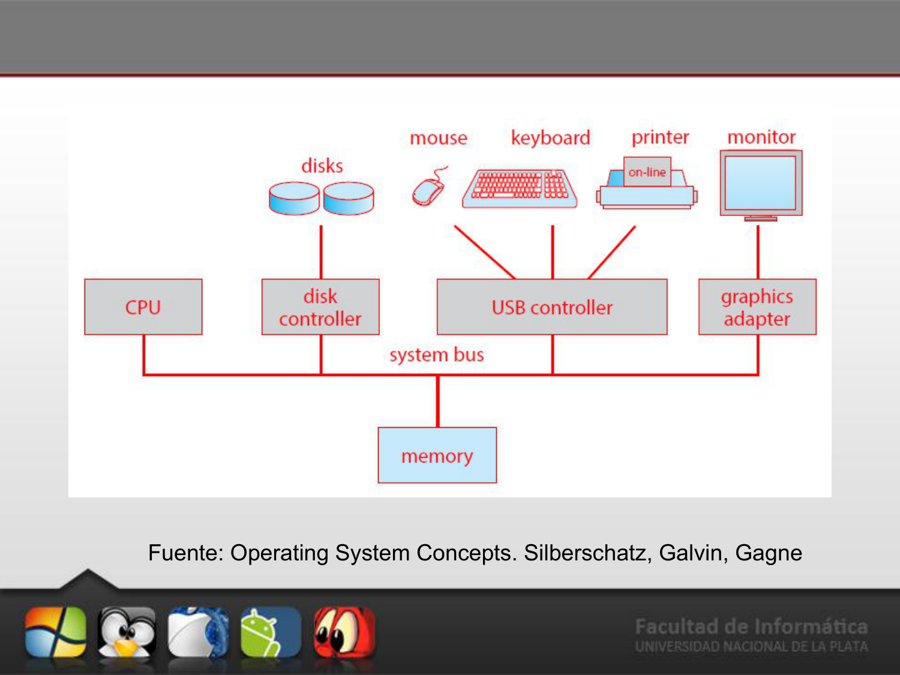

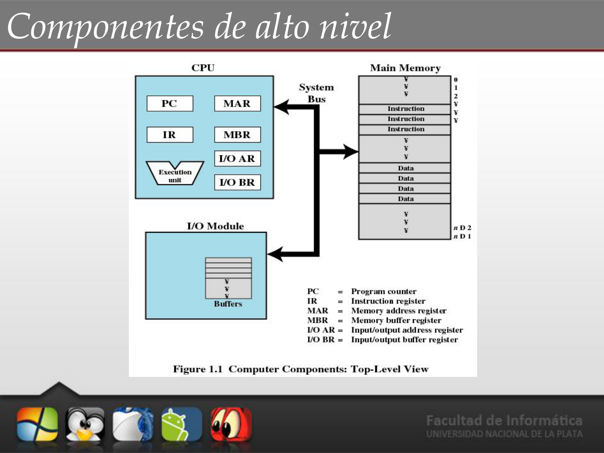

| Componente | Descripción |
|---|---|
| **Procesador (CPU)** | Ejecuta las instrucciones. |
| **Memoria Principal (RAM)** | Almacena datos y código de forma temporal. Es **volátil** (se borra al apagar). También llamada memoria *real* o *primaria*. |
| **Dispositivos de E/S** | Memoria secundaria (discos), equipamiento de comunicación, monitor, teclado, mouse. |
| **Bus del Sistema** | Red de comunicación física que conecta procesador, memoria y E/S. |

---

## ⚙️ Registros del Procesador

La CPU contiene memorias internas ultrarrápidas llamadas **registros**. Se clasifican en dos tipos:

### Visibles por el Usuario

Pueden ser referenciados por lenguaje de máquina y están disponibles para programas/aplicaciones.

| Tipo | Descripción |
|---|---|
| **De Datos** | Almacenan valores para operaciones del programa. |
| **De Direcciones** | Incluyen: *Index Pointer*, *Segment Pointer*, *Stack Pointer*. |

### De Control y Estado

Utilizados por rutinas privilegiadas del SO para controlar la ejecución de procesos.

| Registro | Función |
|---|---|
| **PC (*Program Counter*)** | Contiene la dirección de la **próxima instrucción** a ser ejecutada. |
| **IR (*Instruction Register*)** | Contiene la **instrucción actual** que se va a ejecutar. |
| **PSW (*Program Status Word*)** | Contiene códigos de resultado de operaciones, habilita/deshabilita interrupciones, e indica el **modo de ejecución** (Supervisor/Usuario). |

---

## ⚙️ Ciclo de Ejecución de Instrucción

El procesador ejecuta programas repitiendo cíclicamente dos pasos:

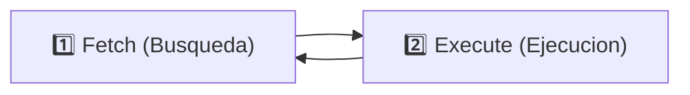
```mermaid
graph LR
    F["1️⃣ Fetch (Busqueda)"] --> E["2️⃣ Execute (Ejecucion)"]
    E --> F
```

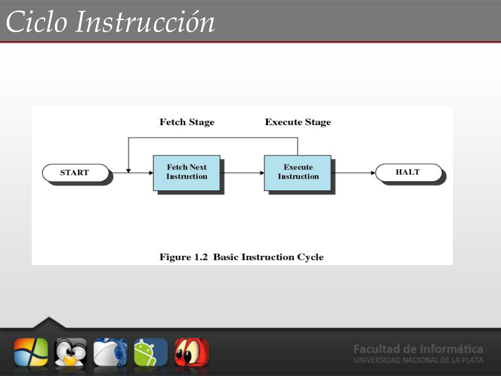

**Pasos:**
1. **Fetch:** El procesador lee (*fetch*) la instrucción desde la memoria: `(PC) → IR`. Luego el PC se incrementa para apuntar a la siguiente instrucción: `PC = PC + 4`.
2. **Execute:** La instrucción almacenada en el IR se decodifica y ejecuta.

### Categorías de Instrucciones

| Categoría | Descripción |
|---|---|
| **Procesador - Memoria** | Transfiere datos entre procesador y memoria. |
| **Procesador - E/S** | Transfiere datos desde/hacia periféricos. |
| **Procesamiento de Datos** | Operaciones aritméticas o lógicas sobre datos. |
| **Control** | Altera la secuencia de ejecución. |

### 📦 Ejemplo: Máquina Hipotética y Ejecución de Programa

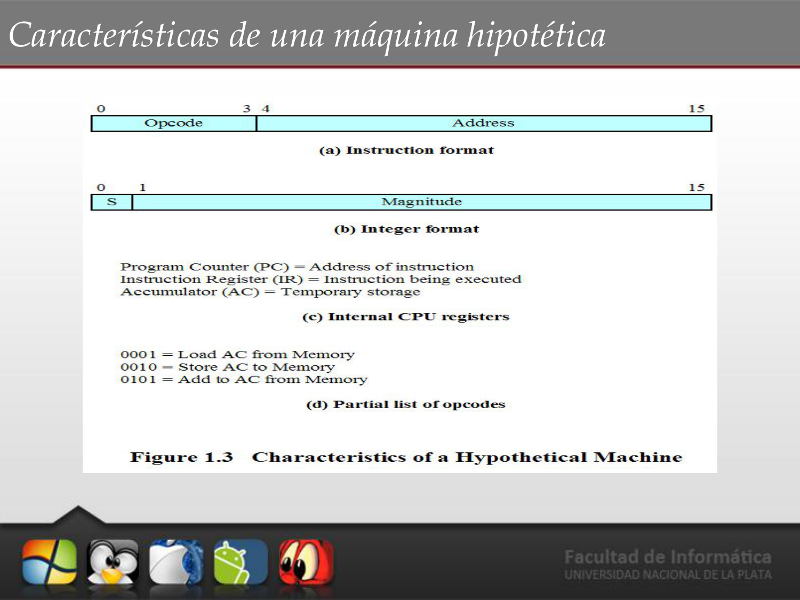

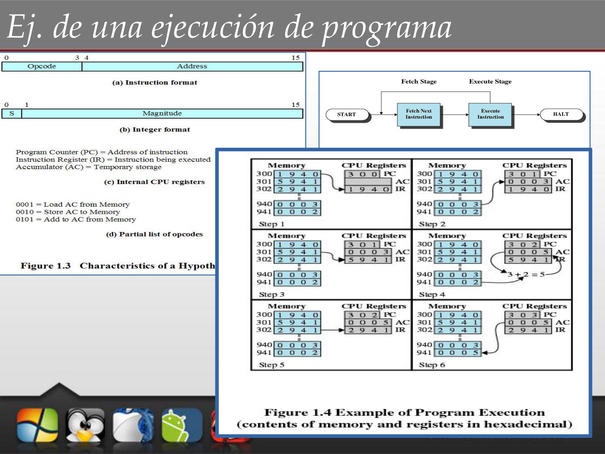

---

## 🎯 Interrupciones

Las interrupciones **interrumpen el secuenciamiento normal** del procesador durante la ejecución de un proceso. Son necesarias porque los dispositivos de E/S son mucho **más lentos** que el procesador.

### Clases de Interrupciones

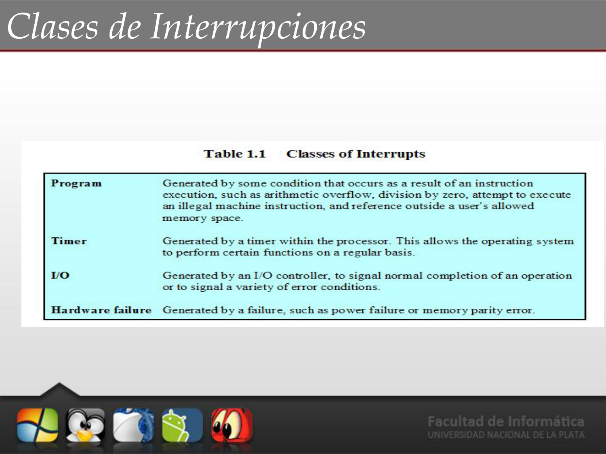

### Necesidades del SO respecto a interrupciones

- Postergar el manejo de una interrupción en momentos críticos.
- Atender en forma eficiente con la rutina adecuada según el dispositivo.
- Tener **varios niveles de interrupción** para distinguir entre alta y baja prioridad.

### Flujo de Control: Sin vs. Con Interrupciones

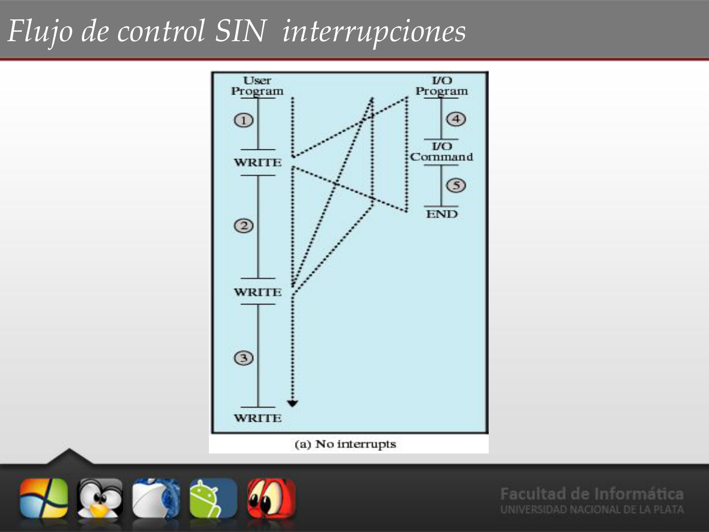

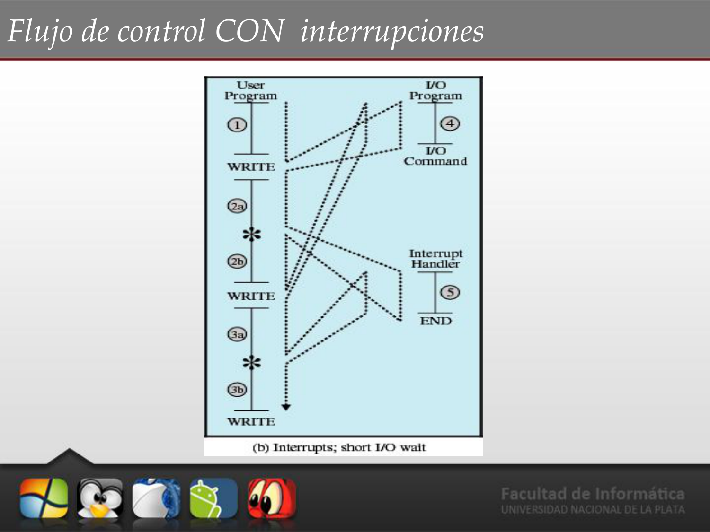

### Interrupt Handler

Es el programa (o rutina) que determina la **naturaleza de una interrupción** y realiza lo necesario para atenderla. Generalmente es parte del SO.

En criollo: cuando un dispositivo dice "¡terminé!", la CPU frena lo que estaba haciendo, va a correr el *interrupt handler* correspondiente, y después vuelve a lo suyo.

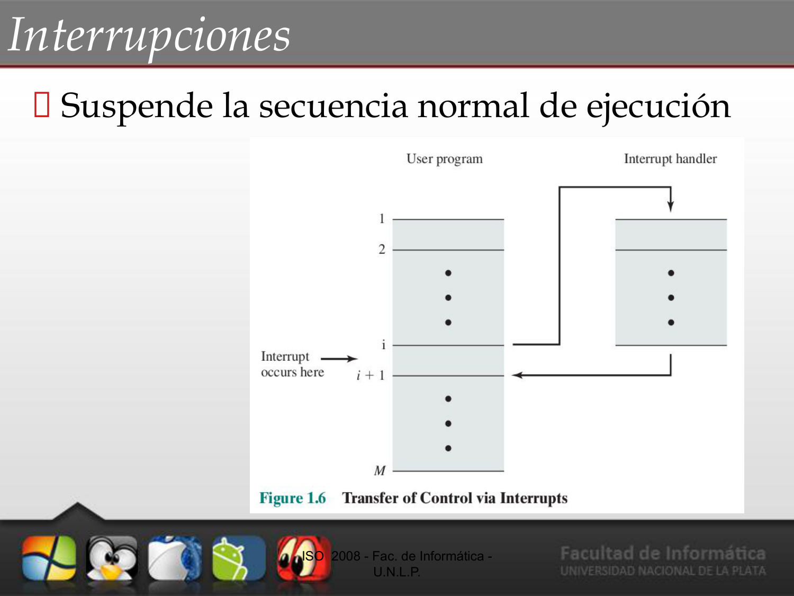

### Ciclo de Interrupción

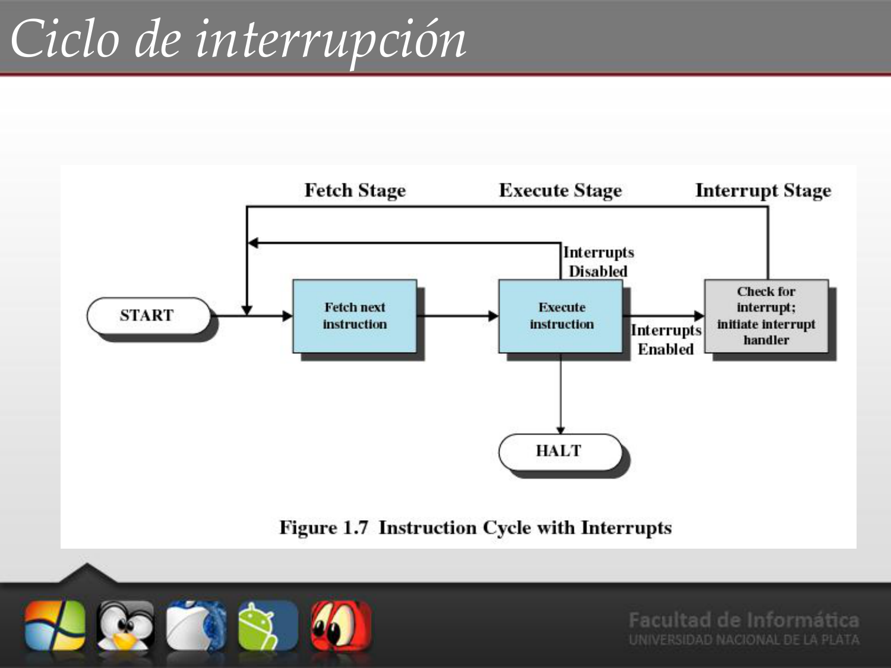

**Procedimiento:**
1. El procesador chequea la existencia de interrupciones.
2. Si no existen interrupciones → la próxima instrucción del programa es ejecutada normalmente.
3. Si hay una interrupción pendiente → se suspende la ejecución del programa actual y se ejecuta la rutina de manejo de interrupciones (*interrupt handler*).

### Procesamiento Simple de una Interrupción

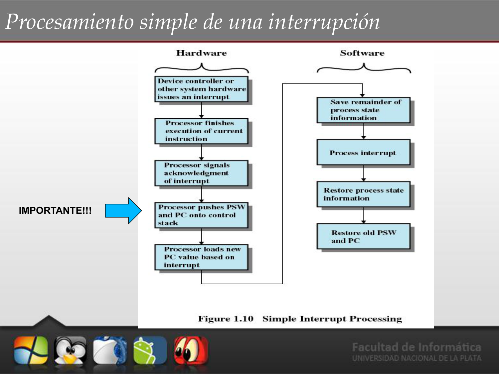

### Interrupciones No Enmascarables vs. Enmascarables

| Tipo | Descripción |
|---|---|
| **No Enmascarables** | Máxima urgencia. La CPU **no puede** negarse a atenderlas (ej: errores de memoria no recuperables). |
| **Enmascarables** | La CPU puede "apagarlas" temporalmente si está ejecutando una secuencia crítica de instrucciones. Son las que usan los controladores de dispositivo cuando necesitan servicio. |

### Múltiples Interrupciones Simultáneas

Dos estrategias principales:
1. **Deshabilitar interrupciones** mientras una ya está siendo procesada (atención en serie).
2. **Definir prioridades:** una interrupción de mayor nivel puede interrumpir al handler de una de menor nivel.

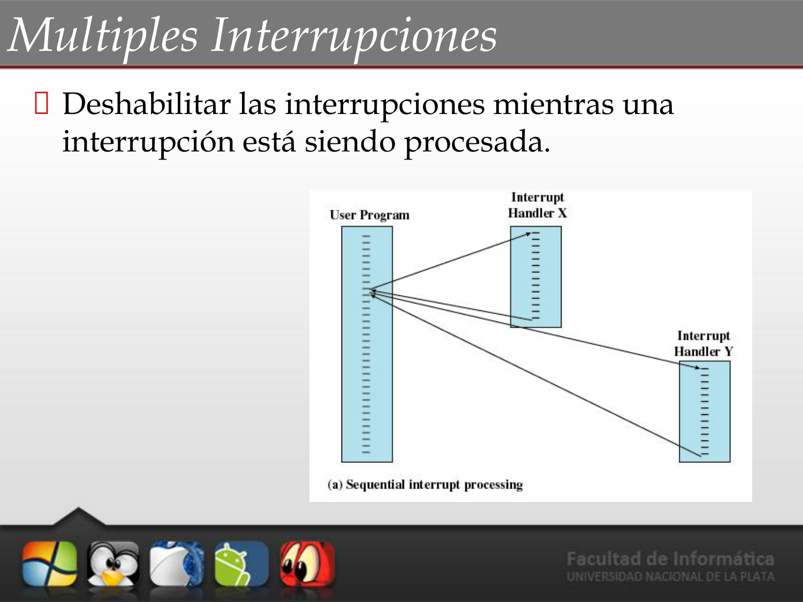

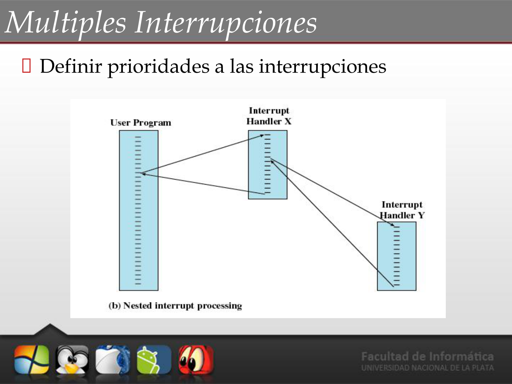

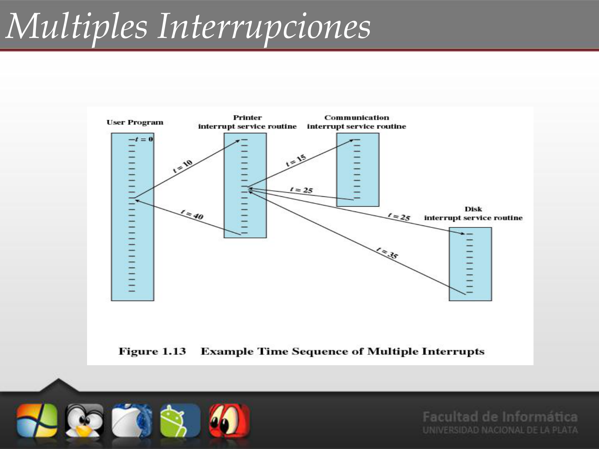

### Vector de Interrupciones (Intel)

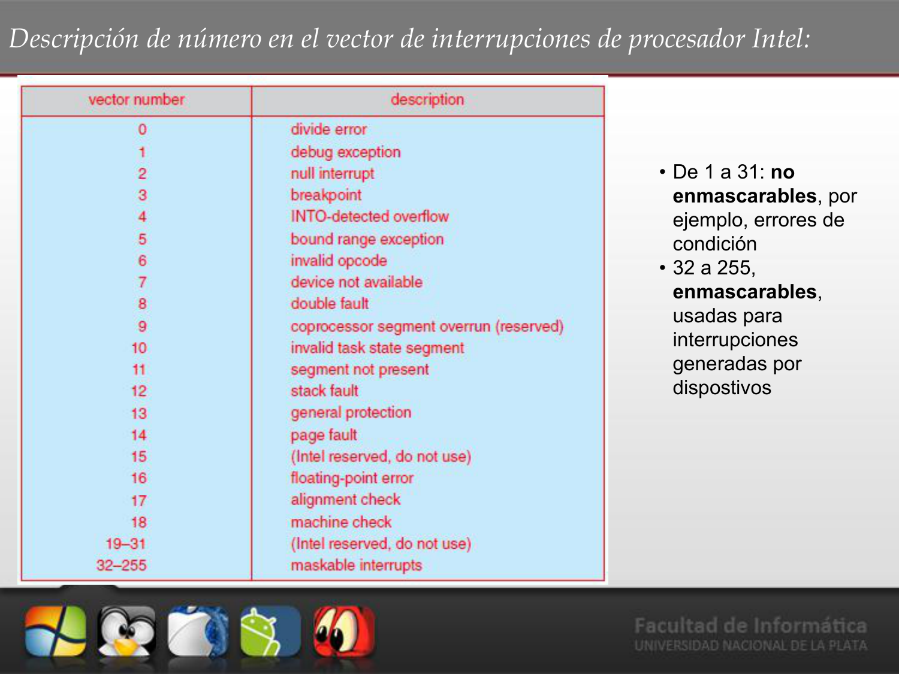

> 🧠 **Dato del vector de interrupciones de Intel:**
> - Posiciones **1 a 31**: no enmascarables (errores de condición).
> - Posiciones **32 a 255**: enmascarables (interrupciones de dispositivos).

---
---

# Parte C: Modos de Ejecución y Protección

## 🎯 Problemas que un SO Debe Evitar

- Que un proceso **se apropie de la CPU**.
- Que un proceso intente ejecutar **instrucciones privilegiadas** (E/S, flags del procesador).
- Que un proceso intente **acceder a memoria fuera de su espacio** declarado.

Para ello, el SO debe:
- Gestionar el uso de la CPU.
- Detectar intentos de ejecución de instrucciones de E/S ilegales.
- Detectar accesos ilegales a memoria.
- Proteger el **vector de interrupciones** y las Rutinas de Atención de Interrupciones (RAI).

---

## 🏗️ Apoyo del Hardware

El SO **no puede** hacer todo solo; necesita que el hardware coopere con ciertos mecanismos:

| Mecanismo de HW | Función |
|---|---|
| **Modos de ejecución** | Define limitaciones en el conjunto de instrucciones ejecutables según el modo. |
| **Interrupción de Clock** | Evita que un proceso se apropie de la CPU indefinidamente. |
| **Protección de memoria** | Define límites de memoria accesibles por cada proceso (registros *base* y *límite*). |

---

## 📊 Modos de Ejecución: Kernel vs. Usuario

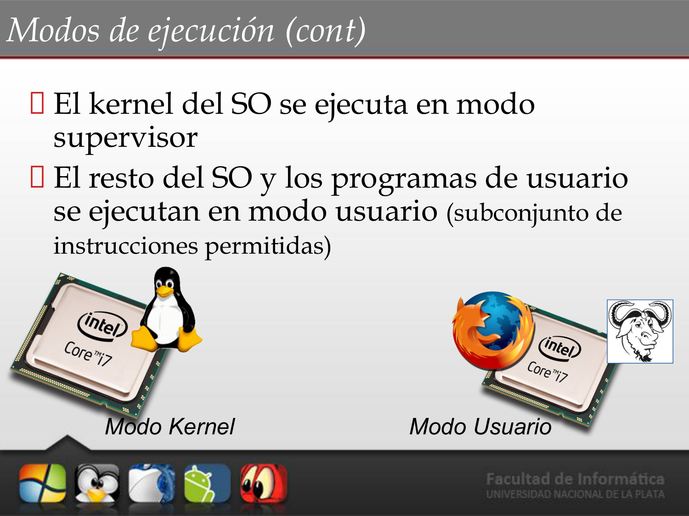

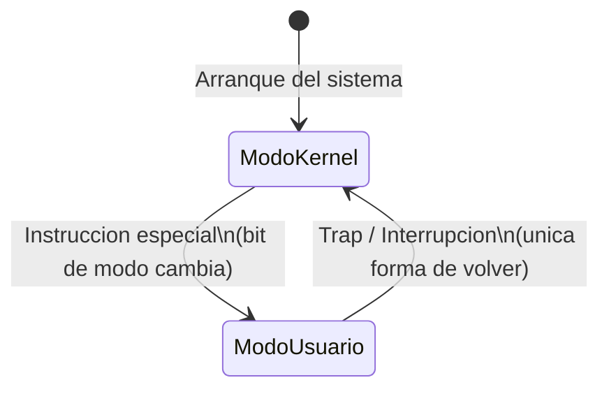
```mermaid
stateDiagram-v2
    [*] --> ModoKernel : Arranque del sistema
    ModoKernel --> ModoUsuario : Instruccion especial\n(bit de modo cambia)
    ModoUsuario --> ModoKernel : Trap / Interrupcion\n(unica forma de volver)
```

| Característica | Modo Kernel (Supervisor) | Modo Usuario |
|---|---|---|
| **¿Quién corre aquí?** | El kernel del SO. | Programas de usuario y el resto del SO. |
| **Instrucciones** | Acceso completo a **todas** las instrucciones, incluyendo las privilegiadas. | Solo un **subconjunto** de instrucciones permitidas. |
| **Memoria** | Puede acceder a **cualquier** espacio de direcciones y estructuras del kernel. | Solo puede acceder a su **propio** espacio de direcciones. |
| **HW** | Puede interactuar con el hardware. | **No puede** interactuar con el hardware directamente. |

**Reglas clave:**
1. Al **arrancar el sistema**, el bit de modo está en **modo supervisor**.
2. Cada vez que comienza a ejecutarse un proceso de usuario, se **pone en modo usuario** (mediante una instrucción especial).
3. La **única forma** de pasar a modo kernel es mediante un **trap o una interrupción**. No es el proceso de usuario quien hace el cambio.
4. Si un proceso de usuario intenta ejecutar instrucciones privilegiadas por su cuenta, el hardware lo detecta como **operación ilegal** y produce un **trap al SO**.

> 🧠 **Tip para estudiar:** En modo kernel se gestionan procesos, memoria, E/S e interrupciones. En modo usuario se ejecutan aplicaciones, debug, editores, compiladores — todo lo que no requiera acceso privilegiado.

---

### 📦 Ejemplo: Windows 2000

En Windows 2000:
- El **modo núcleo** ejecuta los servicios ejecutivos.
- El **modo usuario** ejecuta los procesos de usuario.
- Si un programa se bloquea en **modo usuario** → a lo sumo se escribe un suceso en el registro de sucesos.
- Si el bloqueo ocurre en **modo supervisor** → se genera la **BSOD** (*Blue Screen of Death* / Pantalla Azul de la Muerte).

### 📦 Ejemplo: Intel 8088 y MS-DOS

- El procesador Intel **8088** no tenía modo dual de operación ni protección por hardware.
- En **MS-DOS**, las aplicaciones podían acceder directamente a las funciones básicas de E/S para escribir directamente en pantalla o en disco (sin protección alguna).

---

## ⚙️ Protección de Memoria

Se necesita **delimitar el espacio de direcciones** de cada proceso para que no acceda donde no le corresponde.

**Mecanismo:** Uso de un **registro base** y un **registro límite**, cargados por el kernel mediante instrucciones privilegiadas (solo en modo kernel).

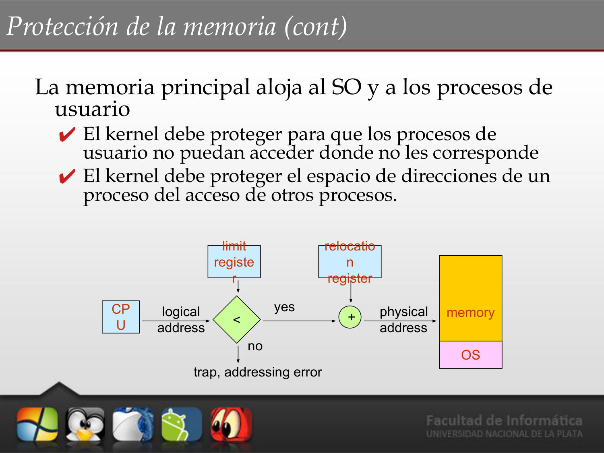

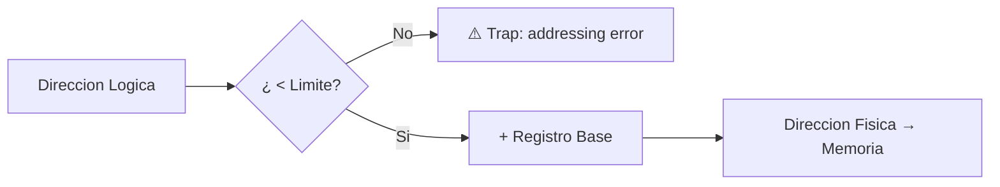
```mermaid
graph LR
    LA["Direccion Logica"] --> CMP{"¿ < Limite?"}
    CMP -->|No| TRAP["⚠️ Trap: addressing error"]
    CMP -->|Si| SUM[" + Registro Base"]
    SUM --> PA["Direccion Fisica → Memoria"]
```

En criollo: la CPU chequea que la dirección que pide el proceso esté dentro del rango permitido. Si se pasa, le frena el carro con un trap.

**Reglas de protección:**
- El kernel protege para que los procesos de usuario **no puedan acceder donde no les corresponde**.
- El kernel protege el espacio de direcciones de un proceso del acceso de **otros procesos**.

---

## ⚙️ Protección de la E/S

Las instrucciones de E/S se definen como **privilegiadas** y deben ejecutarse en **modo kernel**:
- Se gestionan en el kernel del SO.
- Los procesos de usuario realizan E/S **a través de llamadas al SO** (system calls) — es un servicio del SO.

---

## ⚙️ Protección de la CPU

Se usa una **interrupción por clock** para evitar que un proceso se apropie de la CPU:
- Se implementa a través de un **clock y un contador**.
- El kernel le da valor al contador, que se **decrementa con cada tick de reloj**.
- Al llegar a **cero**, el SO puede expulsar al proceso para ejecutar otro.

En criollo: le ponés un timer al proceso. Cuando se le acaba el tiempo, el SO lo saca de la CPU aunque no haya terminado.

---
---

# Parte D: System Calls (Llamadas al Sistema)

## 🎯 Definición

Las **System Calls** son la forma en que los programas de usuario **acceden a los servicios del SO**. Se ejecutan en **modo kernel**.

> *"Es la forma en que los programas de usuario acceden a los servicios del SO."*

En criollo: si tu programa quiere hacer algo que necesita tocar el hardware (leer un archivo, escribir en pantalla, terminar un proceso), no puede hacerlo solo — tiene que pedírselo al SO mediante una system call.

**Pasaje de parámetros:** Los datos asociados a las llamadas pueden pasarse de varias maneras: por **registros**, **bloques o tablas en memoria**, o la **pila** (*stack*).

```c
count = read(file, buffer, nbytes);
```


---

## 📊 Categorías de System Calls

| Categoría | Descripción |
|---|---|
| **Control de procesos** | Crear, terminar, señalizar procesos. |
| **Manejo de archivos** | Abrir, cerrar, leer, escribir archivos. |
| **Manejo de dispositivos** | Solicitar, liberar, leer, escribir en dispositivos. |
| **Mantenimiento de información** | Obtener/fijar hora, fecha, atributos del sistema. |
| **Comunicaciones** | Crear conexiones, enviar, recibir mensajes. |


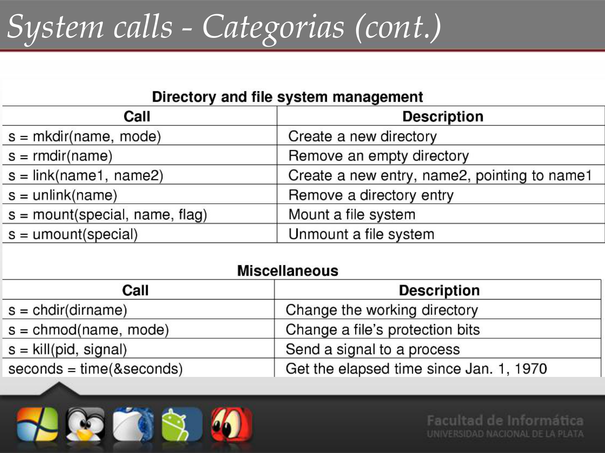

---

## ⚙️ Cómo se Activa una System Call en Linux

**Procedimiento:**
1. Se indica el **número de syscall** que se quiere ejecutar.
2. Se cargan los **parámetros** en los registros correspondientes.
3. Se emite un aviso al SO (**trap/excepción**) para pasar a modo kernel.
4. El SO evalúa la syscall deseada y la ejecuta.

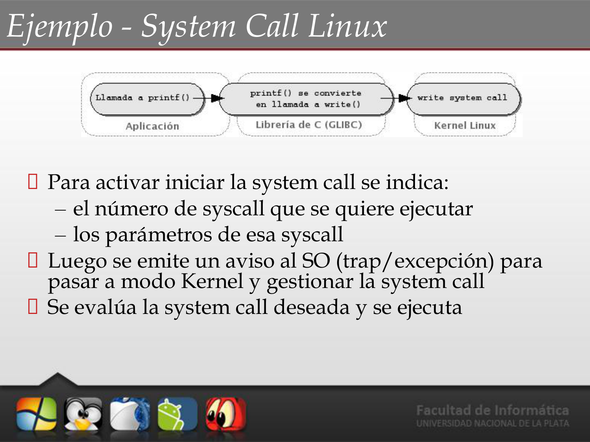

---

## 📦 Ejemplo: Hello World en Assembler

Para programar el clásico "Hello World" sin usar ninguna librería se necesitan como mínimo **2 system calls**:
- **`write`**: Para escribir un mensaje en pantalla.
- **`exit`**: Para terminar la ejecución del proceso.

Los manuales del sistema (`man 2 write`, `man exit`) indican los parámetros necesarios.

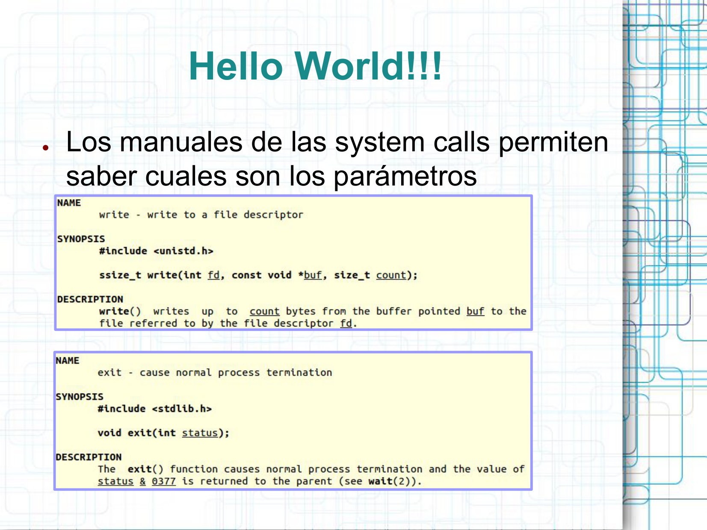

### Comparativa por Arquitectura

| Característica | x86 (32 bits) | x86-64 (64 bits) |
|---|---|---|
| **Instrucción que activa la syscall** | `int 0x80` (interrupción por software) | `syscall` (*fast system call*) |
| **Número de syscall `write`** | `4` | `1` |
| **Número de syscall `exit`** | `1` | `60` |
| **Registro para el nro de syscall** | `EAX` | `RAX` |
| **Registros para parámetros** | `EBX`, `ECX`, `EDX`, `ESI`, `EDI` | `RDI`, `RSI`, `RDX`, `R10`, `R8`, `R9` |

> 💡 **Observación:** Los procesadores modernos de 64 bits usan una instrucción nativa `syscall` en vez de tratar las peticiones como interrupciones generalizadas (`int 80h`), logrando **mayor velocidad** al cambiar menos registros y evitar el overhead del mecanismo de interrupciones.

### Código Hello World en Assembler

**x86 (32 bits):**
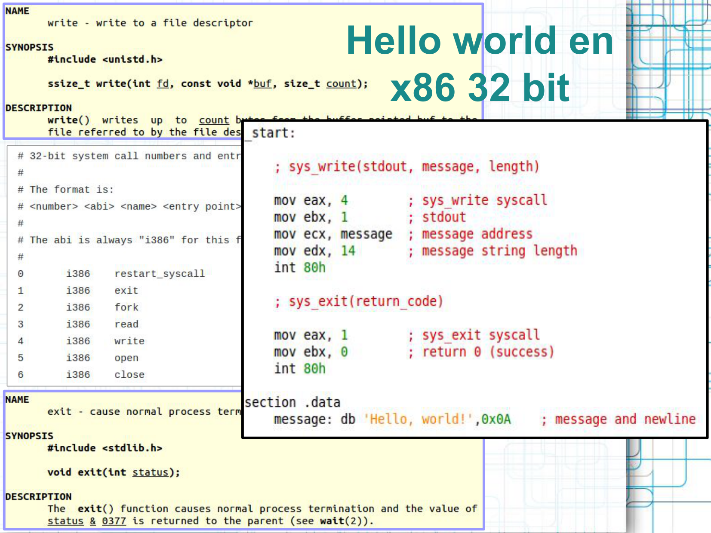

**x86-64 (64 bits):**
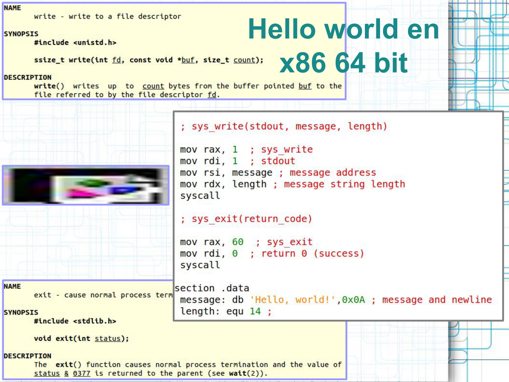

---

## 📚 Recursos y Referencias

- **Stallings, William:** *"Sistemas Operativos: Aspectos internos y principios de diseño"*.
- **Silberschatz, Galvin, Gagne:** *"Conceptos de Sistemas Operativos"* (*Operating System Concepts*).
- Tabla de syscalls x86 32bit: https://github.com/torvalds/linux/blob/master/arch/x86/entry/syscalls/syscall_32.tbl
- Tabla de syscalls x86 64bit: https://github.com/torvalds/linux/blob/master/arch/x86/entry/syscalls/syscall_64.tbl
- Referencia de syscalls: https://syscalls.kernelgrok.com/
- Tabla x86_64: http://blog.rchapman.org/posts/Linux_System_Call_Table_for_x86_64/
