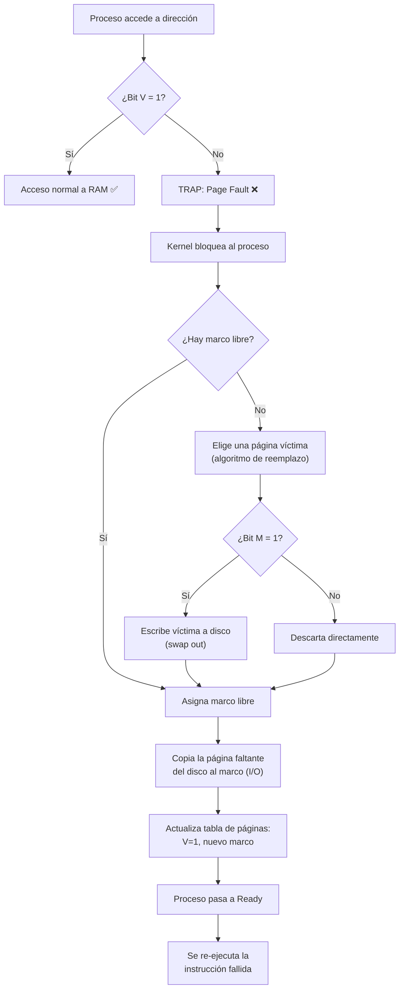
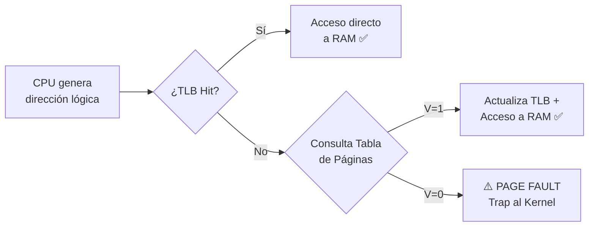
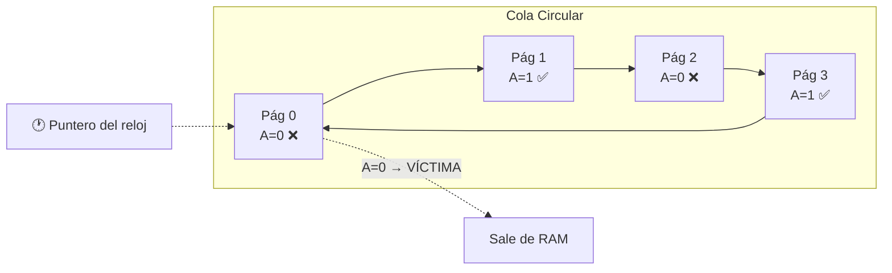

# 📘 Tema 3: Administración de Memoria

**Materia:** Introducción a los Sistemas Operativos (ISO) — UNLP 2026  
**Temas:** Espacio de Direcciones, Fragmentación, Paginación, Segmentación, Memoria Virtual, Page Faults, Algoritmos de Reemplazo.

---

<b>🧠 Parte 1: Administración, Paginación y Segmentación</b>

## 1. Introducción a la Administración de Memoria

## 🎯 ¿Por qué administrar la memoria?
Los datos y programas deben residir obligatoriamente en la memoria principal (RAM) para poder ser referenciados y ejecutados por la CPU en tiempo real. 
El S.O. está a cargo de:
- **Registrar** permanentemente qué partes de la memoria se usan y quién las usa.
- **Asignar / Liberar** espacio cuando nacen o mueren los procesos.
- **Eficiencia**: Alojar de manera compacta e inteligente el mayor número posible de procesos.

> *"Lograr que el programador se abstraiga de la alocación"*

En criollo: Vos como programador no te vas a engranar configurando los chips de la placa ram en los que querés guardar una listita de enteros; el S.O lo gestiona de manera transparente, segura e invisible abajo de la alfombra.

### 🤔 Requisitos Fundamentales
| Requisito | Propósito |
|---|---|
| **Reubicación** | El proceso puede ser temporalmente echado de la memoria hacia la unidad de disco (Swap) y traído de regreso, aterrizando matemáticamente en direcciones RAM distintas. El S.O se encarga de re-calcular los punteros. |
| **Protección** | Cada proceso debe trabajar encerrado en su celda. No deben existir punteros ni lecturas cruzadas sin permiso hacia áreas de memoria dedicadas a otro programa. |
| **Compartición** | Poder declarar secciones específicas de uso público para evitar duplicación, **compartiendo código en común** (ej, *librerías dll compartidas*). |

---

## 2. Espacio de Direcciones y Fragmentación

## 🧱 Espacio de Direcciones
Es la *"fantasía plana"* de direcciones a las que un proceso tiene derecho. Depende estrictamente del Procesador:
- En sistemas de 32 bits, el rango máximo abarcable es **$2^{32}-1$**.
- En sistemas de 64 bits, es de **$2^{64}-1$**.

## 💡 Direcciones Lógicas vs. Direcciones Físicas

| Tipo | Definición |
|---|---|
| **Dirección Lógica (Virtual)** | Referencia abstracta producida en el código de tu archivo (ej, `puntero en byte 200`). Es totalmente ajena e independiente de cómo esté dispuesta la placa de silicio de la RAM. |
| **Dirección Física** | Es el pincho eléctrico crudo y absoluto dentro del hardware la memoria RAM (ej, `celda 0x7A2BC`). |

### Traduciendo la Fantasía (Address Binding)
Esta magia transicional ocurre gracias a la **MMU (Memory Management Unit)**, un chip o porción de hardware en el procesador.
- Usa **Registros Auxiliares**: Por cada proceso asiste un **Registro Base** (dónde nace) y un **Registro Límite** (hasta dónde llega de ancho tu espacio virtual). 
- Cuando un programa de usuario dispara su flecha invocando la dirección virtual `642`, por ejemplo, el chip MMU por HW puro, inyecta su compensación y accede instantáneamente a su ubicación sumada real: `Base (7000) + 642` = Módulo **7642** de RAM sólida física.

## 💔 El Problema Histórico de la Fragmentación

Con el paso del correr del historial computacional surgieron dos filosofías primigenias (obsoletas). 
* Particiones Fijas: Cuadros rígidos exactos.
* Particiones Dinámicas: Se moldea un agujero en base a cuánto pesa el proceso entrante.

Ambas estrategias crudas acarrean la llamada **Fragmentación**:
| Tipo de Fragmentación | Causante | Descripción |
|---|---|---|
| ❌ **Interna** | *Particiones Fijas* | Se reserva una caja gigante de tamaño fijo, llega una carpetita chica y el espacio "interno y sobrante de tu caja" se echa a perder y nadie más lo puede usar. |
| ❌ **Externa** | *Particiones Dinámicas* | Los procesos son como fichas del tetris asimétricas, van terminando asíncronamente dejando *"huecos vacíos y desparramados"*  por toda la RAM. Existe muchísimo espacio general sobrante, pero nada está contiguo en bloque por lo que no te entra más nadie grande. |

---

## 3. Segmentación

## 🏗️ Segmentación Clásica
**Consiste en cortar y separar tu programa siguiendo tu propia intuición lingüística.** 
Se asemeja cien por ciento a *"tu propia visión semántica de usuario programador"*. En lugar de ser un bloque choripán monolítico, el S.O comprende que un programa está repleto de "pedazos o segmentos que significan algo": Las variables globales, las Funciones core y el Stack de llamadas se separan conceptualmente.

1. El programador (y su compilador) parte el código lógicamente en `[Código Principal]`, `[Módulo A]`, `[Pila Local]`, etc.
2. Cada bloque de longitud totalmente distinta y variada es *"disparado hacia la RAM"* rellenando lo huecos sueltos mediante el proceso de tablas de reubicación. 
3. **¿Causa Fragmentación?** SÍ, muchísima Fragmentación Externa.

### ⚙️ Arquitectura de la Traducción
Toda invocación en tiempo de vida requiere su tupla doble: un Selector de Segmento, y el Byte exacto a avanzar *(Offset)*.  
Mediante la validación de la **Tabla de Segmentos**, el procesador revisa:
1. *¿Es legal este avance o es un ataque a la vida privada de otro? (STLR register limits)*.
2. Lo suma a su origen `(Base del Segmento en RAM + Desplazamiento)`.

---

## 4. Paginación Básica

## 🎯 ¿Qué es la Paginación?
Es la estrella rey moderna de esta movida de software. Consiste en abandonar este concepto poético de los segmentos, e implosionar y dividir absolutamente todo uniformemente con **un cuchillo en pedazos de tamaños exactamente idénticos (ej. de a bloques de 4 Kilobytes estáticos)**. 

En criollo: 
1. Picor y rayo el espacio virtual exacto de todo el programa en pedacitos clónicos y en cuadraditos iguales que voy a llamar **Páginas**.
2. Por otro lado, la infinita extensión de la RAM principal va a estar cortada en esos exactamente mismos y clonados pedacitos llamadas **Marcos** (*Frames*).
3. Todo es compatible 1:1. Cualquier *"Pagina"* la sueldo adentro de cualquier puto agujerito *"Marco"* libre en disco en un santiamén. **Se acabó para siempre tener Fragmentación Externa de tamaños incompatibles.**

### 🔗 La Tabla de Páginas (Page Table)
Es el Excel dictador de la computadora. A cada proceso viviente se le hace su libreta perimetral (Tabla), y se dice: *"Aha, tu Pagina 0 vive en el Marco 4"*, y así.

Por cada dirección de un byte que tires, la arquitectura desarma todo diciendo: el bit del `0 al X` es el *"Número de tabla a ubicar"*, y la porción baja se estampa como exacto *"Desplazamiento crudo"*. 

---

## 5. Paginación Avanzada (Tablas Complejas y TLB)

## ⚠️ El Problema de las Tablas Simples GIGANTES
*¿Cuál es la pega enorme de esto?* Que la "tabla / excel indexado" que guardás en la RAM para tu proceso, *engorda como un lechón*. Por ejemplo, en una arquitectura teórica de 64bits, una tabla plana podría ocupar ¡más de 16 millones de Gigabytes per capita! Necesariamente nacen soluciones arquitectónicas superadoras para compactar esa información.

### 1️⃣ Tablas Multinivel (Jerárquicas)
Añaden niveles de anidación (Tablas dentro de Tablas que referencian de a racimos como el índice escalonado de un libro). Enorme ventaja de ahorro ya que podés ignorar y obviar la fabricación completa de los tableros secundarios de todo el inmenso hueco negro en el que tu programa ni siquiera reservó variables y está vacío de plano. 

### 2️⃣ Tabla Invertida (Hashing)
Cambia radicalmente el chip. **En vez de hacer un Padrón GIGANTE DE VIRTUALES a partir del programa, Hago una única tablita indexada enfocada y basada en LOS BLOQUES O MARCOS VERDADEROS FISICOS (que siempre están acotadísimos por los GB que compramos en MercadoLibre de Ram física).** Una sola tabla grupal que domina la matriz del Sistema Operativo Entero, localizando la info por encriptación criptográfica simple (Hashing). Al dar *Hit de colisión* se explora su encadenamiento lateral. (Súper usual en arquitecturas monumentales *PowerPC* *Ia-64*). 

---

## 🚀 TLB (Translation Lookaside Buffer)
El infierno burocrático de toda la memoria paginada era que, de cara pura al hardware, para llegar a cada miserable variable debías ir a buscar a las oficinas en RAM donde tenías anotada esa libreta, para recién de ahí salir e ir adonde de posta tenías estacionada la variable en la propia RAM.  `(Acceso Duplicado + Doble tiempo)`.
- **Qué es:** Es una memoria caché microscópica, de ultra e hyper velocidad relámpago, montada pura y duramente en el cobre del CPU (Chip TLB).
- **Cómo trabaja:** Almacena los mapeos más *"Recientemente y popularmente usados"*.  La CPU inspecciona esto en fracciones de nanosegundos (Hit) ahorrando la vuelta y el cálculo por toda la inmensa RAM, devolviendo todo volando. 

---

## 6. Segmentación Paginada (Híbridos Intel)

## ⚙️ La Solución Mixta Magistral
Toda nuestra arquitectura Intel contemporánea y moderna y computadoras de escritorio (desde la época cruda del  `Intel x386`) utilizan este maravilloso popurrí, casándose con lo mejor de cada una sin perder bondades:
- **Compartición Semántica**: Se disfruta la maravilla de la Segmentación original en la primer capa del sistema (Programas y código en bloque de Segmentos gigantes Modulares). 
- **Picadora Externa Estática**: Automáticamente cada gajo enorme de segmento recién cortado por nuestra intuición humana, a su vez se lo pasa por el molinillo y se lo corta quirúrgicamente en minúsculas y estáticas paginitas atómicas aburridamente repetibles para estampar en la matriz virtual.

> *"La segmentación es visible al programador (te das un lujo conceptual de compartir un bloque libreria .dll publico fácil). La paginación es 100% invisible de cara al OS, y le termina de reventar la perjudicial anomalía matemática y molesta de la fragmentación inyectándole bloques atómicos perfectos estables sobre tu placa base".*

---

---

<b>🔄 Parte 2: Memoria Virtual, Page Faults y Algoritmos de Reemplazo</b>

## 1. ¿Por qué Memoria Virtual?

## 🎯 Motivación

En la Parte 1 vimos cómo la **Paginación** divide todo en trozos iguales y elimina la fragmentación externa. Pero hasta ahora asumíamos que **todo** el programa debía estar cargado en RAM para ejecutarse. La realidad es que:

- Existen **rutinas y librerías** que se ejecutan una única vez (o nunca).
- Hay **regiones de memoria** alocadas dinámicamente que se liberan enseguida.
- Secciones de código que **no vuelven a ejecutarse** jamás luego de su inicialización.

> *"No hay necesidad de que la totalidad de la imagen del proceso sea cargada en memoria."*

En criollo: ¿Para qué llenar la RAM con código que el programa ni va a tocar? Es como llevar toda tu valija de vacaciones cuando solo necesitás el cepillo de dientes y el short. **El SO trae las "piezas" del proceso a medida que las necesita**, y saca las viejas a disco.

---

## 🏗️ Concepto de Memoria Virtual

La **Memoria Virtual** es una técnica que permite ejecutar procesos que **NO están completamente cargados en RAM**. El SO mantiene la imagen completa del proceso en disco (área de intercambio / *swap*) y va trayendo las páginas necesarias bajo demanda.

### Definición Clave: Conjunto Residente (Working Set)

> El **Conjunto Residente** es la porción del espacio de direcciones del proceso que **efectivamente se encuentra en memoria principal** en un momento dado.

En criollo: De tu programa gigante de 500 páginas, quizá solo 20 están alocadas en la RAM en este instante. Esas 20 son tu "Conjunto Residente".

---

## ✅ Ventajas de la Memoria Virtual

| | Descripción |
|---|---|
| ✅ | **Más procesos en memoria**: Solo se cargan las secciones necesarias de cada proceso, así que caben más procesos simultáneos en RAM → más procesos en estado Ready → mejor uso de la CPU. |
| ✅ | **Procesos más grandes que la RAM**: Un programa puede ser mayor que la memoria física disponible. El usuario no se preocupa por el tamaño. |
| ✅ | **Transparencia total**: El programador programa como si tuviera infinita memoria disponible; el SO se encarga de la magia. |

---

## ⚙️ Requisitos para implementar Memoria Virtual

| Requisito | Descripción |
|---|---|
| **Hardware con paginación por demanda** | El procesador (MMU) debe soportar detectar cuándo una página no está en RAM y generar un *trap*. |
| **Disco (Memoria Secundaria)** | Un área de intercambio (*swap area*) que almacena las secciones del proceso que NO están en RAM. |
| **Kernel capaz de gestionar el movimiento** | El SO mueve páginas entre la RAM y el disco según la necesidad de cada proceso. |

---

## 2. Paginación por Demanda y Bits de Control

## 🎯 ¿Cómo sabe el SO qué está en RAM y qué no?

Cada entrada en la **Tabla de Páginas** tiene **bits de control** que le dan información vital al hardware y al kernel:

| Bit | Nombre | ¿Quién lo activa? | ¿Quién lo consulta? | Propósito |
|---|---|---|---|---|
| **V** | Valid (Presente) | Kernel | Hardware (MMU) | Indica si la página está **cargada en RAM** (`V=1`) o no (`V=0`). |
| **M** | Modified (Dirty) | Hardware | Kernel | Indica si la página fue **modificada en RAM**. Si `M=1`, antes de sacarla hay que escribir los cambios al disco. |

En criollo: 
- El **Bit V** es la pregunta *"¿Está esta página en la RAM o sigue tirada en el disco?"*. Si `V=0`, el hardware frena todo y grita **"¡Page Fault!"**.
- El **Bit M** es la pregunta *"¿Alguien tocó/editó esta página desde que la trajimos del disco?"*. Si sí, antes de pisarla con otra cosa, hay que guardar los cambios en el disco (como un `Ctrl+S`).

### 📦 Entrada de la Tabla de Páginas en x86 (32 bits)

El hardware define rígidamente el formato de cada PTE (Page Table Entry). Incluye, además de V y M:

| Campo | Bits | Función |
|---|---|---|
| **Page Frame Number** | 31-12 | El número de marco físico donde está la página. |
| **Valid (V)** | 0 | ¿Está en RAM? |
| **Writable (W)** | 1 | ¿Se puede escribir? |
| **Owner (O)** | 2 | ¿Es de Kernel o de User? |
| **Write Through (Wt)** | 3 | Política de escritura de caché. |
| **Cache Disabled (Cd)** | 4 | ¿Deshabilitar caché para esta página? |
| **Accessed (A)** | 5 | ¿Fue accedida (leída)? |
| **Dirty / Modified (D)** | 6 | ¿Fue modificada (escrita)? |
| **Large Page (L)** | 7 | ¿Es una página grande (4MB en vez de 4KB)? |
| **Global (Gi)** | 8 | ¿Se mantiene en TLB entre context switches? |

---

## 3. Fallo de Página (Page Fault) — El evento central

## 🎯 ¿Qué es un Page Fault?

> Un **Fallo de Página** ocurre cuando un proceso intenta acceder a una dirección cuya página tiene el **Bit V = 0** (no está en RAM). El hardware genera un **trap** (interrupción interna).

En criollo: El programa le pide al procesador "leeme la variable que está en la página 7", el hardware revisa la tabla y se da cuenta de que esa página está tirada en el disco, no en la RAM. Entonces grita *"¡ALTO! Fallo de página, necesito ayuda del kernel"*.

---

## ⚙️ Pasos del manejo de un Page Fault

### Paso a paso en detalle:

1. **Trap**: El hardware detecta `V=0` y genera una interrupción interna.
2. **Bloqueo del proceso**: El kernel pone al proceso en estado **Blocked** (así la CPU no queda ociosa, puede correr otro proceso).
3. **Búsqueda de marco libre**: El kernel revisa si hay algún marco vacío en la RAM.
4. **Si NO hay marcos libres**: Se ejecuta un **algoritmo de reemplazo** para elegir una *"página víctima"* que será expulsada.
   - Si la víctima tiene `Bit M = 1` (fue modificada), hay que escribirla al disco primero (*swap out*).
   - Si la víctima tiene `Bit M = 0`, se descarta directamente (ya está en disco idéntica).
5. **Carga desde disco**: Se genera una operación de **E/S (lectura de disco)** para copiar la página faltante en el marco recién liberado.
6. **Actualización de la tabla**: El kernel pone `V=1` en la entrada de la página del proceso y anota el número del marco.
7. **Ready**: El proceso vuelve a la cola de listos.
8. **Re-ejecución**: Cuando la CPU le dé turno, la instrucción que falló se vuelve a ejecutar, y ahora sí encuentra la página en RAM.

---

## 4. TLB con Paginación por Demanda

## 🚀 ¿Cómo interactúa la TLB con los Page Faults?

Recordemos de la Parte 1 que la **TLB** (Translation Lookaside Buffer) es una caché ultra-rápida que guarda las traducciones más recientes de página → marco. Ahora, con Memoria Virtual, el flujo completo es:

1. La CPU genera una dirección lógica.
2. Se busca en la **TLB**:
   - **TLB Hit**: Se obtiene el marco directamente → acceso ultra-rápido. ✅
   - **TLB Miss**: Se va a la **Tabla de Páginas en RAM**:
     - **Bit V = 1**: Se encuentra el marco, se actualiza la TLB, se accede a memoria. ✅
     - **Bit V = 0**: **PAGE FAULT** → se dispara todo el proceso descrito arriba. ❌

---

## 5. Performance: El costo del Page Fault

## 📊 EAT (Effective Access Time)

Si los page faults son excesivos, la performance del sistema **se desploma** brutalmente. Se define una fórmula para calcular el tiempo efectivo de acceso:

> **EAT** = `(1 - p) × memory_access` + `p × (page_fault_overhead + [swap_page_out] + swap_page_in + restart_overhead)`

Donde:
- **p** = Tasa de Page Faults (`0 ≤ p ≤ 1`)
  - Si `p = 0` → no hay faults, todo va volando.
  - Si `p = 1` → cada acceso genera un fault, la máquina se arrastra.
- **memory_access** = Tiempo normal de acceso a RAM (~100ns)
- **swap_page_out** = Tiempo de escribir la víctima al disco (solo si `M=1`)
- **swap_page_in** = Tiempo de leer la página del disco (~8ms)

En criollo: Un acceso a RAM tarda unos 100 *nanosegundos*. Pero un acceso a disco puede tardar 8 *milisegundos*. Eso es una diferencia de **80.000 veces**. Así que cada page fault extra penaliza brutalmente la performance general del sistema. Por eso es tan crítico elegir bien qué página echar.

---

## 6. Políticas de Memoria Virtual

## ⚙️ Decisiones que toma el Kernel

El SO debe decidir varias cosas respecto a la administración de la memoria virtual. Todas estas decisiones se llaman **Políticas**:

| Política | Pregunta que responde |
|---|---|
| **Fetch (Búsqueda)** | ¿*Cuándo* traer una página a memoria? *(Por demanda vs. prepaging)* |
| **Placement (Ubicación)** | ¿*Dónde* ubicarla? *(Best-fit, first-fit, etc.)* |
| **Replacement (Reemplazo)** | ¿*Cuál* página sacar si no hay marcos libres? *(FIFO, LRU, etc.)* |
| **Cleaning (Limpieza)** | ¿*Cuándo* escribir una página modificada al disco? |
| **Load Control** | ¿*Cuántos* procesos mantener en memoria a la vez? |

---

## 7. Asignación de Marcos

## 🎯 ¿Cuántos marcos le damos a cada proceso?

El **Conjunto Residente** de un proceso depende de cuántos marcos se le asignan. Hay dos estrategias fundamentales:

### Asignación Fija
El número de marcos asignados a un proceso **no cambia** durante su ejecución.

| Método | Descripción | Ejemplo |
|---|---|---|
| **Equitativa** | Misma cantidad para todos. | 100 marcos / 5 procesos = 20 marcos c/u. |
| **Proporcional** | Marcos según el tamaño del proceso. | P1 (10KB) recibe menos marcos que P2 (50KB). |

### Asignación Dinámica
El número de marcos **varía** según el comportamiento del proceso durante su ejecución. Si un proceso tiene muchos page faults, se le dan más marcos; si usa pocos, se le quitan.

---

## 8. Alcance del Reemplazo (Local vs. Global)

## 🎯 ¿De dónde saco la página víctima?

Cuando ocurre un page fault y no hay marcos libres, el kernel tiene que elegir una **página víctima** para expulsar. Pero, ¿de dónde la saca?

| Alcance | Regla | Ventaja | Desventaja |
|---|---|---|---|
| **Reemplazo Local** | Solo puede sacar una página **del mismo proceso** que generó el fault. | El SO controla la tasa de page-faults por proceso. Predecible. | Un proceso puede tener marcos ociosos que nadie más puede usar. |
| **Reemplazo Global** | Puede sacar una página de **cualquier proceso** del sistema. | Flexibilidad máxima, aprovecha mejor la RAM. | Un proceso podría "robarle" marcos a otro, generándole más page faults al segundo (efecto dominó). |

### 📊 Combinaciones Asignación + Alcance

| Combinación | ¿Se usa en la práctica? |
|---|---|
| Fija + Local | ✅ Sí. Cada proceso tiene marcos fijos y solo reemplaza los suyos. |
| Fija + Global | ❌ No tiene sentido. Si es fija, no puede robar de otro. |
| Dinámica + Local | ✅ Sí. Se le van asignando más/menos marcos pero solo reemplaza de los propios. |
| Dinámica + Global | ✅ Sí. La más flexible, usada por la mayoría de los SO modernos. |

---

## 9. Algoritmos de Reemplazo de Páginas

## 🎯 El problema central

> *"¿Cuál página echamos de la RAM para hacerle lugar a la nueva?"*

La respuesta ideal es: **la que NO vaya a ser usada en un futuro próximo**. Pero como no somos videntes, los algoritmos intentan predecir el futuro mirando el comportamiento pasado.

---

### 1️⃣ Algoritmo ÓPTIMO (Teórico)

- **Regla**: Reemplaza la página que **no será usada por el período más largo** en el futuro.
- **Problema**: Es **imposible de implementar** en la realidad porque requiere conocer el futuro.
- **Utilidad**: Sirve como **referencia teórica** para comparar qué tan buenos son los demás algoritmos.

---

### 2️⃣ Algoritmo FIFO (First In, First Out)

- **Regla**: Reemplaza la página **más antigua** en memoria (la que llegó primero a la RAM).
- **Implementación**: Cola circular de marcos.

| | Descripción |
|---|---|
| ✅ | Muy simple de implementar. |
| ❌ | La página más antigua podría ser **muy usada** (ej: código del loop principal). La antigüedad no implica que no se necesite. |
| ❌ | Sufre la **Anomalía de Bélády**: en ciertos casos, agregarle MÁS marcos al proceso genera MÁS page faults (¡contraproducente!). |

---

### 3️⃣ Algoritmo LRU (Least Recently Used)

- **Regla**: Reemplaza la página que **hace más tiempo que no se accede** (la menos recientemente usada).
- **Filosofía**: *"Si no la usaste en mucho rato, probablemente no la necesites pronto."*

| | Descripción |
|---|---|
| ✅ | Muy buena aproximación al Óptimo en la práctica. |
| ✅ | No sufre la Anomalía de Bélády. |
| ❌ | Requiere **soporte de hardware** para mantener timestamps de acceso a cada página (costoso). |
| ❌ | Overhead alto para mantener el orden de acceso actualizado. |

---

### 4️⃣ Algoritmo de 2da Chance (Clock)

- **Regla**: Es un **FIFO mejorado**. Antes de expulsar la página más vieja, le da una "segunda oportunidad": revisa el **Bit A (Accessed/Referenciado)**.
  - Si `A = 1` → la página fue usada recientemente. Le pone `A = 0` y la mueve al final (se "salva").
  - Si `A = 0` → no fue usada recientemente. Se la echa como víctima.

| | Descripción |
|---|---|
| ✅ | Mejora enormemente a FIFO sin necesitar timestamps complejos. |
| ✅ | Fácil de implementar con una cola circular y un puntero (*clock hand*). |
| ❌ | En el peor caso (todas con `A=1`), degenera en FIFO puro. |

---

### 5️⃣ Algoritmo NRU (Not Recently Used)

- **Regla**: Usa **dos bits** por página para clasificarlas en 4 categorías según su uso reciente:
  - **Bit R** (Referenced/Accedida): se pone en `1` cada vez que se lee o escribe la página.
  - **Bit M** (Modified/Modificada): se pone en `1` cuando la página es escrita.
- Periódicamente, el kernel resetea **Bit R** a `0` (pero no el M).

| Clase | R | M | Descripción | Prioridad de expulsión |
|---|---|---|---|---|
| **Clase 0** | 0 | 0 | No referenciada, no modificada. | 🔴 **Primera en irse** (la ideal) |
| **Clase 1** | 0 | 1 | No referenciada, pero modificada. | 🟡 Segunda |
| **Clase 2** | 1 | 0 | Referenciada, no modificada. | 🟠 Tercera |
| **Clase 3** | 1 | 1 | Referenciada y modificada. | 🟢 **Última en irse** (la peor) |

En criollo: La clase 0 es la basura perfecta para reciclar (nadie la usa y no hay nada que guardar). La clase 3 es la joya (la están usando activamente Y además tiene cambios sin guardar).

---

### 📊 Tabla Comparativa Final de Algoritmos

| Algoritmo | Regla de selección | Complejidad | ¿Sufre Anomalía de Bélády? | Calidad |
|---|---|---|---|---|
| **Óptimo** | La que no se usará por más tiempo | Imposible de implementar | No | ⭐⭐⭐⭐⭐ (Teórico) |
| **FIFO** | La más antigua | Muy baja | ✅ Sí | ⭐⭐ |
| **LRU** | La menos recientemente usada | Alta (requiere HW) | No | ⭐⭐⭐⭐ |
| **2da Chance** | FIFO + verificar bit A | Baja | No | ⭐⭐⭐ |
| **NRU** | Clasificación por bits R y M | Baja | No | ⭐⭐⭐ |

---

## 📚 Recursos y Referencias

- **Stallings:** *"Sistemas Operativos"* — Pearson / Prentice Hall.
- **Silberschatz, Galvin, Gagne:** *"Operating System Concepts"* — Wiley.
- Material de cátedra ISO/CSO — Facultad de Informática, UNLP. Versión Agosto 2025.

