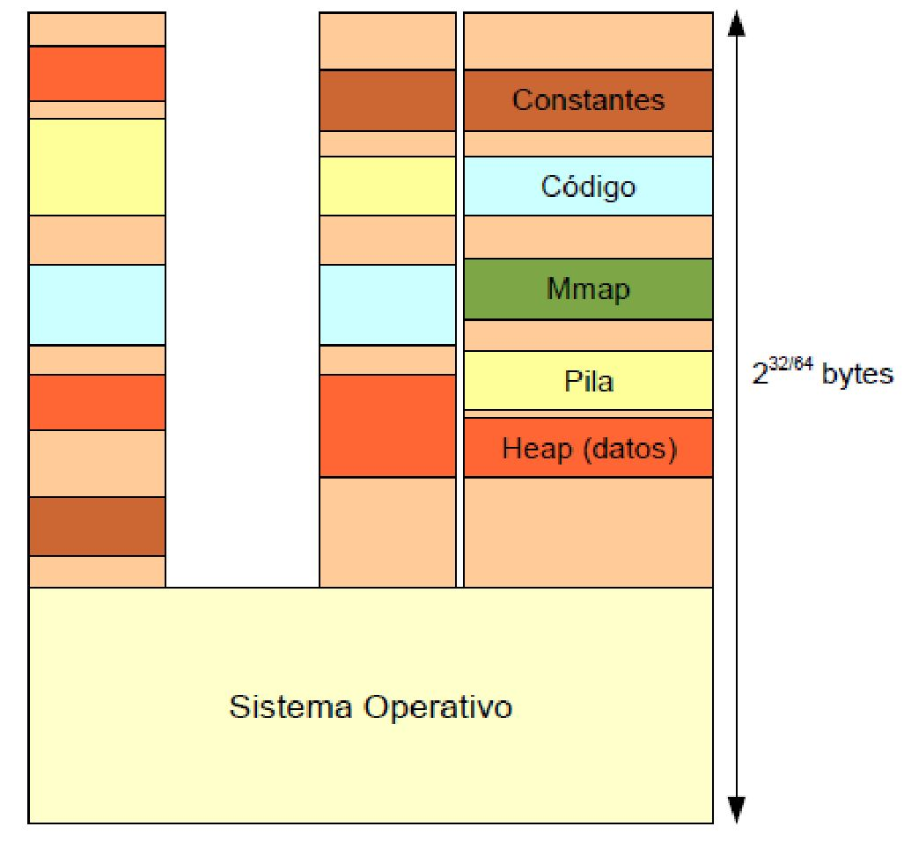
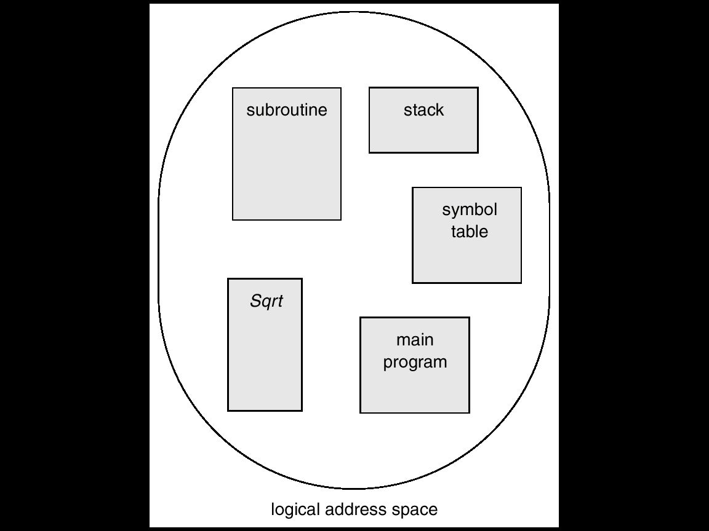
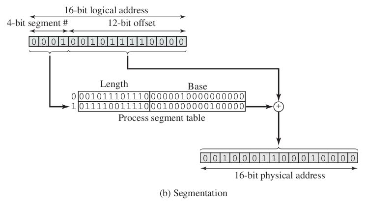
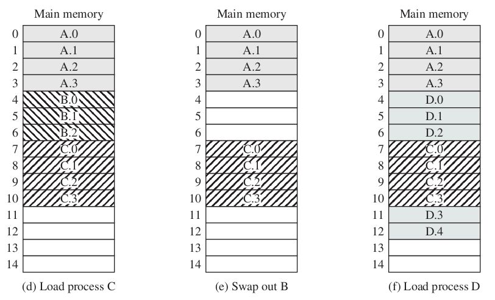
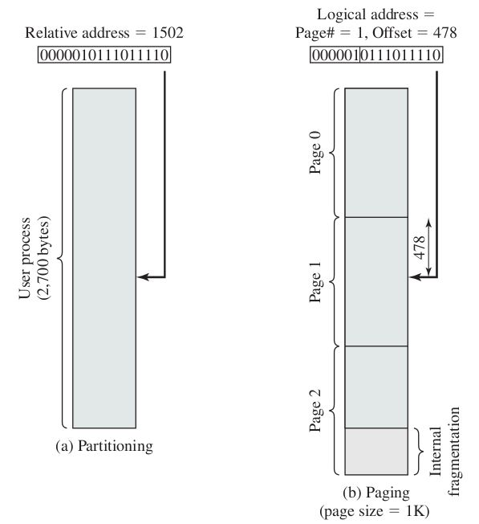
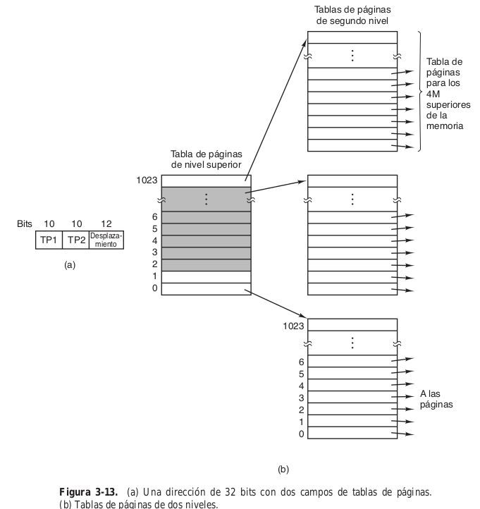
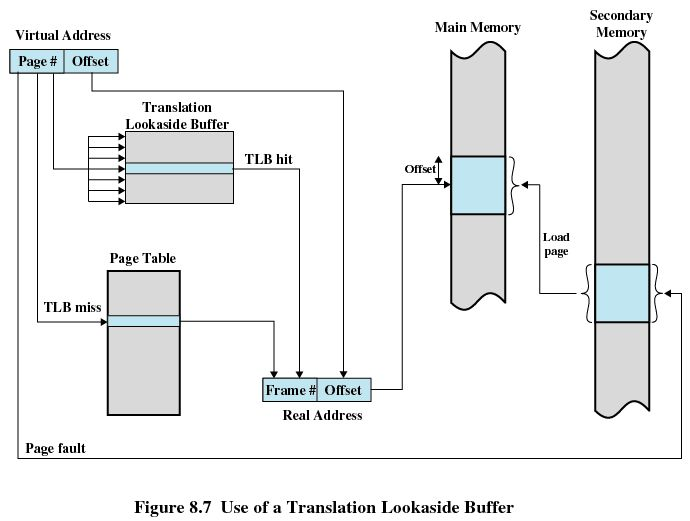
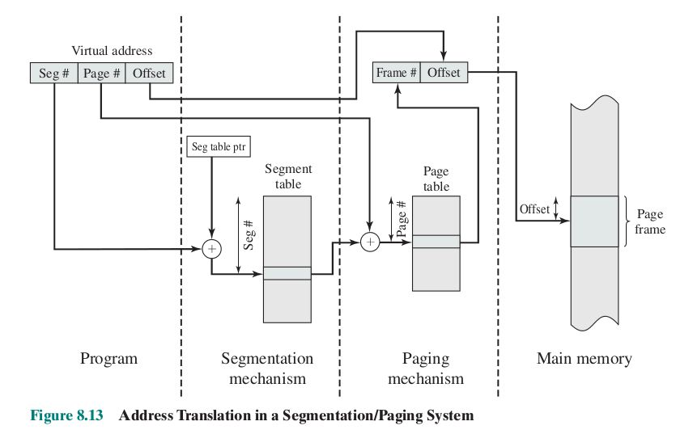

# 📘 Memoria (Parte 1): Administración, Paginación y Segmentación

**Materia:** Introducción a los Sistemas Operativos (ISO) — UNLP 2026  
**Temas:** Espacio de Direcciones, Fragmentación, Paginación, Segmentación, Tablas de Páginas, TLB.

---

<b>1. Introducción a la Administración de Memoria</b>

## 🎯 ¿Por qué administrar la memoria?
Los datos y programas deben residir obligatoriamente en la memoria principal (RAM) para poder ser referenciados y ejecutados por la CPU en tiempo real. 
El S.O. está a cargo de:
- **Registrar** permanentemente qué partes de la memoria se usan y quién las usa.
- **Asignar / Liberar** espacio cuando nacen o mueren los procesos.
- **Eficiencia**: Alojar de manera compacta e inteligente el mayor número posible de procesos.

> *"Lograr que el programador se abstraiga de la alocación"*

En criollo: Vos como programador no te vas a engranar configurando los chips de la placa ram en los que querés guardar una listita de enteros; el S.O lo gestiona de manera transparente, segura e invisible abajo de la alfombra.

### 🤔 Requisitos Fundamentales
| Requisito | Propósito |
|---|---|
| **Reubicación** | El proceso puede ser temporalmente echado de la memoria hacia la unidad de disco (Swap) y traído de regreso, aterrizando matemáticamente en direcciones RAM distintas. El S.O se encarga de re-calcular los punteros. |
| **Protección** | Cada proceso debe trabajar encerrado en su celda. No deben existir punteros ni lecturas cruzadas sin permiso hacia áreas de memoria dedicadas a otro programa. |
| **Compartición** | Poder declarar secciones específicas de uso público para evitar duplicación, **compartiendo código en común** (ej, *librerías dll compartidas*). |

---

<b>2. Espacio de Direcciones y Fragmentación</b>

## 🧱 Espacio de Direcciones
Es la *"fantasía plana"* de direcciones a las que un proceso tiene derecho. Depende estrictamente del Procesador:
- En sistemas de 32 bits, el rango máximo abarcable es **$2^{32}-1$**.
- En sistemas de 64 bits, es de **$2^{64}-1$**.

## 💡 Direcciones Lógicas vs. Direcciones Físicas

| Tipo | Definición |
|---|---|
| **Dirección Lógica (Virtual)** | Referencia abstracta producida en el código de tu archivo (ej, `puntero en byte 200`). Es totalmente ajena e independiente de cómo esté dispuesta la placa de silicio de la RAM. |
| **Dirección Física** | Es el pincho eléctrico crudo y absoluto dentro del hardware la memoria RAM (ej, `celda 0x7A2BC`). |

### Traduciendo la Fantasía (Address Binding)
Esta magia transicional ocurre gracias a la **MMU (Memory Management Unit)**, un chip o porción de hardware en el procesador.
- Usa **Registros Auxiliares**: Por cada proceso asiste un **Registro Base** (dónde nace) y un **Registro Límite** (hasta dónde llega de ancho tu espacio virtual). 
- Cuando un programa de usuario dispara su flecha invocando la dirección virtual `642`, por ejemplo, el chip MMU por HW puro, inyecta su compensación y accede instantáneamente a su ubicación sumada real: `Base (7000) + 642` = Módulo **7642** de RAM sólida física.

## 💔 El Problema Histórico de la Fragmentación

Con el paso del correr del historial computacional surgieron dos filosofías primigenias (obsoletas). 
* Particiones Fijas: Cuadros rígidos exactos.
* Particiones Dinámicas: Se moldea un agujero en base a cuánto pesa el proceso entrante.

Ambas estrategias crudas acarrean la llamada **Fragmentación**:
| Tipo de Fragmentación | Causante | Descripción |
|---|---|---|
| ❌ **Interna** | *Particiones Fijas* | Se reserva una caja gigante de tamaño fijo, llega una carpetita chica y el espacio "interno y sobrante de tu caja" se echa a perder y nadie más lo puede usar. |
| ❌ **Externa** | *Particiones Dinámicas* | Los procesos son como fichas del tetris asimétricas, van terminando asíncronamente dejando *"huecos vacíos y desparramados"*  por toda la RAM. Existe muchísimo espacio general sobrante, pero nada está contiguo en bloque por lo que no te entra más nadie grande. |

---

<b>3. Segmentación</b>

## 🏗️ Segmentación Clásica
**Consiste en cortar y separar tu programa siguiendo tu propia intuición lingüística.** 
Se asemeja cien por ciento a *"tu propia visión semántica de usuario programador"*. En lugar de ser un bloque choripán monolítico, el S.O comprende que un programa está repleto de "pedazos o segmentos que significan algo": Las variables globales, las Funciones core y el Stack de llamadas se separan conceptualmente.

1. El programador (y su compilador) parte el código lógicamente en `[Código Principal]`, `[Módulo A]`, `[Pila Local]`, etc.
2. Cada bloque de longitud totalmente distinta y variada es *"disparado hacia la RAM"* rellenando lo huecos sueltos mediante el proceso de tablas de reubicación. 
3. **¿Causa Fragmentación?** SÍ, muchísima Fragmentación Externa.

### ⚙️ Arquitectura de la Traducción
Toda invocación en tiempo de vida requiere su tupla doble: un Selector de Segmento, y el Byte exacto a avanzar *(Offset)*.  
Mediante la validación de la **Tabla de Segmentos**, el procesador revisa:
1. *¿Es legal este avance o es un ataque a la vida privada de otro? (STLR register limits)*.
2. Lo suma a su origen `(Base del Segmento en RAM + Desplazamiento)`.

---

<b>4. Paginación Básica</b>

## 🎯 ¿Qué es la Paginación?
Es la estrella rey moderna de esta movida de software. Consiste en abandonar este concepto poético de los segmentos, e implosionar y dividir absolutamente todo uniformemente con **un cuchillo en pedazos de tamaños exactamente idénticos (ej. de a bloques de 4 Kilobytes estáticos)**. 

En criollo: 
1. Picor y rayo el espacio virtual exacto de todo el programa en pedacitos clónicos y en cuadraditos iguales que voy a llamar **Páginas**.
2. Por otro lado, la infinita extensión de la RAM principal va a estar cortada en esos exactamente mismos y clonados pedacitos llamadas **Marcos** (*Frames*).
3. Todo es compatible 1:1. Cualquier *"Pagina"* la sueldo adentro de cualquier puto agujerito *"Marco"* libre en disco en un santiamén. **Se acabó para siempre tener Fragmentación Externa de tamaños incompatibles.**

### 🔗 La Tabla de Páginas (Page Table)
Es el Excel dictador de la computadora. A cada proceso viviente se le hace su libreta perimetral (Tabla), y se dice: *"Aha, tu Pagina 0 vive en el Marco 4"*, y así.

Por cada dirección de un byte que tires, la arquitectura desarma todo diciendo: el bit del `0 al X` es el *"Número de tabla a ubicar"*, y la porción baja se estampa como exacto *"Desplazamiento crudo"*. 

---

<b>5. Paginación Avanzada (Tablas Complejas y TLB)</b>

## ⚠️ El Problema de las Tablas Simples GIGANTES
*¿Cuál es la pega enorme de esto?* Que la "tabla / excel indexado" que guardás en la RAM para tu proceso, *engorda como un lechón*. Por ejemplo, en una arquitectura teórica de 64bits, una tabla plana podría ocupar ¡más de 16 millones de Gigabytes per capita! Necesariamente nacen soluciones arquitectónicas superadoras para compactar esa información.

### 1️⃣ Tablas Multinivel (Jerárquicas)
Añaden niveles de anidación (Tablas dentro de Tablas que referencian de a racimos como el índice escalonado de un libro). Enorme ventaja de ahorro ya que podés ignorar y obviar la fabricación completa de los tableros secundarios de todo el inmenso hueco negro en el que tu programa ni siquiera reservó variables y está vacío de plano. 

### 2️⃣ Tabla Invertida (Hashing)
Cambia radicalmente el chip. **En vez de hacer un Padrón GIGANTE DE VIRTUALES a partir del programa, Hago una única tablita indexada enfocada y basada en LOS BLOQUES O MARCOS VERDADEROS FISICOS (que siempre están acotadísimos por los GB que compramos en MercadoLibre de Ram física).** Una sola tabla grupal que domina la matriz del Sistema Operativo Entero, localizando la info por encriptación criptográfica simple (Hashing). Al dar *Hit de colisión* se explora su encadenamiento lateral. (Súper usual en arquitecturas monumentales *PowerPC* *Ia-64*). 

---

## 🚀 TLB (Translation Lookaside Buffer)
El infierno burocrático de toda la memoria paginada era que, de cara pura al hardware, para llegar a cada miserable variable debías ir a buscar a las oficinas en RAM donde tenías anotada esa libreta, para recién de ahí salir e ir adonde de posta tenías estacionada la variable en la propia RAM.  `(Acceso Duplicado + Doble tiempo)`.
- **Qué es:** Es una memoria caché microscópica, de ultra e hyper velocidad relámpago, montada pura y duramente en el cobre del CPU (Chip TLB).
- **Cómo trabaja:** Almacena los mapeos más *"Recientemente y popularmente usados"*.  La CPU inspecciona esto en fracciones de nanosegundos (Hit) ahorrando la vuelta y el cálculo por toda la inmensa RAM, devolviendo todo volando. 

---

<b>6. Segmentación Paginada (Híbridos Intel)</b>

## ⚙️ La Solución Mixta Magistral
Toda nuestra arquitectura Intel contemporánea y moderna y computadoras de escritorio (desde la época cruda del  `Intel x386`) utilizan este maravilloso popurrí, casándose con lo mejor de cada una sin perder bondades:
- **Compartición Semántica**: Se disfruta la maravilla de la Segmentación original en la primer capa del sistema (Programas y código en bloque de Segmentos gigantes Modulares). 
- **Picadora Externa Estática**: Automáticamente cada gajo enorme de segmento recién cortado por nuestra intuición humana, a su vez se lo pasa por el molinillo y se lo corta quirúrgicamente en minúsculas y estáticas paginitas atómicas aburridamente repetibles para estampar en la matriz virtual.

> *"La segmentación es visible al programador (te das un lujo conceptual de compartir un bloque libreria .dll publico fácil). La paginación es 100% invisible de cara al OS, y le termina de reventar la perjudicial anomalía matemática y molesta de la fragmentación inyectándole bloques atómicos perfectos estables sobre tu placa base".*

---
