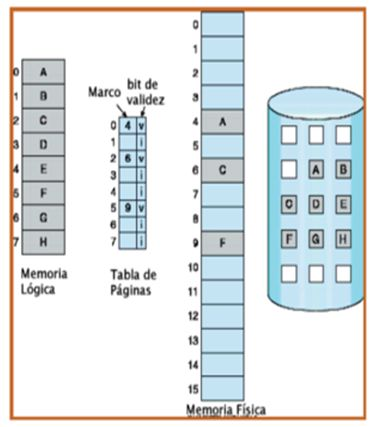
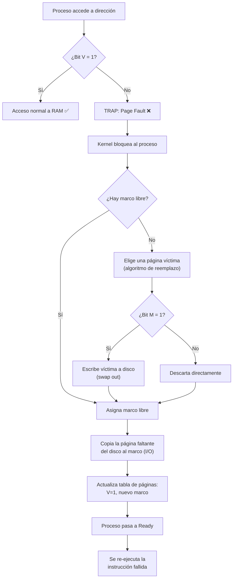
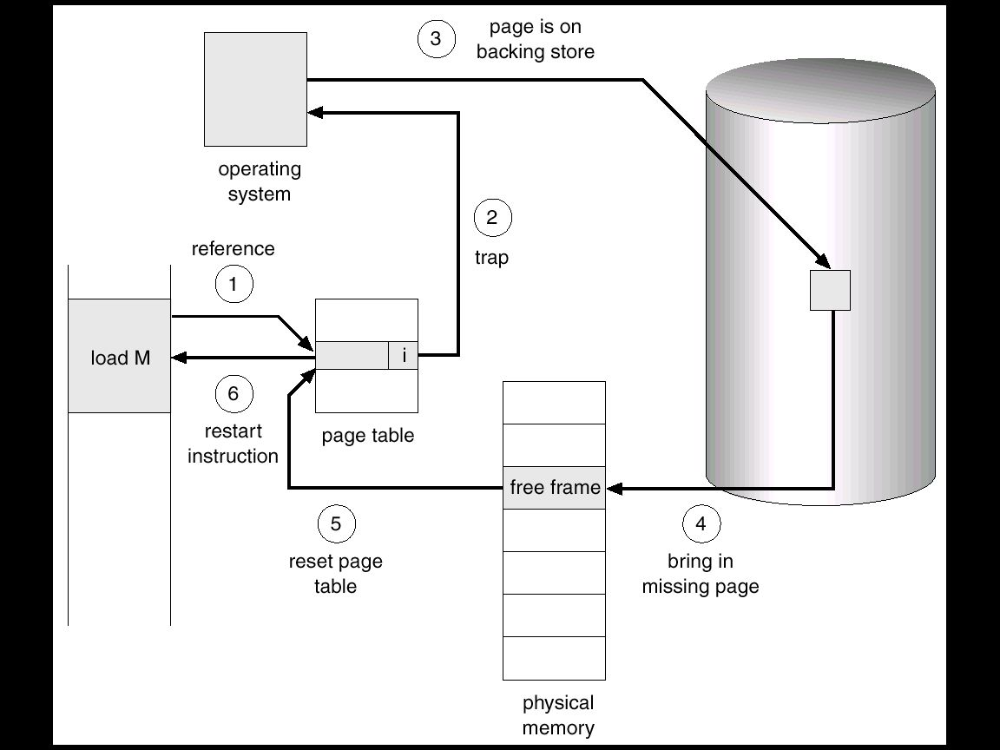
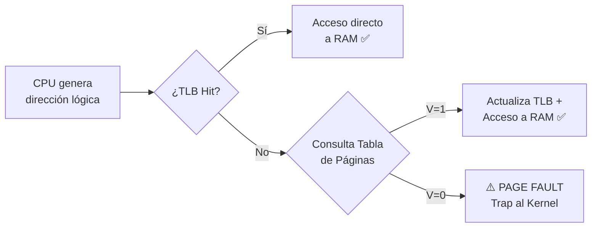
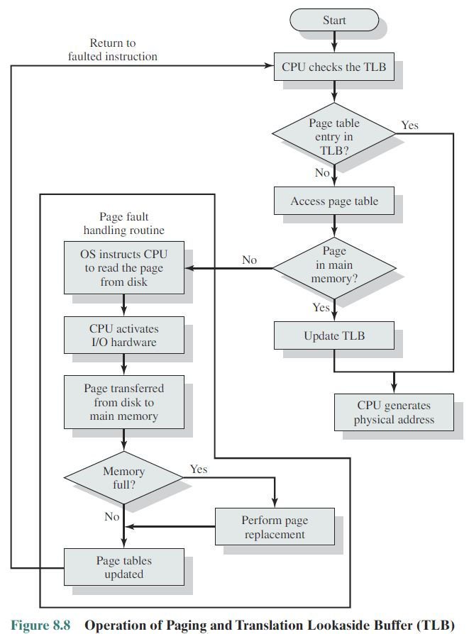
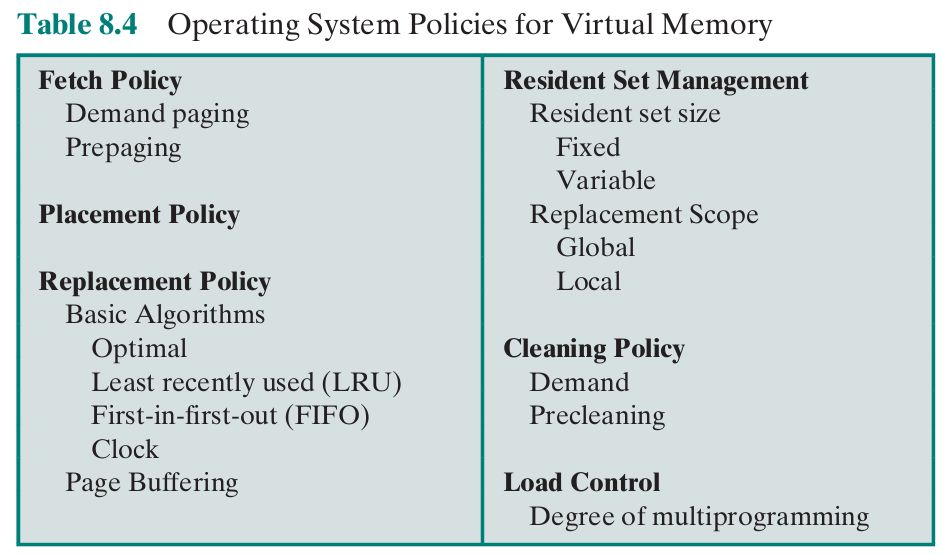
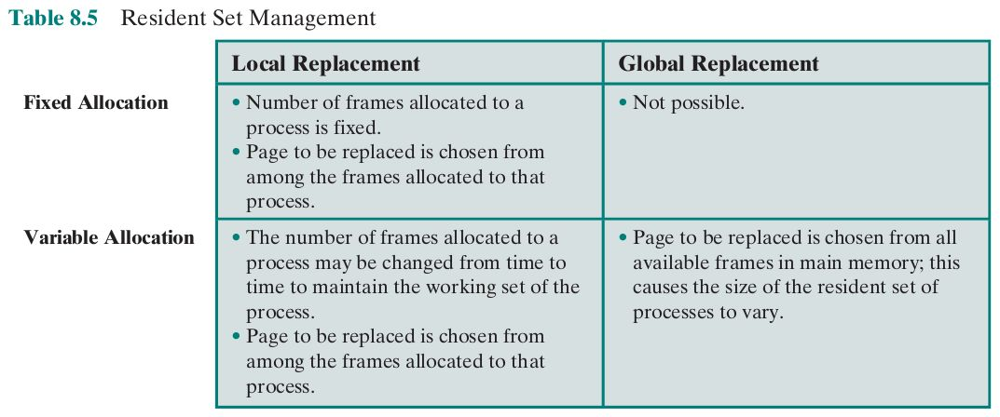
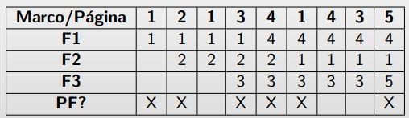
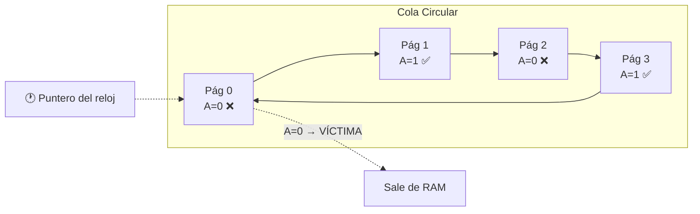

# 📘 Memoria (Parte 2): Memoria Virtual, Page Faults y Algoritmos de Reemplazo

**Materia:** Introducción a los Sistemas Operativos (ISO) — UNLP 2026  
**Temas:** Memoria Virtual, Paginación por Demanda, Conjunto Residente, Fallo de Página, Algoritmos de Reemplazo (FIFO, Óptimo, LRU, 2da Chance, NRU), Asignación de Marcos, Performance.

---

<b>1. ¿Por qué Memoria Virtual?</b>

## 🎯 Motivación

En la Parte 1 vimos cómo la **Paginación** divide todo en trozos iguales y elimina la fragmentación externa. Pero hasta ahora asumíamos que **todo** el programa debía estar cargado en RAM para ejecutarse. La realidad es que:

- Existen **rutinas y librerías** que se ejecutan una única vez (o nunca).
- Hay **regiones de memoria** alocadas dinámicamente que se liberan enseguida.
- Secciones de código que **no vuelven a ejecutarse** jamás luego de su inicialización.

> *"No hay necesidad de que la totalidad de la imagen del proceso sea cargada en memoria."*

En criollo: ¿Para qué llenar la RAM con código que el programa ni va a tocar? Es como llevar toda tu valija de vacaciones cuando solo necesitás el cepillo de dientes y el short. **El SO trae las "piezas" del proceso a medida que las necesita**, y saca las viejas a disco.

---

## 🏗️ Concepto de Memoria Virtual

La **Memoria Virtual** es una técnica que permite ejecutar procesos que **NO están completamente cargados en RAM**. El SO mantiene la imagen completa del proceso en disco (área de intercambio / *swap*) y va trayendo las páginas necesarias bajo demanda.

### Definición Clave: Conjunto Residente (Working Set)

> El **Conjunto Residente** es la porción del espacio de direcciones del proceso que **efectivamente se encuentra en memoria principal** en un momento dado.

En criollo: De tu programa gigante de 500 páginas, quizá solo 20 están alocadas en la RAM en este instante. Esas 20 son tu "Conjunto Residente".

---

## ✅ Ventajas de la Memoria Virtual

| | Descripción |
|---|---|
| ✅ | **Más procesos en memoria**: Solo se cargan las secciones necesarias de cada proceso, así que caben más procesos simultáneos en RAM → más procesos en estado Ready → mejor uso de la CPU. |
| ✅ | **Procesos más grandes que la RAM**: Un programa puede ser mayor que la memoria física disponible. El usuario no se preocupa por el tamaño. |
| ✅ | **Transparencia total**: El programador programa como si tuviera infinita memoria disponible; el SO se encarga de la magia. |

---

## ⚙️ Requisitos para implementar Memoria Virtual

| Requisito | Descripción |
|---|---|
| **Hardware con paginación por demanda** | El procesador (MMU) debe soportar detectar cuándo una página no está en RAM y generar un *trap*. |
| **Disco (Memoria Secundaria)** | Un área de intercambio (*swap area*) que almacena las secciones del proceso que NO están en RAM. |
| **Kernel capaz de gestionar el movimiento** | El SO mueve páginas entre la RAM y el disco según la necesidad de cada proceso. |

---

<b>2. Paginación por Demanda y Bits de Control</b>

## 🎯 ¿Cómo sabe el SO qué está en RAM y qué no?

Cada entrada en la **Tabla de Páginas** tiene **bits de control** que le dan información vital al hardware y al kernel:

| Bit | Nombre | ¿Quién lo activa? | ¿Quién lo consulta? | Propósito |
|---|---|---|---|---|
| **V** | Valid (Presente) | Kernel | Hardware (MMU) | Indica si la página está **cargada en RAM** (`V=1`) o no (`V=0`). |
| **M** | Modified (Dirty) | Hardware | Kernel | Indica si la página fue **modificada en RAM**. Si `M=1`, antes de sacarla hay que escribir los cambios al disco. |

En criollo: 
- El **Bit V** es la pregunta *"¿Está esta página en la RAM o sigue tirada en el disco?"*. Si `V=0`, el hardware frena todo y grita **"¡Page Fault!"**.
- El **Bit M** es la pregunta *"¿Alguien tocó/editó esta página desde que la trajimos del disco?"*. Si sí, antes de pisarla con otra cosa, hay que guardar los cambios en el disco (como un `Ctrl+S`).

### 📦 Entrada de la Tabla de Páginas en x86 (32 bits)

El hardware define rígidamente el formato de cada PTE (Page Table Entry). Incluye, además de V y M:

| Campo | Bits | Función |
|---|---|---|
| **Page Frame Number** | 31-12 | El número de marco físico donde está la página. |
| **Valid (V)** | 0 | ¿Está en RAM? |
| **Writable (W)** | 1 | ¿Se puede escribir? |
| **Owner (O)** | 2 | ¿Es de Kernel o de User? |
| **Write Through (Wt)** | 3 | Política de escritura de caché. |
| **Cache Disabled (Cd)** | 4 | ¿Deshabilitar caché para esta página? |
| **Accessed (A)** | 5 | ¿Fue accedida (leída)? |
| **Dirty / Modified (D)** | 6 | ¿Fue modificada (escrita)? |
| **Large Page (L)** | 7 | ¿Es una página grande (4MB en vez de 4KB)? |
| **Global (Gi)** | 8 | ¿Se mantiene en TLB entre context switches? |

---

<b>3. Fallo de Página (Page Fault) — El evento central</b>

## 🎯 ¿Qué es un Page Fault?

> Un **Fallo de Página** ocurre cuando un proceso intenta acceder a una dirección cuya página tiene el **Bit V = 0** (no está en RAM). El hardware genera un **trap** (interrupción interna).

En criollo: El programa le pide al procesador "leeme la variable que está en la página 7", el hardware revisa la tabla y se da cuenta de que esa página está tirada en el disco, no en la RAM. Entonces grita *"¡ALTO! Fallo de página, necesito ayuda del kernel"*.

---

## ⚙️ Pasos del manejo de un Page Fault

### Paso a paso en detalle:

1. **Trap**: El hardware detecta `V=0` y genera una interrupción interna.
2. **Bloqueo del proceso**: El kernel pone al proceso en estado **Blocked** (así la CPU no queda ociosa, puede correr otro proceso).
3. **Búsqueda de marco libre**: El kernel revisa si hay algún marco vacío en la RAM.
4. **Si NO hay marcos libres**: Se ejecuta un **algoritmo de reemplazo** para elegir una *"página víctima"* que será expulsada.
   - Si la víctima tiene `Bit M = 1` (fue modificada), hay que escribirla al disco primero (*swap out*).
   - Si la víctima tiene `Bit M = 0`, se descarta directamente (ya está en disco idéntica).
5. **Carga desde disco**: Se genera una operación de **E/S (lectura de disco)** para copiar la página faltante en el marco recién liberado.
6. **Actualización de la tabla**: El kernel pone `V=1` en la entrada de la página del proceso y anota el número del marco.
7. **Ready**: El proceso vuelve a la cola de listos.
8. **Re-ejecución**: Cuando la CPU le dé turno, la instrucción que falló se vuelve a ejecutar, y ahora sí encuentra la página en RAM.

---

<b>4. TLB con Paginación por Demanda</b>

## 🚀 ¿Cómo interactúa la TLB con los Page Faults?

Recordemos de la Parte 1 que la **TLB** (Translation Lookaside Buffer) es una caché ultra-rápida que guarda las traducciones más recientes de página → marco. Ahora, con Memoria Virtual, el flujo completo es:

1. La CPU genera una dirección lógica.
2. Se busca en la **TLB**:
   - **TLB Hit**: Se obtiene el marco directamente → acceso ultra-rápido. ✅
   - **TLB Miss**: Se va a la **Tabla de Páginas en RAM**:
     - **Bit V = 1**: Se encuentra el marco, se actualiza la TLB, se accede a memoria. ✅
     - **Bit V = 0**: **PAGE FAULT** → se dispara todo el proceso descrito arriba. ❌

---

<b>5. Performance: El costo del Page Fault</b>

## 📊 EAT (Effective Access Time)

Si los page faults son excesivos, la performance del sistema **se desploma** brutalmente. Se define una fórmula para calcular el tiempo efectivo de acceso:

> **EAT** = `(1 - p) × memory_access` + `p × (page_fault_overhead + [swap_page_out] + swap_page_in + restart_overhead)`

Donde:
- **p** = Tasa de Page Faults (`0 ≤ p ≤ 1`)
  - Si `p = 0` → no hay faults, todo va volando.
  - Si `p = 1` → cada acceso genera un fault, la máquina se arrastra.
- **memory_access** = Tiempo normal de acceso a RAM (~100ns)
- **swap_page_out** = Tiempo de escribir la víctima al disco (solo si `M=1`)
- **swap_page_in** = Tiempo de leer la página del disco (~8ms)

En criollo: Un acceso a RAM tarda unos 100 *nanosegundos*. Pero un acceso a disco puede tardar 8 *milisegundos*. Eso es una diferencia de **80.000 veces**. Así que cada page fault extra penaliza brutalmente la performance general del sistema. Por eso es tan crítico elegir bien qué página echar.

---

<b>6. Políticas de Memoria Virtual</b>

## ⚙️ Decisiones que toma el Kernel

El SO debe decidir varias cosas respecto a la administración de la memoria virtual. Todas estas decisiones se llaman **Políticas**:

| Política | Pregunta que responde |
|---|---|
| **Fetch (Búsqueda)** | ¿*Cuándo* traer una página a memoria? *(Por demanda vs. prepaging)* |
| **Placement (Ubicación)** | ¿*Dónde* ubicarla? *(Best-fit, first-fit, etc.)* |
| **Replacement (Reemplazo)** | ¿*Cuál* página sacar si no hay marcos libres? *(FIFO, LRU, etc.)* |
| **Cleaning (Limpieza)** | ¿*Cuándo* escribir una página modificada al disco? |
| **Load Control** | ¿*Cuántos* procesos mantener en memoria a la vez? |

---

<b>7. Asignación de Marcos</b>

## 🎯 ¿Cuántos marcos le damos a cada proceso?

El **Conjunto Residente** de un proceso depende de cuántos marcos se le asignan. Hay dos estrategias fundamentales:

### Asignación Fija
El número de marcos asignados a un proceso **no cambia** durante su ejecución.

| Método | Descripción | Ejemplo |
|---|---|---|
| **Equitativa** | Misma cantidad para todos. | 100 marcos / 5 procesos = 20 marcos c/u. |
| **Proporcional** | Marcos según el tamaño del proceso. | P1 (10KB) recibe menos marcos que P2 (50KB). |

### Asignación Dinámica
El número de marcos **varía** según el comportamiento del proceso durante su ejecución. Si un proceso tiene muchos page faults, se le dan más marcos; si usa pocos, se le quitan.

---

<b>8. Alcance del Reemplazo (Local vs. Global)</b>

## 🎯 ¿De dónde saco la página víctima?

Cuando ocurre un page fault y no hay marcos libres, el kernel tiene que elegir una **página víctima** para expulsar. Pero, ¿de dónde la saca?

| Alcance | Regla | Ventaja | Desventaja |
|---|---|---|---|
| **Reemplazo Local** | Solo puede sacar una página **del mismo proceso** que generó el fault. | El SO controla la tasa de page-faults por proceso. Predecible. | Un proceso puede tener marcos ociosos que nadie más puede usar. |
| **Reemplazo Global** | Puede sacar una página de **cualquier proceso** del sistema. | Flexibilidad máxima, aprovecha mejor la RAM. | Un proceso podría "robarle" marcos a otro, generándole más page faults al segundo (efecto dominó). |

### 📊 Combinaciones Asignación + Alcance

| Combinación | ¿Se usa en la práctica? |
|---|---|
| Fija + Local | ✅ Sí. Cada proceso tiene marcos fijos y solo reemplaza los suyos. |
| Fija + Global | ❌ No tiene sentido. Si es fija, no puede robar de otro. |
| Dinámica + Local | ✅ Sí. Se le van asignando más/menos marcos pero solo reemplaza de los propios. |
| Dinámica + Global | ✅ Sí. La más flexible, usada por la mayoría de los SO modernos. |

---

<b>9. Algoritmos de Reemplazo de Páginas</b>

## 🎯 El problema central

> *"¿Cuál página echamos de la RAM para hacerle lugar a la nueva?"*

La respuesta ideal es: **la que NO vaya a ser usada en un futuro próximo**. Pero como no somos videntes, los algoritmos intentan predecir el futuro mirando el comportamiento pasado.

---

### 1️⃣ Algoritmo ÓPTIMO (Teórico)

- **Regla**: Reemplaza la página que **no será usada por el período más largo** en el futuro.
- **Problema**: Es **imposible de implementar** en la realidad porque requiere conocer el futuro.
- **Utilidad**: Sirve como **referencia teórica** para comparar qué tan buenos son los demás algoritmos.

---

### 2️⃣ Algoritmo FIFO (First In, First Out)

- **Regla**: Reemplaza la página **más antigua** en memoria (la que llegó primero a la RAM).
- **Implementación**: Cola circular de marcos.

| | Descripción |
|---|---|
| ✅ | Muy simple de implementar. |
| ❌ | La página más antigua podría ser **muy usada** (ej: código del loop principal). La antigüedad no implica que no se necesite. |
| ❌ | Sufre la **Anomalía de Bélády**: en ciertos casos, agregarle MÁS marcos al proceso genera MÁS page faults (¡contraproducente!). |

---

### 3️⃣ Algoritmo LRU (Least Recently Used)

- **Regla**: Reemplaza la página que **hace más tiempo que no se accede** (la menos recientemente usada).
- **Filosofía**: *"Si no la usaste en mucho rato, probablemente no la necesites pronto."*

| | Descripción |
|---|---|
| ✅ | Muy buena aproximación al Óptimo en la práctica. |
| ✅ | No sufre la Anomalía de Bélády. |
| ❌ | Requiere **soporte de hardware** para mantener timestamps de acceso a cada página (costoso). |
| ❌ | Overhead alto para mantener el orden de acceso actualizado. |

---

### 4️⃣ Algoritmo de 2da Chance (Clock)

- **Regla**: Es un **FIFO mejorado**. Antes de expulsar la página más vieja, le da una "segunda oportunidad": revisa el **Bit A (Accessed/Referenciado)**.
  - Si `A = 1` → la página fue usada recientemente. Le pone `A = 0` y la mueve al final (se "salva").
  - Si `A = 0` → no fue usada recientemente. Se la echa como víctima.

| | Descripción |
|---|---|
| ✅ | Mejora enormemente a FIFO sin necesitar timestamps complejos. |
| ✅ | Fácil de implementar con una cola circular y un puntero (*clock hand*). |
| ❌ | En el peor caso (todas con `A=1`), degenera en FIFO puro. |

---

### 5️⃣ Algoritmo NRU (Not Recently Used)

- **Regla**: Usa **dos bits** por página para clasificarlas en 4 categorías según su uso reciente:
  - **Bit R** (Referenced/Accedida): se pone en `1` cada vez que se lee o escribe la página.
  - **Bit M** (Modified/Modificada): se pone en `1` cuando la página es escrita.
- Periódicamente, el kernel resetea **Bit R** a `0` (pero no el M).

| Clase | R | M | Descripción | Prioridad de expulsión |
|---|---|---|---|---|
| **Clase 0** | 0 | 0 | No referenciada, no modificada. | 🔴 **Primera en irse** (la ideal) |
| **Clase 1** | 0 | 1 | No referenciada, pero modificada. | 🟡 Segunda |
| **Clase 2** | 1 | 0 | Referenciada, no modificada. | 🟠 Tercera |
| **Clase 3** | 1 | 1 | Referenciada y modificada. | 🟢 **Última en irse** (la peor) |

En criollo: La clase 0 es la basura perfecta para reciclar (nadie la usa y no hay nada que guardar). La clase 3 es la joya (la están usando activamente Y además tiene cambios sin guardar).

---

### 📊 Tabla Comparativa Final de Algoritmos

| Algoritmo | Regla de selección | Complejidad | ¿Sufre Anomalía de Bélády? | Calidad |
|---|---|---|---|---|
| **Óptimo** | La que no se usará por más tiempo | Imposible de implementar | No | ⭐⭐⭐⭐⭐ (Teórico) |
| **FIFO** | La más antigua | Muy baja | ✅ Sí | ⭐⭐ |
| **LRU** | La menos recientemente usada | Alta (requiere HW) | No | ⭐⭐⭐⭐ |
| **2da Chance** | FIFO + verificar bit A | Baja | No | ⭐⭐⭐ |
| **NRU** | Clasificación por bits R y M | Baja | No | ⭐⭐⭐ |

---

## 📚 Recursos y Referencias

- **Stallings:** *"Sistemas Operativos"* — Pearson / Prentice Hall.
- **Silberschatz, Galvin, Gagne:** *"Operating System Concepts"* — Wiley.
- Material de cátedra ISO/CSO — Facultad de Informática, UNLP. Versión Agosto 2025.
