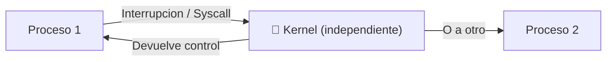
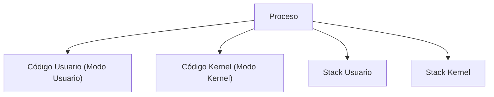

# 📘 Tema 2 — Parte 1: Procesos (Conceptos)

**Materia:** Introducción a los Sistemas Operativos (ISO) — UNLP 2026  
**Temas:** Definición de proceso, Componentes, PCB, Espacio de direcciones, Contexto, Cambio de contexto, Kernel

---

## 🎯 Definición de Proceso

Un proceso es un **programa en ejecución**.

> *"Para nosotros serán sinónimos: tarea, job y proceso."*

En criollo: un programa es un archivo estático guardado en disco. Cuando lo ejecutás, se convierte en un proceso — algo vivo que ocupa memoria, tiene registros y consume CPU.

---

## 📊 Programa vs. Proceso

| Programa | Proceso |
|---|---|
| Es **estático** (vive en disco). | Es **dinámico** (vive en memoria, ejecutándose). |
| No tiene *Program Counter*. | Tiene *Program Counter* (sabe en qué instrucción va). |
| Existe desde que se edita hasta que se borra. | Su ciclo de vida va desde que se solicita ejecutar hasta que termina. |

---

## 🏗️ El Modelo de Proceso (Multiprogramación)

En un entorno de **multiprogramación**, múltiples procesos residen en memoria simultáneamente. El modelo conceptual los considera como **secuenciales e independientes**. Con una sola CPU, **solo un proceso estará activo** en cualquier instante dado.

---

## ⚙️ Componentes de un Proceso

Un proceso (para poder ejecutarse) incluye como mínimo:

| Componente | Descripción |
|---|---|
| **Sección de Código (*Text*)** | Las instrucciones del ejecutable. |
| **Sección de Datos** | Variables globales del programa. |
| **Stack(s) (Pila)** | Datos temporales: parámetros, variables locales y direcciones de retorno. |

### Stacks en Detalle

- Un proceso cuenta con **uno o más stacks** (generalmente: uno para modo Usuario y otro para modo Kernel).
- Se crean automáticamente y su tamaño se ajusta en *run-time*.
- Está formado por **stack frames** que se *pushean* al llamar a una rutina y se *popean* al retornar.
- Cada *stack frame* contiene:
  - Parámetros de la rutina (variables locales).
  - Datos para recuperar el *stack frame* anterior (PC y *Stack Pointer* del momento del llamado).

---

## 👥 Atributos de un Proceso

Cada proceso posee información que lo identifica:
- **PID** (*Process ID*): Identificador único del proceso.
- **PPID** (*Parent Process ID*): ID del proceso padre.
- **Identificación del usuario** que lo "disparó".
- **Grupo** al que pertenece.
- **Terminal** desde la que se ejecutó (en ambientes multiusuario).

---

## 🎯 PCB (Process Control Block)

El PCB es la **estructura de datos** que representa al proceso dentro del Sistema Operativo. Es su **abstracción**.

- Existe **una PCB por proceso**.
- Es lo **primero** que se crea cuando nace el proceso y lo **último** que se borra cuando termina.

### Contenido del PCB

| Campo | Descripción |
|---|---|
| **PID, PPID** | Identificadores del proceso y su padre. |
| **Registros de CPU** | Valores del PC, Acumulador, etc. |
| **Planificación** | Estado actual, prioridad, tiempo consumido en CPU. |
| **Ubicación en memoria** | Dónde residen las secciones del proceso. |
| **Accounting** | Estadísticas de uso de recursos. |
| **Entrada/Salida** | Estado de E/S, operaciones pendientes. |

---

## 🏗️ Espacio de Direcciones

Es el **conjunto de direcciones de memoria** que ocupa el proceso (Stack + Text + Datos).

- **No incluye** su PCB ni tablas mantenidas por el SO.
- En **modo usuario**, un proceso solo puede acceder a **su propio** espacio de direcciones.
- En **modo kernel**, el SO puede acceder a estructuras internas (como el PCB) o a espacios de otros procesos.

---

## ⚙️ Contexto de un Proceso

El contexto incluye **toda la información** que el SO necesita para administrar el proceso, y que la CPU necesita para ejecutarlo correctamente.

Son parte del contexto:
- Registros de la CPU (incluyendo el PC).
- Prioridad del proceso.
- E/S pendientes.
- Estado actual.

---

## ⚙️ Cambio de Contexto (*Context Switch*)

Se produce cuando la CPU **cambia de un proceso a otro**.

**Procedimiento:**
1. Se **resguarda el contexto** del proceso saliente (que pasa a espera).
2. Se **carga el contexto** del nuevo proceso (se reanuda desde la última instrucción ejecutada, guardada en su PC).

> 💡 **Importante:** El cambio de contexto es **tiempo no productivo** de CPU. El tiempo que consume depende del soporte de hardware.

---

## 🏗️ El Kernel del Sistema Operativo

El Kernel es un conjunto de módulos de software que se ejecuta en el procesador. **¿Es un proceso?** No exactamente. Existen dos enfoques de diseño:

### Enfoque 1: Kernel como Entidad Independiente

- El Kernel se ejecuta **fuera de todo proceso**.
- Posee su **propia región de memoria** y su **propio stack**.
- Cuando hay una interrupción o *System Call*, se guarda el contexto del proceso y el control pasa al Kernel.
- Al finalizar, devuelve el control al proceso original u otro.
- **El Kernel NO es un proceso.** Se ejecuta como entidad independiente en modo privilegiado.

### Enfoque 2: Kernel "dentro" del Proceso

- El código del Kernel está **dentro del espacio de direcciones de cada proceso** (es memoria compartida).
- El Kernel se ejecuta en el **mismo contexto** del proceso de usuario.
- Dentro del proceso conviven el código de usuario y el código del SO.
- Cada proceso tiene **dos stacks**: uno para Modo Usuario y otro para Modo Kernel.
- Las interrupciones se atienden en el contexto del proceso actual, pasando a Modo Kernel. Es **más económico** que un cambio de contexto completo.

> 🧠 **Tip para estudiar:** El enfoque 2 es más performante porque evita el context switch completo — solo cambia de modo usuario a modo kernel dentro del mismo proceso.

---

## 📚 Recursos y Referencias

- **Tanenbaum, Andrew S.:** *"Sistemas Operativos Modernos"*.
- **Stallings, William:** *"Sistemas Operativos: Aspectos internos y principios de diseño"*.
