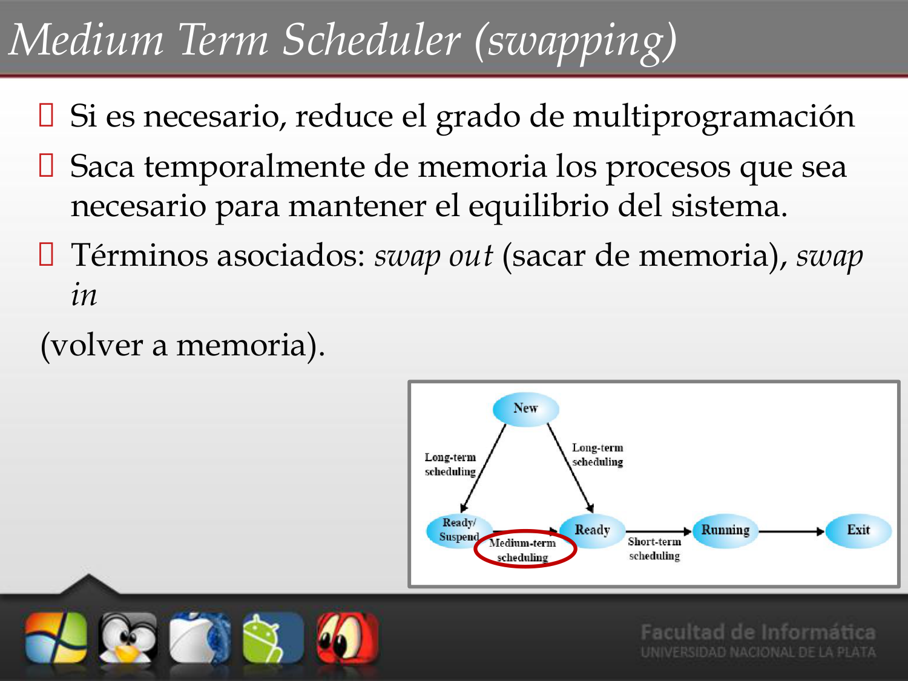
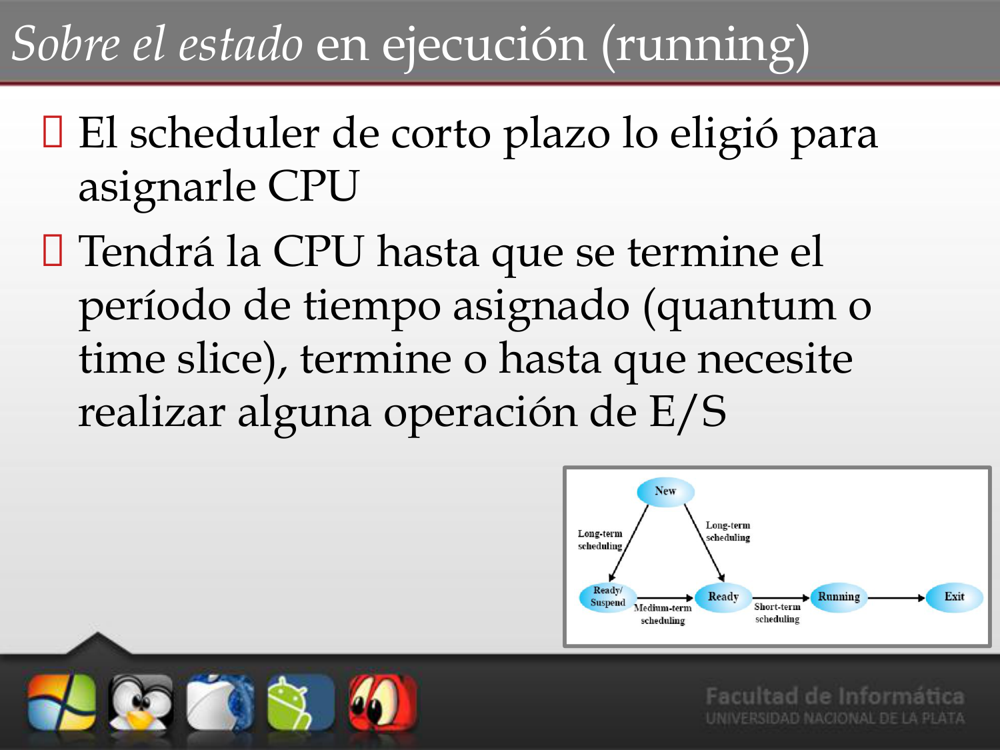

# 📝 Tema 2: Procesos (Parte 2)

**Materia**: Introducción a los Sistemas Operativos (ISO)
**Fuente**: *Sistemas Operativos Modernos* (Tanenbaum) y *Sistemas Operativos* (Stallings)

---

## 1. Colas en la Planificación de Procesos
Para realizar la planificación, el Sistema Operativo utiliza el PCB de cada proceso como una abstracción del mismo. Los PCB se enlazan en **colas** siguiendo un orden determinado:

- **Cola de trabajos (*Job Queue*)**: Contiene los PCB de todos los procesos presentes en el sistema.
- **Cola de procesos listos (*Ready Queue*)**: Contiene los PCB de los procesos que residen en la memoria principal y están listos/esperando para ejecutarse.
- **Cola de dispositivos (*Device/IO Queue*)**: Contiene los PCB de los procesos que están esperando por la disponibilidad o respuesta de un dispositivo de E/S.

## 2. Módulos de la Planificación (Schedulers)
Son módulos de software del Kernel que realizan tareas de planificación ante eventos como la creación/terminación de procesos, sincronización, eventos de E/S o cuando finaliza el quantum de tiempo. 

Su nombre proviene de la frecuencia con la que se ejecutan:
- **Scheduler de Largo Plazo (*Long Term*)**: Controla el grado de multiprogramación (cantidad de procesos en memoria). Elige qué procesos cargar en memoria.
- **Scheduler de Corto Plazo (*Short Term*)**: Determina cuál de los procesos que están en la cola de listos se ejecutará a continuación en la CPU. Este módulo es donde actúa el *algoritmo de planificación*.
- **Scheduler de Medio Plazo (*Medium Term* o *Swapping*)**: Reduce el grado de multiprogramación sacando procesos temporalmente de la memoria hacia el disco (*swap out*), y luego trayéndolos de nuevo a memoria (*swap in*) cuando se estabiliza la saturación.

### Otros Módulos Clave:
- **Dispatcher**: Realiza físicamente el cambio de contexto y salta a ejecutar la instrucción del proceso elegido por el Short Term Scheduler.
- **Loader**: Es el encargado de cargar físicamente en memoria el programa elegido por el Long Term Scheduler.

## 3. Comportamiento de los Procesos
A lo largo de su vida, los procesos alternan ráfagas de uso intenso de CPU y ráfagas de espera por operaciones de E/S. Existen dos tipos de procesos según su comportamiento principal:

- **CPU-bound**: Pasan la mayor parte de su tiempo utilizando la CPU (realizando cálculos).
- **I/O-bound**: Pasan la mayor parte del tiempo esperando por operaciones de E/S (lecturas a disco, red, etc.).

> **Nota:** La CPU es excesivamente rápida comparada con la E/S. Se suele priorizar fuertemente a los procesos *I/O-bound* para que envíen sus peticiones rápidamente al dispositivo (manteniéndolo ocupado), permitiendo luego entregarle de lleno la CPU a los procesos *CPU-bound*.

## 4. Tipos de Algoritmos de Planificación
Dependiendo de cómo gestionan la expulsión de un proceso de la CPU:

- **No Apropiativos (*Non-Preemptive*)**: El proceso conserva el uso de la CPU hasta que decide soltarla por su propia cuenta (por llegar a su fin, llamar a exit, o efectuar una espera bloqueante de I/O). No son interrumpidos por el reloj de sistema.
- **Apropiativos (*Preemptive*)**: Existen situaciones (tiempo consumido o llegada de procesos más prioritarios) donde el proceso actual es obligado a abandonar su ejecución y regresar a la cola de listados.

## 5. Ambientes y Algoritmos de Planificación
Se requiere diferentes algoritmos según el tipo de procesamiento:

### Procesos por Lotes (*Batch*)
- **Características**: No hay usuarios esperando interactivamente. Usan algoritmos *No Apropiativos*.
- **Metas**: Maximizar el rendimiento (procesos por hora) y uso de la CPU, minimizando los tiempos de retorno.
- **Algoritmos Comunes**: FCFS (*First Come First Served*), SJF (*Shortest Job First*).

### Procesos Interactivos
- **Características**: Usuarios o clientes interactivos esperando respuestas rápidas (servidores, sistemas modernos). Necesitan de *Algoritmos Apropiativos* para evitar el acaparamiento de la CPU.
- **Metas**: Minimizar el tiempo de respuesta y mantener la proporcionalidad frente al usuario (las cosas simples como frenar música o mover un mouse deben verse de inmediato).
- **Algoritmos Comunes**: Round Robin, Prioridades, SRTF (*Shortest Remaining Time First*), Colas Multinivel.

## 6. Política vs. Mecanismo
El concepto es fundamental al diseñar sistemas operativos parametrizables:
- **Mecanismo**: Lo implementa el Kernel de forma invisible a nivel lógico. Define *cómo* se hace (por ejemplo, existe un planificador Round Robin por prioridad y provee la system call para modificarlo).
- **Política**: Lo definen los usuarios, procesos o administradores en espacio de usuario. Define *qué* hacer (por ejemplo, definir la prioridad manual de un servicio a un valor más alto usando el comando `nice`).

## 7. Estados de un Proceso y Transiciones
Durante su vida, un proceso transiciona por estados marcados por eventos:

- **New (Nuevo)**: Proceso recién disparado/creado. Se crean sus componentes (PCB), sin cargarse todavía completamente en memoria.
- **Ready (Listo)**: El proceso fue cargado (por el loader) en memoria. Se encola en la *Ready Queue* a la espera de que se le asigne tiempo de CPU.
- **Running (Ejecución)**: El dispatcher le ha cedido la CPU e instrucciones están corriendo física y activamente en el hardware.
- **Waiting / Blocked (Dormido / En Espera)**: Entrar en pausa forzada esperando que finalice un evento de E/S o una señal, sin ocupar espacio de CPU. 
- **Swapping (Swap in/Swap out)**: Cuando un proceso ya sea en *Waiting* o *Ready* es movido temporalmente a una partición de disco para liberar memoria principal muy saturada.
   
  
- **Zombie / Exit**: Ha terminado y el OS liberó los recursos vitales (memoria, sockets). Pero mantiene un "fantasma" del PCB a la espera de que el proceso padre lo verifique ("recoja" el estatus final).

### Transiciones Principales
1. **New → Ready**: Por elección del Long Term Scheduler; carga del Loader temporalmente.
2. **Ready → Running**: Corto Plazo lo elige y el Dispatcher lo ejecuta en CPU.
3. **Running → Waiting**: El proceso realiza una petición bloqueante de I/O voluntaria o duerme.
4. **Waiting → Ready**: Finaliza el evento por el que esperaba. Despierta en la cola de listos.
5. **Running → Ready (Excepción)**: En entornos apropiativos, este cambio ocurre cuando se le agota el tiempo asignado (*quantum*) y se lo interrumpe a la fuerza para regresarlo a la cola.

### Diagrama General de Transiciones (UNIX)

