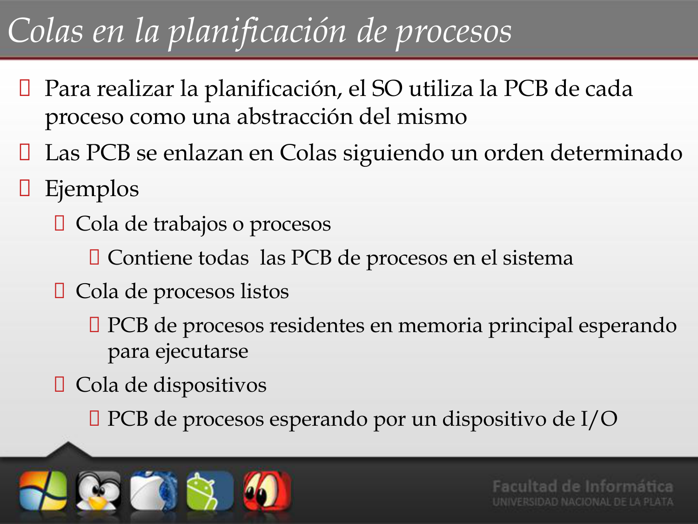
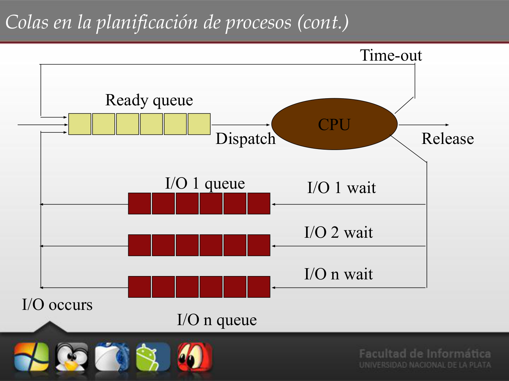
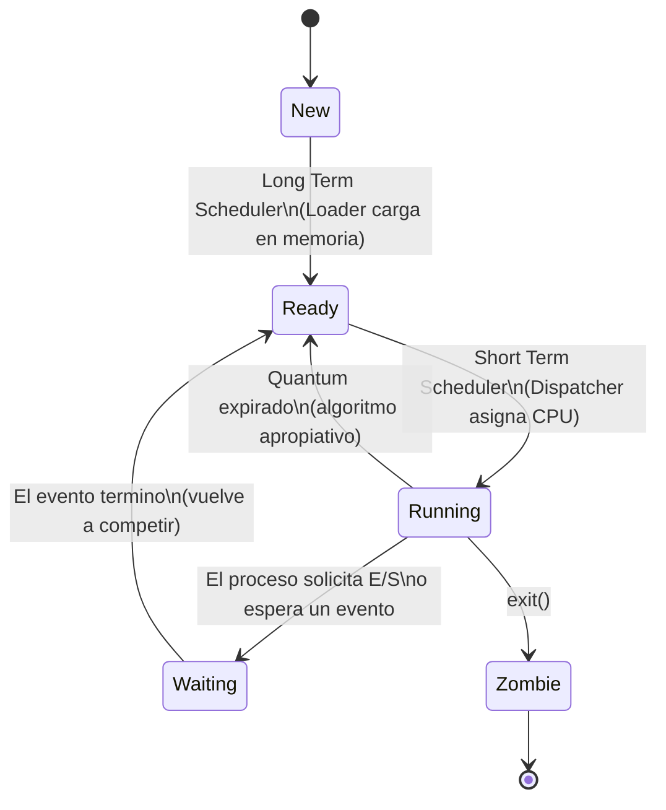
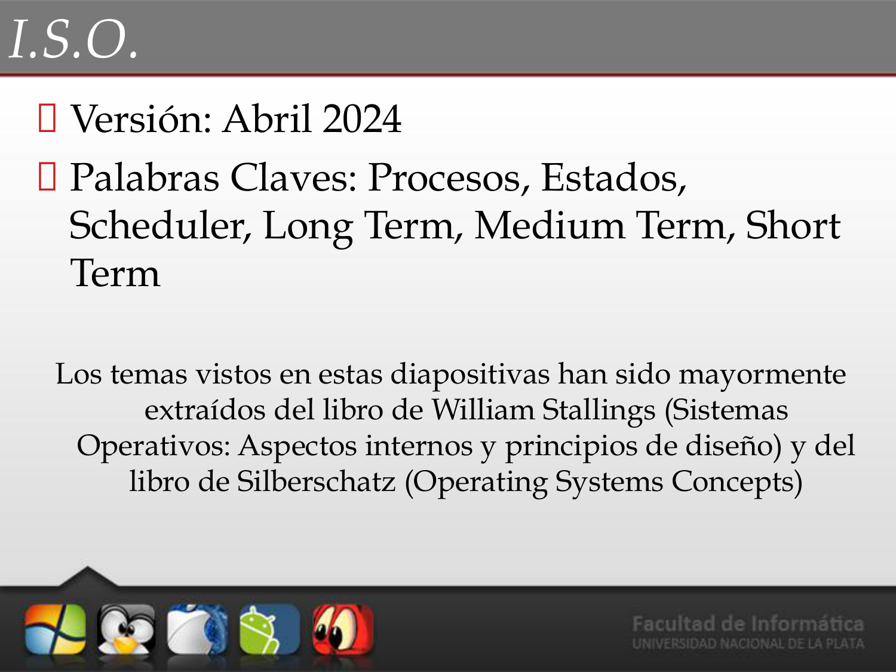
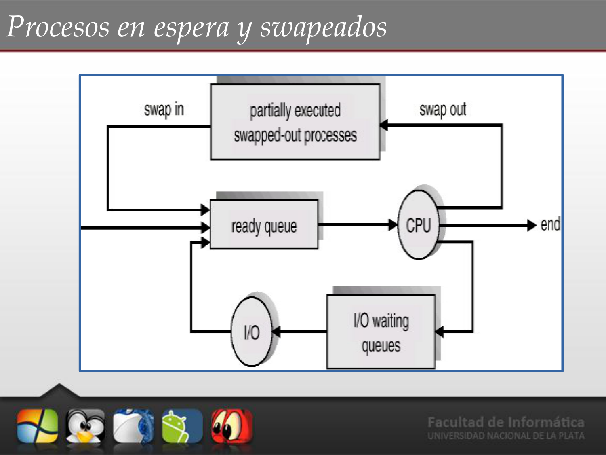
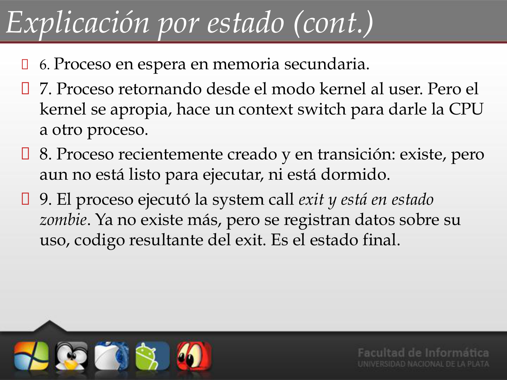

# 📘 Tema 2 — Parte 2: Planificación y Estados de Procesos

**Materia:** Introducción a los Sistemas Operativos (ISO) — UNLP 2026  
**Temas:** Colas de planificación, Schedulers, Comportamiento de procesos, Algoritmos, Política vs Mecanismo, Estados, Transiciones, Swapping

---

## 🏗️ Colas en la Planificación de Procesos

Para realizar la planificación, el SO utiliza el **PCB** de cada proceso como abstracción. Los PCB se enlazan en **colas** siguiendo un orden determinado.

| Cola | Contenido |
|---|---|
| **Cola de trabajos (*Job Queue*)** | Todas las PCB de procesos en el sistema. |
| **Cola de procesos listos (*Ready Queue*)** | PCB de procesos residentes en memoria principal esperando para ejecutarse. |
| **Cola de dispositivos (*Device Queue*)** | PCB de procesos esperando por un dispositivo de E/S. |

---

## ⚙️ Módulos de la Planificación (Schedulers)

Son módulos de **software del Kernel** que realizan tareas de planificación. Se ejecutan ante eventos como: creación/terminación de procesos, eventos de sincronización o E/S, finalización de quantum de tiempo.

Su nombre proviene de la **frecuencia de ejecución**:

| Scheduler | Función |
|---|---|
| **Long Term (Largo Plazo)** | Controla el **grado de multiprogramación** (cantidad de procesos en memoria). Puede no existir y ser absorbido por el Short Term. |
| **Short Term (Corto Plazo)** | Determina cuál de los procesos listos se ejecutará a continuación. Aquí actúa el **algoritmo de planificación**. |
| **Medium Term (Medio Plazo / Swapping)** | Reduce el grado de multiprogramación sacando procesos de memoria temporalmente (*swap out*) y trayéndolos de vuelta (*swap in*). |

### Otros Módulos

| Módulo | Función |
|---|---|
| **Dispatcher** | Realiza el **cambio de contexto**, cambio de modo de ejecución y "despacha" el proceso elegido por el Short Term (salta a la instrucción a ejecutar). |
| **Loader** | **Carga en memoria** el proceso elegido por el Long Term. |

---

## 📊 Comportamiento de los Procesos

Los procesos alternan **ráfagas de CPU** y **ráfagas de E/S** a lo largo de su vida.

| Tipo | Descripción |
|---|---|
| **CPU-bound** | Mayor parte del tiempo **utilizando la CPU** (cálculos intensivos). |
| **I/O-bound** | Mayor parte del tiempo **esperando por E/S** (disco, red, teclado). |

> 💡 **Concepto clave:** La CPU es mucho más rápida que los dispositivos de E/S. Se debe atender rápidamente a los procesos *I/O-bound* para mantener el dispositivo ocupado y aprovechar la CPU para los *CPU-bound*.

---

## 📊 Algoritmos Apropiativos vs. No Apropiativos

| Tipo | Descripción |
|---|---|
| **Apropiativos (*Preemptive*)** | Existen situaciones que hacen que el proceso en ejecución sea **expulsado** de la CPU (por quantum, por prioridad mayor, etc.). |
| **No Apropiativos (*Non-Preemptive*)** | El proceso se ejecuta hasta que **por su propia cuenta** abandone la CPU: termina (`exit`), se bloquea voluntariamente (`wait`, `sleep`), o solicita E/S bloqueante (`read`, `write`). No hay decisiones de planificación durante interrupciones de reloj. |

---

## 📊 Categorías de Algoritmos según el Ambiente

Metas generales de todos los algoritmos:
- **Equidad:** Otorgar una parte justa de CPU a cada proceso.
- **Balance:** Mantener ocupadas todas las partes del sistema.

### Procesos por Lotes (*Batch*)

- No existen usuarios esperando respuesta en una terminal.
- Se pueden utilizar algoritmos **no apropiativos**.
- **Metas:** Maximizar rendimiento (trabajos/hora), minimizar tiempo de retorno, mantener CPU ocupada.

| Algoritmo | Descripción |
|---|---|
| **FCFS** (*First Come First Served*) | Se atiende por orden de llegada. |
| **SJF** (*Shortest Job First*) | Se ejecuta primero el proceso más corto. |

### Procesos Interactivos

- Usuarios o clientes esperando respuestas rápidas (servidores modernos).
- Necesitan algoritmos **apropiativos** para evitar acaparamiento.
- **Metas:** Minimizar tiempo de respuesta, proporcionalidad (si el usuario hace STOP al reproductor, que pare rápido).

| Algoritmo | Descripción |
|---|---|
| **Round Robin** | Reparto equitativo por quantum de tiempo. |
| **Prioridades** | Se atiende primero al de mayor prioridad. |
| **Colas Multinivel** | Varias colas con distintas políticas. |
| **SRTF** (*Shortest Remaining Time First*) | Se ejecuta el que le quede menos tiempo. |

---

## 🔗 Política vs. Mecanismo

El algoritmo de planificación debe estar **parametrizado**:

| Concepto | Descripción |
|---|---|
| **Mecanismo** | Lo implementa el **Kernel**. Define *cómo* se hace (ej: un planificador por prioridades). |
| **Política** | La definen los **usuarios/procesos/administradores**. Define *qué* hacer (ej: usar `nice` para modificar la prioridad de un proceso). |

En criollo: el kernel te da la herramienta (mecanismo), pero vos decidís cómo usarla (política).

---

## 🎯 Estados de un Proceso

| Estado | Descripción |
|---|---|
| **New (Nuevo)** | Proceso recién creado. Se generan las estructuras asociadas (PCB). Queda en espera de ser cargado en memoria. |
| **Ready (Listo)** | El Long Term Scheduler lo eligió y el Loader lo cargó en memoria. Solo necesita que se le **asigne CPU**. Está en la *Ready Queue*. |
| **Running (Ejecución)** | El Short Term Scheduler lo eligió y el Dispatcher le asignó la CPU. Tendrá la CPU hasta que: termine su quantum, termine, o necesite E/S. |
| **Waiting (Espera)** | El proceso necesita que se cumpla un evento (E/S, señal de otro proceso). Sigue en memoria pero **no tiene la CPU**. Al cumplirse el evento, pasa a Ready. |
| **Zombie (Exit)** | El proceso ejecutó `exit()`. Ya no existe operativamente, pero se registran datos sobre su uso y código de retorno. Es el **estado final**. |

---

## ⚙️ Transiciones entre Estados

| Transición | Descripción |
|---|---|
| **New → Ready** | Por elección del Long Term Scheduler: el Loader carga el programa en memoria. |
| **Ready → Running** | Por elección del Short Term Scheduler: el Dispatcher asigna la CPU. |
| **Running → Waiting** | El proceso "se pone a dormir", esperando por un evento. |
| **Waiting → Ready** | Terminó la espera y compite nuevamente por la CPU. |
| **Running → Ready** | **Caso especial** de algoritmos apropiativos: el proceso termina su quantum sin haber necesitado E/S. Es **expulsado contra su voluntad**. |

---

## ⚙️ Medium Term Scheduler (Swapping)

Si es necesario, reduce el grado de multiprogramación:
- **Swap out:** Saca temporalmente de memoria los procesos necesarios.
- **Swap in:** Los vuelve a traer a memoria cuando se estabiliza.

---

## 🏗️ Diagrama de Transiciones UNIX (9 Estados)

El diagrama completo de UNIX incluye 9 estados:

| # | Estado | Descripción |
|---|---|---|
| 1 | Ejecución en modo usuario | El proceso corre instrucciones de usuario. |
| 2 | Ejecución en modo kernel | El proceso ejecuta código del SO. |
| 3 | Listo para ejecutar | En memoria, esperando ser elegido. |
| 4 | En espera (en memoria) | Esperando un evento, reside en RAM. |
| 5 | Listo (swapped) | Listo pero sacado a disco por el swapper. |
| 6 | En espera (swapped) | Esperando un evento, sacado a disco. |
| 7 | Preempted | Retornando de modo kernel a usuario, pero el kernel se apropia y hace context switch. |
| 8 | Creado (new) | Recién creado, en transición: existe pero no está listo ni dormido. |
| 9 | Zombie | Ejecutó `exit()`. Se registran datos sobre su uso. Estado final. |

---

## 📚 Recursos y Referencias

- **Stallings, William:** *"Sistemas Operativos: Aspectos internos y principios de diseño"*.
- **Silberschatz, Galvin, Gagne:** *"Operating Systems Concepts"*.
