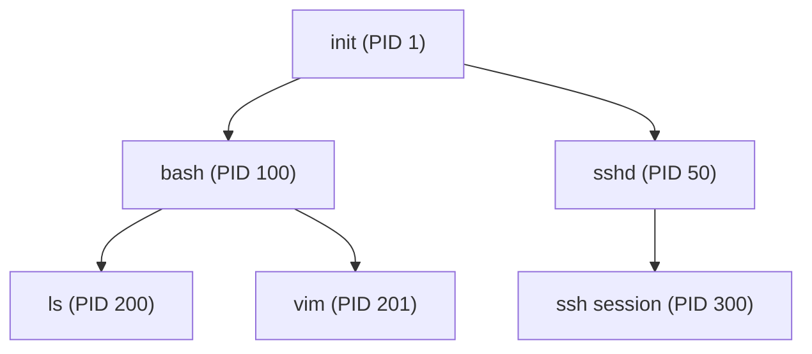
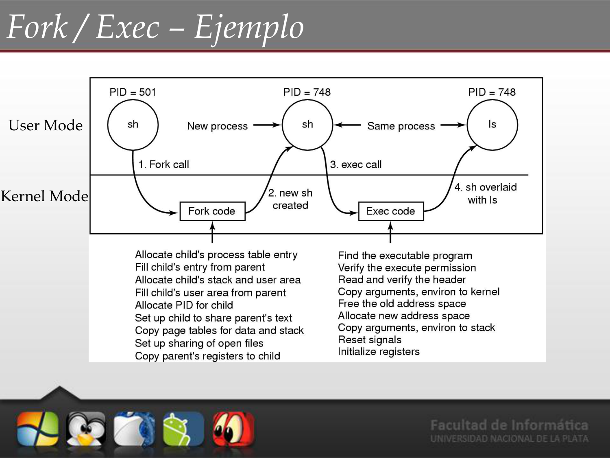
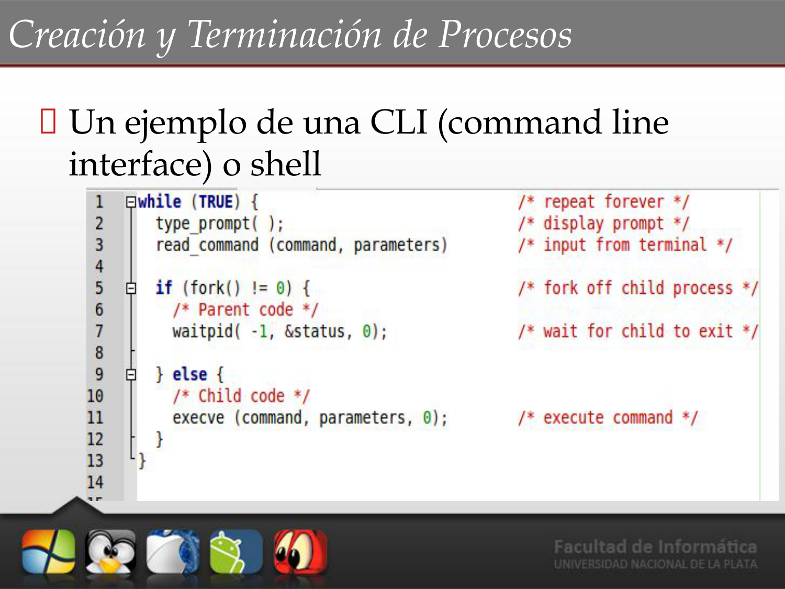
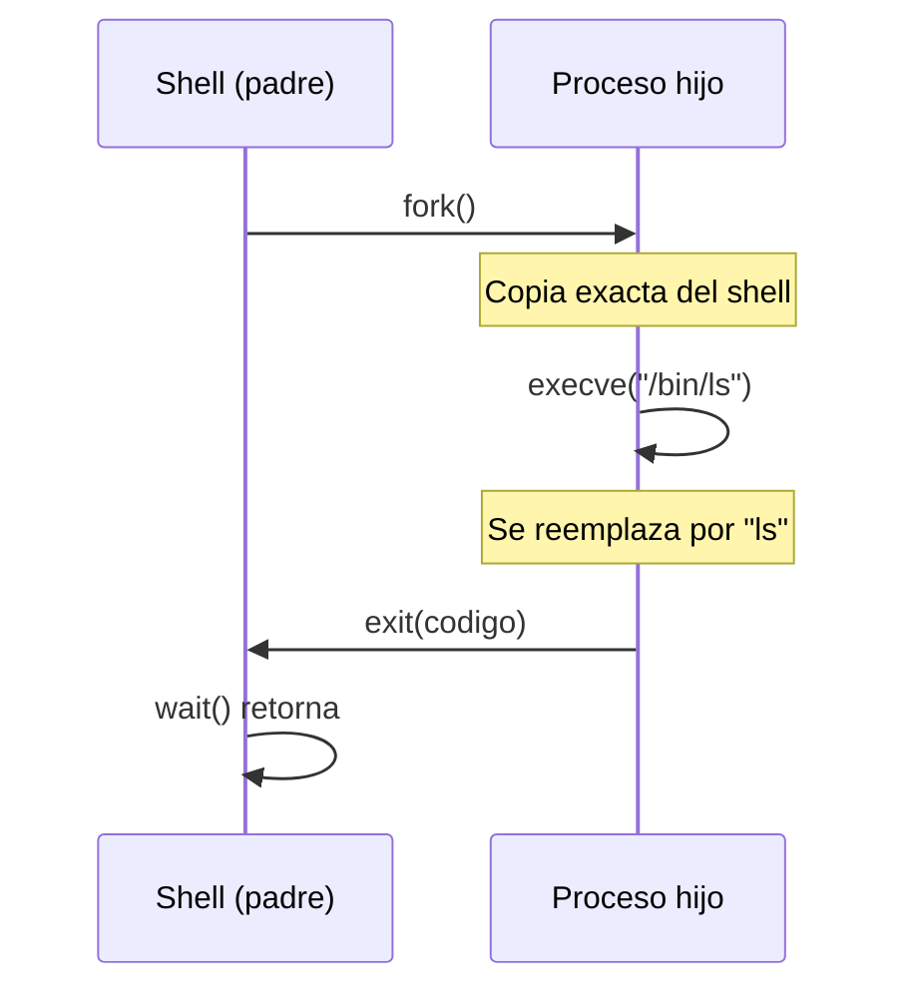
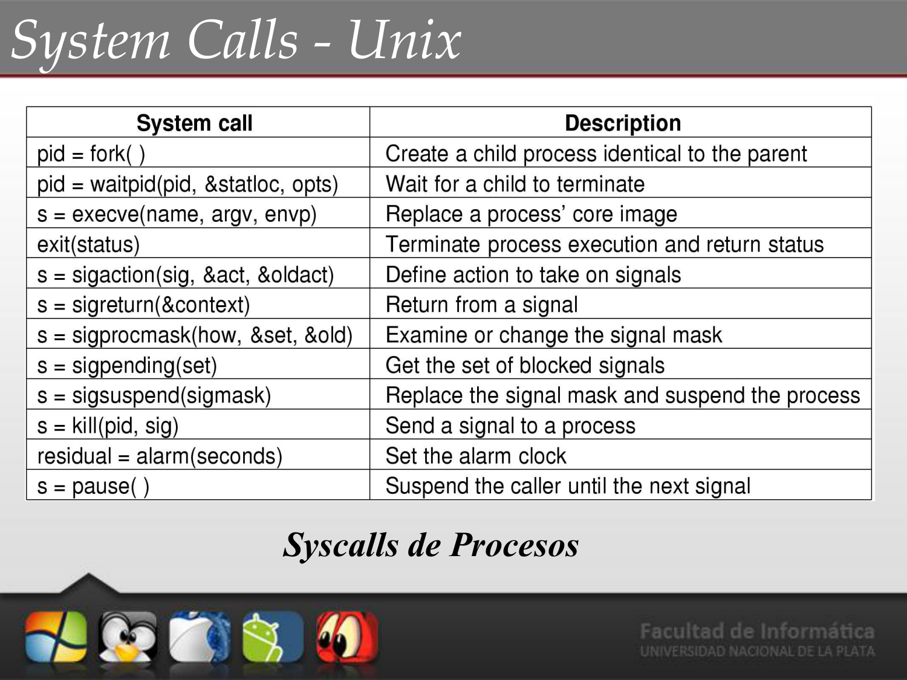
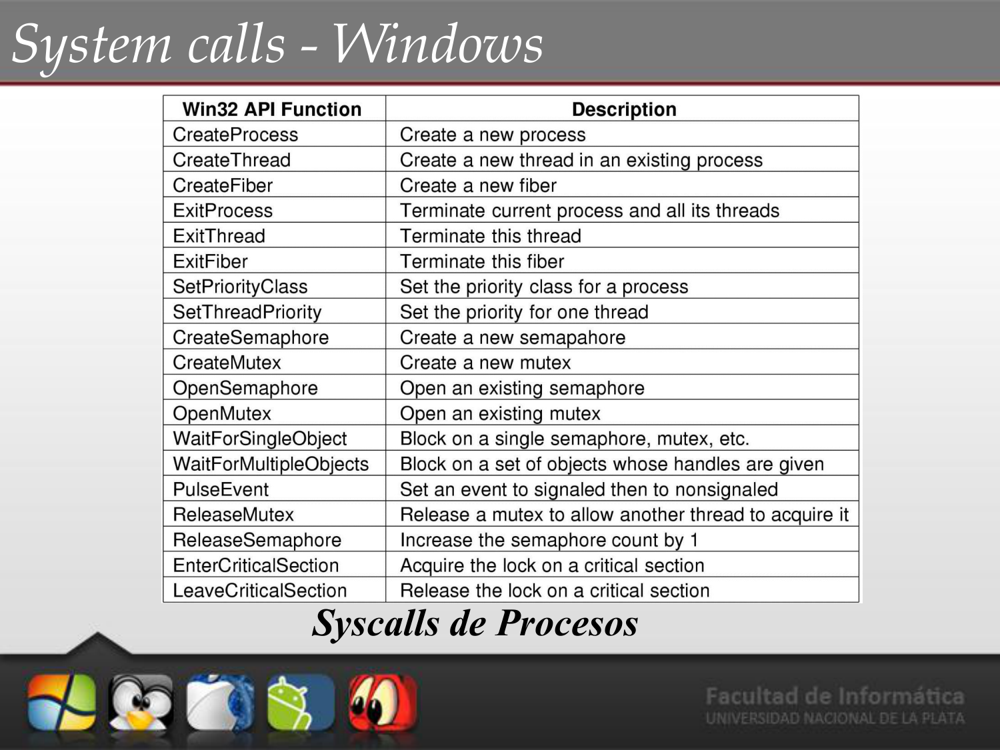

# 📘 Tema 2 — Parte 3: Creación y Terminación de Procesos

**Materia:** Introducción a los Sistemas Operativos (ISO) — UNLP 2026  
**Temas:** Creación de procesos, Relación padre-hijo, fork, execve, wait, exit, CreateProcess, System Calls UNIX/Windows

---

## 🎯 Creación de Procesos

Un proceso **siempre** es creado por otro proceso:
- El creador se llama **proceso padre**.
- El creado se llama **proceso hijo**.
- Se forma un **árbol de procesos** jerárquico.



### Actividades en la Creación

**Procedimiento:**
1. **Crear la PCB** del nuevo proceso.
2. **Asignar un PID** (*Process Identification*) único.
3. **Asignar memoria** para sus regiones (Stack, Text, Datos).
4. **Crear estructuras de datos** asociadas.
5. Copiar el contexto del padre mediante **fork** (regiones de datos, text y stack).

---

## 🔗 Relación entre Padre e Hijo

### Con respecto a la Ejecución

| Opción | Descripción |
|---|---|
| **Concurrente** | El padre **continúa ejecutándose** en paralelo con su hijo. |
| **Secuencial** | El padre **espera** a que el hijo (o hijos) terminen para continuar (usando `wait`). |

### Con respecto al Espacio de Direcciones

| Sistema | Estrategia |
|---|---|
| **UNIX** | El hijo es un **duplicado** del padre. Se crea un nuevo espacio de direcciones **copiando** el del padre. |
| **Windows** | Se crea un proceso con un espacio de direcciones **vacío** y se le carga un programa adentro. |

---

## ⚙️ Creación de Procesos: UNIX vs. Windows

| | UNIX (2 syscalls) | Windows (1 syscall) |
|---|---|---|
| **Llamada** | `fork()` + `execve()` | `CreateProcess()` |
| **¿Qué hace?** | `fork()` crea un proceso **idéntico** al padre. `execve()` carga un nuevo programa en el espacio de direcciones. | Crea un nuevo proceso **y** carga el programa en un solo paso. |

---

## 📦 Ejemplo: ¿Cómo funciona `fork()`?

`fork()` retorna **valores diferentes** según dónde estés:

| Valor de retorno | ¿En quién estoy? |
|---|---|
| `0` | Estoy en el **proceso hijo**. |
| `> 0` (PID del hijo) | Estoy en el **proceso padre**. |
| `< 0` | **Error**: el proceso hijo nunca se creó. |

### Código de Ejemplo

```c
#include <stdio.h>
#include <unistd.h>
#include <sys/wait.h>

int main() {
    pid_t nue;

    nue = fork();       // Se crea un proceso hijo idéntico

    if (nue == 0) {
        // --- Código del HIJO ---
        printf("Soy el hijo, mi PID es %d\n", getpid());
    } else if (nue > 0) {
        // --- Código del PADRE ---
        printf("Soy el padre, mi hijo tiene PID %d\n", nue);
    } else {
        // --- Error en el fork ---
        perror("fork falló");
        return 1;
    }

    return 0;
}
```

En criollo: `fork()` es como una máquina fotocopiadora — crea una copia exacta del proceso. El original (padre) recibe el PID del hijo; la copia (hijo) recibe 0. A partir de ahí, cada uno sigue su camino.


---

## ⚙️ Terminación de Procesos

### Salida voluntaria: `exit()`

Al ejecutar `exit()`, se retorna el control al SO. El proceso padre puede esperar recibir un **código de retorno** usando `wait()`.

### Terminación forzada: `kill()`

El proceso padre puede **terminar la ejecución** de sus hijos:
- La tarea asignada al hijo se terminó.
- Cuando el padre termina, habitualmente **no se permite a los hijos continuar** → **Terminación en cascada**.

---

## 📦 Ejemplo: `fork()` + `wait()` + `exit()`



En este patrón:
1. El padre hace `fork()` para crear al hijo.
2. El padre hace `wait()` para esperar que el hijo termine.
3. El hijo hace su trabajo y ejecuta `exit()`.
4. El padre recibe el código de retorno y continúa.

---

## 📦 Ejemplo: `fork()` + `exec()` (Shell)

Este es el patrón que usa una **CLI (Shell)**:

1. El shell hace `fork()` para crear un proceso hijo.
2. El hijo hace `execve()` para reemplazar su código con el del programa solicitado (ej: `ls`, `cat`, etc.).
3. El shell (padre) hace `wait()` para esperar que el comando termine.





En criollo: el Shell se clona a sí mismo, el clon cambia de identidad (pasa a ser `ls` o lo que sea), lo ejecuta, muere, y el shell original sigue esperando el próximo comando.

---

## 📊 System Calls de Procesos: UNIX vs. Windows





| Operación | UNIX | Windows |
|---|---|---|
| Crear proceso | `fork()` | `CreateProcess()` |
| Reemplazar programa | `execve()` | — (incluido en `CreateProcess`) |
| Esperar al hijo | `wait()` / `waitpid()` | `WaitForSingleObject()` |
| Terminar proceso | `exit()` | `ExitProcess()` |
| Enviar señal / matar | `kill()` | `TerminateProcess()` |
| Obtener PID | `getpid()` | `GetCurrentProcessId()` |

---

## 📚 Recursos y Referencias

- **Tanenbaum, Andrew S.:** *"Sistemas Operativos Modernos"*.
