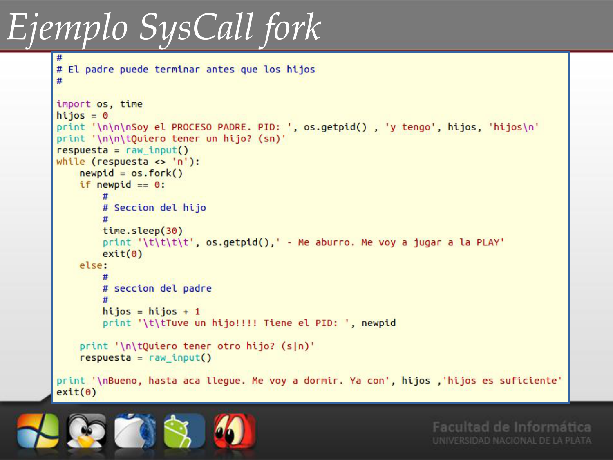
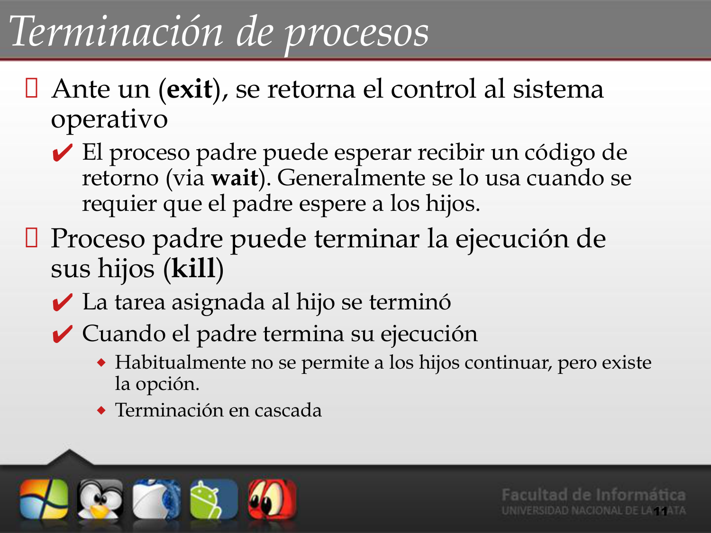

# 📝 Tema 2: Procesos (Parte 3)

**Materia**: Introducción a los Sistemas Operativos (ISO)
**Fuente**: *Sistemas Operativos Modernos* (Tanenbaum)

---

## 1. Creación de Procesos
En un sistema operativo moderno, **un proceso siempre es creado por otro proceso preexistente**. El proceso creador se denomina **padre** y el nuevo proceso se denomina **hijo**. Esto deriva en la conformación de un *árbol jerárquico de procesos*.

### Actividades del Sistema Operativo en la Creación:
- Crear un nuevo bloque de control (PCB) para el proceso.
- Asignarle un **PID** (*Process IDentification*) único.
- Asignarle memoria para sus diferentes regiones lógicas (Stack, Datos y Texto).
- Crear de las estructuras de datos asociadas en base al proceso padre.

## 2. Relación entre Procesos Padre e Hijo
La relación se puede analizar de dos maneras clave:

### Con respecto a la Ejecución
Existen dos grandes posibilidades cuando el padre tiene un hijo:
1. El padre **continúa ejecutándose concurrentemente** (en paralelo) a su nuevo proceso hijo.
2. El padre se bloquea y se queda dormido esperando a que termine la ejecución del hijo primero.

### Con respecto al Espacio de Direcciones
1. **UNIX (Duplicación)**: El proceso hijo nace como un clon directo del proceso padre y se crea su espacio de direcciones **copiando completamente el del padre**.
2. **Windows (Nuevo Espacio)**: Se crea en blanco un nuevo espacio de direcciones independiente para el nuevo proceso, y se le carga directamente un programa desde cero.

## 3. System Calls de Creación (UNIX vs Windows)

### UNIX: Implementación en 2 Pasos
En UNIX la creación requiere dos syscalls distintas:
1. `fork()`: Crea un proceso nuevo que es **idéntico al proceso llamador**. El hijo clonado será inicialmente indistinguible del padre, excepto por su identificador único (PID).
2. `execve()`: Usualmente se invoca inmediatamente después del `fork()`. Sirve para sobreescribir el espacio de memoria (text, data y stack) del clon hijo con un archivo ejecutable (programa nuevo), inyectando el código para separarse definitivamente del ciclo del padre.

### Windows: Implementación en 1 Paso
- `CreateProcess()`: Realiza el equivalente a ambas en un solo movimiento. Crea el bloque de proceso y lo rellena con un programa desde un inicio.

## 4. Profundización: ¿Cómo funciona `fork()`?
Al invocar `fork()`, el hilo de ejecución original se "parte" en dos ramas.
La llamada retorna algo a *ambos procesos a la vez*:
- Si retorna `0`: Esa bifurcación sabe que es el hilo **hijo**.
- Si retorna un número `>`, `0`: Es el PID que corresponde al **padre** (le indica el identificador de su nuevo bebé).
- Si da un valor negativo `< 0`: Ocurrió un error en la solicitud y el hijo nunca se llegó a crear.

### Diagrama de Ejecución

## 5. Terminación de Procesos
Existen factores explícitos para eliminar un proceso del OS:

- `exit()`: El proceso terminó su ejecución deseada o tuvo una falla grave, y el control retorna al OS. Generalmente retorna un código de salida *(exit code)* informando si la finalización fue exitosa o no.
- `wait()`: El proceso padre usa esta system call para pausar la ejecución *esperando el código de retorno explícito de exit()* de sus procesos hijos y verificar que finalizaron de manera limpia.
- `kill()`: Permite abortar a otros procesos (si se tienen los permisos). Muchas veces el padre puede forzar la terminación temprana de la vida del hijo (por ejemplo, si presiona "Cancelar" o la tarea ya no le es requerida).
   - *Nota*: La muerte del padre, dependiendo del sistema, puede significar la "muerte en cascada" irremediable de los hijos, o la reasignación de los mismos (dejándolos huérfanos hasta que sean capturados por el proceso init central).
