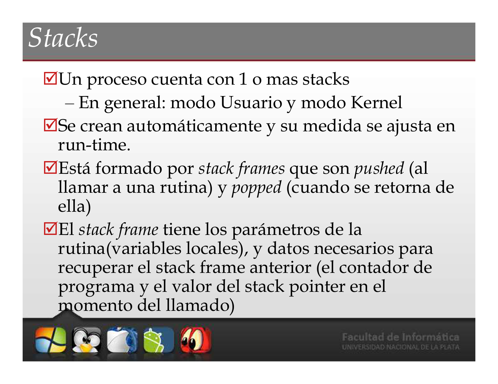
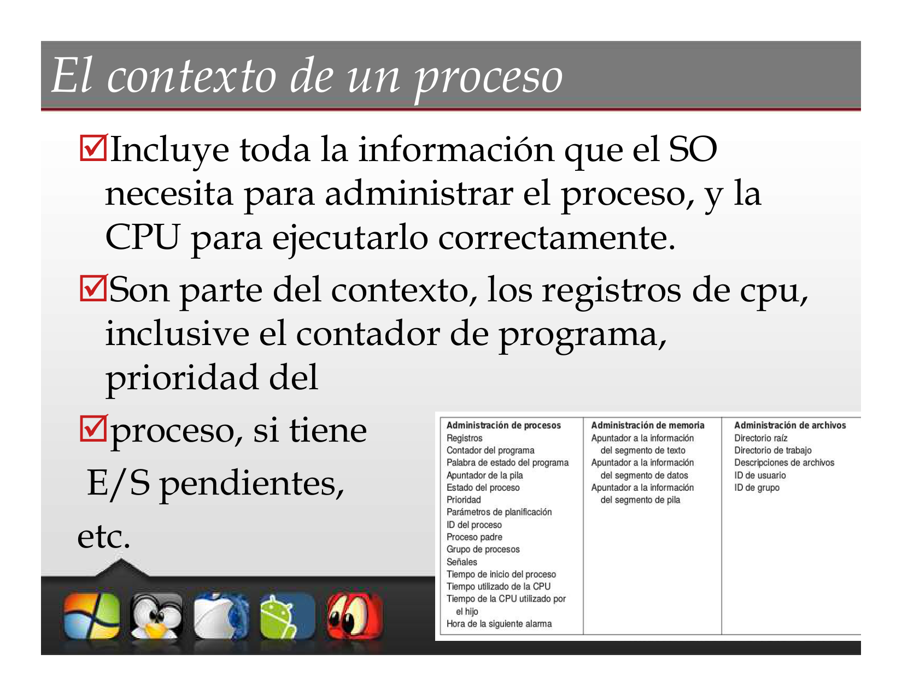
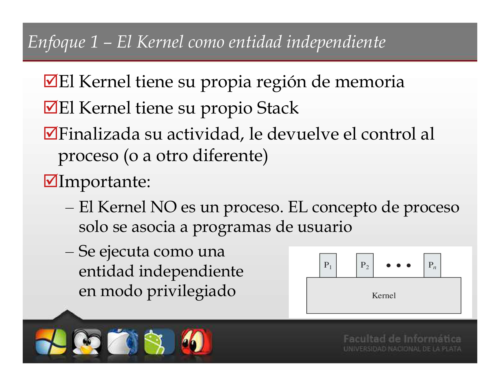
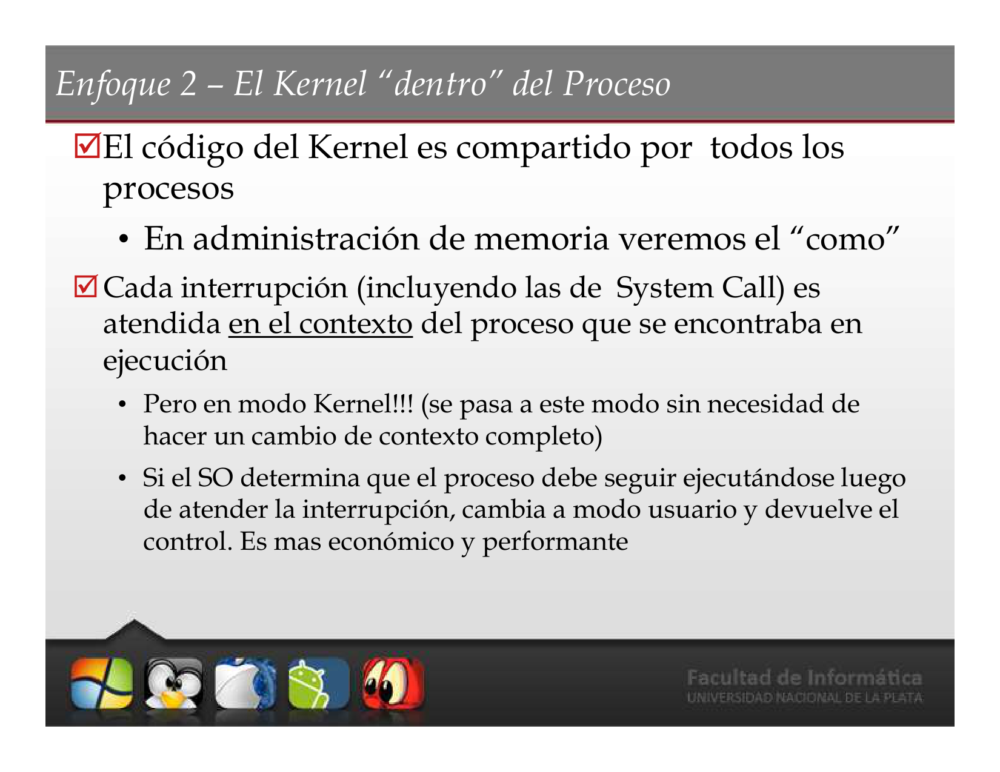
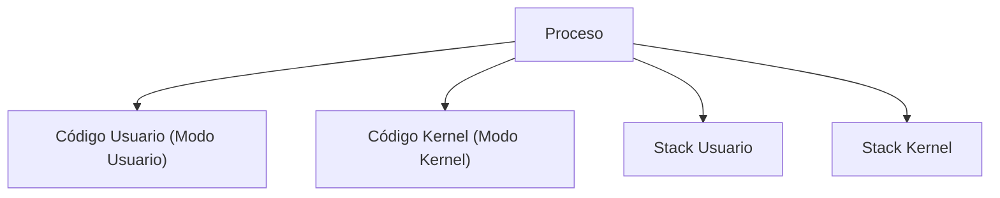
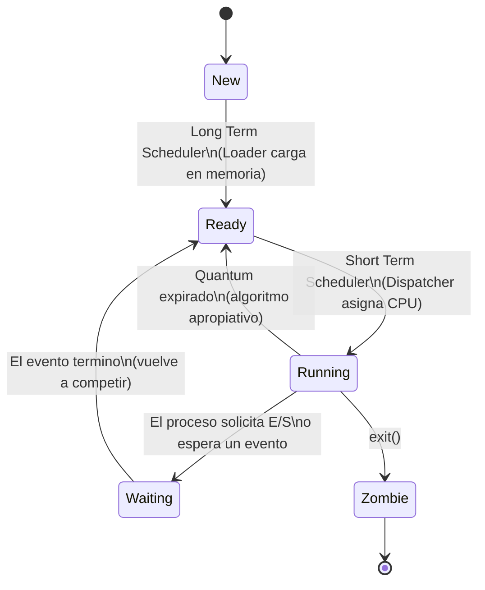
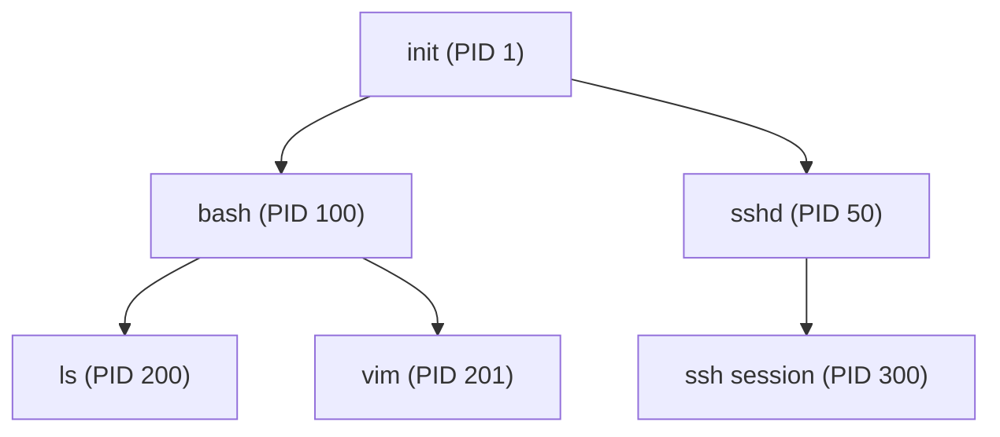
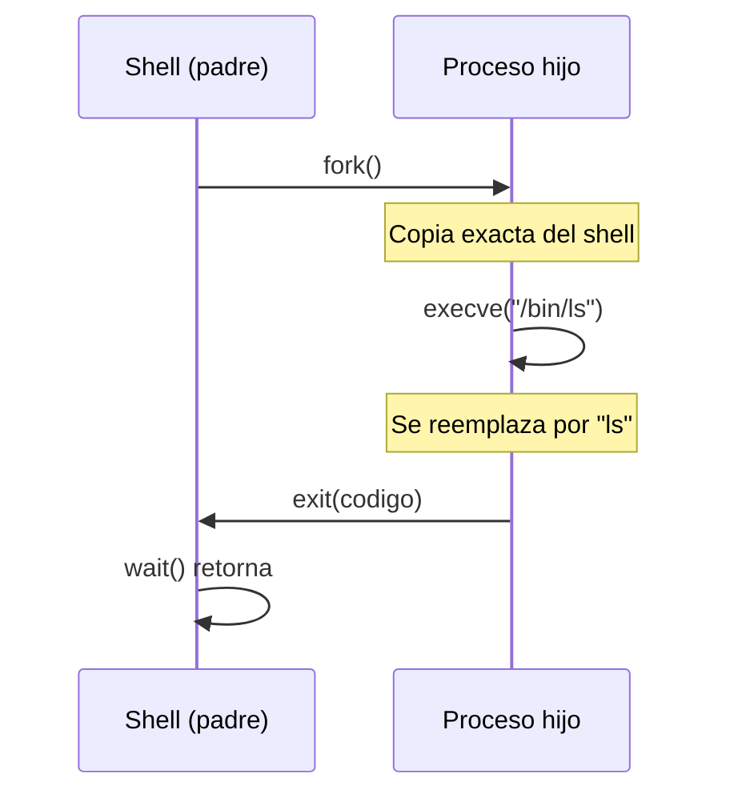

# 📘 Tema 2: Procesos

**Materia:** Introducción a los Sistemas Operativos (ISO) — UNLP 2026
**Temas:** Definición de proceso, PCB, Contexto, Schedulers, Estados y Transiciones, fork, exec

---

<details>
<summary><b>🔄 Parte 1: Procesos (Conceptos, PCB, Cambio de Contexto)</b></summary>

## 🎯 Definición de Proceso

Un proceso es un **programa en ejecución**.

> *"Para nosotros serán sinónimos: tarea, job y proceso."*

En criollo: un programa es un archivo estático guardado en disco. Cuando lo ejecutás, se convierte en un proceso — algo vivo que ocupa memoria, tiene registros y consume CPU.

---

## 📊 Programa vs. Proceso

| Programa | Proceso |
|---|---|
| Es **estático** (vive en disco). | Es **dinámico** (vive en memoria, ejecutándose). |
| No tiene *Program Counter*. | Tiene *Program Counter* (sabe en qué instrucción va). |
| Existe desde que se edita hasta que se borra. | Su ciclo de vida va desde que se solicita ejecutar hasta que termina. |

---

## 🏗️ El Modelo de Proceso (Multiprogramación)

En un entorno de **multiprogramación**, múltiples procesos residen en memoria simultáneamente. El modelo conceptual los considera como **secuenciales e independientes**. Con una sola CPU, **solo un proceso estará activo** en cualquier instante dado.



---

## ⚙️ Componentes de un Proceso

Un proceso (para poder ejecutarse) incluye como mínimo:

| Componente | Descripción |
|---|---|
| **Sección de Código (*Text*)** | Las instrucciones del ejecutable. |
| **Sección de Datos** | Variables globales del programa. |
| **Stack(s) (Pila)** | Datos temporales: parámetros, variables locales y direcciones de retorno. |

### Stacks en Detalle

- Un proceso cuenta con **uno o más stacks** (generalmente: uno para modo Usuario y otro para modo Kernel).
- Se crean automáticamente y su tamaño se ajusta en *run-time*.
- Está formado por **stack frames** que se *pushean* al llamar a una rutina y se *popean* al retornar.
- Cada *stack frame* contiene:
  - Parámetros de la rutina (variables locales).
  - Datos para recuperar el *stack frame* anterior (PC y *Stack Pointer* del momento del llamado).

---

## 👥 Atributos de un Proceso

Cada proceso posee información que lo identifica:
- **PID** (*Process ID*): Identificador único del proceso.
- **PPID** (*Parent Process ID*): ID del proceso padre.
- **Identificación del usuario** que lo "disparó".
- **Grupo** al que pertenece.
- **Terminal** desde la que se ejecutó (en ambientes multiusuario).

---

## 🎯 PCB (Process Control Block)

El PCB es la **estructura de datos** que representa al proceso dentro del Sistema Operativo. Es su **abstracción**.

- Existe **una PCB por proceso**.
- Es lo **primero** que se crea cuando nace el proceso y lo **último** que se borra cuando termina.

### Contenido del PCB

| Campo | Descripción |
|---|---|
| **PID, PPID** | Identificadores del proceso y su padre. |
| **Registros de CPU** | Valores del PC, Acumulador, etc. |
| **Planificación** | Estado actual, prioridad, tiempo consumido en CPU. |
| **Ubicación en memoria** | Dónde residen las secciones del proceso. |
| **Accounting** | Estadísticas de uso de recursos. |
| **Entrada/Salida** | Estado de E/S, operaciones pendientes. |



---

## 🏗️ Espacio de Direcciones

Es el **conjunto de direcciones de memoria** que ocupa el proceso (Stack + Text + Datos).

- **No incluye** su PCB ni tablas mantenidas por el SO.
- En **modo usuario**, un proceso solo puede acceder a **su propio** espacio de direcciones.
- En **modo kernel**, el SO puede acceder a estructuras internas (como el PCB) o a espacios de otros procesos.



---

## ⚙️ Contexto de un Proceso

El contexto incluye **toda la información** que el SO necesita para administrar el proceso, y que la CPU necesita para ejecutarlo correctamente.

Son parte del contexto:
- Registros de la CPU (incluyendo el PC).
- Prioridad del proceso.
- E/S pendientes.
- Estado actual.

---

## ⚙️ Cambio de Contexto (*Context Switch*)

Se produce cuando la CPU **cambia de un proceso a otro**.

**Procedimiento:**
1. Se **resguarda el contexto** del proceso saliente (que pasa a espera).
2. Se **carga el contexto** del nuevo proceso (se reanuda desde la última instrucción ejecutada, guardada en su PC).

> 💡 **Importante:** El cambio de contexto es **tiempo no productivo** de CPU. El tiempo que consume depende del soporte de hardware.



---

## 🏗️ El Kernel del Sistema Operativo

El Kernel es un conjunto de módulos de software que se ejecuta en el procesador. **¿Es un proceso?** No exactamente. Existen dos enfoques de diseño:

### Enfoque 1: Kernel como Entidad Independiente

- El Kernel se ejecuta **fuera de todo proceso**.
- Posee su **propia región de memoria** y su **propio stack**.
- Cuando hay una interrupción o *System Call*, se guarda el contexto del proceso y el control pasa al Kernel.
- Al finalizar, devuelve el control al proceso original u otro.
- **El Kernel NO es un proceso.** Se ejecuta como entidad independiente en modo privilegiado.


### Enfoque 2: Kernel "dentro" del Proceso

- El código del Kernel está **dentro del espacio de direcciones de cada proceso** (es memoria compartida).
- El Kernel se ejecuta en el **mismo contexto** del proceso de usuario.
- Dentro del proceso conviven el código de usuario y el código del SO.
- Cada proceso tiene **dos stacks**: uno para Modo Usuario y otro para Modo Kernel.
- Las interrupciones se atienden en el contexto del proceso actual, pasando a Modo Kernel. Es **más económico** que un cambio de contexto completo.



> 🧠 **Tip para estudiar:** El enfoque 2 es más performante porque evita el context switch completo — solo cambia de modo usuario a modo kernel dentro del mismo proceso.

---

## 📚 Recursos y Referencias

- **Tanenbaum, Andrew S.:** *"Sistemas Operativos Modernos"*.
- **Stallings, William:** *"Sistemas Operativos: Aspectos internos y principios de diseño"*.


</details>

---

<details>
<summary><b>⏳ Parte 2: Planificación y Estados de Procesos</b></summary>

## 🏗️ Colas en la Planificación de Procesos

Para realizar la planificación, el SO utiliza el **PCB** de cada proceso como abstracción. Los PCB se enlazan en **colas** siguiendo un orden determinado.

| Cola | Contenido |
|---|---|
| **Cola de trabajos (*Job Queue*)** | Todas las PCB de procesos en el sistema. |
| **Cola de procesos listos (*Ready Queue*)** | PCB de procesos residentes en memoria principal esperando para ejecutarse. |
| **Cola de dispositivos (*Device Queue*)** | PCB de procesos esperando por un dispositivo de E/S. |


---

## ⚙️ Módulos de la Planificación (Schedulers)

Son módulos de **software del Kernel** que realizan tareas de planificación. Se ejecutan ante eventos como: creación/terminación de procesos, eventos de sincronización o E/S, finalización de quantum de tiempo.

Su nombre proviene de la **frecuencia de ejecución**:

| Scheduler | Función |
|---|---|
| **Long Term (Largo Plazo)** | Controla el **grado de multiprogramación** (cantidad de procesos en memoria). Puede no existir y ser absorbido por el Short Term. |
| **Short Term (Corto Plazo)** | Determina cuál de los procesos listos se ejecutará a continuación. Aquí actúa el **algoritmo de planificación**. |
| **Medium Term (Medio Plazo / Swapping)** | Reduce el grado de multiprogramación sacando procesos de memoria temporalmente (*swap out*) y trayéndolos de vuelta (*swap in*). |

### Otros Módulos

| Módulo | Función |
|---|---|
| **Dispatcher** | Realiza el **cambio de contexto**, cambio de modo de ejecución y "despacha" el proceso elegido por el Short Term (salta a la instrucción a ejecutar). |
| **Loader** | **Carga en memoria** el proceso elegido por el Long Term. |

---

## 📊 Comportamiento de los Procesos

Los procesos alternan **ráfagas de CPU** y **ráfagas de E/S** a lo largo de su vida.

| Tipo | Descripción |
|---|---|
| **CPU-bound** | Mayor parte del tiempo **utilizando la CPU** (cálculos intensivos). |
| **I/O-bound** | Mayor parte del tiempo **esperando por E/S** (disco, red, teclado). |

> 💡 **Concepto clave:** La CPU es mucho más rápida que los dispositivos de E/S. Se debe atender rápidamente a los procesos *I/O-bound* para mantener el dispositivo ocupado y aprovechar la CPU para los *CPU-bound*.

---

## 📊 Algoritmos Apropiativos vs. No Apropiativos

| Tipo | Descripción |
|---|---|
| **Apropiativos (*Preemptive*)** | Existen situaciones que hacen que el proceso en ejecución sea **expulsado** de la CPU (por quantum, por prioridad mayor, etc.). |
| **No Apropiativos (*Non-Preemptive*)** | El proceso se ejecuta hasta que **por su propia cuenta** abandone la CPU: termina (`exit`), se bloquea voluntariamente (`wait`, `sleep`), o solicita E/S bloqueante (`read`, `write`). No hay decisiones de planificación durante interrupciones de reloj. |

---

## 📊 Categorías de Algoritmos según el Ambiente

Metas generales de todos los algoritmos:
- **Equidad:** Otorgar una parte justa de CPU a cada proceso.
- **Balance:** Mantener ocupadas todas las partes del sistema.

### Procesos por Lotes (*Batch*)

- No existen usuarios esperando respuesta en una terminal.
- Se pueden utilizar algoritmos **no apropiativos**.
- **Metas:** Maximizar rendimiento (trabajos/hora), minimizar tiempo de retorno, mantener CPU ocupada.

| Algoritmo | Descripción |
|---|---|
| **FCFS** (*First Come First Served*) | Se atiende por orden de llegada. |
| **SJF** (*Shortest Job First*) | Se ejecuta primero el proceso más corto. |

### Procesos Interactivos

- Usuarios o clientes esperando respuestas rápidas (servidores modernos).
- Necesitan algoritmos **apropiativos** para evitar acaparamiento.
- **Metas:** Minimizar tiempo de respuesta, proporcionalidad (si el usuario hace STOP al reproductor, que pare rápido).

| Algoritmo | Descripción |
|---|---|
| **Round Robin** | Reparto equitativo por quantum de tiempo. |
| **Prioridades** | Se atiende primero al de mayor prioridad. |
| **Colas Multinivel** | Varias colas con distintas políticas. |
| **SRTF** (*Shortest Remaining Time First*) | Se ejecuta el que le quede menos tiempo. |

---

## 🔗 Política vs. Mecanismo

El algoritmo de planificación debe estar **parametrizado**:

| Concepto | Descripción |
|---|---|
| **Mecanismo** | Lo implementa el **Kernel**. Define *cómo* se hace (ej: un planificador por prioridades). |
| **Política** | La definen los **usuarios/procesos/administradores**. Define *qué* hacer (ej: usar `nice` para modificar la prioridad de un proceso). |

En criollo: el kernel te da la herramienta (mecanismo), pero vos decidís cómo usarla (política).

---

## 🎯 Estados de un Proceso



| Estado | Descripción |
|---|---|
| **New (Nuevo)** | Proceso recién creado. Se generan las estructuras asociadas (PCB). Queda en espera de ser cargado en memoria. |
| **Ready (Listo)** | El Long Term Scheduler lo eligió y el Loader lo cargó en memoria. Solo necesita que se le **asigne CPU**. Está en la *Ready Queue*. |
| **Running (Ejecución)** | El Short Term Scheduler lo eligió y el Dispatcher le asignó la CPU. Tendrá la CPU hasta que: termine su quantum, termine, o necesite E/S. |
| **Waiting (Espera)** | El proceso necesita que se cumpla un evento (E/S, señal de otro proceso). Sigue en memoria pero **no tiene la CPU**. Al cumplirse el evento, pasa a Ready. |
| **Zombie (Exit)** | El proceso ejecutó `exit()`. Ya no existe operativamente, pero se registran datos sobre su uso y código de retorno. Es el **estado final**. |


---

## ⚙️ Transiciones entre Estados

| Transición | Descripción |
|---|---|
| **New → Ready** | Por elección del Long Term Scheduler: el Loader carga el programa en memoria. |
| **Ready → Running** | Por elección del Short Term Scheduler: el Dispatcher asigna la CPU. |
| **Running → Waiting** | El proceso "se pone a dormir", esperando por un evento. |
| **Waiting → Ready** | Terminó la espera y compite nuevamente por la CPU. |
| **Running → Ready** | **Caso especial** de algoritmos apropiativos: el proceso termina su quantum sin haber necesitado E/S. Es **expulsado contra su voluntad**. |

---

## ⚙️ Medium Term Scheduler (Swapping)

Si es necesario, reduce el grado de multiprogramación:
- **Swap out:** Saca temporalmente de memoria los procesos necesarios.
- **Swap in:** Los vuelve a traer a memoria cuando se estabiliza.


---

## 🏗️ Diagrama de Transiciones UNIX (9 Estados)

El diagrama completo de UNIX incluye 9 estados:

| # | Estado | Descripción |
|---|---|---|
| 1 | Ejecución en modo usuario | El proceso corre instrucciones de usuario. |
| 2 | Ejecución en modo kernel | El proceso ejecuta código del SO. |
| 3 | Listo para ejecutar | En memoria, esperando ser elegido. |
| 4 | En espera (en memoria) | Esperando un evento, reside en RAM. |
| 5 | Listo (swapped) | Listo pero sacado a disco por el swapper. |
| 6 | En espera (swapped) | Esperando un evento, sacado a disco. |
| 7 | Preempted | Retornando de modo kernel a usuario, pero el kernel se apropia y hace context switch. |
| 8 | Creado (new) | Recién creado, en transición: existe pero no está listo ni dormido. |
| 9 | Zombie | Ejecutó `exit()`. Se registran datos sobre su uso. Estado final. |


---

## 📚 Recursos y Referencias

- **Stallings, William:** *"Sistemas Operativos: Aspectos internos y principios de diseño"*.
- **Silberschatz, Galvin, Gagne:** *"Operating Systems Concepts"*.


</details>

---

<details>
<summary><b>⚙️ Parte 3: Creación y Terminación de Procesos (fork, exec, wait, exit)</b></summary>

## 🎯 Creación de Procesos

Un proceso **siempre** es creado por otro proceso:
- El creador se llama **proceso padre**.
- El creado se llama **proceso hijo**.
- Se forma un **árbol de procesos** jerárquico.



### Actividades en la Creación

**Procedimiento:**
1. **Crear la PCB** del nuevo proceso.
2. **Asignar un PID** (*Process Identification*) único.
3. **Asignar memoria** para sus regiones (Stack, Text, Datos).
4. **Crear estructuras de datos** asociadas.
5. Copiar el contexto del padre mediante **fork** (regiones de datos, text y stack).

---

## 🔗 Relación entre Padre e Hijo

### Con respecto a la Ejecución

| Opción | Descripción |
|---|---|
| **Concurrente** | El padre **continúa ejecutándose** en paralelo con su hijo. |
| **Secuencial** | El padre **espera** a que el hijo (o hijos) terminen para continuar (usando `wait`). |

### Con respecto al Espacio de Direcciones

| Sistema | Estrategia |
|---|---|
| **UNIX** | El hijo es un **duplicado** del padre. Se crea un nuevo espacio de direcciones **copiando** el del padre. |
| **Windows** | Se crea un proceso con un espacio de direcciones **vacío** y se le carga un programa adentro. |

---

## ⚙️ Creación de Procesos: UNIX vs. Windows

| | UNIX (2 syscalls) | Windows (1 syscall) |
|---|---|---|
| **Llamada** | `fork()` + `execve()` | `CreateProcess()` |
| **¿Qué hace?** | `fork()` crea un proceso **idéntico** al padre. `execve()` carga un nuevo programa en el espacio de direcciones. | Crea un nuevo proceso **y** carga el programa en un solo paso. |

---

## 📦 Ejemplo: ¿Cómo funciona `fork()`?

`fork()` retorna **valores diferentes** según dónde estés:

| Valor de retorno | ¿En quién estoy? |
|---|---|
| `0` | Estoy en el **proceso hijo**. |
| `> 0` (PID del hijo) | Estoy en el **proceso padre**. |
| `< 0` | **Error**: el proceso hijo nunca se creó. |

### Código de Ejemplo

```c
#include <stdio.h>
#include <unistd.h>
#include <sys/wait.h>

int main() {
    pid_t nue;

    nue = fork();       // Se crea un proceso hijo idéntico

    if (nue == 0) {
        // --- Código del HIJO ---
        printf("Soy el hijo, mi PID es %d\n", getpid());
    } else if (nue > 0) {
        // --- Código del PADRE ---
        printf("Soy el padre, mi hijo tiene PID %d\n", nue);
    } else {
        // --- Error en el fork ---
        perror("fork falló");
        return 1;
    }

    return 0;
}
```

En criollo: `fork()` es como una máquina fotocopiadora — crea una copia exacta del proceso. El original (padre) recibe el PID del hijo; la copia (hijo) recibe 0. A partir de ahí, cada uno sigue su camino.


---

## ⚙️ Terminación de Procesos

### Salida voluntaria: `exit()`

Al ejecutar `exit()`, se retorna el control al SO. El proceso padre puede esperar recibir un **código de retorno** usando `wait()`.

### Terminación forzada: `kill()`

El proceso padre puede **terminar la ejecución** de sus hijos:
- La tarea asignada al hijo se terminó.
- Cuando el padre termina, habitualmente **no se permite a los hijos continuar** → **Terminación en cascada**.

---

## 📦 Ejemplo: `fork()` + `wait()` + `exit()`


En este patrón:
1. El padre hace `fork()` para crear al hijo.
2. El padre hace `wait()` para esperar que el hijo termine.
3. El hijo hace su trabajo y ejecuta `exit()`.
4. El padre recibe el código de retorno y continúa.

---

## 📦 Ejemplo: `fork()` + `exec()` (Shell)

Este es el patrón que usa una **CLI (Shell)**:

1. El shell hace `fork()` para crear un proceso hijo.
2. El hijo hace `execve()` para reemplazar su código con el del programa solicitado (ej: `ls`, `cat`, etc.).
3. El shell (padre) hace `wait()` para esperar que el comando termine.




En criollo: el Shell se clona a sí mismo, el clon cambia de identidad (pasa a ser `ls` o lo que sea), lo ejecuta, muere, y el shell original sigue esperando el próximo comando.

---

## 📊 System Calls de Procesos: UNIX vs. Windows


| Operación | UNIX | Windows |
|---|---|---|
| Crear proceso | `fork()` | `CreateProcess()` |
| Reemplazar programa | `execve()` | — (incluido en `CreateProcess`) |
| Esperar al hijo | `wait()` / `waitpid()` | `WaitForSingleObject()` |
| Terminar proceso | `exit()` | `ExitProcess()` |
| Enviar señal / matar | `kill()` | `TerminateProcess()` |
| Obtener PID | `getpid()` | `GetCurrentProcessId()` |

---

## 📚 Recursos y Referencias

- **Tanenbaum, Andrew S.:** *"Sistemas Operativos Modernos"*.


</details>

---

