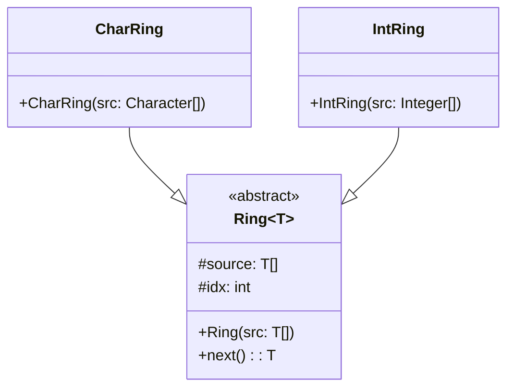

# Resolución Práctica 2: Refactoring

## Ejercicio 1: Algo huele mal

### 1.1 Protocolo de Cliente
- **Mal Olor:** Comentarios (causados por Nombres Inexpresivos).
- **Refactoring:** Rename Method y Rename Variable.
**Solución:** Borrar comentarios y renombrar para comunicar:
```java
public double limiteDeCredito() { ... }

protected double montoFacturadoEntre(LocalDate fechaInicio, LocalDate fechaFin) { ... }

private double montoCobradoEntre(LocalDate fechaInicio, LocalDate fechaFin) { ... }
```

---

### 1.2 Participación en proyectos
- **Mal Olor:** Envidia de Atributo (*Feature Envy*). La clase `Persona` envidia la colección `participantes` de `Proyecto`.
- **Refactoring:** Move Method.
**Solución:** Mover el método a la clase dueña de los datos (`Proyecto`):
```java
// En la clase Proyecto:
public boolean participa(Persona p) {
    return participantes.contains(p);
}
```

---

### 1.3 Cálculos
- **Mal Olor:** Método Largo y Múltiples Tareas en un Bucle (usa variables temporales en un bucle que calcula dos cosas a la vez).
- **Refactoring:** Split Loop (Separar Bucle) + Replace Temp with Query (Extraer consultas).
**Solución:**
```java
public void imprimirValores() {
    String msg = String.format("Promedio de edades: %s, Total de salarios: %s",
                                 this.obtenerPromedioEdades(), this.obtenerTotalSalarios());
    System.out.println(msg);
}

private double obtenerTotalSalarios() {
    double total = 0;
    for (Empleado e : personal) total += e.getSalario();
    return total;
}

private double obtenerPromedioEdades() {
    int total = 0;
    for (Empleado e : personal) total += e.getEdad();
    return (double) total / personal.size();
}
```

---

## Ejercicio 2: Iteradores circulares
**1) y 2) Código final con Rename Variable e Inconveniente**

**Solución (Código Final de `next()`):**
```java
public char next() {
    int currentPosition;
    if (idx >= source.length)
        idx = 0;
    currentPosition = idx++;
    return source[currentPosition];
}
```

**Posible Inconveniente:**
Si el renombre se hace de forma manual realizando un clásico **"Buscar y Reemplazar" (texto plano)** en el editor, accidentalmente se modificaría y pisaría también la variable local `char result;` que existe dentro del constructor `CharRing(...)` en la línea 6. 
*¿Cómo se evita?* Usando una herramienta formal de refactoring automático provista por la IDE. Estas herramientas no leen texto crudo, sino que leen el **AST (Abstract Syntax Tree)**, lo que les permite distinguir el *scope* (*alcance*) local exacto de la variable `result` de `next()` sin afectar a otras variables homónimas del resto de la clase.

---

## Ejercicio 3: Iteradores circulares bis

- **Mal Olor:** Código duplicado.
- **Refactoring:** Extract Superclass (aprovechando **Generics** de Java para abstraer los tipos primitivos).

**Pasos Intermedios (Cómo aplicar Extract Superclass):**
1. Crear una clase abstracta vacía `Ring<T>` que reciba un tipo genérico.
2. Hacer que `CharRing` e `IntRing` extiendan de ella. Pasar a utilizar clases *Wrapper* (`Character` e `Integer`) en lugar de `char` e `int` nativos, para poder unificarlos en `T`.
3. **Pull Up Field:** Subir la declaración compartida del index (`protected int idx`) y del array (`protected T[] source`) a la superclase.
4. **Pull Up Constructor:** Crear el constructor en la super clase que inicialice el `source` e invocarlo desde los hijos usando `super()`.
5. **Pull Up Method:** Subir el método `next()` a la superclase retornando `T`, ya que su lógica de recorrido es matemáticamente idéntica para ambos casos.

**Solución 4) Diagrama UML Refactorizado:**

