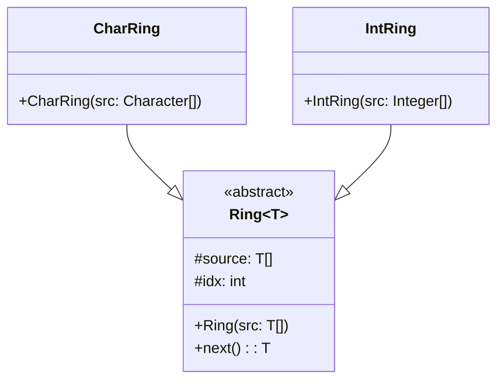

# Resolución Práctica 2: Refactoring

## Ejercicio 1: Algo huele mal

### 1.1 Protocolo de Cliente
- **Mal Olor:** Comentarios (causados por Nombres Inexpresivos).
- **Refactoring:** Rename Method y Rename Variable.
**Solución:** Borrar comentarios y renombrar para comunicar:
```java
public double limiteDeCredito() { ... }

protected double montoFacturadoEntre(LocalDate fechaInicio, LocalDate fechaFin) { ... }

private double montoCobradoEntre(LocalDate fechaInicio, LocalDate fechaFin) { ... }
```

---

### 1.2 Participación en proyectos
- **Mal Olor:** Envidia de Atributo (*Feature Envy*). La clase `Persona` envidia la colección `participantes` de `Proyecto`.
- **Refactoring:** Move Method.
**Solución:** Mover el método a la clase dueña de los datos (`Proyecto`):
```java
// En la clase Proyecto:
public boolean participa(Persona p) {
    return participantes.contains(p);
}
```

---

### 1.3 Cálculos
- **Mal Olor:** Método Largo y Múltiples Tareas en un Bucle (usa variables temporales en un bucle que calcula dos cosas a la vez).
- **Refactoring:** Split Loop (Separar Bucle) + Replace Temp with Query (Extraer consultas).
**Solución:**
```java
public void imprimirValores() {
    String msg = String.format("Promedio de edades: %s, Total de salarios: %s",
                                 this.obtenerPromedioEdades(), this.obtenerTotalSalarios());
    System.out.println(msg);
}

private double obtenerTotalSalarios() {
    double total = 0;
    for (Empleado e : personal) total += e.getSalario();
    return total;
}

private double obtenerPromedioEdades() {
    int total = 0;
    for (Empleado e : personal) total += e.getEdad();
    return (double) total / personal.size();
}
```

---

## Ejercicio 2: Iteradores circulares
**1) y 2) Código final con Rename Variable e Inconveniente**

**Solución (Código Final de `next()`):**
```java
public char next() {
    int currentPosition;
    if (idx >= source.length)
        idx = 0;
    currentPosition = idx++;
    return source[currentPosition];
}
```

**Posible Inconveniente:**
Si el renombre se hace de forma manual realizando un clásico **"Buscar y Reemplazar" (texto plano)** en el editor, accidentalmente se modificaría y pisaría también la variable local `char result;` que existe dentro del constructor `CharRing(...)` en la línea 6. 
*¿Cómo se evita?* Usando una herramienta formal de refactoring automático provista por la IDE. Estas herramientas no leen texto crudo, sino que leen el **AST (Abstract Syntax Tree)**, lo que les permite distinguir el *scope* (*alcance*) local exacto de la variable `result` de `next()` sin afectar a otras variables homónimas del resto de la clase.

---

## Ejercicio 3: Iteradores circulares bis

- **Mal Olor:** Código duplicado.
- **Refactoring:** Extract Superclass (aprovechando **Generics** de Java para abstraer los tipos primitivos).

**Pasos Intermedios (Cómo aplicar Extract Superclass):**
1. Crear una clase abstracta vacía `Ring<T>` que reciba un tipo genérico.
2. Hacer que `CharRing` e `IntRing` extiendan de ella. Pasar a utilizar clases *Wrapper* (`Character` e `Integer`) en lugar de `char` e `int` nativos, para poder unificarlos en `T`.
3. **Pull Up Field:** Subir la declaración compartida del index (`protected int idx`) y del array (`protected T[] source`) a la superclase.
4. **Pull Up Constructor:** Crear el constructor en la super clase que inicialice el `source` e invocarlo desde los hijos usando `super()`.
5. **Pull Up Method:** Subir el método `next()` a la superclase retornando `T`, ya que su lógica de recorrido es matemáticamente idéntica para ambos casos.

**Solución 4) Diagrama UML Refactorizado:**

```mermaid
classDiagram
  class Ring~T~ {
     <<abstract>>
     #source: T[]
     #idx: int
     +Ring(src: T[])
     +next(): T
  }
  class CharRing {
     +CharRing(src: Character[])
  }
  class IntRing {
     +IntRing(src: Integer[])
  }
  CharRing --|> Ring~Character~
  IntRing --|> Ring~Integer~
```

---

## Ejercicio 4: Alcance en Redes Sociales

A continuación se detallan los archivos y números de línea afectados para aplicar cada uno de los refactorings solicitados:

### 1. Rename Method: `procesar` por `impacto`
Al ser un método privado (`private`), solo afecta a la clase donde está declarado.
*   **`Publicacion.java` (Línea 11):** Declaración del método.
    *   *Antes:* `private int procesar() {`
    *   *Después:* `private int impacto() {`
*   **`Publicacion.java` (Línea 15):** Invocación del método.
    *   *Antes:* `return procesar() * 10;`
    *   *Después:* `return impacto() * 10;`

### 2. Rename Method: `calcular` por `alcance` (en `Publicacion.java`)
Al ser un método público (`public`), afecta a su declaración y a la clase `Perfil` que lo invoca.
*   **`Publicacion.java` (Línea 14):** Declaración del método.
    *   *Antes:* `public int calcular() {`
    *   *Después:* `public int alcance() {`
*   **`Perfil.java` (Línea 13):** Invocación sobre instancias de `Publicacion`.
    *   *Antes:* `return publicaciones.stream().mapToInt(p -> p.calcular()).sum();`
    *   *Después:* `return publicaciones.stream().mapToInt(p -> p.alcance()).sum();`

### 3. Rename Method: `calcular` por `alcance` (en `Perfil.java`)
Renombrar el método propio de la clase `Perfil`.
*   **`Perfil.java` (Línea 15):** Declaración del método.
    *   *Antes:* `public int calcular() {`
    *   *Después:* `public int alcance() {`

### 4. Rename Parameter: `p` por `publicacion`
Cambiar el nombre del parámetro del método `agregarPublicacion`. Su alcance está delimitado por el cuerpo del método.
*   **`Perfil.java` (Línea 10):** Declaración y uso del parámetro.
    *   *Antes:* `public void agregarPublicacion(Publicacion p) { publicaciones.add(p); }`
    *   *Después:* `public void agregarPublicacion(Publicacion publicacion) { publicaciones.add(publicacion); }`

---

## Ejercicio 5: Productos

A continuación se detallan las respuestas y el proceso de refactorización aplicado sobre el modelo de `Product`, `HotelStay` y `CarRental`:

### 1. Encapsulate Field sobre `cost`
*   **Pasos:**
    1.  Cambiar la visibilidad del atributo `public double cost;` a `private double cost;` en `HotelStay.java` y `CarRental.java`.
    2.  Crear los métodos de acceso `getCost()` y `setCost()` en ambas clases.
*   **Preguntas de discusión:**
    *   **a. ¿Es correcto modificar alguno de los tests para que el código refactorizado funcione?**  
        Sí, es correcto y necesario. El refactoring consiste en ocultar la representación interna (visibilidad privada). Al ser los tests clientes del código de producción que se acoplaban directamente a la variable pública para sus validaciones, la compilación de estos se rompe. Corregir los tests para que usen `getCost()` es la acción correcta.
    *   **b. ¿Qué situación está representando este test al fallar?**  
        El test fallido representa un **acoplamiento fuerte (tight coupling)** entre los clientes (los tests) y la estructura de datos interna de la clase, delatando una violación al principio de encapsulamiento.

### 2. Rename Field de `cost` a `quote` (en `priceFactor()`)
*   Se renombró el atributo `cost` a `quote` en `HotelStay.java` (y también en `CarRental.java` para mantener la simetría y coherencia).
*   **Consecuencia en los tests:** Al renombrar el atributo, la herramienta de refactoring también renombró los accesores generados a `getQuote()` y `setQuote()`. Por ende, los tests se tuvieron que actualizar para llamar a `getQuote()`.

### 3. Pull Up Method de `startDate()` y `endDate()` (Factibilidad)
*   **Respuesta:** **No es posible** realizar el *Pull Up Method* directamente en el código de partida.
*   **Justificación:** Los métodos `startDate()` y `endDate()` acceden a la variable `this.timePeriod`, la cual está declarada en cada subclase. Como la superclase `Product` no posee dicho atributo ni acceso a él, subir los métodos directamente rompería la compilación.

### 4 y 5. Refactorings previos y aplicación de Pull Up Method
Para subir exitosamente los métodos, se aplicaron los siguientes pasos en el código:
1.  **Pull Up Field:** Subir el atributo `timePeriod` de las subclases a la superclase `Product` (declarado como `protected TimePeriod timePeriod;`).
2.  **Constructor Refactoring:** Crear un constructor en `Product` que reciba e inicialice `timePeriod` y delegar desde los constructores de las subclases mediante `super(timePeriod)`.
3.  **Pull Up Method:** Mover los métodos `startDate()` y `endDate()` a la superclase `Product` y borrarlos de las subclases.

### 6. Métodos `price()` y Code Smells
*   **Code Smell detectado:** **Feature Envy (Envidia de Atributos)**. Las subclases acceden a múltiples propiedades de colaboradores (`company` y `hotel`) para calcular un valor que es responsabilidad exclusiva de estos últimos (violando el principio *Tell, Don't Ask*).
*   **Refactorings aplicados (Move Method):**
    *   Se creó el método `getPrice()` en `Company.java` que retorna `price * promotionRate` y se delegó desde `CarRental.java` (`return this.company.getPrice();`).
    *   Se creó el método `getPriceForDuration(long duration)` en `Hotel.java` que retorna `nightPrice * discountRate * duration` y se delegó desde `HotelStay.java` (`return this.hotel.getPriceForDuration(this.timePeriod.duration());`).

---

## Ejercicio 6: Refactorizaciones Iterativas

### 6.1 Empleados

#### i) Malos Olores Detectados
1.  **Falta de Encapsulamiento:** Todos los atributos (`nombre`, `apellido`, `sueldoBasico`, etc.) están expuestos públicamente (`public`).
2.  **Código Duplicado (Atributos):** Los atributos `nombre`, `apellido` y `sueldoBasico` se encuentran repetidos en las tres clases (`EmpleadoTemporario`, `EmpleadoPlanta`, `EmpleadoPasante`).
3.  **Código Duplicado (Lógica):** La deducción del descuento de sueldo (`this.sueldoBasico * 0.13`) está duplicada en el método `sueldo()` de los tres tipos de empleados.

#### ii) Refactorings Aplicados
1.  **Encapsulate Field:** Cambiar los atributos de las subclases a privados (`private`) y generar getters/setters.
2.  **Extract Superclass (y Pull Up Field):** Crear la superclase abstracta `Empleado` y mover a ella los atributos duplicados (`nombre`, `apellido`, `sueldoBasico`) con sus respectivos accesores.
3.  **Form Template Method:** Subir el método `sueldo()` a la superclase `Empleado`, definiendo el esqueleto del algoritmo de cálculo, y delegar los cálculos adicionales de cada tipo de empleado mediante un método primitivo abstracto `adicionales()`.

#### iii) Diseño Final Refactorizado

```java
// Empleado.java
public abstract class Empleado {
    private String nombre;
    private String apellido;
    private double sueldoBasico;

    public Empleado(String nombre, String apellido, double sueldoBasico) {
        this.nombre = nombre;
        this.apellido = apellido;
        this.sueldoBasico = sueldoBasico;
    }

    public double getSueldoBasico() { return this.sueldoBasico; }
    public String getNombre() { return this.nombre; }
    public String getApellido() { return this.apellido; }

    // TEMPLATE METHOD
    public double sueldo() {
        return this.getSueldoBasico() + this.adicionales() - this.descuento();
    }

    protected double descuento() {
        return this.getSueldoBasico() * 0.13;
    }

    // Operación primitiva
    protected abstract double adicionales();
}

// EmpleadoTemporario.java
public class EmpleadoTemporario extends Empleado {
    private double horasTrabajadas;
    private int cantidadHijos;

    public EmpleadoTemporario(String nombre, String apellido, double sueldoBasico, double horas, int hijos) {
        super(nombre, apellido, sueldoBasico);
        this.horasTrabajadas = horas;
        this.cantidadHijos = hijos;
    }

    @Override
    protected double adicionales() {
        return (this.horasTrabajadas * 500) + (this.cantidadHijos * 1000);
    }
}

// EmpleadoPlanta.java
public class EmpleadoPlanta extends Empleado {
    private int cantidadHijos;

    public EmpleadoPlanta(String nombre, String apellido, double sueldoBasico, int hijos) {
        super(nombre, apellido, sueldoBasico);
        this.cantidadHijos = hijos;
    }

    @Override
    protected double adicionales() {
        return this.cantidadHijos * 2000;
    }
}

// EmpleadoPasante.java
public class EmpleadoPasante extends Empleado {
    public EmpleadoPasante(String nombre, String apellido, double sueldoBasico) {
        super(nombre, apellido, sueldoBasico);
    }

    @Override
    protected double adicionales() {
        return 0.0;
    }
}
```

---

### 6.2 Juego

#### i) Malos Olores Detectados
1.  **Falta de Encapsulamiento:** El atributo `puntuacion` en la clase `Jugador` es de acceso público (`public`).
2.  **Envidia de Atributos (Feature Envy) / Violación de "Tell, Don't Ask":** La clase `Juego` accede directamente al atributo `puntuacion` del jugador, realiza la suma o resta, y actualiza el valor externamente. Este comportamiento debe pertenecer a `Jugador`.
3.  **Nombres Inexpresivos / Rename Parameter:** El parámetro `j` del método en `Juego` es inexpresivo y debe cambiarse por `jugador`.

#### ii) Refactorings Aplicados
1.  **Encapsulate Field:** Cambiar los atributos de `Jugador` a privados (`private`).
2.  **Move Method:** Mover el cálculo de incremento y decremento de la puntuación a la clase `Jugador`.
3.  **Rename Parameter:** Renombrar el parámetro `j` por `jugador` en la firma de los métodos de `Juego`.

#### iii) Diseño Final Refactorizado

```java
// Jugador.java
public class Jugador {
    private String nombre;
    private String apellido;
    private int puntuacion = 0;

    public String getNombre() { return nombre; }
    public void setNombre(String nombre) { this.nombre = nombre; }
    
    public String getApellido() { return apellido; }
    public void setApellido(String apellido) { this.apellido = apellido; }
    
    public int getPuntuacion() { return puntuacion; }

    public void incrementarPuntuacion() {
        this.puntuacion += 100;
    }

    public void decrementarPuntuacion() {
        this.puntuacion -= 50;
    }
}

// Juego.java
public class Juego {
    public void incrementar(Jugador jugador) {
        jugador.incrementarPuntuacion();
    }

    public void decrementar(Jugador jugador) {
        jugador.decrementarPuntuacion();
    }
}
```

---

### 6.3 Publicaciones

#### i) Malos Olores Detectados
1.  **Método Largo:** El método `ultimosPosts` acumula múltiples responsabilidades (filtrar elementos, ordenar mediante un algoritmo manual de ordenación por selección, y paginar o acotar resultados).
2.  **Sustitución de Algoritmo Innecesario:** Se implementa una ordenación manual en lugar de aprovechar las herramientas provistas por el framework de colecciones de Java.

#### ii) Refactorings Aplicados
1.  **Replace Loop with Pipeline:** Reemplazar los bucles iterativos manuales y el iterador final por un pipeline declarativo utilizando la API de **Streams** de Java 8.
2.  **Substitute Algorithm:** Reemplazar el bucle de ordenación anidada manual por la operación `.sorted()` utilizando un comparador de fechas.

#### iii) Diseño Final Refactorizado

```java
import java.util.List;
import java.util.stream.Collectors;

public class PostApp {
    private List<Post> posts;

    public List<Post> ultimosPosts(Usuario user, int cantidad) {
        return this.posts.stream()
            .filter(post -> !post.getUsuario().equals(user))
            .sorted((p1, p2) -> p2.getFecha().compareTo(p1.getFecha())) // Más nuevo primero
            .limit(cantidad)
            .collect(Collectors.toList());
    }
}
```

---

### 6.4 Carrito de compras

#### i) Malos Olores Detectados
1.  **Cadena de Mensajes (Message Chains):** La llamada `item.getProducto().getPrecio()` acopla la clase `Carrito` con la clase `Producto`, navegando a través de `ItemCarrito`.
2.  **Envidia de Atributos (Feature Envy):** La clase `Carrito` realiza el cálculo del subtotal de cada ítem, lo cual depende enteramente de los datos de `ItemCarrito` y `Producto`, violando el principio *"Tell, Don't Ask"*.

#### ii) Refactorings Aplicados
1.  **Move Method:** Mover el cálculo del subtotal (`cantidad * precio`) de la clase `Carrito` a la clase `ItemCarrito`.
2.  **Hide Delegate:** Al delegar el cálculo del subtotal a `ItemCarrito`, ocultamos la navegación directa hacia `Producto`, eliminando la cadena de mensajes.

#### iii) Diseño Final Refactorizado

```java
// Producto.java
public class Producto {
    private String nombre;
    private double precio;

    public double getPrecio() {
        return this.precio;
    }
}

// ItemCarrito.java
public class ItemCarrito {
    private Producto producto;
    private int cantidad;

    public Producto getProducto() { return this.producto; }
    public int getCantidad() { return this.cantidad; }

    public double getSubtotal() {
        return this.getProducto().getPrecio() * this.getCantidad();
    }
}

// Carrito.java
public class Carrito {
    private List<ItemCarrito> items;

    public double total() {
        return this.items.stream()
            .mapToDouble(item -> item.getSubtotal())
            .sum();
    }
}
```

---

### 6.5 Envío de pedidos

#### i) Malos Olores Detectados
1.  **Envidia de Atributos (Feature Envy):** La clase `Cliente` accede a múltiples atributos internos de `Direccion` (calle, número, localidad, departamento) para armar una cadena formateada. Esta responsabilidad de formateo le corresponde a `Direccion`.

#### ii) Refactorings Aplicados
1.  **Move Method:** Mover el método de formateo de dirección desde `Cliente` a la clase `Direccion`.
2.  **Delegation (Hide Delegate):** El método `getDireccionFormateada()` en `Cliente` ahora delega la llamada a `Direccion`, manteniendo intacta la interfaz pública de `Cliente` para no romper la clase `Supermercado`.

#### iii) Diseño Final Refactorizado

```java
// Direccion.java
public class Direccion {
    private String localidad;
    private String calle;
    private String numero;
    private String departamento;

    public String getLocalidad() { return localidad; }
    public String getCalle() { return calle; }
    public String getNumero() { return numero; }
    public String getDepartamento() { return departamento; }

    public String getDireccionFormateada() {
        return this.localidad + ", " + this.calle + ", " + this.numero + ", " + this.departamento;
    }
}

// Cliente.java
public class Cliente {
    private Direccion direccion;

    public String getDireccionFormateada() {
        return this.direccion.getDireccionFormateada();
    }
}

// Supermercado.java (Queda igual, usando encapsulamiento)
public class Supermercado {
    public void notificarPedido(long nroPedido, Cliente cliente) {
        String notificacion = MessageFormat.format(
            "Estimado cliente, se le informa que hemos recibido su pedido con número {0}, el cual será enviado a la dirección {1}",
            new Object[] { nroPedido, cliente.getDireccionFormateada() }
        );
        System.out.println(notificacion);
    }
}
```

---

### 6.6 Películas

#### i) Malos Olores Detectados
1.  **Sentencias Condicionales (Switch Statements / If-Else Chain):** El método `calcularCostoPelicula` en `Usuario` decide el costo basándose en una cadena de `if-else` sobre el tipo de suscripción. Esto viola el principio de Abierto/Cerrado (*Open/Closed Principle*).
2.  **Comparación de Strings Inadecuada:** El uso de `==` para comparar strings (`tipoSubscripcion == "Basico"`) es una mala práctica en Java, ya que compara referencias de objetos en lugar de su contenido (lo correcto es `.equals()`).

#### ii) Refactorings Aplicados
1.  **Replace Conditional with Polymorphism (Patrón Strategy):**
    *   Definir la interfaz `Suscripcion` para encapsular la estrategia de cálculo de precio de la película.
    *   Implementar clases concretas para cada tipo de suscripción (`Basico`, `Familia`, `Plus`, `Premium`).
    *   Modificar la clase `Usuario` para que contenga un objeto `Suscripcion` en lugar de un `String`, delegando el cálculo de forma polimórfica.

#### iii) Diseño Final Refactorizado

```java
// Suscripcion.java
public interface Suscripcion {
    double calcularCosto(Pelicula pelicula);
}

// SuscripcionBasica.java
public class SuscripcionBasica implements Suscripcion {
    @Override
    public double calcularCosto(Pelicula pelicula) {
        return pelicula.getCosto() + pelicula.calcularCargoExtraPorEstreno();
    }
}

// SuscripcionFamilia.java
public class SuscripcionFamilia implements Suscripcion {
    @Override
    public double calcularCosto(Pelicula pelicula) {
        return (pelicula.getCosto() + pelicula.calcularCargoExtraPorEstreno()) * 0.90;
    }
}

// SuscripcionPlus.java
public class SuscripcionPlus implements Suscripcion {
    @Override
    public double calcularCosto(Pelicula pelicula) {
        return pelicula.getCosto();
    }
}

// SuscripcionPremium.java
public class SuscripcionPremium implements Suscripcion {
    @Override
    public double calcularCosto(Pelicula pelicula) {
        return pelicula.getCosto() * 0.75;
    }
}

// Usuario.java
public class Usuario {
    private Suscripcion tipoSubscripcion;

    public void setTipoSubscripcion(Suscripcion unTipo) {
        this.tipoSubscripcion = unTipo;
    }

    public double calcularCostoPelicula(Pelicula pelicula) {
        return this.tipoSubscripcion.calcularCosto(pelicula);
    }
}

// Pelicula.java
public class Pelicula {
    private LocalDate fechaEstreno;
    private double costo;

    public double getCosto() {
        return this.costo;
    }

    public double calcularCargoExtraPorEstreno() {
        return ChronoUnit.DAYS.between(this.fechaEstreno, LocalDate.now()) > 30 ? 0.0 : 300.0;
    }
}
```
