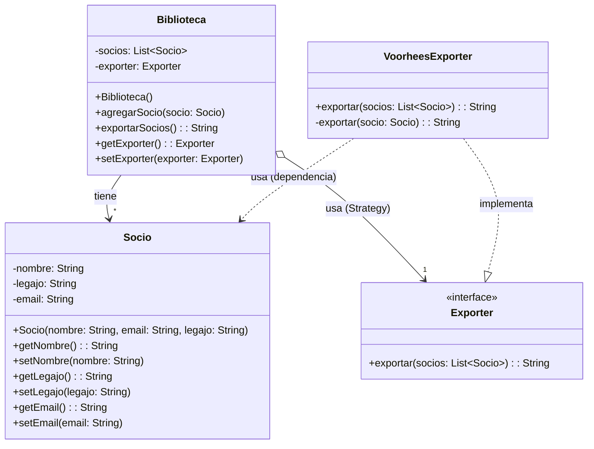

# Resolución Práctica 3: Patrones de Diseño

## Ejercicio 1: Biblioteca (BJSON)

A continuación se detalla el diagrama de clases exacto del modelo provisto.

### 📊 Diagrama de Clases (UML)

### 🗒️ Notas de corrección
*   **Acoplamiento débil (Polimorfismo):** Se debe prestar especial atención a que la clase `Biblioteca` **conoce a la interfaz `Exporter`** y no a la clase concreta `VoorheesExporter`. En el UML se grafica la relación hacia la interfaz, y no hacia el objeto con el que el constructor lo inicializa.
*   **Dependencia en UML:** La flecha punteada (`..>`) desde `VoorheesExporter` hacia `Socio` denota una relación de uso/dependencia. Significando que el exportador depende de la interfaz pública de Socio (*sus getters*) de forma pasajera recibir sus datos como parámetro, sin adueñarse de los objetos.
