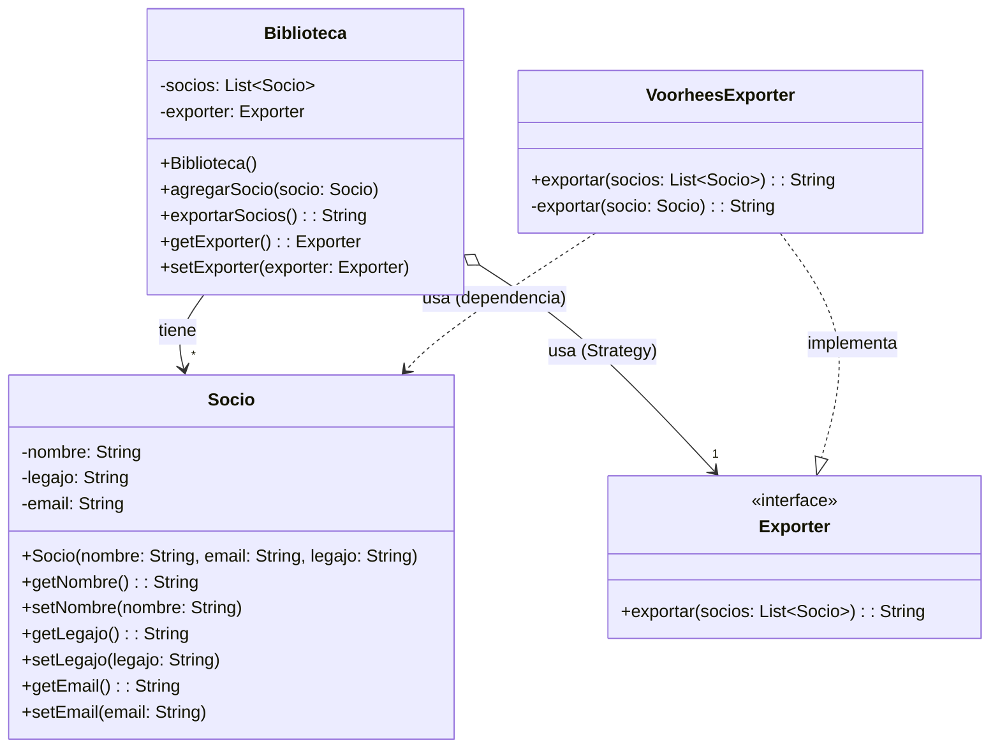
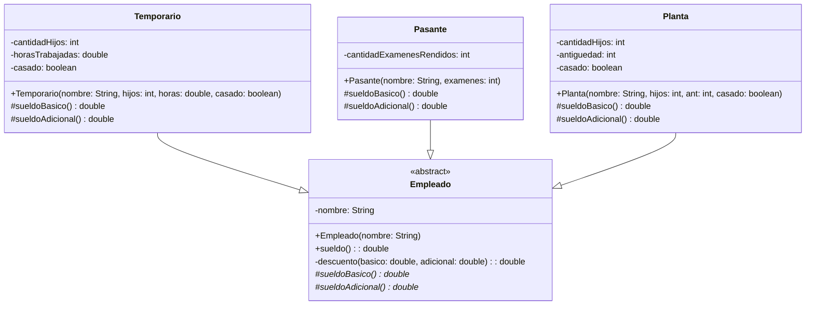
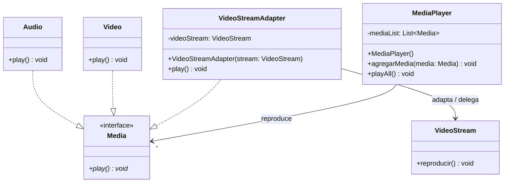
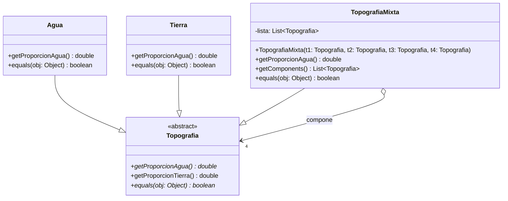
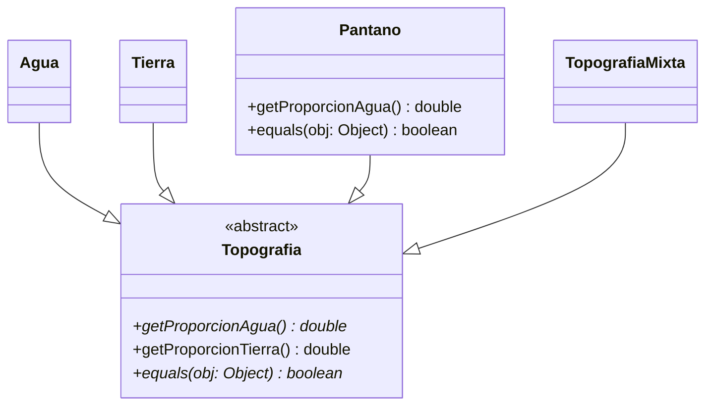
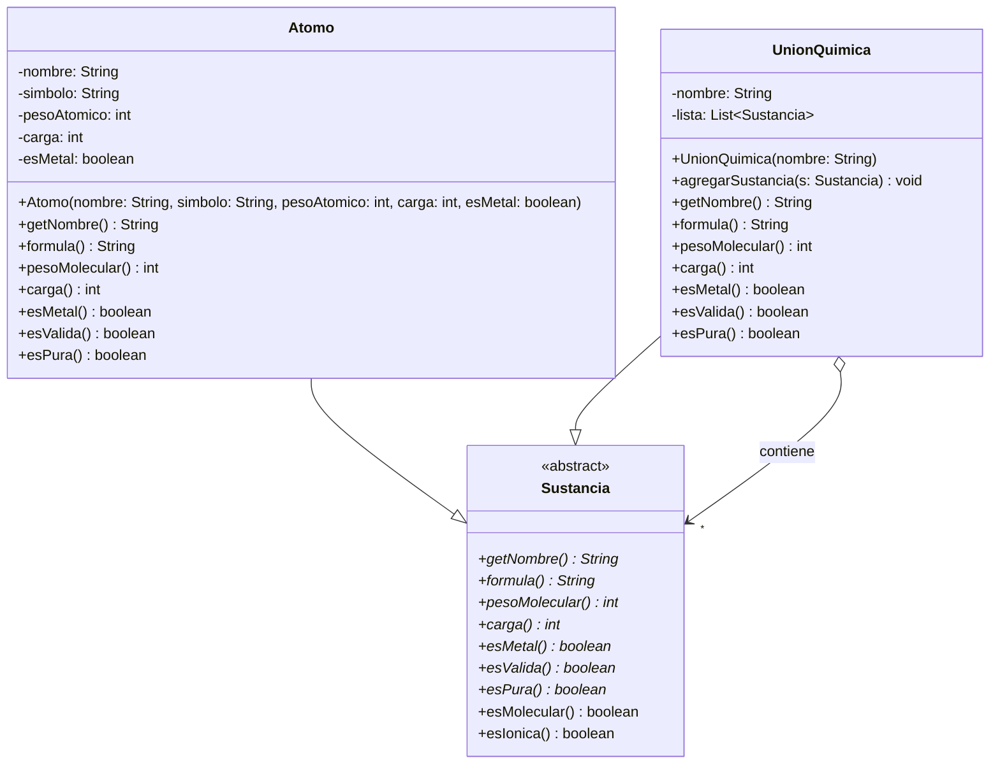
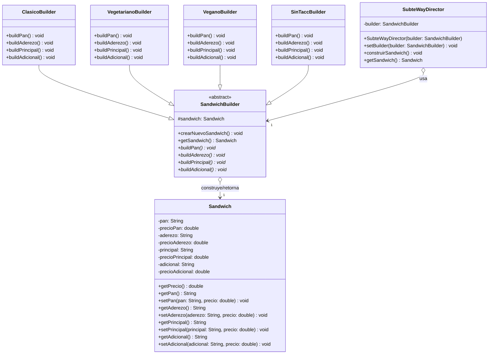

# Resolución Práctica 3: Patrones de Diseño

## Ejercicio 1: Biblioteca (BJSON)

A continuación se detalla el diagrama de clases exacto del modelo provisto.

### 📊 Diagrama de Clases (UML)

```mermaid
classDiagram
    class Biblioteca {
        -socios: List~Socio~
        -exporter: Exporter
        +Biblioteca()
        +agregarSocio(socio: Socio)
        +exportarSocios(): String
        +getExporter(): Exporter
        +setExporter(exporter: Exporter)
    }

    class Socio {
        -nombre: String
        -legajo: String
        -email: String
        +Socio(nombre: String, email: String, legajo: String)
        +getNombre(): String
        +setNombre(nombre: String)
        +getLegajo(): String
        +setLegajo(legajo: String)
        +getEmail(): String
        +setEmail(email: String)
    }

    class Exporter {
        <<interface>>
        +exportar(socios: List~Socio~): String
    }

    class VoorheesExporter {
        +exportar(socios: List~Socio~): String
        -exportar(socio: Socio): String
    }

    %% Relaciones
    Biblioteca --> "*" Socio : tiene 
    Biblioteca o--> "1" Exporter : usa (Strategy)
    VoorheesExporter ..|> Exporter : implementa
    VoorheesExporter ..> Socio : usa (dependencia)
```

### 🗒️ Notas de corrección
*   **Acoplamiento débil (Polimorfismo):** Se debe prestar especial atención a que la clase `Biblioteca` **conoce a la interfaz `Exporter`** y no a la clase concreta `VoorheesExporter`. En el UML se grafica la relación hacia la interfaz, y no hacia el objeto con el que el constructor lo inicializa.
*   **Dependencia en UML:** La flecha punteada (`..>`) desde `VoorheesExporter` hacia `Socio` denota una relación de uso/dependencia. Significando que el exportador depende de la interfaz pública de Socio (*sus getters*) de forma pasajera recibir sus datos como parámetro, sin adueñarse de los objetos.

---

## Ejercicio 2: Cálculo de sueldos

### 📊 Diagrama de Clases (UML) con Template Method

Para evitar la duplicación de código en la estructura de cálculo de sueldo neto y en la deducción de los descuentos comunes, se implementa el patrón **Template Method** en la jerarquía de empleados:

```mermaid
classDiagram
    class Empleado {
        <<abstract>>
        -nombre: String
        +Empleado(nombre: String)
        +sueldo(): double
        -descuento(basico: double, adicional: double): double
        #sueldoBasico()* double
        #sueldoAdicional()* double
    }

    class Temporario {
        -cantidadHijos: int
        -horasTrabajadas: double
        -casado: boolean
        +Temporario(nombre: String, hijos: int, horas: double, casado: boolean)
        #sueldoBasico() double
        #sueldoAdicional() double
    }

    class Pasante {
        -cantidadExamenesRendidos: int
        +Pasante(nombre: String, examenes: int)
        #sueldoBasico() double
        #sueldoAdicional() double
    }

    class Planta {
        -cantidadHijos: int
        -antiguedad: int
        -casado: boolean
        +Planta(nombre: String, hijos: int, ant: int, casado: boolean)
        #sueldoBasico() double
        #sueldoAdicional() double
    }

    Temporario --|> Empleado
    Pasante --|> Empleado
    Planta --|> Empleado
```

### 🗒️ Detalles de Diseño
*   **Template Method:** El método `sueldo()` de `Empleado` es concreto y se define como `final` para evitar su redefinición por las subclases, garantizando la consistencia del algoritmo:
    $$\text{sueldo()} = \text{sueldoBasico()} + \text{sueldoAdicional()} - \text{descuento}(\text{basico}, \text{adicional})$$
*   **Operaciones Primitivas:** `sueldoBasico()` y `sueldoAdicional()` se definen como métodos abstractos protegidos para que cada subclase implemente su variación particular.
*   **Encapsulamiento del Cambio:** Cada subclase declara y encapsula únicamente los atributos de los que depende su lógica de negocio particular (ej. `examenesRendidos` solo en `Pasante`), logrando alta cohesión y evitando acoplamiento inútil en la superclase.

---

## Ejercicio 3: Media Player

### 📊 Diagrama de Clases (UML) con Adapter

Para permitir que `MediaPlayer` reproduzca instancias de `VideoStream` (de una biblioteca externa que no podemos modificar) uniformemente junto a otros tipos de `Media`, se implementa el patrón **Adapter (de objetos)**:

```mermaid
classDiagram
    class Media {
        <<interface>>
        +play()* void
    }

    class Audio {
        +play() void
    }

    class Video {
        +play() void
    }

    class VideoStreamAdapter {
        -videoStream: VideoStream
        +VideoStreamAdapter(stream: VideoStream)
        +play() void
    }

    class VideoStream {
        +reproducir() void
    }

    class MediaPlayer {
        -mediaList: List~Media~
        +MediaPlayer()
        +agregarMedia(media: Media) void
        +playAll() void
    }

    Audio ..|> Media
    Video ..|> Media
    VideoStreamAdapter ..|> Media
    VideoStreamAdapter --> VideoStream : adapta / delega
    MediaPlayer --> "*" Media : reproduce
```

### 🗒️ Roles del Patrón Adapter
*   **Target (Objetivo):** La interfaz `Media` (define el protocolo `play()` esperado por el cliente).
*   **Client (Cliente):** La clase `MediaPlayer` (envía mensajes `play()` a elementos que implementan `Media`).
*   **Adaptee (Adaptado):** La clase `VideoStream` (contiene la lógica incompatible en su método `reproducir()`).
*   **Adapter (Adaptador):** La clase `VideoStreamAdapter` (implementa `Media` y delega internamente en `VideoStream`).

---

## Ejercicio 4: Topografías

### 📊 Diagrama de Clases (UML) con Composite

Para representar cuencas hídricas que pueden ser puras (sólo agua o sólo tierra) o compuestas recursivamente en 4 subporciones, se implementa el patrón **Composite**:

```mermaid
classDiagram
    class Topografia {
        <<abstract>>
        +getProporcionAgua()* double
        +getProporcionTierra() double
        +equals(obj: Object)* boolean
    }

    class Agua {
        +getProporcionAgua() double
        +equals(obj: Object) boolean
    }

    class Tierra {
        +getProporcionAgua() double
        +equals(obj: Object) boolean
    }

    class TopografiaMixta {
        -lista: List~Topografia~
        +TopografiaMixta(t1: Topografia, t2: Topografia, t3: Topografia, t4: Topografia)
        +getProporcionAgua() double
        +getComponents() List~Topografia~
        +equals(obj: Object) boolean
    }

    Agua --|> Topografia
    Tierra --|> Topografia
    TopografiaMixta --|> Topografia
    TopografiaMixta o--> "4" Topografia : compone
```

### 🗒️ Roles del Patrón Composite
*   **Component (Componente):** La clase abstracta `Topografia`. Define la interfaz común y métodos reutilizables (como `getProporcionTierra()`).
*   **Leaf (Hoja):** Las clases `Agua` y `Tierra`. Representan los elementos básicos de la topología y no contienen hijos.
*   **Composite (Compuesto):** La clase `TopografiaMixta`. Representa agrupaciones complejas de 4 subtopografías, delegando recursivamente cálculos y comparaciones.
*   **Uniformidad:** El cliente interactúa con la abstracción `Topografia` de manera uniforme, sin necesidad de distinguir el tipo concreto de celda.

---

## Ejercicio 4b: Más Topografías

### 📊 Extensión de la jerarquía (UML)

Para agregar soporte al terreno de tipo **Pantano**, simplemente añadimos una nueva clase hoja (`Leaf`) que herede de la clase abstracta `Topografia`:

```mermaid
classDiagram
    class Topografia {
        <<abstract>>
        +getProporcionAgua()* double
        +getProporcionTierra() double
        +equals(obj: Object)* boolean
    }

    class Agua
    class Tierra
    class Pantano {
        +getProporcionAgua() double
        +equals(obj: Object) boolean
    }
    class TopografiaMixta

    Agua --|> Topografia
    Tierra --|> Topografia
    Pantano --|> Topografia
    TopografiaMixta --|> Topografia
```

### 🗒️ Detalles de Diseño
*   **Extensibilidad (Open/Closed Principle):** Se incorporó el nuevo tipo de terreno `Pantano` **sin modificar** ninguna de las clases existentes (`Topografia`, `Agua`, `Tierra`, ni `TopografiaMixta`). Esto demuestra el poder de extensión del patrón *Composite*.
*   **Reuso de Comportamiento:** La clase `Pantano` solo redefine `getProporcionAgua()` retornando `0.7`. El cálculo de su proporción de tierra se delega automáticamente a la superclase `Topografia`, retornando `1.0 - 0.7 = 0.3` de forma heredada y reutilizable.
*   **Igualdad:** Se sobrescribe `equals(Object)` en `Pantano` para que sea igual únicamente a otras instancias de `Pantano`.

---

## Ejercicio 5: Sustancias químicas

### 📊 Diagrama de Clases (UML) con Composite

Para modelar sustancias que pueden ser simples (átomos) o compuestas recursivamente por la unión de otras sustancias (uniones químicas), se implementa el patrón **Composite**:

```mermaid
classDiagram
    class Sustancia {
        <<abstract>>
        +getNombre()* String
        +formula()* String
        +pesoMolecular()* int
        +carga()* int
        +esMetal()* boolean
        +esValida()* boolean
        +esPura()* boolean
        +esMolecular() boolean
        +esIonica() boolean
    }

    class Atomo {
        -nombre: String
        -simbolo: String
        -pesoAtomico: int
        -carga: int
        -esMetal: boolean
        +Atomo(nombre: String, simbolo: String, pesoAtomico: int, carga: int, esMetal: boolean)
        +getNombre() String
        +formula() String
        +pesoMolecular() int
        +carga() int
        +esMetal() boolean
        +esValida() boolean
        +esPura() boolean
    }

    class UnionQuimica {
        -nombre: String
        -lista: List~Sustancia~
        +UnionQuimica(nombre: String)
        +agregarSustancia(s: Sustancia) void
        +getNombre() String
        +formula() String
        +pesoMolecular() int
        +carga() int
        +esMetal() boolean
        +esValida() boolean
        +esPura() boolean
    }

    Atomo --|> Sustancia
    UnionQuimica --|> Sustancia
    UnionQuimica o--> "*" Sustancia : contiene
```

### 🗒️ Roles del Patrón Composite
*   **Component (Componente):** La clase abstracta `Sustancia`. Define la interfaz común y métodos comunes (como `esMolecular()` y `esIonica()`).
*   **Leaf (Hoja):** La clase `Atomo`. Representa los átomos simples e indivisibles de la tabla periódica.
*   **Composite (Compuesto):** La clase `UnionQuimica`. Representa las uniones complejas de múltiples sustancias (átomos o subuniones), delegando recursivamente cálculos de peso, carga, y fórmulas.

### 🗒️ Detalles de Diseño
*   **Validación de Combinación (esValida):** Una unión química es válida si todos sus componentes son válidos recursivamente y **no contiene más de un metal directo** (evitando la combinación Metal + Metal).
*   **Algoritmo de Fórmulas Dinámico:** En `UnionQuimica`, el método `formula()` cuenta los componentes usando un `LinkedHashMap` para mantener el orden, agrupando y agregando paréntesis de forma recursiva sólo para subuniones que se repitan (por ejemplo, `Ca(OH)2`).

---

## Ejercicio 6: SubteWay

### 📊 Diagrama de Clases (UML) con Builder

Para desacoplar el proceso de construcción paso a paso de un sandwich complejo (`Sandwich`) de su representación y las variaciones particulares de cada menú, se implementa el patrón **Builder**:

```mermaid
classDiagram
    class Sandwich {
        -pan: String
        -precioPan: double
        -aderezo: String
        -precioAderezo: double
        -principal: String
        -precioPrincipal: double
        -adicional: String
        -precioAdicional: double
        +getPrecio() double
        +getPan() String
        +setPan(pan: String, precio: double) void
        +getAderezo() String
        +setAderezo(aderezo: String, precio: double) void
        +getPrincipal() String
        +setPrincipal(principal: String, precio: double) void
        +getAdicional() String
        +setAdicional(adicional: String, precio: double) void
    }

    class SandwichBuilder {
        <<abstract>>
        #sandwich: Sandwich
        +crearNuevoSandwich() void
        +getSandwich() Sandwich
        +buildPan()* void
        +buildAderezo()* void
        +buildPrincipal()* void
        +buildAdicional()* void
    }

    class ClasicoBuilder {
        +buildPan() void
        +buildAderezo() void
        +buildPrincipal() void
        +buildAdicional() void
    }

    class VegetarianoBuilder {
        +buildPan() void
        +buildAderezo() void
        +buildPrincipal() void
        +buildAdicional() void
    }

    class VeganoBuilder {
        +buildPan() void
        +buildAderezo() void
        +buildPrincipal() void
        +buildAdicional() void
    }

    class SinTaccBuilder {
        +buildPan() void
        +buildAderezo() void
        +buildPrincipal() void
        +buildAdicional() void
    }

    class SubteWayDirector {
        -builder: SandwichBuilder
        +SubteWayDirector(builder: SandwichBuilder)
        +setBuilder(builder: SandwichBuilder) void
        +construirSandwich() void
        +getSandwich() Sandwich
    }

    ClasicoBuilder --|> SandwichBuilder
    VegetarianoBuilder --|> SandwichBuilder
    VeganoBuilder --|> SandwichBuilder
    SinTaccBuilder --|> SandwichBuilder
    SubteWayDirector o--> "1" SandwichBuilder : usa
    SandwichBuilder o--> "1" Sandwich : construye/retorna
```

### 🗒️ Roles del Patrón Builder
*   **Product (Producto):** La clase `Sandwich`, que representa el objeto complejo en construcción con sus ingredientes y cálculo de precio total.
*   **Builder (Constructor abstracto):** La clase abstracta `SandwichBuilder`. Define el protocolo común de pasos de construcción (`buildPan()`, `buildAderezo()`, etc.) y provee el método para recuperar el producto final.
*   **Concrete Builder (Constructores concretos):** `ClasicoBuilder`, `VegetarianoBuilder`, `VeganoBuilder` y `SinTaccBuilder`. Implementan los pasos específicos del menú (ej. `VeganoBuilder` agrega pan integral, salsa criolla, milanesa de gírgolas y no tiene adicionales).
*   **Director:** La clase `SubteWayDirector`. Controla la secuencia ordenada de los pasos de construcción, asegurando que se invoquen en la secuencia adecuada para ensamblar el sandwich.

