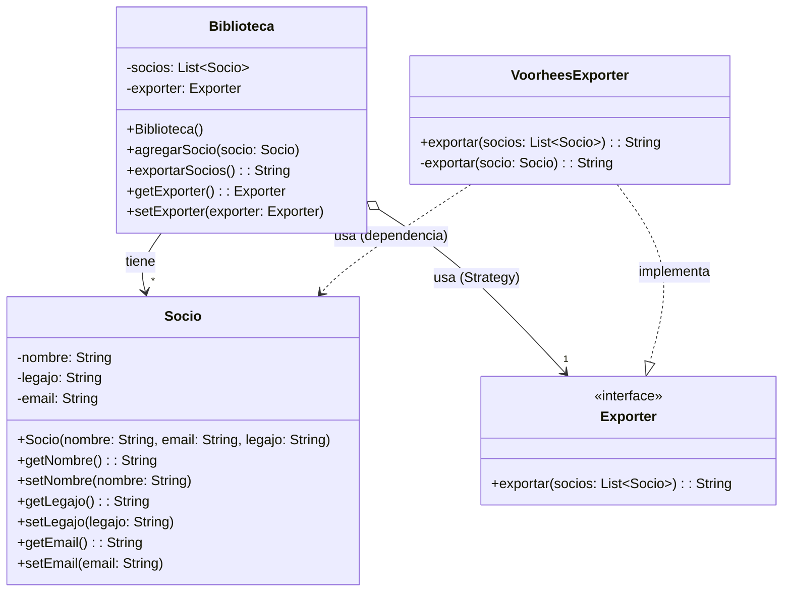
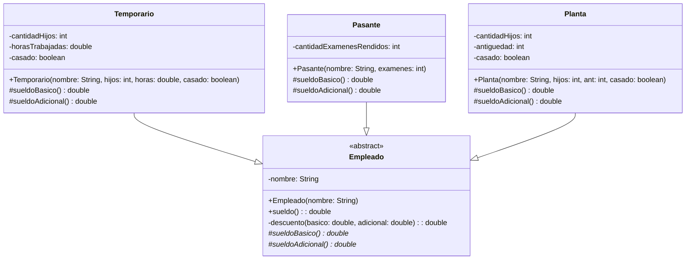
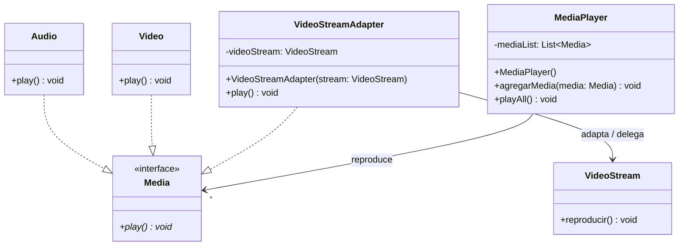
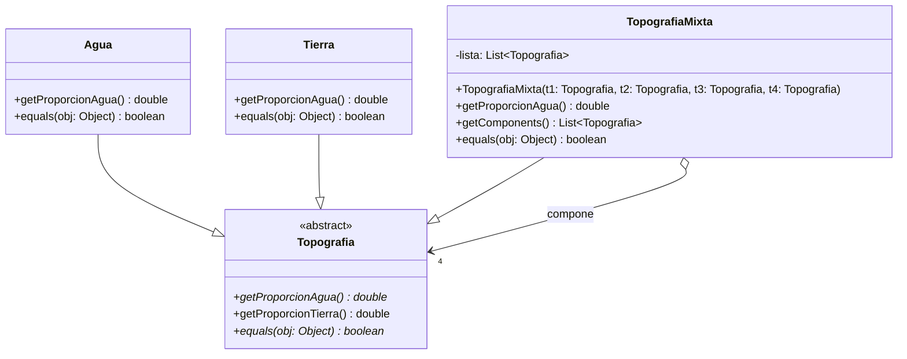
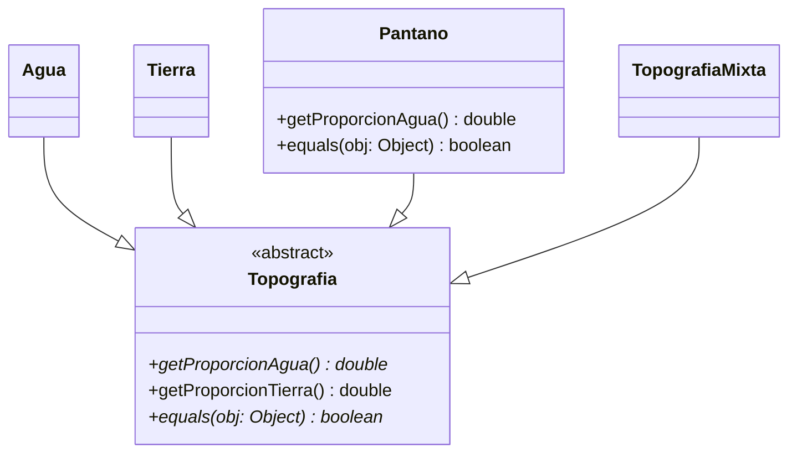
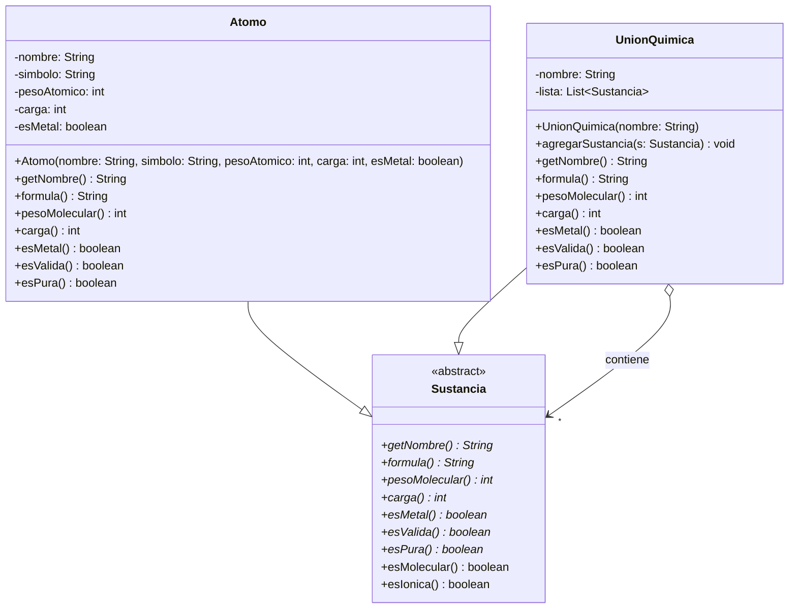
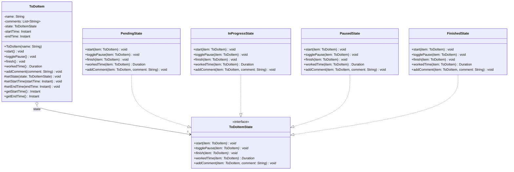
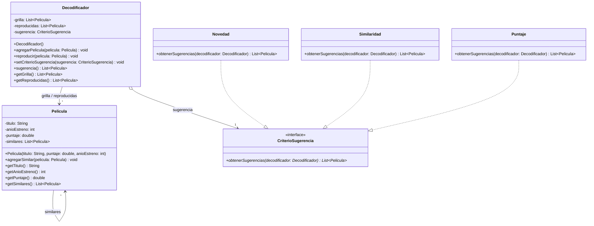
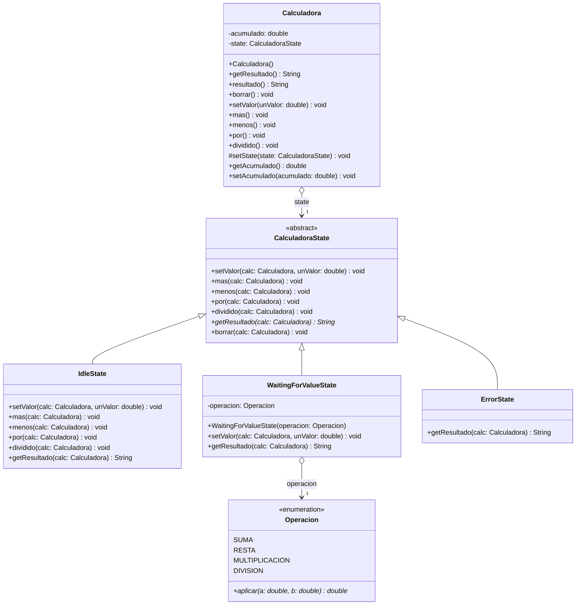

# Resolución Práctica 3: Patrones de Diseño

## Ejercicio 1: Biblioteca (BJSON)

A continuación se detalla el diagrama de clases exacto del modelo provisto.

### 📊 Diagrama de Clases (UML)

```mermaid
classDiagram
    class Biblioteca {
        -socios: List~Socio~
        -exporter: Exporter
        +Biblioteca()
        +agregarSocio(socio: Socio)
        +exportarSocios(): String
        +getExporter(): Exporter
        +setExporter(exporter: Exporter)
    }

    class Socio {
        -nombre: String
        -legajo: String
        -email: String
        +Socio(nombre: String, email: String, legajo: String)
        +getNombre(): String
        +setNombre(nombre: String)
        +getLegajo(): String
        +setLegajo(legajo: String)
        +getEmail(): String
        +setEmail(email: String)
    }

    class Exporter {
        <<interface>>
        +exportar(socios: List~Socio~): String
    }

    class VoorheesExporter {
        +exportar(socios: List~Socio~): String
        -exportar(socio: Socio): String
    }

    %% Relaciones
    Biblioteca --> "*" Socio : tiene 
    Biblioteca o--> "1" Exporter : usa (Strategy)
    VoorheesExporter ..|> Exporter : implementa
    VoorheesExporter ..> Socio : usa (dependencia)
```

### 🗒️ Notas de corrección
*   **Acoplamiento débil (Polimorfismo):** Se debe prestar especial atención a que la clase `Biblioteca` **conoce a la interfaz `Exporter`** y no a la clase concreta `VoorheesExporter`. En el UML se grafica la relación hacia la interfaz, y no hacia el objeto con el que el constructor lo inicializa.
*   **Dependencia en UML:** La flecha punteada (`..>`) desde `VoorheesExporter` hacia `Socio` denota una relación de uso/dependencia. Significando que el exportador depende de la interfaz pública de Socio (*sus getters*) de forma pasajera recibir sus datos como parámetro, sin adueñarse de los objetos.

---

## Ejercicio 2: Cálculo de sueldos

### 📊 Diagrama de Clases (UML) con Template Method

Para evitar la duplicación de código en la estructura de cálculo de sueldo neto y en la deducción de los descuentos comunes, se implementa el patrón **Template Method** en la jerarquía de empleados:

```mermaid
classDiagram
    class Empleado {
        <<abstract>>
        -nombre: String
        +Empleado(nombre: String)
        +sueldo(): double
        -descuento(basico: double, adicional: double): double
        #sueldoBasico()* double
        #sueldoAdicional()* double
    }

    class Temporario {
        -cantidadHijos: int
        -horasTrabajadas: double
        -casado: boolean
        +Temporario(nombre: String, hijos: int, horas: double, casado: boolean)
        #sueldoBasico() double
        #sueldoAdicional() double
    }

    class Pasante {
        -cantidadExamenesRendidos: int
        +Pasante(nombre: String, examenes: int)
        #sueldoBasico() double
        #sueldoAdicional() double
    }

    class Planta {
        -cantidadHijos: int
        -antiguedad: int
        -casado: boolean
        +Planta(nombre: String, hijos: int, ant: int, casado: boolean)
        #sueldoBasico() double
        #sueldoAdicional() double
    }

    Temporario --|> Empleado
    Pasante --|> Empleado
    Planta --|> Empleado
```

### 🗒️ Detalles de Diseño
*   **Template Method:** El método `sueldo()` de `Empleado` es concreto y se define como `final` para evitar su redefinición por las subclases, garantizando la consistencia del algoritmo:
    $$\text{sueldo()} = \text{sueldoBasico()} + \text{sueldoAdicional()} - \text{descuento}(\text{basico}, \text{adicional})$$
*   **Operaciones Primitivas:** `sueldoBasico()` y `sueldoAdicional()` se definen como métodos abstractos protegidos para que cada subclase implemente su variación particular.
*   **Encapsulamiento del Cambio:** Cada subclase declara y encapsula únicamente los atributos de los que depende su lógica de negocio particular (ej. `examenesRendidos` solo en `Pasante`), logrando alta cohesión y evitando acoplamiento inútil en la superclase.

---

## Ejercicio 3: Media Player

### 📊 Diagrama de Clases (UML) con Adapter

Para permitir que `MediaPlayer` reproduzca instancias de `VideoStream` (de una biblioteca externa que no podemos modificar) uniformemente junto a otros tipos de `Media`, se implementa el patrón **Adapter (de objetos)**:

```mermaid
classDiagram
    class Media {
        <<interface>>
        +play()* void
    }

    class Audio {
        +play() void
    }

    class Video {
        +play() void
    }

    class VideoStreamAdapter {
        -videoStream: VideoStream
        +VideoStreamAdapter(stream: VideoStream)
        +play() void
    }

    class VideoStream {
        +reproducir() void
    }

    class MediaPlayer {
        -mediaList: List~Media~
        +MediaPlayer()
        +agregarMedia(media: Media) void
        +playAll() void
    }

    Audio ..|> Media
    Video ..|> Media
    VideoStreamAdapter ..|> Media
    VideoStreamAdapter --> VideoStream : adapta / delega
    MediaPlayer --> "*" Media : reproduce
```

### 🗒️ Roles del Patrón Adapter
*   **Target (Objetivo):** La interfaz `Media` (define el protocolo `play()` esperado por el cliente).
*   **Client (Cliente):** La clase `MediaPlayer` (envía mensajes `play()` a elementos que implementan `Media`).
*   **Adaptee (Adaptado):** La clase `VideoStream` (contiene la lógica incompatible en su método `reproducir()`).
*   **Adapter (Adaptador):** La clase `VideoStreamAdapter` (implementa `Media` y delega internamente en `VideoStream`).

---

## Ejercicio 4: Topografías

### 📊 Diagrama de Clases (UML) con Composite

Para representar cuencas hídricas que pueden ser puras (sólo agua o sólo tierra) o compuestas recursivamente en 4 subporciones, se implementa el patrón **Composite**:

```mermaid
classDiagram
    class Topografia {
        <<abstract>>
        +getProporcionAgua()* double
        +getProporcionTierra() double
        +equals(obj: Object)* boolean
    }

    class Agua {
        +getProporcionAgua() double
        +equals(obj: Object) boolean
    }

    class Tierra {
        +getProporcionAgua() double
        +equals(obj: Object) boolean
    }

    class TopografiaMixta {
        -lista: List~Topografia~
        +TopografiaMixta(t1: Topografia, t2: Topografia, t3: Topografia, t4: Topografia)
        +getProporcionAgua() double
        +getComponents() List~Topografia~
        +equals(obj: Object) boolean
    }

    Agua --|> Topografia
    Tierra --|> Topografia
    TopografiaMixta --|> Topografia
    TopografiaMixta o--> "4" Topografia : compone
```

### 🗒️ Roles del Patrón Composite
*   **Component (Componente):** La clase abstracta `Topografia`. Define la interfaz común y métodos reutilizables (como `getProporcionTierra()`).
*   **Leaf (Hoja):** Las clases `Agua` y `Tierra`. Representan los elementos básicos de la topología y no contienen hijos.
*   **Composite (Compuesto):** La clase `TopografiaMixta`. Representa agrupaciones complejas de 4 subtopografías, delegando recursivamente cálculos y comparaciones.
*   **Uniformidad:** El cliente interactúa con la abstracción `Topografia` de manera uniforme, sin necesidad de distinguir el tipo concreto de celda.

---

## Ejercicio 4b: Más Topografías

### 📊 Extensión de la jerarquía (UML)

Para agregar soporte al terreno de tipo **Pantano**, simplemente añadimos una nueva clase hoja (`Leaf`) que herede de la clase abstracta `Topografia`:

```mermaid
classDiagram
    class Topografia {
        <<abstract>>
        +getProporcionAgua()* double
        +getProporcionTierra() double
        +equals(obj: Object)* boolean
    }

    class Agua
    class Tierra
    class Pantano {
        +getProporcionAgua() double
        +equals(obj: Object) boolean
    }
    class TopografiaMixta

    Agua --|> Topografia
    Tierra --|> Topografia
    Pantano --|> Topografia
    TopografiaMixta --|> Topografia
```

### 🗒️ Detalles de Diseño
*   **Extensibilidad (Open/Closed Principle):** Se incorporó el nuevo tipo de terreno `Pantano` **sin modificar** ninguna de las clases existentes (`Topografia`, `Agua`, `Tierra`, ni `TopografiaMixta`). Esto demuestra el poder de extensión del patrón *Composite*.
*   **Reuso de Comportamiento:** La clase `Pantano` solo redefine `getProporcionAgua()` retornando `0.7`. El cálculo de su proporción de tierra se delega automáticamente a la superclase `Topografia`, retornando `1.0 - 0.7 = 0.3` de forma heredada y reutilizable.
*   **Igualdad:** Se sobrescribe `equals(Object)` en `Pantano` para que sea igual únicamente a otras instancias de `Pantano`.

---

## Ejercicio 5: Sustancias químicas

### 📊 Diagrama de Clases (UML) con Composite

Para modelar sustancias que pueden ser simples (átomos) o compuestas recursivamente por la unión de otras sustancias (uniones químicas), se implementa el patrón **Composite**:

```mermaid
classDiagram
    class Sustancia {
        <<abstract>>
        +getNombre()* String
        +formula()* String
        +pesoMolecular()* int
        +carga()* int
        +esMetal()* boolean
        +esValida()* boolean
        +esPura()* boolean
        +esMolecular() boolean
        +esIonica() boolean
    }

    class Atomo {
        -nombre: String
        -simbolo: String
        -pesoAtomico: int
        -carga: int
        -esMetal: boolean
        +Atomo(nombre: String, simbolo: String, pesoAtomico: int, carga: int, esMetal: boolean)
        +getNombre() String
        +formula() String
        +pesoMolecular() int
        +carga() int
        +esMetal() boolean
        +esValida() boolean
        +esPura() boolean
    }

    class UnionQuimica {
        -nombre: String
        -lista: List~Sustancia~
        +UnionQuimica(nombre: String)
        +agregarSustancia(s: Sustancia) void
        +getNombre() String
        +formula() String
        +pesoMolecular() int
        +carga() int
        +esMetal() boolean
        +esValida() boolean
        +esPura() boolean
    }

    Atomo --|> Sustancia
    UnionQuimica --|> Sustancia
    UnionQuimica o--> "*" Sustancia : contiene
```

### 🗒️ Roles del Patrón Composite
*   **Component (Componente):** La clase abstracta `Sustancia`. Define la interfaz común y métodos comunes (como `esMolecular()` y `esIonica()`).
*   **Leaf (Hoja):** La clase `Atomo`. Representa los átomos simples e indivisibles de la tabla periódica.
*   **Composite (Compuesto):** La clase `UnionQuimica`. Representa las uniones complejas de múltiples sustancias (átomos o subuniones), delegando recursivamente cálculos de peso, carga, y fórmulas.

### 🗒️ Detalles de Diseño
*   **Validación de Combinación (esValida):** Una unión química es válida si todos sus componentes son válidos recursivamente y **no contiene más de un metal directo** (evitando la combinación Metal + Metal).
*   **Algoritmo de Fórmulas Dinámico:** En `UnionQuimica`, el método `formula()` cuenta los componentes usando un `LinkedHashMap` para mantener el orden, agrupando y agregando paréntesis de forma recursiva sólo para subuniones que se repitan (por ejemplo, `Ca(OH)2`).

---

## Ejercicio 6: SubteWay

### 📊 Diagrama de Clases (UML) con Builder

Para desacoplar el proceso de construcción paso a paso de un sandwich complejo (`Sandwich`) de su representación y las variaciones particulares de cada menú, se implementa el patrón **Builder**:

```mermaid
classDiagram
    class Sandwich {
        -pan: String
        -precioPan: double
        -aderezo: String
        -precioAderezo: double
        -principal: String
        -precioPrincipal: double
        -adicional: String
        -precioAdicional: double
        +getPrecio() double
        +getPan() String
        +setPan(pan: String, precio: double) void
        +getAderezo() String
        +setAderezo(aderezo: String, precio: double) void
        +getPrincipal() String
        +setPrincipal(principal: String, precio: double) void
        +getAdicional() String
        +setAdicional(adicional: String, precio: double) void
    }

    class SandwichBuilder {
        <<abstract>>
        #sandwich: Sandwich
        +crearNuevoSandwich() void
        +getSandwich() Sandwich
        +buildPan()* void
        +buildAderezo()* void
        +buildPrincipal()* void
        +buildAdicional()* void
    }

    class ClasicoBuilder {
        +buildPan() void
        +buildAderezo() void
        +buildPrincipal() void
        +buildAdicional() void
    }

    class VegetarianoBuilder {
        +buildPan() void
        +buildAderezo() void
        +buildPrincipal() void
        +buildAdicional() void
    }

    class VeganoBuilder {
        +buildPan() void
        +buildAderezo() void
        +buildPrincipal() void
        +buildAdicional() void
    }

    class SinTaccBuilder {
        +buildPan() void
        +buildAderezo() void
        +buildPrincipal() void
        +buildAdicional() void
    }

    class SubteWayDirector {
        -builder: SandwichBuilder
        +SubteWayDirector(builder: SandwichBuilder)
        +setBuilder(builder: SandwichBuilder) void
        +construirSandwich() void
        +getSandwich() Sandwich
    }

    ClasicoBuilder --|> SandwichBuilder
    VegetarianoBuilder --|> SandwichBuilder
    VeganoBuilder --|> SandwichBuilder
    SinTaccBuilder --|> SandwichBuilder
    SubteWayDirector o--> "1" SandwichBuilder : usa
    SandwichBuilder o--> "1" Sandwich : construye/retorna
```

### 🗒️ Roles del Patrón Builder
*   **Product (Producto):** La clase `Sandwich`, que representa el objeto complejo en construcción con sus ingredientes y cálculo de precio total.
*   **Builder (Constructor abstracto):** La clase abstracta `SandwichBuilder`. Define el protocolo común de pasos de construcción (`buildPan()`, `buildAderezo()`, etc.) y provee el método para recuperar el producto final.
*   **Concrete Builder (Constructores concretos):** `ClasicoBuilder`, `VegetarianoBuilder`, `VeganoBuilder` y `SinTaccBuilder`. Implementan los pasos específicos del menú (ej. `VeganoBuilder` agrega pan integral, salsa criolla, milanesa de gírgolas y no tiene adicionales).
*   **Director:** La clase `SubteWayDirector`. Controla la secuencia ordenada de los pasos de construcción, asegurando que se invoquen en la secuencia adecuada para ensamblar el sandwich.

---

## Ejercicio 8: ToDoItem

### 📊 Diagrama de Clases (UML) con State

Para modelar las transiciones de estado de un ítem de tarea de manera dinámica, evitando estructuras condicionales complejas que dependan de flags internas, se implementa el patrón **State**:

```mermaid
classDiagram
    class ToDoItem {
        -name: String
        -comments: List~String~
        -state: ToDoItemState
        -startTime: Instant
        -endTime: Instant
        +ToDoItem(name: String)
        +start() void
        +togglePause() void
        +finish() void
        +workedTime() Duration
        +addComment(comment: String) void
        #setState(state: ToDoItemState) void
        #setStartTime(startTime: Instant) void
        #setEndTime(endTime: Instant) void
        +getStartTime() Instant
        +getEndTime() Instant
    }

    class ToDoItemState {
        <<interface>>
        +start(item: ToDoItem)* void
        +togglePause(item: ToDoItem)* void
        +finish(item: ToDoItem)* void
        +workedTime(item: ToDoItem)* Duration
        +addComment(item: ToDoItem, comment: String)* void
    }

    class PendingState {
        +start(item: ToDoItem) void
        +togglePause(item: ToDoItem) void
        +finish(item: ToDoItem) void
        +workedTime(item: ToDoItem) Duration
        +addComment(item: ToDoItem, comment: String) void
    }

    class InProgressState {
        +start(item: ToDoItem) void
        +togglePause(item: ToDoItem) void
        +finish(item: ToDoItem) void
        +workedTime(item: ToDoItem) Duration
        +addComment(item: ToDoItem, comment: String) void
    }

    class PausedState {
        +start(item: ToDoItem) void
        +togglePause(item: ToDoItem) void
        +finish(item: ToDoItem) void
        +workedTime(item: ToDoItem) Duration
        +addComment(item: ToDoItem, comment: String) void
    }

    class FinishedState {
        +start(item: ToDoItem) void
        +togglePause(item: ToDoItem) void
        +finish(item: ToDoItem) void
        +workedTime(item: ToDoItem) Duration
        +addComment(item: ToDoItem, comment: String) void
    }

    ToDoItem o--> "1" ToDoItemState : state
    PendingState ..|> ToDoItemState
    InProgressState ..|> ToDoItemState
    PausedState ..|> ToDoItemState
    FinishedState ..|> ToDoItemState
```

### 🗒️ Roles del Patrón State
*   **Context (Contexto):** La clase `ToDoItem`. Mantiene la referencia a la instancia del estado actual (`state`) y expone la interfaz para los clientes, delegando todo el comportamiento de negocio al estado.
*   **State (Estado abstracto):** La interfaz `ToDoItemState`. Declara los métodos correspondientes a cada acción que cambia su comportamiento según el estado del contexto.
*   **Concrete States (Estados concretos):** Las clases `PendingState`, `InProgressState`, `PausedState` y `FinishedState`. Cada una de ellas implementa las reglas de transición y la lógica de negocio válida para esa etapa en particular:
    *   `PendingState` permite iniciar la tarea y registrar el tiempo de comienzo, lanzando errores al intentar pausar o pedir el tiempo trabajado.
    *   `InProgressState` y `PausedState` permiten pausar (alternar), registrar comentarios y finalizar (guardando el tiempo final). Calculan el tiempo trabajado de forma dinámica usando `Instant.now()`.
    *   `FinishedState` calcula la duración estática final (entre `startTime` y `endTime`), ignora los nuevos comentarios y lanza errores si se intenta pausar.

---

## Ejercicio 9: Decodificador de películas

### 📊 Diagrama de Clases (UML) con Strategy

Para permitir que el algoritmo de recomendación de películas varíe dinámicamente y sea fácilmente extensible a nuevos criterios sin acoplamiento rígido en la clase principal, se implementa el patrón **Strategy**:

```mermaid
classDiagram
    class Pelicula {
        -titulo: String
        -anioEstreno: int
        -puntaje: double
        -similares: List~Pelicula~
        +Pelicula(titulo: String, puntaje: double, anioEstreno: int)
        +agregarSimilar(pelicula: Pelicula) void
        +getTitulo() String
        +getAnioEstreno() int
        +getPuntaje() double
        +getSimilares() List~Pelicula~
    }

    class Decodificador {
        -grilla: List~Pelicula~
        -reproducidas: List~Pelicula~
        -sugerencia: CriterioSugerencia
        +Decodificador()
        +agregarPelicula(pelicula: Pelicula) void
        +reproducir(pelicula: Pelicula) void
        +setCriterioSugerencia(sugerencia: CriterioSugerencia) void
        +sugerencia() List~Pelicula~
        +getGrilla() List~Pelicula~
        +getReproducidas() List~Pelicula~
    }

    class CriterioSugerencia {
        <<interface>>
        +obtenerSugerencias(decodificador: Decodificador)* List~Pelicula~
    }

    class Novedad {
        +obtenerSugerencias(decodificador: Decodificador) List~Pelicula~
    }

    class Similaridad {
        +obtenerSugerencias(decodificador: Decodificador) List~Pelicula~
    }

    class Puntaje {
        +obtenerSugerencias(decodificador: Decodificador) List~Pelicula~
    }

    Decodificador o--> "1" CriterioSugerencia : sugerencia
    Decodificador --> "*" Pelicula : grilla / reproducidas
    Pelicula --> "*" Pelicula : similares
    Novedad ..|> CriterioSugerencia
    Similaridad ..|> CriterioSugerencia
    Puntaje ..|> CriterioSugerencia
```

### 🗒️ Roles del Patrón Strategy
*   **Context (Contexto):** La clase `Decodificador`. Mantiene la grilla de películas del catálogo, la lista de películas ya vistas por el usuario, y delega la responsabilidad de sugerir películas a la estrategia actualmente activa (`sugerencia`).
*   **Strategy (Estrategia abstracta):** La interfaz `CriterioSugerencia`. Declara una interfaz común para todos los algoritmos de recomendación soportados (`obtenerSugerencias()`).
*   **Concrete Strategies (Estrategias concretas):** Las clases `Novedad`, `Similaridad` y `Puntaje`. Cada una encapsula un algoritmo de filtrado, ordenación y selección específico de 3 películas:
    *   `Novedad` selecciona películas no reproducidas ordenadas de más reciente a más antigua.
    *   `Similaridad` busca y ordena las películas similares a las que ya vio el usuario, excluyendo las vistas.
    *   `Puntaje` ordena películas no reproducidas por puntaje de mayor a menor y desempata por año de estreno.
*   **Facilidad de Extensión (Open/Closed Principle):** Se pueden agregar nuevos criterios de sugerencia implementando la interfaz `CriterioSugerencia`, sin necesidad de modificar el decodificador existente ni las otras estrategias.

---

## Ejercicio 10: Calculadora

### 📊 Diagrama de Clases (UML) con State

Para modelar la lógica de transiciones de una calculadora tradicional, gestionando el ingreso de operandos, operadores y capturando errores de forma polimórfica sin llenar de bifurcaciones condicionales la clase de negocio, se implementa el patrón **State**:

```mermaid
classDiagram
    class Calculadora {
        -acumulado: double
        -state: CalculadoraState
        +Calculadora()
        +getResultado() String
        +resultado() String
        +borrar() void
        +setValor(unValor: double) void
        +mas() void
        +menos() void
        +por() void
        +dividido() void
        #setState(state: CalculadoraState) void
        +getAcumulado() double
        +setAcumulado(acumulado: double) void
    }

    class CalculadoraState {
        <<abstract>>
        +setValor(calc: Calculadora, unValor: double) void
        +mas(calc: Calculadora) void
        +menos(calc: Calculadora) void
        +por(calc: Calculadora) void
        +dividido(calc: Calculadora) void
        +getResultado(calc: Calculadora)* String
        +borrar(calc: Calculadora) void
    }

    class IdleState {
        +setValor(calc: Calculadora, unValor: double) void
        +mas(calc: Calculadora) void
        +menos(calc: Calculadora) void
        +por(calc: Calculadora) void
        +dividido(calc: Calculadora) void
        +getResultado(calc: Calculadora) String
    }

    class WaitingForValueState {
        -operacion: Operacion
        +WaitingForValueState(operacion: Operacion)
        +setValor(calc: Calculadora, unValor: double) void
        +getResultado(calc: Calculadora) String
    }

    class ErrorState {
        +getResultado(calc: Calculadora) String
    }

    class Operacion {
        <<enumeration>>
        SUMA
        RESTA
        MULTIPLICACION
        DIVISION
        +aplicar(a: double, b: double)* double
    }

    Calculadora o--> "1" CalculadoraState : state
    CalculadoraState <|-- IdleState
    CalculadoraState <|-- WaitingForValueState
    CalculadoraState <|-- ErrorState
    WaitingForValueState o--> "1" Operacion : operacion
```

### 🗒️ Roles del Patrón State
*   **Context (Contexto):** La clase `Calculadora`. Mantiene el acumulador del cálculo actual (`acumulado`) y delega el protocolo completo a su estado activo.
*   **State (Estado abstracto):** La clase abstracta `CalculadoraState`. Define el comportamiento por defecto de lanzar un error (`ErrorState`) para cualquier comando de operación inesperado. Esto simplifica drásticamente el código de las subclases concretas.
*   **Concrete States (Estados concretos):**
    *   `IdleState`: Representa el reposo. Permite la asignación directa de valores y la selección de operadores matemáticos, transicionando a `WaitingForValueState`.
    *   `WaitingForValueState`: Espera obligatoriamente un operando numérico. Si recibe `setValor(x)`, aplica la operación y retorna a `IdleState`. Si recibe cualquier otro método, transiciona inmediatamente a `ErrorState` (heredado por defecto de `CalculadoraState`).
    *   `ErrorState`: Captura fallos (como división por cero o transiciones inválidas). Solo permite salir del error y volver a 0 mediante `borrar()`.
*   **Encapsulamiento Matemático (Enum):** La enumeración `Operacion` encapsula la lógica aritmética y el control de división por cero de manera independiente, permitiendo a `WaitingForValueState` ser reutilizable para cualquier operador.

