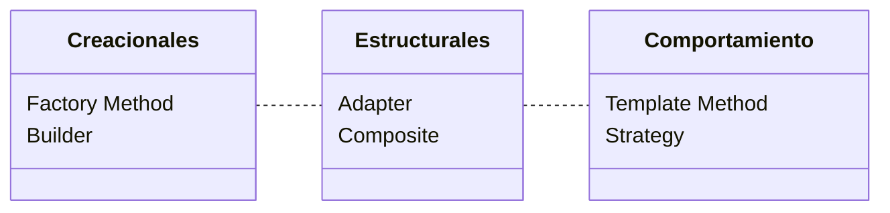

<h1 align="center">
  <br>
  <code>OO2</code>
  <br>
  <sub>Orientación a Objetos 2 — UNLP</sub>
  <br>
</h1>

<p align="center">
  
  
  
  
  
</p>

<br>

> *"Each pattern describes a problem which occurs over and over again in our environment, and then describes the core of the solution to that problem, in such a way that you can use this solution a million times over, without ever doing it the same way twice."*
>
> — Christopher Alexander, 1977

<br>

---

## `>_ roadmap`

El recorrido de la materia puede pensarse como un viaje de 3 etapas. Primero aprendemos a **limpiar** código existente. Después aprendemos a **diseñar** con patrones probados. Finalmente, combinamos ambas disciplinas.


---

## `>_ teoría`

<details open>
<summary><b>🧹 Etapa 1 — Refactoring</b> <sub><i>Clases 1 y 2</i></sub></summary>
<br>

<table>
  <tr>
    <td width="50" align="center">📄</td>
    <td><a href="Teoria/Resumenes/Clase1.md"><b>Clase 1</b> — Introducción a Refactoring</a></td>
  </tr>
  <tr>
    <td></td>
    <td>
      Leyes de Lehman · Big Ball of Mud · Definición formal de Refactoring<br>
      <code>Encapsulate Field</code> · <code>Pull Up Field</code> · <code>Pull Up Method</code>
    </td>
  </tr>
  <tr><td colspan="2"><br></td></tr>
  <tr>
    <td width="50" align="center">📄</td>
    <td><a href="Teoria/Resumenes/Clase2.md"><b>Clase 2</b> — Catálogo de Refactoring & Herramientas</a></td>
  </tr>
  <tr>
    <td></td>
    <td>
      Code Smells (7 categorías) · Código CLEAN · Metáfora de los 2 sombreros<br>
      <code>Extract Method</code> · <code>Move Method</code> · <code>Replace Conditional w/ Polymorphism</code><br>
      Ejemplo integrador: Club de Tenis 🎾 · AST & herramientas automáticas
    </td>
  </tr>
</table>

</details>

<details open>
<summary><b>🧩 Etapa 2 — Patrones de Diseño</b> <sub><i>Clases 3 y 4</i></sub></summary>
<br>

<table>
  <tr>
    <td width="50" align="center">📄</td>
    <td><a href="Teoria/Resumenes/Clase3.md"><b>Clase 3</b> — Intro a Patrones: Adapter & Template Method</a></td>
  </tr>
  <tr>
    <td></td>
    <td>
      Origen de los patrones (Christopher Alexander) · Catálogo GoF<br>
      <code>Adapter</code> <sub>estructural</sub> · <code>Template Method</code> <sub>comportamiento</sub><br>
      Ejemplo: Sensores IoT + TelegramNotifier · Exportadores de Reportes
    </td>
  </tr>
  <tr><td colspan="2"><br></td></tr>
  <tr>
    <td width="50" align="center">📄</td>
    <td><a href="Teoria/Resumenes/Clase4.md"><b>Clase 4</b> — Composite, Factory Method & Builder</a></td>
  </tr>
  <tr>
    <td></td>
    <td>
      <code>Composite</code> <sub>estructural</sub> · <code>Factory Method</code> <sub>creacional</sub> · <code>Builder</code> <sub>creacional</sub><br>
      Ejemplo: Elementos Químicos · Mezclador de Pinturas · Viajes de Egresados<br>
      Tabla comparativa FM vs Builder · Errores comunes de parciales y finales
    </td>
  </tr>
</table>

</details>

> 📂 [Material original de cátedra (PDFs)](Teoria/Material_Original/)

---

## `>_ prácticas`

```
Practicas/
├── Practica_1/    Red Social (repaso OO1)          → proyecto Java
├── Practica_2/    Refactoring & Code Smells         → resolución .md + consigna
└── Practica_3/    Patrones de Diseño (Strategy)     → proyecto Maven + tests JUnit
```

| # | Proyecto | Qué hay | Link |
|:-:|---|---|:-:|
| **1** | Red Social | Clases Java, herencia, polimorfismo | [→](Practicas/Practica_1/) |
| **2** | Refactoring | Resolución de ejercicios de Code Smells con antes/después | [→](Practicas/Practica_2/) |
| **3** | Biblioteca (BJSON) | Proyecto Maven con `Exporter` (Strategy), tests JUnit 5, diagrama UML | [→](Practicas/Practica_3/) |

---

## `>_ patrones`

Mapa visual de todos los patrones de diseño cubiertos hasta ahora en la cursada:



<table align="center">
  <tr>
    <td align="center">
      <b>Adapter</b><br>
      <sub>Convertir interfaces<br>incompatibles</sub>
    </td>
    <td align="center">
      <b>Template Method</b><br>
      <sub>Esqueleto de algoritmo<br>pasos variables</sub>
    </td>
    <td align="center">
      <b>Composite</b><br>
      <sub>Jerarquía parte-todo<br>trato uniforme</sub>
    </td>
  </tr>
  <tr>
    <td align="center">
      <b>Factory Method</b><br>
      <sub>Delegar instanciación<br>a subclases</sub>
    </td>
    <td align="center">
      <b>Builder</b><br>
      <sub>Separar construcción<br>de representación</sub>
    </td>
    <td align="center">
      <b>Strategy</b><br>
      <sub>Intercambiar algoritmos<br>en runtime</sub>
    </td>
  </tr>
</table>

---

## `>_ evaluaciones`

Material de preparación extra, simulacros y resolución de exámenes pasados.

[📁 Directorio de Evaluaciones](Evaluaciones/)

---

## `>_ stack`

<p align="center">
  
</p>

---

<p align="center">
  <sub>Repositorio de uso personal y académico · Material de cátedra © sus respectivos autores</sub>
  <br>
  <sub><a href="https://github.com/auwus21">@auwus21</a> · Facultad de Informática · UNLP</sub>
</p>
