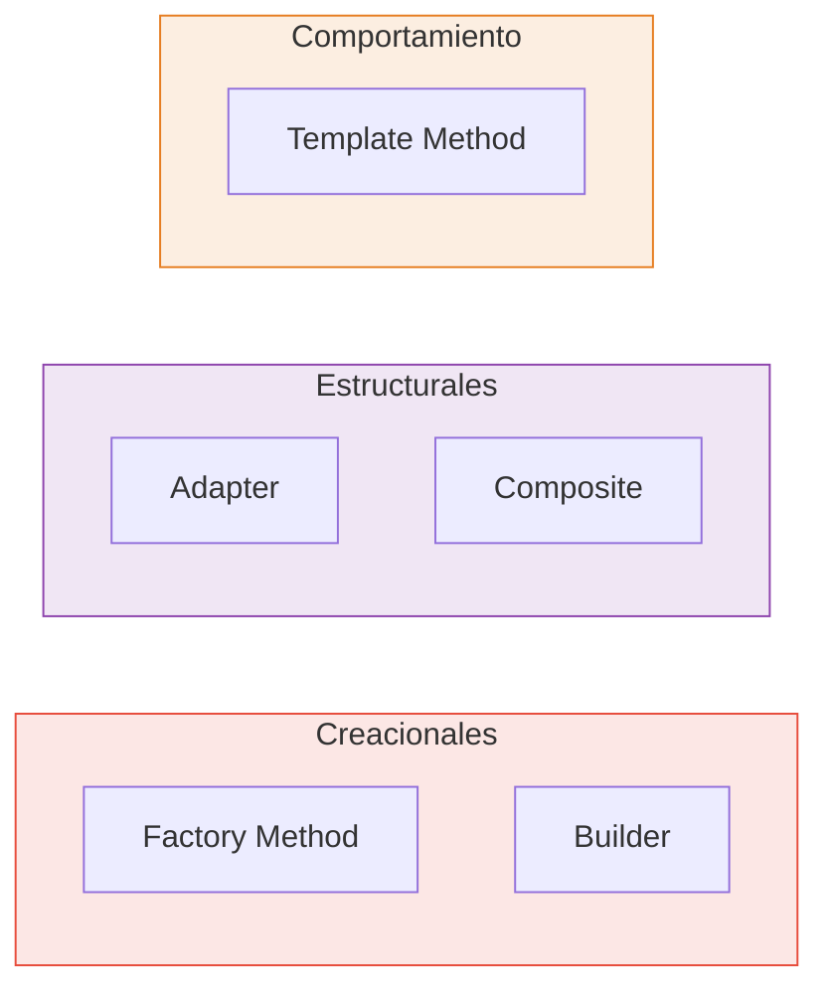

  

  
  
  
  

  

---

Repositorio de estudio personal para la materia **Orientación a Objetos 2**, correspondiente a las carreras Licenciatura en Sistemas y Analista en TIC (UNLP).  
**Docentes:** Dra. Alejandra Garrido · Federico Balaguer

 

## 📖 Teoría — Resúmenes por Clase

Cada resumen incluye diagramas UML en Mermaid, tablas comparativas, código Java y explicaciones "en criollo".

<table>
  <tr>
    <th width="60">Clase</th>
    <th width="350">Contenido</th>
    <th width="250">Temas Clave</th>
  </tr>
  <tr>
    <td align="center"><b>1</b></td>
    <td>
      <a href="Teoria/Resumenes/Clase1.md">📄 Introducción a Refactoring</a>
    </td>
    <td>
      
      
      
    </td>
  </tr>
  <tr>
    <td align="center"><b>2</b></td>
    <td>
      <a href="Teoria/Resumenes/Clase2.md">📄 Catálogo de Refactoring y Herramientas</a>
    </td>
    <td>
      
      
      
      
    </td>
  </tr>
  <tr>
    <td align="center"><b>3</b></td>
    <td>
      <a href="Teoria/Resumenes/Clase3.md">📄 Introducción a Patrones de Diseño</a>
    </td>
    <td>
      
      
      
    </td>
  </tr>
  <tr>
    <td align="center"><b>4</b></td>
    <td>
      <a href="Teoria/Resumenes/Clase4.md">📄 Composite, Factory Method & Builder</a>
    </td>
    <td>
      
      
      
    </td>
  </tr>
</table>

> 📂 **Material oficial de cátedra:** [PDFs y Diapositivas originales](Teoria/Material_Original/)

 

## 💻 Prácticas — Ejercicios Resueltos en Java

<table>
  <tr>
    <th width="60">#</th>
    <th width="300">Tema</th>
    <th width="200">Contenido</th>
    <th width="100">Link</th>
  </tr>
  <tr>
    <td align="center"><b>1</b></td>
    <td>Red Social (OO1 Repaso)</td>
    <td>
      
    </td>
    <td align="center"><a href="Practicas/Practica_1/">📁 Abrir</a></td>
  </tr>
  <tr>
    <td align="center"><b>2</b></td>
    <td>Refactoring (Code Smells)</td>
    <td>
      
      
    </td>
    <td align="center"><a href="Practicas/Practica_2/">📁 Abrir</a></td>
  </tr>
  <tr>
    <td align="center"><b>3</b></td>
    <td>Patrones de Diseño</td>
    <td>
      
      
      
    </td>
    <td align="center"><a href="Practicas/Practica_3/">📁 Abrir</a></td>
  </tr>
</table>

 

## 📝 Evaluaciones

Material de preparación extra, simulacros y resolución de exámenes pasados.

* [📁 Directorio de Evaluaciones](Evaluaciones/)

 

## 🧩 Mapa de Patrones Cubiertos

 

## 🛠️ Stack Tecnológico

  

<table align="center">
  <tr>
    <td align="center"><b>Java 17</b> Lenguaje</td>
    <td align="center"><b>Eclipse</b> IDE</td>
    <td align="center"><b>Maven</b> Build</td>
    <td align="center"><b>JUnit 5</b> Testing</td>
    <td align="center"><b>Git</b> Versionado</td>
  </tr>
</table>

---

  

  Este repositorio es de uso personal y académico · Material de cátedra © sus respectivos autores
   
  Hecho con 🧡 por <a href="https://github.com/auwus21">@auwus21</a>

