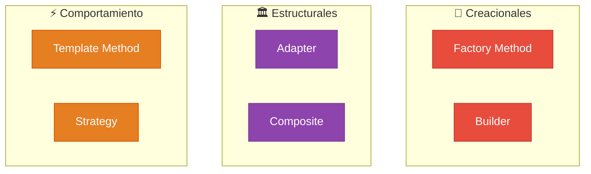

  

  
  
  
  

  

---

Repositorio de estudio personal para la materia **Orientación a Objetos 2**, correspondiente a la carrera Licenciatura en Sistemas / Analista en TIC (UNLP).  
**Docentes:** Dra. Alejandra Garrido · Federico Balaguer

 

## 📖 Resúmenes de Teoría

Cada resumen incluye **diagramas UML**, **tablas comparativas**, **código Java** del antes y después,  y explicaciones en lenguaje simple. Hacé click en cualquier clase para abrirlo.

 

<!-- ═══════════════ CLASE 1 ═══════════════ -->

<table>
  <tr>
    <td width="900">
      <h3>📄 <a href="Teoria/Resumenes/Clase1.md">Clase 1 — Introducción a Refactoring</a></h3>
      <blockquote>¿Por qué el software se degrada con el tiempo? ¿Cómo podemos mejorar código existente sin romperlo?</blockquote>
      

        
        
        
        
        
      

    </td>
  </tr>
</table>

<!-- ═══════════════ CLASE 2 ═══════════════ -->

<table>
  <tr>
    <td width="900">
      <h3>📄 <a href="Teoria/Resumenes/Clase2.md">Clase 2 — Catálogo de Refactoring & Herramientas</a></h3>
      <blockquote>El catálogo completo de malos olores, las técnicas para eliminarlos, y un ejemplo integrador paso a paso con el Club de Tenis 🎾</blockquote>
      

        
        
        
        
      

      

        
        
        
        
      

    </td>
  </tr>
</table>

<!-- ═══════════════ CLASE 3 ═══════════════ -->

<table>
  <tr>
    <td width="900">
      <h3>📄 <a href="Teoria/Resumenes/Clase3.md">Clase 3 — Intro a Patrones: Adapter & Template Method</a></h3>
      <blockquote>Del mundo de la arquitectura al software: el origen de los patrones, el catálogo GoF, y los dos primeros patrones de diseño.</blockquote>
      

        
        
      

      

        
        estructural · interfaces incompatibles
        &nbsp;&nbsp;
        
        comportamiento · esqueleto de algoritmo
      

    </td>
  </tr>
</table>

<!-- ═══════════════ CLASE 4 ═══════════════ -->

<table>
  <tr>
    <td width="900">
      <h3>📄 <a href="Teoria/Resumenes/Clase4.md">Clase 4 — Composite, Factory Method & Builder</a></h3>
      <blockquote>Tres patrones nuevos del GoF: cómo armar árboles parte-todo, delegar la creación de objetos, y separar construcción de representación.</blockquote>
      

        
        estructural · jerarquías parte-todo
      

      

        
        creacional · delegar instanciación
        &nbsp;&nbsp;
        
        creacional · construcción paso a paso
      

      

        
      

    </td>
  </tr>
</table>

 

> 📂 **Material oficial de cátedra (PDFs):** [Abrir directorio](Teoria/Material_Original/)

---

 

## 💻 Prácticas Resueltas

| # | Tema | Contenido | Link |
|:-:|---|---|:-:|
| **1** | Red Social (repaso OO1) | Proyecto Java · Herencia · Polimorfismo | [📁](Practicas/Practica_1/) |
| **2** | Refactoring | Resolución de ejercicios de Code Smells (antes/después en `.md`) | [📁](Practicas/Practica_2/) |
| **3** | Patrones (Biblioteca BJSON) | Proyecto Maven · Strategy · Tests JUnit 5 · Diagrama UML | [📁](Practicas/Practica_3/) |

---

 

## 🧩 Mapa de Patrones Cubiertos

---

 

## 📝 Evaluaciones

Material de preparación extra, simulacros y resolución de exámenes pasados.

📁 [Abrir directorio de Evaluaciones](Evaluaciones/)

---

 

## 🛠️ Stack Tecnológico

  

  <b>Java 17</b> · <b>Eclipse IDE</b> · <b>Maven</b> · <b>JUnit 5</b> · <b>Git & GitHub</b>

---

  

  Repositorio de uso personal y académico · Material de cátedra © sus respectivos autores
   
  Hecho con 🧡 por <a href="https://github.com/auwus21">@auwus21</a>

