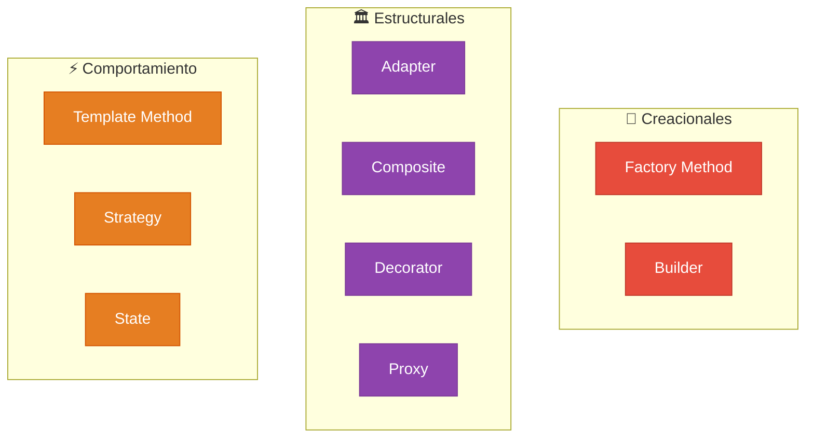

  

  
  
  
  

  

---

Repositorio de estudio personal para la materia **Orientación a Objetos 2**, correspondiente a la carrera Licenciatura en Sistemas / Analista en TIC (UNLP).  
**Docentes:** Dra. Alejandra Garrido · Federico Balaguer

 

## 📖 Resúmenes de Teoría Completa (Organizados por Ejes Temáticos)

Cada resumen incluye **diagramas UML**, **código Java** (antes/después de refactorizar) y explicaciones estructuradas. Hacé click en cualquier tema para abrir su resumen:

### 🧩 Eje 1: Refactoring y Diseño Emergente
| Clase | Tema Principal | Refactorings / Patrones Clave | Link |
|:---:|---|---|:---:|
| **1** | Introducción a Refactoring | Leyes de Lehman · *Encapsulate Field* · *Pull Up Field* · *Pull Up Method* | [📄](Teoria/Resumenes/1_Refactoring/Clase1_Intro.md) |
| **2** | Catálogo de Refactoring | Clasificación de *Code Smells* · *Extract Method* · *Move Method* · *Replace Temp with Query* | [📄](Teoria/Resumenes/1_Refactoring/Clase2_Catalogo.md) |
| **9** | Refactoring to Patterns | Joshua Kerievsky · Recetas para evolucionar código sucio hacia patrones | [📄](Teoria/Resumenes/1_Refactoring/Clase9_RefactoringToPatterns.md) |

### ⚡ Eje 2: Patrones de Diseño (Design Patterns)
| Clase | Tema Principal | Refactorings / Patrones Clave | Link |
|:---:|---|---|:---:|
| **3** | Intro a Patrones de Diseño | Origen GoF · Patrón **Adapter** · Patrón **Template Method** | [📄](Teoria/Resumenes/2_Patrones/Clase3_Adapter_TemplateMethod.md) |
| **4** | Estructurales & Creacionales | Patrón **Composite** · Patrón **Factory Method** · Patrón **Builder** | [📄](Teoria/Resumenes/2_Patrones/Clase4_Composite_Factory_Builder.md) |
| **5** | Profundización de Composite | Variante Segura (*Safe*) vs Transparente (*Transparent*) · Reglas de Composición | [📄](Teoria/Resumenes/2_Patrones/Clase5_Composite_Profundo.md) |
| **6** | Comportamiento | Patrón **Strategy** · Patrón **State** (Manejo de transiciones) | [📄](Teoria/Resumenes/2_Patrones/Clase6_Strategy_State.md) |
| **8** | Estructurales Avanzados | Patrón **Decorator** · Patrón **Proxy** (Virtual, Protección y Remoto) | [📄](Teoria/Resumenes/2_Patrones/Clase8_Decorator_Proxy.md) |

### 🧪 Eje 3: Pruebas Unitarias Avanzadas (Testing)
| Clase | Tema Principal | Refactorings / Patrones Clave | Link |
|:---:|---|---|:---:|
| **7** | Testing Avanzado | **Test Doubles** (Dummies, Fakes, Stubs, Spies, Mocks) · JUnit 5 + Mockito | [📄](Teoria/Resumenes/3_Testing/Clase7_TestDoubles.md) |

### 🏗️ Eje 4: Arquitectura de Frameworks
| Clase | Tema Principal | Refactorings / Patrones Clave | Link |
|:---:|---|---|:---:|
| **10** | Concepto de Frameworks I | Inversión de Control (IoC) · Frozen & Hot Spots · Servidor Mono-hilo | [📄](Teoria/Resumenes/4_Frameworks/Clase10_Conceptos_Basicos.md) |
| **11** | Concepto de Frameworks II | Frameworks de **Caja Blanca** (herencia) vs **Caja Negra** (composición) | [📄](Teoria/Resumenes/4_Frameworks/Clase11_CajaBlanca_CajaNegra.md) |

 

> 📂 **Material oficial de cátedra (PDFs originales):** [Abrir directorio](Teoria/Material_Original/)

---

 

## 💻 Prácticas Resueltas

| # | Tema | Contenido | Link |
|:-:|---|---|:-:|
| **1** | Red Social (Repaso) | Proyecto Java · Herencia · Polimorfismo | [📁](Practicas/Practica_1/) |
| **2** | Refactoring | Resolución de ejercicios de Code Smells (antes/después en `.md`) | [📁](Practicas/Practica_2/) |
| **3** | Patrones (Biblioteca BJSON) | Proyecto Maven · Strategy · Tests JUnit 5 · Diagrama UML | [📁](Practicas/Practica_3/) |
| **4** | Frameworks | Cuadernillo y PDFs explicativos | [📁](Practicas/Practica_4/) |

---

 

## 🧩 Mapa de Patrones de Diseño Cubiertos

El siguiente diagrama sintetiza los patrones GoF estudiados en la cursada, clasificados por su propósito:

```mermaid
graph TB
    subgraph "🔨 Creacionales"
        FM["Factory Method"]
        BU["Builder"]
    end

    subgraph "🏛️ Estructurales"
        AD["Adapter"]
        CO["Composite"]
        DE["Decorator"]
        PR["Proxy"]
    end

    subgraph "⚡ Comportamiento"
        TM["Template Method"]
        ST["Strategy"]
        SE["State"]
    end

    style FM fill:#E74C3C,stroke:#C0392B,color:#fff
    style BU fill:#E74C3C,stroke:#C0392B,color:#fff
    style AD fill:#8E44AD,stroke:#7D3C98,color:#fff
    style CO fill:#8E44AD,stroke:#7D3C98,color:#fff
    style DE fill:#8E44AD,stroke:#7D3C98,color:#fff
    style PR fill:#8E44AD,stroke:#7D3C98,color:#fff
    style TM fill:#E67E22,stroke:#D35400,color:#fff
    style ST fill:#E67E22,stroke:#D35400,color:#fff
    style SE fill:#E67E22,stroke:#D35400,color:#fff
```

---

 

## 📝 Evaluaciones

Material de preparación extra, simulacros y resolución de exámenes parciales anteriores.

📁 [Abrir directorio de Evaluaciones](Evaluaciones/)

---

 

## 🛠️ Stack Tecnológico

  

  <b>Java 17</b> · <b>Eclipse IDE</b> · <b>Maven</b> · <b>JUnit 5</b> · <b>Mockito</b> · <b>Git & GitHub</b>

---

  

  Repositorio de uso personal y académico · Material de cátedra © sus respectivos autores
   
  Hecho con 💜 por <a href="https://github.com/auwus21">@auwus21</a>

