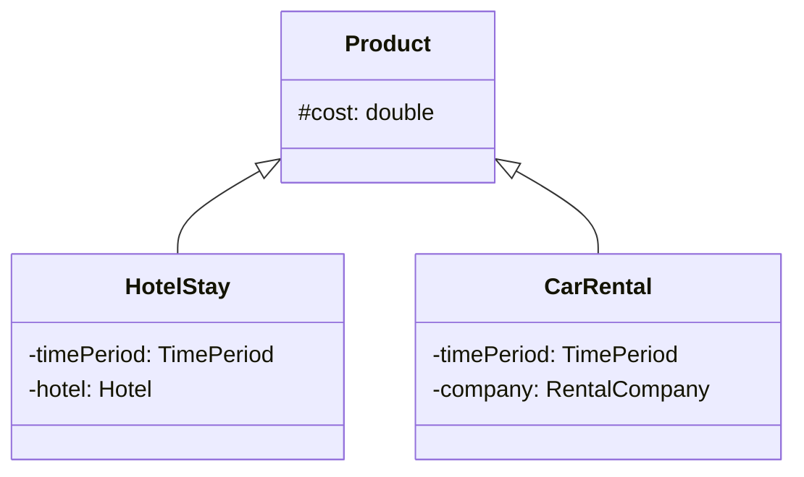

# 📘 Clase 1: Introducción a Refactoring

**Materia:** Orientación a Objetos 2 (OO2) — UNLP  
**Tema Central:** La evolución del software, las Leyes de Lehman, definición formal de Refactoring y primeros refactorings del catálogo.

---

## 🎯 ¿Por qué cambia el Software?

El software **no es estático**. Por más bien diseñado que esté, inevitablemente va a cambiar. Esto fue formalizado por Meir M. Lehman en sus famosas leyes:

### Leyes de Lehman (Evolución del Software)

| Ley | Año | Enunciado | Explicación en lenguaje claro |
|---|---|---|---|
| **Continuing Change** *(Cambio Continuo)* | 1974 | Un sistema que se utiliza debe sufrir modificaciones continuas o se volverá progresivamente **menos satisfactorio**. | El entorno del usuario cambia, aparecen nuevas necesidades y regulaciones. Si el sistema no se adapta, muere. |
| **Continuing Growth** *(Crecimiento Continuo)* | 1991 | La funcionalidad de un sistema debe ser **incrementada continuamente** para mantener la satisfacción del cliente. | Los usuarios demandan nuevas características y mejoras funcionales a lo largo del tiempo. |
| **Increasing Complexity** *(Complejidad Creciente)* | 1974 | A medida que un sistema evoluciona, su complejidad se **incrementa**, a menos que se trabaje activamente para evitarlo. | Agregar código nuevo sin reestructurar degrada la arquitectura original. El refactoring combate esta ley. |
| **Declining Quality** *(Calidad Declinante)* | 1996 | La calidad de un sistema va a ir **declinando** a menos que se haga un mantenimiento riguroso y adaptativo. | La acumulación de parches rápidos y código desorganizado degrada la mantenibilidad del sistema. |

---

## 💰 El Costo del Mantenimiento

El mantenimiento del software consume la mayor parte del presupuesto del ciclo de vida de un sistema. Se clasifica en:
*   **Correctivo:** Corregir defectos (bugs).
*   **Evolutivo:** Agregar nuevas funcionalidades solicitadas por el cliente.
*   **Adaptativo:** Modificar el sistema para que funcione en nuevos entornos (bases de datos, hardware, librerías).
*   **Perfectivo:** Mejorar características no funcionales como la legibilidad o el rendimiento.
*   **Preventivo:** Reestructurar el código existente para facilitar su mantenimiento futuro.

> [!IMPORTANT]
> **El factor de legibilidad:** Entender código existente consume el **50% del tiempo de mantenimiento**. Escribir código legible y autodocumentado tiene un impacto directo y positivo en los costos de desarrollo.

---

## 🍝 El Problema: Big Ball of Mud (Gran Bola de Barro)

Cuando no se realiza un mantenimiento arquitectónico y preventivo continuo, los sistemas tienden a convertirse en un **Big Ball of Mud**:
*   Sistemas que carecen de una arquitectura limpia y definida.
*   Código spaghetti donde todo está acoplado con todo.
*   Cualquier cambio pequeño produce efectos colaterales (bugs) en partes inesperadas.

### Heurísticas de Diseño
*   Los elementos clave de la arquitectura **no surgen de antemano de forma perfecta**, sino que se descubren y refinan a medida que el código funciona y evoluciona.
*   Construir el sistema perfecto en la primera iteración es imposible; se aprende del **feedback** y del reuso.

---

## 🔧 Refactoring: Definición Formal

### Como sustantivo:
> Un **Refactoring** es una transformación que se realiza en la estructura interna del software para hacerlo **más fácil de entender** y **más barato de modificar**, sin alterar su **comportamiento observable**.

### Como verbo (Proceso):
> Es el proceso de cambiar un sistema de software para mejorar su estructura interna, legibilidad y mantenibilidad **luego de haber sido escrito**, sin alterar el comportamiento externo.

### Regla de oro:
> Si el comportamiento cambia (se rompen tests de unidad, cambian las salidas ante las mismas entradas), la transformación **NO** es un refactoring.

---

## ⚙️ Estructura de un Refactoring del Catálogo

Todo refactoring documentado formalmente posee:
1.  **Nombre:** Un identificador claro en el catálogo de Fowler (ej. *Extract Method*).
2.  **Precondiciones:** Condiciones que deben cumplirse antes del cambio para garantizar la seguridad de la transformación.
3.  **Mecánica:** Pasos ordenados a seguir. Después de cada paso, se debe **compilar y correr los tests** para detectar fallas tempranas.

---

## 📦 Caso de Estudio: Jerarquía `Product`

Para ilustrar los primeros refactorings, analizamos una jerarquía de productos de reserva vacacionales compuesta por `Product`, `HotelStay` y `CarRental`.

### Código Inicial (Sucio)

```java
// HotelStay.java
public class HotelStay {
    public double cost; // Violación de encapsulamiento (pública)
    private TimePeriod timePeriod;
    private Hotel hotel;

    public Date startDate() {
        return timePeriod.getStart();
    }

    public Date endDate() {
        return timePeriod.getEnd();
    }

    public double price() {
        return timePeriod.duration() * hotel.nightPrice() * hotel.discountRate();
    }

    public double priceFactor() {
        return cost / this.price();
    }
}

// CarRental.java
public class CarRental {
    public double cost; // Violación de encapsulamiento y duplicado
    private TimePeriod timePeriod;
    private RentalCompany company;

    public Date startDate() {
        return timePeriod.getStart();
    }

    public Date endDate() {
        return timePeriod.getEnd();
    }

    public double price() {
        return company.price() * company.promotionRate();
    }

    public double cost() {
        return cost;
    }
}
```

### Code Smells (Malos Olores) Detectados:
1.  **Romper Encapsulamiento:** La variable `cost` es pública en ambas clases.
2.  **Código Duplicado:**
    *   La variable `cost` está repetida en ambas clases.
    *   Los métodos `startDate()` y `endDate()` son idénticos en su lógica y estructura en ambas subclases.

---

## 🛠️ Catálogo: Refactorings Aplicados

### 1. Encapsulate Field *(Encapsular Campo)*
*   **Problema:** Un campo es público, lo que permite el acoplamiento directo de clientes externos y dificulta el cambio interno.
*   **Precondiciones:** Ninguna compleja.
*   **Mecánica:**
    1.  Si hay referencias directas externas, crear métodos de acceso (`get` / `set`).
    2.  Reemplazar todas las referencias directas al campo por llamadas a los accessors creados.
    3.  Cambiar la visibilidad del campo a `private`.
    4.  Compilar y testear.

```java
// Antes
public double cost;

// Después
private double cost;
public double getCost() { return this.cost; }
public void setCost(double cost) { this.cost = cost; }
```

### 2. Pull Up Field *(Subir Campo)*
*   **Problema:** Dos o más subclases tienen el mismo campo declarativamente idéntico.
*   **Precondiciones:**
    *   Los campos representan semánticamente lo mismo.
    *   Tienen el mismo nombre y tipo (si no, renombrarlos antes).
    *   No debe existir un campo con ese nombre en la superclase.
*   **Mecánica:**
    1.  Declarar el campo en la superclase común.
    2.  Si es necesario que las subclases lo accedan directamente, declararlo como `protected`.
    3.  Eliminar el campo de las subclases.
    4.  Compilar y testear.



### 3. Pull Up Method *(Subir Método)*
*   **Problema:** Métodos idénticos en subclases de una misma jerarquía.
*   **Precondiciones:**
    *   El comportamiento y la signatura deben ser idénticos.
    *   Los recursos que utiliza el método (atributos, otros métodos) deben ser accesibles desde la superclase (subir variables necesarias a la superclase primero, o declarar métodos abstractos en ella).
*   **Mecánica:**
    1.  Crear el método en la superclase con el cuerpo idéntico.
    2.  Borrar el método en una de las subclases, compilar y testear.
    3.  Repetir para las demás subclases.

```java
// En la clase abstracta Product
public abstract class Product {
    protected double cost;
    protected TimePeriod timePeriod; // Subido previamente mediante Pull Up Field

    public Date startDate() {
        return timePeriod.getStart();
    }

    public Date endDate() {
        return timePeriod.getEnd();
    }
}
```
