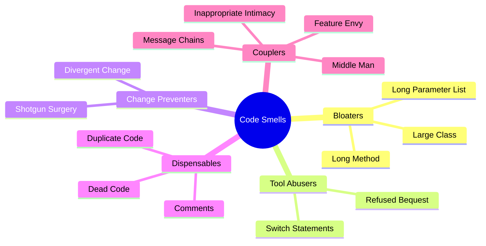
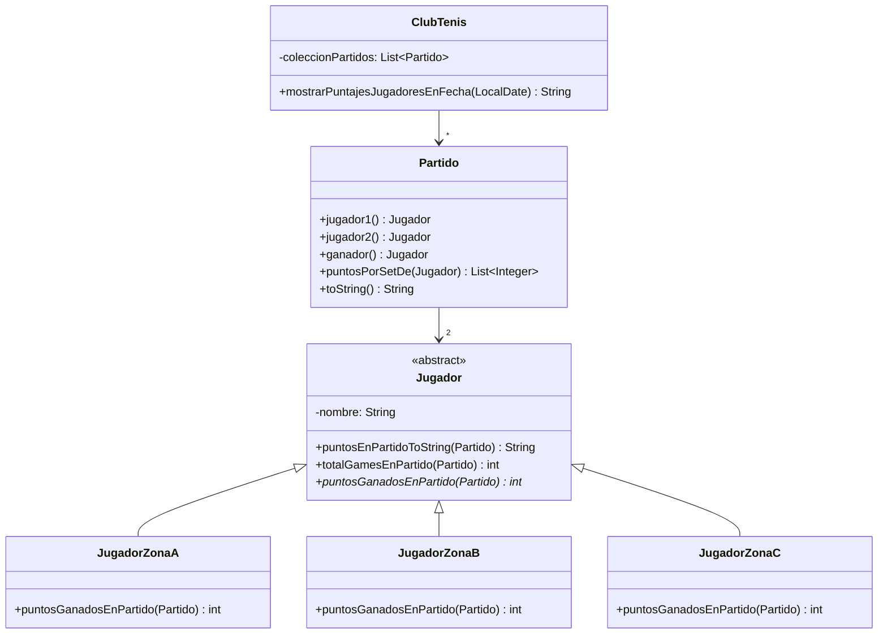

# 📘 Clase 2: Catálogo de Refactoring, Ejemplo Práctico y Herramientas

**Materia:** Orientación a Objetos 2 (OO2) — UNLP  
**Temas:** Catálogo de *Code Smells*, refactorings asociados, ejemplo integrador (*Club de Tenis*), herramientas automáticas y el *Abstract Syntax Tree (AST)*.

---

## 🎯 Código CLEAN

El objetivo primordial del refactoring es transformar el software degradado en código **CLEAN**:

| Característica | Significado | Explicación |
|---|---|---|
| **C**ohesive | Cohesivo | Cada módulo o clase tiene **una única responsabilidad** bien definida. |
| **L**oosely coupled | Bajo acoplamiento | Las clases dependen lo mínimo posible de la estructura interna de otras. |
| **E**ncapsulated | Encapsulado | Los datos están ocultos tras interfaces públicas de comportamiento. |
| **A**ssertive | Asertivo | *"Tell, don't ask"*. No le pidas datos a otro objeto para hacer cálculos vos; pedile que los haga él. |
| **N**on-redundant | No redundante | No hay duplicación de lógica ni de datos. |

---

## 👃 Catálogo Completo de Code Smells (Malos Olores)

Los *Code Smells* son indicios o síntomas de que hay un problema de diseño en el código. No son bugs por sí mismos, pero aumentan la complejidad y la probabilidad de introducirlos.

### Clasificación Académica de Code Smells



### Tabla de Equivalencias: Mal Olor → Refactoring Sugerido

| Mal Olor | Descripción | Refactoring Sugerido |
|---|---|---|
| **Duplicate Code** | Bloques de código idénticos o muy similares repetidos. | *Extract Method*, *Pull Up Method*, *Form Template Method*. |
| **Long Method** | Métodos con demasiadas líneas de código y responsabilidades. | *Extract Method*, *Replace Temp with Query*, *Decompose Conditional*. |
| **Large Class** | Clases con muchas variables de instancia y métodos (baja cohesión). | *Extract Class*, *Extract Subclass*. |
| **Long Parameter List** | Métodos que reciben demasiados argumentos, lo que dificulta su firma y reusabilidad. | *Replace Parameter with Method*, *Preserve Whole Object*, *Introduce Parameter Object*. |
| **Divergent Change** | Una sola clase se modifica de diferentes formas ante distintos cambios del negocio (múltiples motivos de cambio). | *Extract Class*. |
| **Shotgun Surgery** | Un único cambio en las reglas de negocio requiere realizar modificaciones pequeñas en muchas clases distintas. | *Move Method*, *Move Field*. |
| **Feature Envy** *(Envidia de Atributo)* | Un método de la clase A pasa más tiempo llamando a los getters/atributos de la clase B que a los propios. | *Move Method*. |
| **Data Class** | Clases que solo actúan como contenedores de datos (getters y setters) sin comportamiento. | *Move Method* (llevar la lógica que los procesa hacia ellos). |
| **Switch Statements** | Bloques condicionales basados en el tipo de un objeto para decidir su comportamiento. | *Replace Conditional with Polymorphism*. |
| **Message Chains** | Invocaciones del estilo `a.getB().getC().getD().hacerAlgo()`. | *Hide Delegate*. |
| **Middle Man** | Una clase que solo delega trabajo a otra sin aportar valor añadido. | *Remove Middle Man*. |
| **Comments** | Comentarios excesivos que intentan explicar un código complejo en lugar de escribir código claro. | *Rename Method*, *Extract Method*. |

---

## 🛠️ Mecánica Detallada de Refactorings Clave

### 1. Extract Method *(Extraer Método)*
*   **Precondición de variables:** El bloque a extraer puede modificar **como máximo 1 variable local** que sea necesitada posteriormente en el método original. Si modifica 2 o más, no es posible aplicar la extracción directa.
*   **Mecánica:**
    1.  Crear un método nuevo con un nombre declarativo.
    2.  Copiar el fragmento de código.
    3.  Pasar como parámetros las variables locales que se leen en el bloque.
    4.  Si se modifica una variable, retornar su nuevo valor y asignarlo en el método original.
    5.  Reemplazar el código original por la llamada al nuevo método.
    6.  Compilar y testear.

### 2. Move Method *(Mover Método)*
*   **Motivación:** Eliminar *Feature Envy*.
*   **Mecánica:**
    1.  Declarar el método en la clase destino (con los parámetros ajustados).
    2.  Copiar el cuerpo del método original y ajustar las referencias (los accesos a la clase origen ahora se hacen mediante parámetros o referencias pasadas).
    3.  En la clase de origen, reemplazar el cuerpo del método original para que delegue en la clase destino, o eliminarlo si no quedan referencias externas.
    4.  Compilar y testear.

### 3. Replace Temp with Query *(Reemplazar Temporal con Consulta)*
*   **Motivación:** Las variables temporales dificultan la extracción de métodos al obligar a pasar muchos parámetros.
*   **Mecánica:**
    1.  Asegurar que la variable temporal se asigne **una única vez** (si no, aplicar *Split Temporary Variable* primero).
    2.  Extraer la expresión del lado derecho de la asignación a un método privado.
    3.  Reemplazar todas las ocurrencias de la variable temporal por la llamada al método.
    4.  Eliminar la declaración de la variable.

---

## 🎾 Ejemplo Integrador: El Club de Tenis

### Código Original (Spaghetti)

Un método calcula e imprime los puntajes de los partidos de una fecha, discriminando las reglas de puntuación de los jugadores según su zona ("A", "B" o "C"):

```java
public class ClubTenis {
    private List<Partido> coleccionPartidos;

    public String mostrarPuntajesJugadoresEnFecha(LocalDate fecha) {
        String result = "Puntajes para los partidos de la fecha " + fecha.toString() + "\n";
        List<Partido> partidosFecha = coleccionPartidos.stream()
            .filter(p -> p.fecha().equals(fecha)).collect(Collectors.toList());
        
        for (Partido p : partidosFecha) {
            // j1
            int totalGamesJ1 = 0;
            Jugador j1 = p.jugador1();
            result += "Partido: \n";
            result += "Puntaje del jugador: " + j1.nombre() + ": ";
            for (int gamesGanados : p.puntosPorSetDe(j1)) {
                result += gamesGanados + ";";
                totalGamesJ1 += gamesGanados;
            }
            result += "Puntos del partido: ";
            if (j1.zona().equals("A")) result += (totalGamesJ1 * 2);
            else if (j1.zona().equals("B")) result += totalGamesJ1;
            else if (j1.zona().equals("C")) {
                if (p.ganador() == j1) result += totalGamesJ1;
                else result += 0;
            }
            result += "\n";

            // j2 (CÓDIGO DUPLICADO)
            int totalGamesJ2 = 0;
            Jugador j2 = p.jugador2();
            result += "Puntaje del jugador: " + j2.nombre() + ": ";
            for (int gamesGanados : p.puntosPorSetDe(j2)) {
                result += gamesGanados + ";";
                totalGamesJ2 += gamesGanados;
            }
            result += "Puntos del partido: ";
            if (j2.zona().equals("A")) result += (totalGamesJ2 * 2);
            else if (j2.zona().equals("B")) result += totalGamesJ2;
            else if (j2.zona().equals("C")) {
                if (p.ganador() == j2) result += totalGamesJ2;
                else result += 0;
            }
            result += "\n";
        }
        return result;
    }
}
```

### Proceso de Refactorización

1.  **Extract Method (`ClubTenis`):** Extraer la lógica interna del bucle `for` a un método `mostrarPartido(Partido p)`.
2.  **Move Method (`ClubTenis` ➔ `Partido`):** `mostrarPartido` sufre de *Feature Envy* hacia `Partido`. Lo movemos a la clase `Partido` (renombrándolo a `toString()`).
3.  **Extract Method (`Partido`):** Dentro del nuevo `toString()`, extraemos el bloque duplicado para procesar un jugador a `puntosJugadorToString(Jugador j)`.
4.  **Move Method (`Partido` ➔ `Jugador`):** El método `puntosJugadorToString` tiene envidia de atributos de `Jugador`. Lo movemos a `Jugador` bajo el nombre `puntosEnPartidoToString(Partido p)`.
5.  **Replace Conditional with Polymorphism (`Jugador`):** La lógica de cálculo según `zona()` (`"A"`, `"B"`, `"C"`) se elimina creando subclases polimórficas de `Jugador`.
6.  **Replace Temp with Query (`Jugador`):** La variable local `totalGames` se extrae al método `totalGamesEnPartido(Partido p)`.

### Diagrama UML Final de la Solución



### Código Final de las Clases Refactorizadas

```java
// Jugador.java (Abstracto)
public abstract class Jugador {
    private String nombre;

    public String getNombre() { return nombre; }

    public String puntosEnPartidoToString(Partido partido) {
        StringBuilder result = new StringBuilder("Puntaje del jugador: " + getNombre() + ": ");
        for (int gamesGanados : partido.puntosPorSetDe(this)) {
            result.append(gamesGanados).append(";");
        }
        result.append(" Puntos del partido: ").append(this.puntosGanadosEnPartido(partido)).append("\n");
        return result.toString();
    }

    public int totalGamesEnPartido(Partido partido) {
        return partido.puntosPorSetDe(this).stream().mapToInt(Integer::intValue).sum();
    }

    public abstract int puntosGanadosEnPartido(Partido partido);
}

// JugadorZonaA.java
public class JugadorZonaA extends Jugador {
    @Override
    public int puntosGanadosEnPartido(Partido partido) {
        return totalGamesEnPartido(partido) * 2;
    }
}

// JugadorZonaC.java
public class JugadorZonaC extends Jugador {
    @Override
    public int puntosGanadosEnPartido(Partido partido) {
        if (partido.ganador() == this) {
            return totalGamesEnPartido(partido);
        }
        return 0;
    }
}
```

---

## 🌳 Herramientas de Refactoring y el AST

### La Metáfora de los Dos Sombreros (Kent Beck)
*   **Sombrero de Nueva Funcionalidad:** Agregamos nuevas clases, métodos o características. Los tests pueden fallar momentáneamente.
*   **Sombrero de Refactoring:** Solo reestructuramos el código existente para mejorarlo. **Los tests siempre deben estar en verde**.
*   **Regla:** Nunca se deben usar ambos sombreros a la vez.

### El Abstract Syntax Tree (AST)

Las IDEs modernas no tratan el código como texto plano a la hora de refactorizar; utilizan el **Abstract Syntax Tree (AST)**.

1.  **Análisis de Precondiciones:** El refactoring automático chequea que la transformación propuesta sea segura analizando el árbol de sintaxis abstracta y la tabla de símbolos (ej. chequeo del scope de variables).
2.  **Transformación Segura:** La IDE realiza la reescritura del AST (*AST Rewriting*) y genera el nuevo código fuente garantizando que no se violen las reglas sintácticas ni semánticas básicas del compilador.
3.  **Límite de las IDEs:** La IDE no puede garantizar la preservación del comportamiento dinámico/lógico. Por ello, la existencia de una suite robusta de **Tests de Unidad** sigue siendo fundamental.
