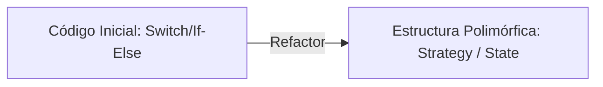

# 📘 Clase 9: Refactoring to Patterns

**Materia:** Orientación a Objetos 2 (OO2) — UNLP  
**Temas:** El concepto de **Refactoring to Patterns** (Refactorización hacia Patrones) de Joshua Kerievsky, equilibrio de diseño (Over-engineering vs Under-engineering) y recetas típicas de transformación.

---

## 🎯 ¿Por qué "Hacia Patrones"?

En la ingeniería de software tradicional, existía la tendencia de intentar diseñar todos los patrones GoF de antemano durante la fase de análisis. Esto a menudo resultaba en dos problemas graves:

### 1. Over-engineering (Sobrediseño)
*   Se introducen patrones complejos para anticipar cambios que **nunca ocurren**.
*   El código se vuelve innecesariamente complejo, difícil de leer y mantener debido al exceso de indirecciones y clases sin uso real.
*   *Heurística:* YAGNI (*You Aren't Gonna Need It*).

### 2. Under-engineering (Subdiseño)
*   El código se escribe de forma procedural y descuidada.
*   Los parches continuos producen acumulación de malas estructuras (*Big Ball of Mud*).
*   *Heurística:* No diseñar nada y acumular deuda técnica.

### El Camino Medio: Refactoring to Patterns (Joshua Kerievsky, 2004)
> La solución es implementar el diseño **más simple y directo posible** que solucione el problema actual. Luego, a medida que el sistema evoluciona y los *Code Smells* aparecen, refactorizar **hacia los patrones** de forma evolutiva e iterativa.

---

## 🛠️ Recetas Comunes de Refactorización hacia Patrones

A continuación se detallan las recetas más frecuentes enseñadas en la cátedra para introducir patrones GoF de forma segura a partir de código con problemas:

### 1. Replace Conditional Logic with State or Strategy
*   **Code Smell de partida:** *Switch Statements* o condicionales anidados complejos sobre tipos o comportamientos de un objeto.
*   **Procedimiento:**
    1.  Aplicar *Extract Method* sobre el cuerpo del condicional.
    2.  Aplicar *Move Method* para llevar la lógica a una nueva jerarquía de clases polimórficas (Estrategias o Estados).
    3.  El objeto original (Contexto) delega la decisión en el objeto de la jerarquía.
*   **Resultado:** Flexibilidad para agregar nuevos tipos/comportamientos sin alterar la clase original (Principio Open/Closed).



---

### 2. Form Template Method *(Formar Método Plantilla)*
*   **Code Smell de partida:** *Duplicate Code* en los métodos de subclases de una misma jerarquía que realizan un algoritmo similar pero con pequeños pasos diferentes.
*   **Procedimiento:**
    1.  Asegurar que las firmas de los métodos en las subclases sean idénticas.
    2.  Aplicar *Extract Method* para separar los pasos idénticos de los pasos variables en cada subclase.
    3.  Aplicar *Pull Up Method* para subir la estructura general del algoritmo (el esqueleto) a la superclase abstracta.
    4.  Declarar los pasos variables como abstractos (*operaciones primitivas*) o con comportamiento por defecto (*hooks*) en la superclase.
*   **Resultado:** Eliminación del código duplicado en la secuencia lógica principal y control estricto sobre las extensiones en las subclases.

---

### 3. Replace Constructors with Creation Methods
*   **Code Smell de partida:** Múltiples constructores sobrecargados con diferentes combinaciones de parámetros que confunden al cliente sobre qué constructor usar y qué representación inicial se está creando.
*   **Procedimiento:**
    1.  Crear métodos estáticos públicos en la clase (o Factory Methods) con nombres explicativos y declarativos (ej. `crearUsuarioAdministrador(...)`, `crearUsuarioInvitado(...)`).
    2.  Llamar al constructor correspondiente dentro de estos métodos.
    3.  Cambiar la visibilidad del constructor original a `private` o `protected` para obligar a usar los métodos de creación.
    4.  Reemplazar las llamadas `new Constructor(...)` en los clientes externos.
*   **Resultado:** Claridad de intenciones en la creación de instancias complejas.

```java
// Antes
Usuario u = new Usuario("Juan", true, false, 0);

// Después
Usuario u = Usuario.crearAdministrador("Juan");
```

---

### 4. Extract Composite
*   **Code Smell de partida:** Lógica de condicionales o bucles en el cliente para discriminar si está procesando un elemento atómico o una colección de elementos (ej. tratar de forma diferente un producto individual de un combo de productos).
*   **Procedimiento:**
    1.  Definir una interfaz común (`Component`) para el elemento simple y la colección.
    2.  Hacer que el elemento atómico (`Leaf`) y el contenedor de la colección (`Composite`) implementen dicha interfaz.
    3.  Hacer que el `Composite` delegue la operación recorriendo sus hijos polimórficamente.
*   **Resultado:** Tratamiento transparente y recursivo del árbol por parte del cliente.
