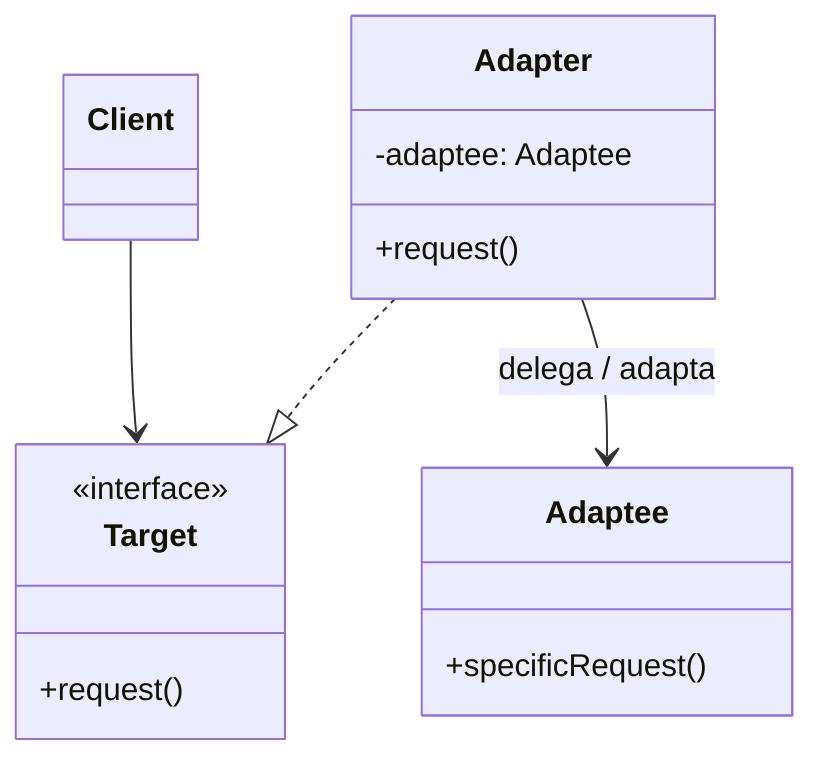
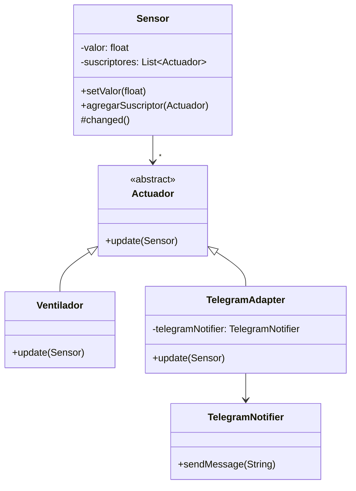
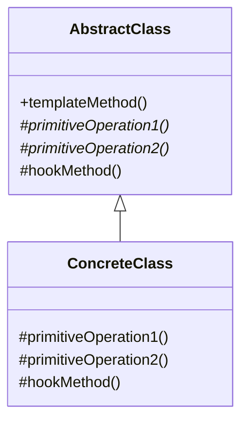

# 📘 Clase 3: Introducción a Patrones de Diseño — Adapter & Template Method

**Materia:** Orientación a Objetos 2 (OO2) — UNLP  
**Temas:** Origen de los patrones de diseño, catálogo GoF, patrón **Adapter** (Estructural) y patrón **Template Method** (Comportamiento).

---

## 🏛️ ¿De dónde vienen los Patrones?

### El origen: Christopher Alexander (Arquitectura)
El concepto de patrón fue formulado originalmente por el arquitecto Christopher Alexander en 1977 para el diseño de comunidades y edificios. Un patrón es un **par problema-solución** en un entorno determinado, que se repite constantemente y cuya solución es lo suficientemente abstracta para ser aplicada millones de veces sin repetirse exactamente igual.

### De la arquitectura al software
Ward Cunningham y Kent Beck (1987) adaptaron la idea al desarrollo de software orientado a objetos. En 1994, el grupo conocido como **GoF (Gang of Four)** —Gamma, Helm, Johnson, Vlissides— publicó el libro fundamental *"Design Patterns: Elements of Reusable Object-Oriented Software"*, definiendo 23 patrones divididos en tres categorías:
1.  **Creacionales:** Conciernen al proceso de creación de objetos (ej. *Factory Method*, *Builder*).
2.  **Estructurales:** Tratan con la composición de clases u objetos (ej. *Adapter*, *Composite*).
3.  **De Comportamiento:** Caracterizan las formas en las que interactúan y se distribuyen la responsabilidad las clases u objetos (ej. *Template Method*, *Strategy*, *State*).

---

## 🔌 Patrón Adapter (Estructural)

### 🎯 Propósito
> Convertir la interfaz de una clase en otra interfaz que los clientes esperan. Permite que ciertas clases con interfaces **incompatibles** trabajen juntas.

### Estructura UML (Basada en Objetos)



### Participantes
*   **Target (Objetivo):** Define la interfaz específica del dominio que el `Client` utiliza.
*   **Client (Cliente):** Colabora con objetos que implementan la interfaz `Target`.
*   **Adaptee (Adaptado):** Define una interfaz existente que **necesita ser adaptada** y de la cual no podemos modificar el código fuente (ej. librerías de terceros).
*   **Adapter (Adaptador):** Adapta la interfaz de `Adaptee` implementando `Target` y delegando internamente en una instancia de `Adaptee`.

---

### 📦 Caso práctico: Actuadores IoT y Telegram

Queremos conectar un sistema IoT que monitoriza un sensor de temperatura y notifica a actuadores. Queremos enviar una alerta a Telegram usando una API externa (`TelegramNotifier`), pero esta clase externa no hereda de nuestra clase abstracta `Actuador` ni implementa su protocolo.

#### Estructura del Diseño con Adapter



#### Código Java de la Solución

```java
// Sensor.java
public class Sensor {
    private float valor;
    private List<Actuador> suscriptores = new ArrayList<>();

    public void setValor(float valor) {
        this.valor = valor;
        this.changed();
    }
    public float getValor() { return valor; }
    
    public void agregarSuscriptor(Actuador act) { suscriptores.add(act); }
    
    protected void changed() {
        for (Actuador act : suscriptores) {
            act.update(this);
        }
    }
}

// Actuador.java (Target)
public abstract class Actuador {
    public abstract void update(Sensor sensor);
}

// Ventilador.java (Concrete Target)
public class Ventilador extends Actuador {
    @Override
    public void update(Sensor sensor) {
        if (sensor.getValor() > 25.0f) {
            System.out.println("Ventilador Encendido.");
        }
    }
}

// TelegramNotifier.java (Adaptee)
public class TelegramNotifier {
    public void sendMessage(String text) {
        System.out.println("Enviando Telegram: " + text);
    }
}

// TelegramAdapter.java (Adapter)
public class TelegramAdapter extends Actuador {
    private TelegramNotifier telegramNotifier;

    public TelegramAdapter(TelegramNotifier telegramNotifier) {
        this.telegramNotifier = telegramNotifier;
    }

    @Override
    public void update(Sensor sensor) {
        // Adaptación: Convertir el cambio del sensor en un texto de mensaje
        String mensaje = "Alerta: El sensor cambió su valor a: " + sensor.getValor();
        this.telegramNotifier.sendMessage(mensaje);
    }
}
```

### Consecuencias del Adapter
*   **Flexibilidad:** Permite la reutilización de clases existentes sin necesidad de modificar su código fuente original ni su jerarquía.
*   **Compromiso:** Introduce un nivel de redirección que puede incrementar levemente la cantidad de objetos creados y el tiempo de ejecución (despreciable en la mayoría de los escenarios).

---

## 📐 Patrón Template Method (Comportamiento)

### 🎯 Propósito
> Definir el esqueleto de un algoritmo en una operación, delegando algunos pasos a las subclases. Permite que las subclases redefinan ciertos pasos de un algoritmo sin cambiar su estructura básica.

### Estructura UML



### Participantes
*   **AbstractClass (Clase Abstracta):** Define el **Template Method** que contiene la secuencia algorítmica. Declara las operaciones primitivas abstractas y opcionalmente implementa métodos gancho (*hook methods*).
*   **ConcreteClass (Clase Concreta):** Implementa las operaciones primitivas para realizar los pasos específicos del algoritmo que dependen de la subclase.

### Tipos de Métodos en la Superclase

1.  **Template Method:** Método público y generalmente concreto (`final` en Java para evitar que sea redefinido). Define la estructura del algoritmo llamando a otros métodos en un orden específico.
2.  **Operaciones Primitivas:** Métodos abstractos que **deben** ser implementados obligatoriamente por las subclases (representan la variación obligatoria).
3.  **Hook Methods (Métodos Gancho):** Métodos con una implementación vacía o por defecto en la clase abstracta. Las subclases **pueden** redefinirlos de forma opcional para modificar o extender el comportamiento en puntos específicos del algoritmo.

---

### 📦 Caso práctico: Exportadores de Reportes

Queremos armar un módulo de exportación de datos en varios formatos (CSV, PDF, Excel). La secuencia de preparación, apertura de archivo y cierre es idéntica en todos, pero la forma de escribir el header y los datos específicos varía por formato.

#### Código Java de la Solución

```java
// ReportExporter.java (AbstractClass)
public abstract class ReportExporter {

    // TEMPLATE METHOD
    public final void export(ReportData data, String filePath) {
        this.prepareData(data);
        this.openFile(filePath);
        this.writeHeader(data);
        this.writeData(data);
        if (this.needsFooter()) { // Hook method
            this.writeFooter(data);
        }
        this.closeFile(filePath);
    }

    // Pasos comunes (implementados en la superclase)
    private void prepareData(ReportData data) {
        System.out.println("Preparando estructura de datos...");
    }

    private void openFile(String filePath) {
        System.out.println("Abriendo archivo en: " + filePath);
    }

    private void closeFile(String filePath) {
        System.out.println("Cerrando archivo y guardando buffer.");
    }

    // Pasos variables obligatorios (Operaciones primitivas)
    protected abstract void writeHeader(ReportData data);
    protected abstract void writeData(ReportData data);

    // Método Gancho (Hook Method) con comportamiento por defecto
    protected boolean needsFooter() {
        return false; // Por defecto no escribe pie de página
    }

    protected void writeFooter(ReportData data) {
        // Implementación vacía por defecto
    }
}

// CsvReportExporter.java (ConcreteClass)
public class CsvReportExporter extends ReportExporter {
    @Override
    protected void writeHeader(ReportData data) {
        System.out.println("Escribiendo cabecera CSV: ID,Nombre,Email");
    }

    @Override
    protected void writeData(ReportData data) {
        System.out.println("Escribiendo filas de datos separadas por comas...");
    }
}

// PdfReportExporter.java (ConcreteClass con Hook)
public class PdfReportExporter extends ReportExporter {
    @Override
    protected void writeHeader(ReportData data) {
        System.out.println("Dibujando logo corporativo y título en PDF...");
    }

    @Override
    protected void writeData(ReportData data) {
        System.out.println("Dibujando tablas de datos PDF con fuentes personalizadas...");
    }

    @Override
    protected boolean needsFooter() {
        return true; // PDF sí requiere pie de página
    }

    @Override
    protected void writeFooter(ReportData data) {
        System.out.println("Dibujando número de página y fecha de emisión.");
    }
}
```

### Consecuencias del Template Method
*   **Inversión de Control (Hollywood Principle):** *"No nos llames, nosotros te llamaremos"*. La superclase es la que tiene el control del flujo e invoca al código de las subclases en los momentos oportunos, invirtiendo la jerarquía de llamadas tradicional.
*   **Eliminación de Código Duplicado:** Reutiliza el flujo común y los pasos compartidos en un único lugar (la superclase).
*   **Extensibilidad Controlada:** Limita las variaciones que pueden hacer los hijos únicamente a los métodos provistos para sobreescritura.
