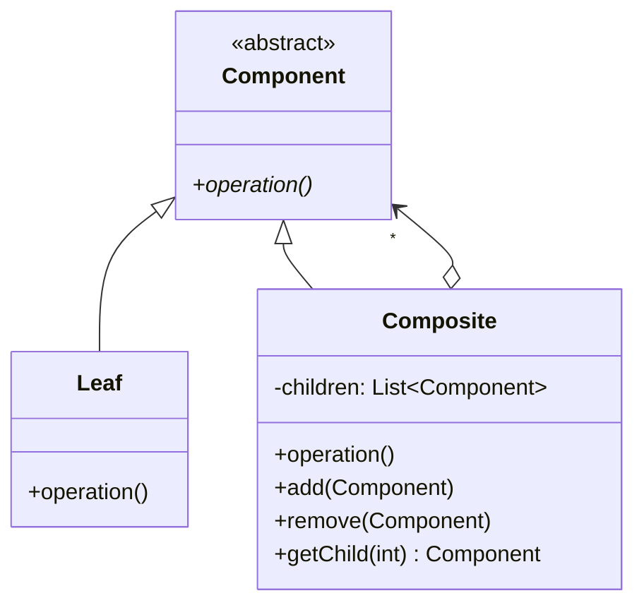
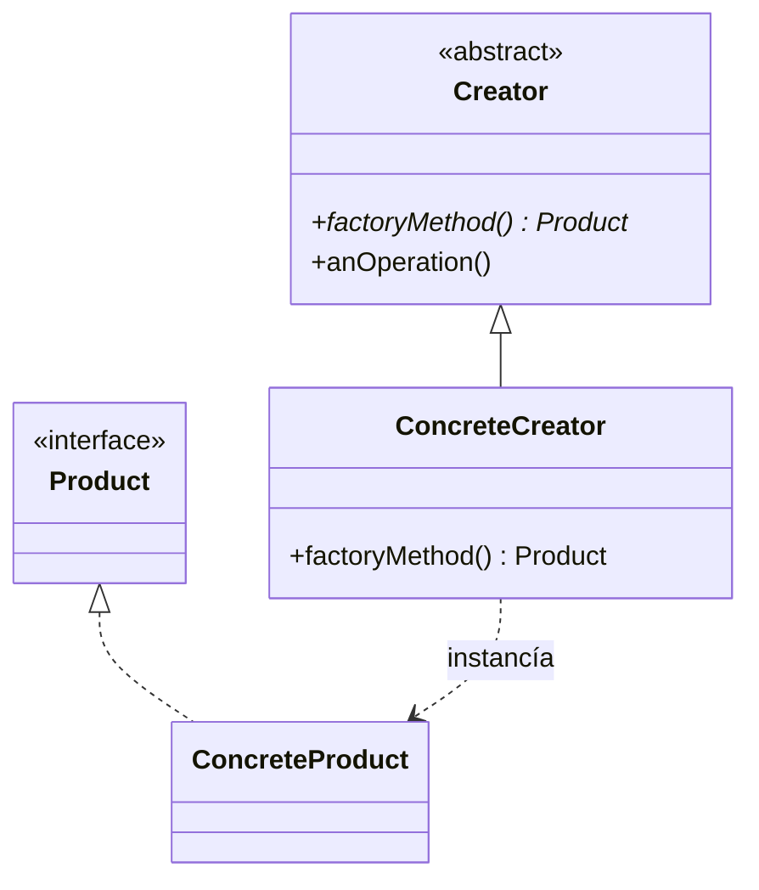
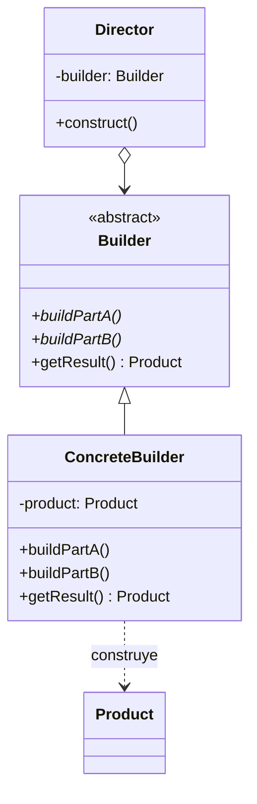

# 📘 Clase 4: Composite, Factory Method & Builder

**Materia:** Orientación a Objetos 2 (OO2) — UNLP  
**Temas:** Patrón **Composite** (Estructural) y patrones creacionales **Factory Method** y **Builder**.

---

## 🌳 Patrón Composite (Estructural)

### 🎯 Propósito
> Componer objetos en estructuras de árbol para representar jerarquías parte-todo. Permite que los clientes traten a los objetos individuales (hojas) y a las composiciones de objetos (nodos) de manera uniforme.

### Estructura UML



### Participantes
*   **Component (Componente):** Declara la interfaz común para los objetos de la composición. Puede implementar un comportamiento por defecto común.
*   **Leaf (Hoja):** Representa objetos hoja (atómicos) en la composición. No tiene hijos. Define el comportamiento directo.
*   **Composite (Compuesto):** Representa componentes complejos que tienen hijos. Implementa los métodos de manipulación de hijos y delega el comportamiento recorriendo su colección.

---

### 📦 Caso práctico: Préstamos con Garantías Prendarias

Un banco otorga préstamos que requieren garantías de valor percibido igual o superior al capital prestado. Las garantías pueden ser simples (un auto) o mixtas (un lote de bienes constituido por varios autos y flujos de sueldo).

#### Código Java de la Solución

```java
// Garantia.java (Component)
public abstract class Garantia {
    public abstract double getValorPercibido();
}

// Vehiculo.java (Leaf)
public class Vehiculo extends Garantia {
    private double tasacion;
    private double coeficienteDepreciacion;

    public Vehiculo(double tasacion, double desc) {
        this.tasacion = tasacion;
        this.coeficienteDepreciacion = desc;
    }

    @Override
    public double getValorPercibido() {
        return this.tasacion * (1.0 - this.coeficienteDepreciacion);
    }
}

// FlujoFondo.java (Leaf)
public class FlujoFondo extends Garantia {
    private double montoMensual;
    private double porcentajeRetencion;

    public FlujoFondo(double monto, double porc) {
        this.montoMensual = monto;
        this.porcentajeRetencion = porc;
    }

    @Override
    public double getValorPercibido() {
        return this.montoMensual * this.porcentajeRetencion;
    }
}

// GarantiaMixta.java (Composite)
public class GarantiaMixta extends Garantia {
    private List<Garantia> subGarantias = new ArrayList<>();

    public void agregarGarantia(Garantia g) { this.subGarantias.add(g); }
    public void eliminarGarantia(Garantia g) { this.subGarantias.remove(g); }

    @Override
    public double getValorPercibido() {
        // Delegación polimórfica y recursiva
        return this.subGarantias.stream()
                .mapToDouble(Garantia::getValorPercibido)
                .sum();
    }
}
```

---

## 🏭 Patrón Factory Method (Creacional)

### 🎯 Propósito
> Define una interfaz para la creación de un objeto, pero deja que las subclases decidan qué clase instanciar. Permite que una clase delegue la instanciación a subclases.

### Estructura UML



### Participantes
*   **Product (Producto):** Define la interfaz de los objetos creados por el método de fábrica.
*   **ConcreteProduct (Producto Concreto):** Implementa la interfaz de `Product`.
*   **Creator (Creador):** Declara el método de fábrica (`factoryMethod`) que devuelve un `Product`. Puede proveer una implementación por defecto.
*   **ConcreteCreator (Creador Concreto):** Redefine el método de fábrica para devolver una instancia de un `ConcreteProduct`.

---

### 📦 Caso práctico: Mezclador de Pinturas e Inflamabilidad

Tenemos pinturas que se diluyen con diferentes elementos (Agua o Aguarrás). La propiedad de si la pintura es inflamable o no depende del tipo de diluyente que use. Evitamos acoplar la clase `Pintura` a diluyentes específicos usando Factory Method.

#### Código Java de la Solución

```java
// Diluyente.java (Product)
public abstract class Diluyente {
    public abstract boolean esInflamable();
}

// Agua.java (ConcreteProduct)
public class Agua extends Diluyente {
    @Override
    public boolean esInflamable() { return false; }
}

// Aguarras.java (ConcreteProduct)
public class Aguarras extends Diluyente {
    @Override
    public boolean esInflamable() { return true; }
}

// Pintura.java (Creator)
public abstract class Pintura {
    // Factory Method abstracto
    protected abstract Diluyente crearDiluyente();

    // Operación que utiliza el producto creado por el factory method
    public boolean esInflamable() {
        Diluyente diluyente = this.crearDiluyente();
        return diluyente.esInflamable();
    }
}

// Latex.java (ConcreteCreator)
public class Latex extends Pintura {
    @Override
    protected Diluyente crearDiluyente() {
        return new Agua(); // Instanciación diferida
    }
}

// EsmalteSintetico.java (ConcreteCreator)
public class EsmalteSintetico extends Pintura {
    @Override
    protected Diluyente crearDiluyente() {
        return new Aguarras(); // Instanciación diferida
    }
}
```

---

## 🔨 Patrón Builder (Creacional)

### 🎯 Propósito
> Separa la construcción de un objeto complejo de su representación, de manera que el mismo proceso de construcción pueda crear diferentes representaciones.

### Estructura UML



### Participantes
*   **Builder (Constructor):** Especifica una interfaz abstracta para la creación de las partes del objeto complejo.
*   **ConcreteBuilder (Constructor Concreto):** Implementa la interfaz de `Builder`, ensambla las partes del producto y mantiene la referencia al producto en construcción.
*   **Director (Director):** Conoce la "receta" (algoritmo paso a paso) de construcción utilizando la interfaz del `Builder`.
*   **Product (Producto):** Representa el objeto complejo bajo construcción.

---

### 📦 Caso práctico: Configuración de Viajes de Egresados

Un viaje de egresados requiere contratar transporte, alojamiento y seguro médico. Según el presupuesto, se arman paquetes "Económicos" o "Premium". El Director conoce el orden de los pasos, y el Builder provee los elementos específicos de cada paquete.

#### Código Java de la Solución

```java
// Viaje.java (Product)
public class Viaje {
    private String transporte;
    private String alojamiento;
    private String seguro;

    public void setTransporte(String t) { this.transporte = t; }
    public void setAlojamiento(String a) { this.alojamiento = a; }
    public void setSeguro(String s) { this.seguro = s; }

    @Override
    public String toString() {
        return "Viaje [Transporte=" + transporte + ", Alojamiento=" + alojamiento + ", Seguro=" + seguro + "]";
    }
}

// ViajeBuilder.java (Builder)
public abstract class ViajeBuilder {
    protected Viaje viaje;

    public void crearNuevoViaje() { this.viaje = new Viaje(); }
    public Viaje getResult() { return this.viaje; }

    public abstract void buildTransporte();
    public abstract void buildAlojamiento();
    public abstract void buildSeguro();
}

// EconomicoBuilder.java (ConcreteBuilder)
public class EconomicoBuilder extends ViajeBuilder {
    @Override
    public void buildTransporte() { viaje.setTransporte("Micro Larga Distancia"); }
    @Override
    public void buildAlojamiento() { viaje.setAlojamiento("Hostel 2 estrellas"); }
    @Override
    public void buildSeguro() { viaje.setSeguro("Seguro básico obligatorio"); }
}

// PremiumBuilder.java (ConcreteBuilder)
public class PremiumBuilder extends ViajeBuilder {
    @Override
    public void buildTransporte() { viaje.setTransporte("Vuelo charter privado"); }
    @Override
    public void buildAlojamiento() { viaje.setAlojamiento("Hotel Resort All-Inclusive"); }
    @Override
    public void buildSeguro() { viaje.setSeguro("Cobertura médica internacional premium"); }
}

// AgenciaDirector.java (Director)
public class AgenciaDirector {
    private ViajeBuilder builder;

    public void setBuilder(ViajeBuilder builder) {
        this.builder = builder;
    }

    public void construct() {
        this.builder.crearNuevoViaje();
        this.builder.buildTransporte();
        this.builder.buildAlojamiento();
        this.builder.buildSeguro();
    }
}
```

---

## ⚔️ Factory Method vs Builder

| Criterio | Factory Method | Builder |
|---|---|---|
| **Intención** | Crear un objeto de una jerarquía de clases mediante un solo método. | Crear un objeto complejo con múltiples partes siguiendo una receta. |
| **Complejidad del objeto** | Simple o mediano. | Alto (estructura interna con muchas partes opcionales o configurables). |
| **Proceso de construcción** | En un solo paso (retorna el objeto instanciado directamente). | En múltiples pasos controlados por un **Director**. |
| **Número de Roles** | 2 roles principales (Creator, Product). | 4 roles (Director, Builder, ConcreteBuilder, Product). |
