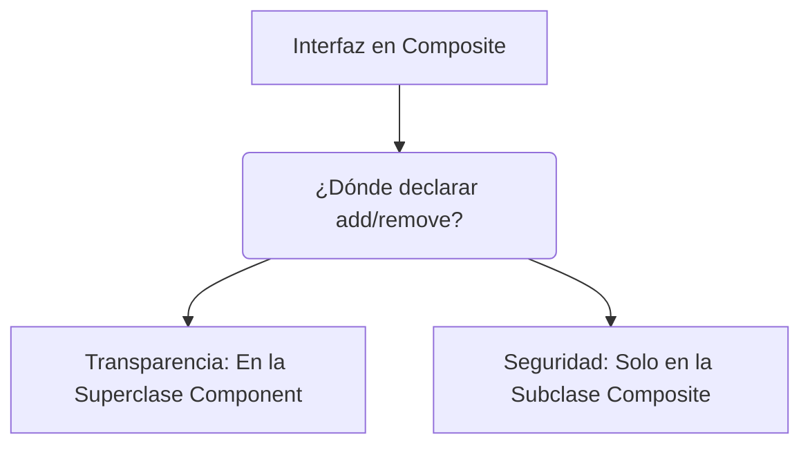

# 📘 Clase 5: Profundización en Composite — Safe vs Transparent Interface

**Materia:** Orientación a Objetos 2 (OO2) — UNLP  
**Temas:** Diseño de interfaces en el patrón Composite: Variante de **Seguridad (Safe)** vs Variante de **Transparencia (Transparent)**, reglas de composición y verificación de circularidad.

---

## ⚖️ Interfaz de Component: ¿Seguridad o Transparencia?

Una de las decisiones de diseño más importantes al implementar el patrón **Composite** radica en dónde declarar las operaciones de manejo de hijos (`add()`, `remove()`, `getChild()`). Existen dos enfoques contrapuestos que priorizan distintos principios de diseño:



### 1. Interfaz Transparente *(Transparent)*
Las operaciones de manejo de hijos se declaran en la superclase **Component**.

*   **Implementación:** Las hojas (`Leaf`) heredan estas operaciones. Se puede programar que hagan nada (`no-op`) o que lancen una excepción en tiempo de ejecución (ej. `UnsupportedOperationException`).
*   **Ventaja:** **Uniformidad máxima**. El cliente puede tratar a cualquier nodo de la estructura jerárquica de forma exactamente igual, sin importar si es una hoja o un compuesto. No requiere casting.
*   **Desventaja:** **Pérdida de seguridad**. El compilador no puede evitar que intentemos agregarle un hijo a una hoja, lo que puede provocar fallas o excepciones en runtime.

```java
// Ejemplo de Interfaz Transparente
public abstract class Component {
    public abstract void operation();
    
    public void add(Component c) {
        throw new UnsupportedOperationException("No se puede agregar hijos a este tipo de componente.");
    }
    public void remove(Component c) {
        throw new UnsupportedOperationException("No se puede remover hijos a este tipo de componente.");
    }
}
```

### 2. Interfaz Segura *(Safe)*
Las operaciones de manejo de hijos se declaran **únicamente** en la clase **Composite**.

*   **Implementación:** La clase `Component` solo define el protocolo común de negocio. `Leaf` no expone operaciones de hijos en absoluto.
*   **Ventaja:** **Máxima seguridad**. Es físicamente imposible por compilación intentar agregarle un hijo a una hoja.
*   **Desventaja:** **Pérdida de uniformidad**. El cliente debe conocer el tipo de objeto con el que está trabajando. Para manipular hijos, se requiere realizar un chequeo de tipos y un *down-cast* (ej. `instanceof` y cast a `Composite`), lo que acopla el código del cliente.

```java
// Ejemplo de Interfaz Segura
public abstract class Component {
    public abstract void operation();
    // No hay métodos de manejo de hijos aquí
}

public class Composite extends Component {
    private List<Component> children = new ArrayList<>();
    
    public void add(Component c) { children.add(c); }
    public void remove(Component c) { children.remove(c); }
    
    @Override
    public void operation() { ... }
}
```

---

## 🧪 Caso de Estudio: Elementos Químicos y Reglas de Composición

El modelado de uniones químicas de la tabla periódica ilustra cómo el patrón Composite requiere la incorporación de **reglas de negocio de validación de composición** durante la construcción del árbol.

### Tabla de Elementos Base

| Símbolo | Peso | Carga | Clasificación |
|---|---|---|---|
| **H** | 1 | +1 | No metal |
| **O** | 16 | -2 | No metal |
| **Cl** | 35 | -1 | No metal |
| **Na** | 23 | +1 | Metal |
| **Ca** | 40 | +2 | Metal |

### Reglas Químicas de Unión
1.  **Metal + No metal:** Permitido (ej. NaCl, CaO).
2.  **No metal + No metal:** Permitido (ej. H₂O).
3.  **Metal + Metal:** **PROHIBIDO** (ej. Na + Ca no puede componerse).

### Diseño de la Composición

Para evitar un código repetido masivo con 118 clases hoja para los elementos, se implementa una única clase hoja `ElementoAtomico` configurada mediante un constructor, y un compuesto `UnionQuimica` que controla las restricciones de agregación.

```java
// ElementoQuimico.java (Component)
public abstract class ElementoQuimico {
    public abstract int getCargaElectrica();
    public abstract int getPesoAtomico();
    public abstract boolean esMetal();
    
    // Método concreto en la superclase
    public boolean esNoMetal() {
        return !this.esMetal();
    }
    
    public boolean esMolecular() {
        return this.getCargaElectrica() == 0;
    }
    
    public boolean esIon() {
        return !this.esMolecular();
    }
}

// ElementoAtomico.java (Leaf)
public class ElementoAtomico extends ElementoQuimico {
    private String simbolo;
    private int peso;
    private int carga;
    private boolean metal;

    public ElementoAtomico(String simbolo, int peso, int carga, boolean metal) {
        this.simbolo = simbolo;
        this.peso = peso;
        this.carga = carga;
        this.metal = metal;
    }

    @Override
    public int getCargaElectrica() { return this.carga; }

    @Override
    public int getPesoAtomico() { return this.peso; }

    @Override
    public boolean esMetal() { return this.metal; }
}

// UnionQuimica.java (Composite)
public class UnionQuimica extends ElementoQuimico {
    private List<ElementoQuimico> elementos = new ArrayList<>();

    public void add(ElementoQuimico eq) {
        // Validación de Reglas de Composición antes de insertar
        if (this.esMetal() && eq.esMetal()) {
            throw new IllegalArgumentException("No se permiten uniones de metales (Metal + Metal).");
        }
        this.elementos.add(eq);
    }

    @Override
    public int getCargaElectrica() {
        return this.elementos.stream().mapToInt(ElementoQuimico::getCargaElectrica).sum();
    }

    @Override
    public int getPesoAtomico() {
        return this.elementos.stream().mapToInt(ElementoQuimico::getPesoAtomico).sum();
    }

    @Override
    public boolean esMetal() {
        // Una unión es metal si contiene al menos un elemento metálico
        return this.elementos.stream().anyMatch(ElementoQuimico::esMetal);
    }
}
```

---

## ⚠️ Circularidad en el Composite

Un problema común en las estructuras de datos jerárquicas recursivas es el riesgo de introducir una **referencia circular** (ej. que un compuesto se agregue a sí mismo o a uno de sus descendientes). Esto provoca bucles infinitos y desbordamientos de pila (`StackOverflowError`) al ejecutar operaciones recursivas como `getPesoAtomico()`.

### Heurísticas de Prevención
1.  **Validación en `add()`:** Antes de insertar un componente `C` dentro de un Composite `X`, verificar que `X` no sea descendiente o igual a `C`.
2.  **Mantener una referencia al padre:** Cada componente conoce a su padre directivo. Si al recorrer los padres de `X` hacia la raíz encontramos a `C`, entonces agregar `C` a `X` crearía un ciclo.

```java
// Ejemplo conceptual de validación de circularidad
public void add(ElementoQuimico eq) {
    if (eq == this || eq.contiene(this)) {
        throw new IllegalStateException("Se detectó una referencia circular.");
    }
    // lógica de inserción
}
```
