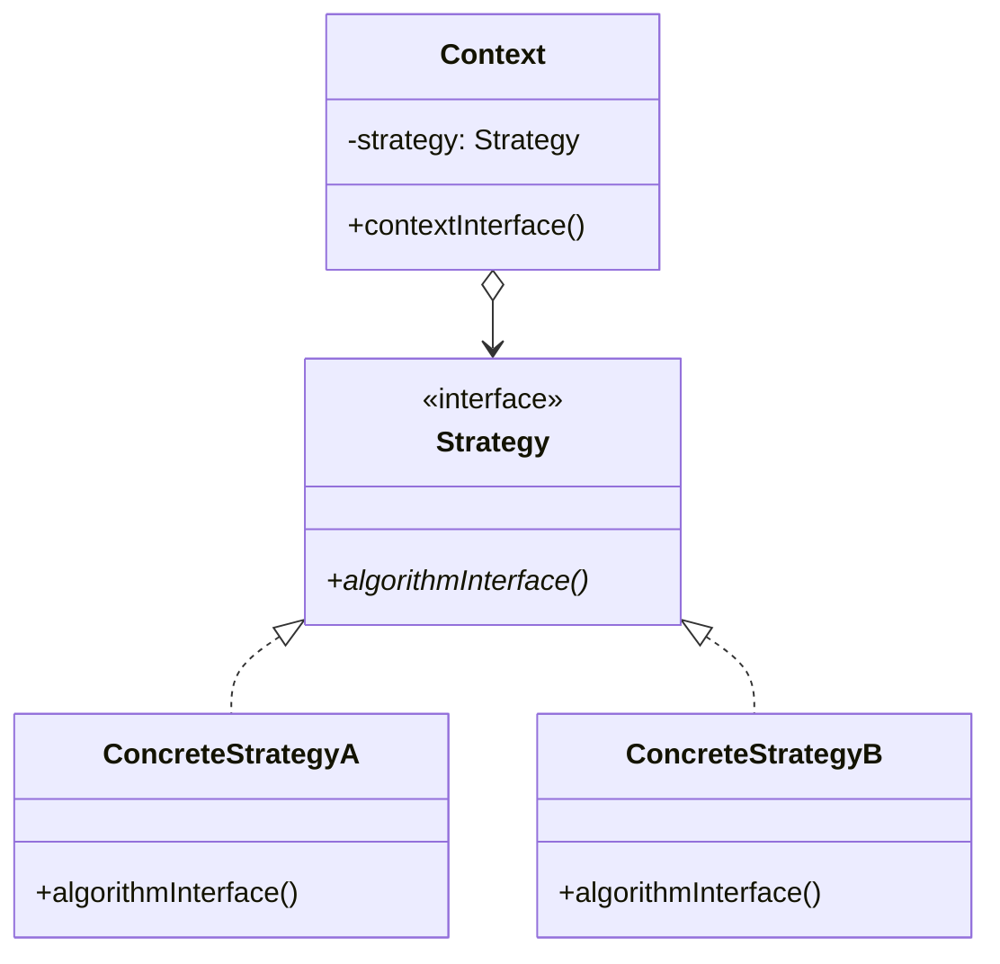
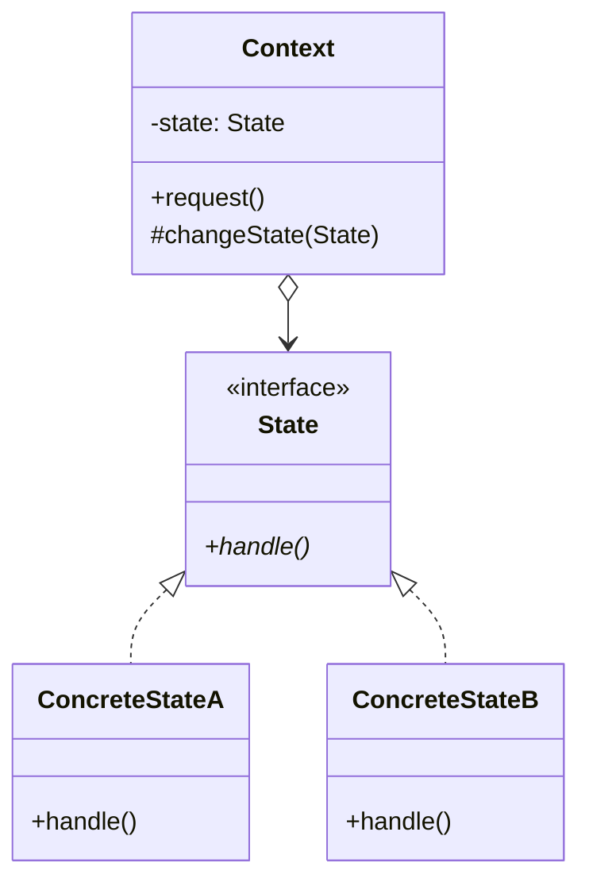
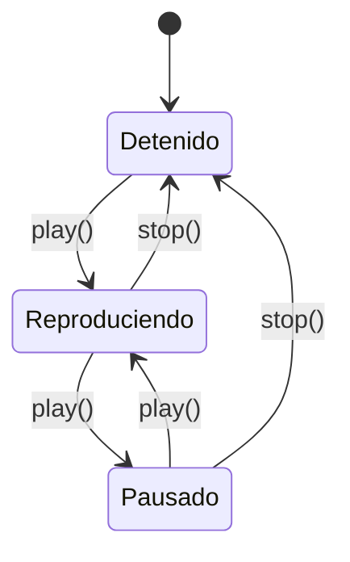

# 📘 Clase 6: Patrones Strategy & State

**Materia:** Orientación a Objetos 2 (OO2) — UNLP  
**Temas:** Patrón **Strategy** (Comportamiento), patrón **State** (Comportamiento), diferencias semánticas, y el manejo de transiciones de estados.

---

## ⚡ Patrón Strategy (Comportamiento)

### 🎯 Propósito
> Define un conjunto de algoritmos, encapsula cada uno de ellos y los hace intercambiables. Strategy permite que el algoritmo varíe de forma independiente a los clientes que lo utilizan.

### Estructura UML



### Participantes
*   **Context (Contexto):** Mantiene una referencia a un objeto `Strategy`. Puede definir una interfaz que permita a la estrategia acceder a sus datos.
*   **Strategy (Estrategia):** Declara una interfaz común para todos los algoritmos soportados.
*   **ConcreteStrategy (Estrategia Concreta):** Implementa el algoritmo usando la interfaz de `Strategy`.

---

### 📦 Caso práctico: Métodos de Envío en E-Commerce

Un e-commerce calcula el costo de envío de un paquete según la velocidad elegida por el cliente: Retiro en Sucursal (gratis), Envío Estándar (fijo) o Envío Express (según peso).

#### Código Java de la Solución

```java
// EstrategiaEnvio.java (Strategy)
public interface EstrategiaEnvio {
    double calcularCosto(double peso, double distancia);
}

// RetiroSucursal.java (ConcreteStrategy)
public class RetiroSucursal implements EstrategiaEnvio {
    @Override
    public double calcularCosto(double peso, double distancia) { return 0.0; }
}

// EnvioEstandar.java (ConcreteStrategy)
public class EnvioEstandar implements EstrategiaEnvio {
    @Override
    public double calcularCosto(double peso, double distancia) { return 350.0; }
}

// EnvioExpress.java (ConcreteStrategy)
public class EnvioExpress implements EstrategiaEnvio {
    @Override
    public double calcularCosto(double peso, double distancia) {
        return (peso * 15.0) + (distancia * 2.5);
    }
}

// Pedido.java (Context)
public class Pedido {
    private double peso;
    private double distancia;
    private EstrategiaEnvio estrategiaEnvio;

    public Pedido(double peso, double dist, EstrategiaEnvio est) {
        this.peso = peso;
        this.distancia = dist;
        this.estrategiaEnvio = est;
    }

    public void setEstrategiaEnvio(EstrategiaEnvio est) {
        this.estrategiaEnvio = est; // Cambio dinámico de estrategia
    }

    public double obtenerCostoEnvio() {
        return this.estrategiaEnvio.calcularCosto(this.peso, this.distancia);
    }
}
```

---

## 🔄 Patrón State (Comportamiento)

### 🎯 Propósito
> Permite que un objeto varíe su comportamiento cuando cambia su estado interno. El objeto parecerá cambiar de clase.

### Estructura UML



### Participantes
*   **Context (Contexto):** Define la interfaz de interés para los clientes. Mantiene una instancia de una subclase de `State` que representa el estado actual.
*   **State (Estado):** Declara una interfaz para encapsular el comportamiento asociado a un estado particular del `Context`.
*   **ConcreteState (Estado Concreto):** Cada subclase implementa el comportamiento asociado a ese estado del `Context`.

---

### 📦 Caso práctico: Reproductor Multimedia (Media Player)

Un reproductor de audio se comporta de forma diferente al presionar "Play" o "Stop" según esté Reproduciendo, Pausado o Detenido.

#### Diagrama de Transición de Estados



#### Código Java de la Solución

```java
// EstadoReproductor.java (State)
public abstract class EstadoReproductor {
    protected Reproductor reproductor;

    public EstadoReproductor(Reproductor rep) { this.reproductor = rep; }

    public abstract void presionarPlay();
    public abstract void presionarStop();
}

// Reproductor.java (Context)
public class Reproductor {
    private EstadoReproductor estadoActual;

    public Reproductor() {
        // Estado inicial
        this.estadoActual = new DetenidoState(this);
    }

    public void setEstado(EstadoReproductor estado) {
        this.estadoActual = estado;
    }

    public void presionarPlay() { this.estadoActual.presionarPlay(); }
    public void presionarStop() { this.estadoActual.presionarStop(); }

    // Simulación de hardware
    public void iniciarAudio() { System.out.println("Audio sonando..."); }
    public void pausarAudio() { System.out.println("Audio en pausa."); }
    public void detenerAudio() { System.out.println("Audio detenido."); }
}

// DetenidoState.java (ConcreteState)
public class DetenidoState extends EstadoReproductor {
    public DetenidoState(Reproductor rep) { super(rep); }

    @Override
    public void presionarPlay() {
        reproductor.iniciarAudio();
        reproductor.setEstado(new ReproduciendoState(reproductor));
    }

    @Override
    public void presionarStop() {
        // Ya está detenido, no hace nada
        System.out.println("Ya silenciado.");
    }
}

// ReproduciendoState.java (ConcreteState)
public class ReproduciendoState extends EstadoReproductor {
    public ReproduciendoState(Reproductor rep) { super(rep); }

    @Override
    public void presionarPlay() {
        reproductor.pausarAudio();
        reproductor.setEstado(new PausadoState(reproductor));
    }

    @Override
    public void presionarStop() {
        reproductor.detenerAudio();
        reproductor.setEstado(new DetenidoState(reproductor));
    }
}

// PausadoState.java (ConcreteState)
public class PausadoState extends EstadoReproductor {
    public PausadoState(Reproductor rep) { super(rep); }

    @Override
    public void presionarPlay() {
        reproductor.iniciarAudio();
        reproductor.setEstado(new ReproduciendoState(reproductor));
    }

    @Override
    public void presionarStop() {
        reproductor.detenerAudio();
        reproductor.setEstado(new DetenidoState(reproductor));
    }
}
```

---

## ⚙️ ¿Quién maneja las Transiciones en el patrón State?

Una discusión recurrente en la implementación de **State** es decidir dónde reside la lógica de cambio de estado:

### Opción A: Transición en la clase Contexto (`Context`)
*   El contexto tiene una estructura condicional o lógica interna que decide cuándo transicionar de estado.
*   **Pro:** Los estados concretos son totalmente independientes entre sí (desacoplados).
*   **Contra:** Si los estados y sus reglas cambian o crecen, el contexto se vuelve complejo y viola el principio *Open/Closed*.

### Opción B: Transición en las clases de Estado (`ConcreteState`)
*   Cada estado concreto conoce al "siguiente" estado según la acción que se ejecute (como en el ejemplo del Reproductor).
*   **Pro:** El contexto es extremadamente simple y actúa únicamente como pasamanos. Es fácil agregar nuevos estados.
*   **Contra:** Los estados concretos están acoplados entre sí (cada estado debe instanciar o conocer la existencia de los otros).

---

## ⚔️ Strategy vs State

Aunque la estructura de clases de ambos patrones es virtualmente idéntica (ambos delegan en un objeto polimórfico mediante composición), sus **intenciones de diseño** son muy diferentes:

| Criterio | Strategy | State |
|---|---|---|
| **Intención de diseño** | Encapsular un algoritmo o regla de negocio independiente. | Encapsular el comportamiento dependiente del ciclo de vida o estado de un objeto. |
| **Conocimiento del Cliente** | El cliente **conoce y selecciona** activamente la estrategia adecuada al construir o usar el contexto. | El cliente usualmente **ignora** la existencia de los estados concretos; solo envía mensajes al contexto. |
| **Frecuencia de Cambio** | Rara vez cambia durante el ciclo de vida del contexto. | Cambia continuamente y de forma autónoma en respuesta a eventos y operaciones. |
| **Relación de Estados** | Las estrategias son independientes entre sí. | Los estados concretos a menudo requieren conocerse para transicionar al siguiente estado. |
