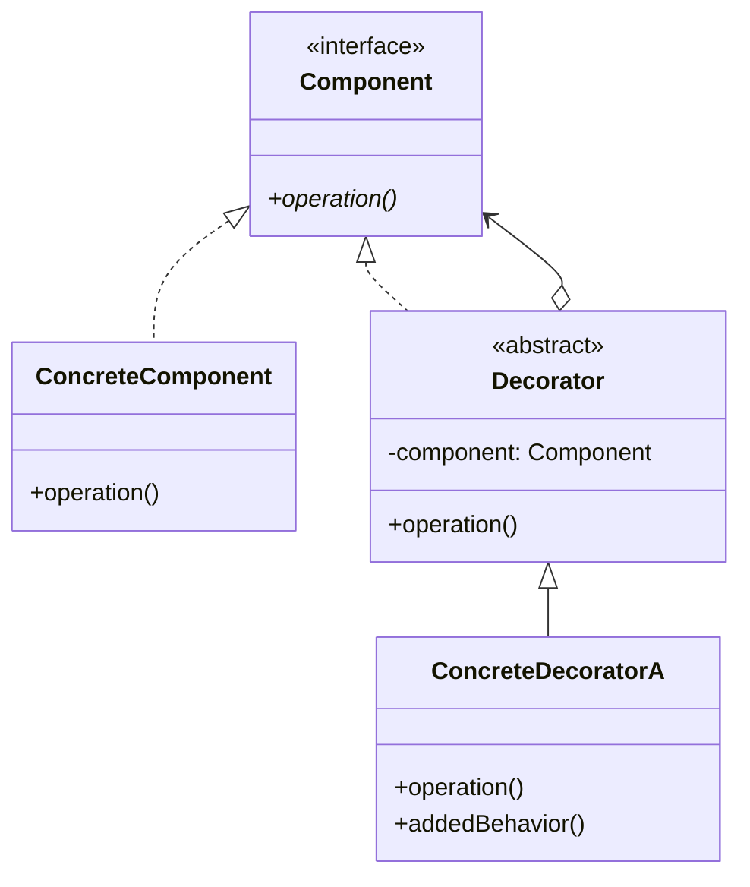
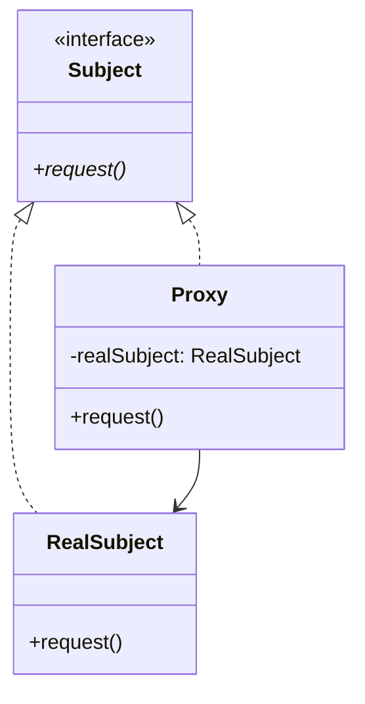

# 📘 Clase 8: Patrones Decorator & Proxy

**Materia:** Orientación a Objetos 2 (OO2) — UNLP  
**Temas:** Patrón **Decorator** (Estructural), patrón **Proxy** (Estructural), comparación de estructuras e intenciones y tipologías de Proxies.

---

## ☕ Patrón Decorator (Estructural)

### 🎯 Propósito
> Añadir responsabilidades a un objeto dinámicamente. Los decoradores ofrecen una alternativa flexible a la herencia para extender funcionalidad sin modificar la clase original.

### Estructura UML



### Participantes
*   **Component (Componente):** Define la interfaz común para los objetos que pueden recibir responsabilidades dinámicamente.
*   **ConcreteComponent (Componente Concreto):** Define un objeto al cual se le pueden añadir responsabilidades adicionales.
*   **Decorator (Decorador):** Mantiene una referencia al objeto `Component` y define una interfaz conforme a la de `Component`.
*   **ConcreteDecorator (Decorador Concreto):** Añade responsabilidades al componente (ejecuta su lógica propia antes o después de delegar en el componente envuelto).

---

### 📦 Caso práctico: Condimentos de Café (Bebidas)

Queremos calcular el precio y descripción de distintas bebidas (Café Solo, Decaf) con múltiples condimentos opcionales (Leche, Chocolate). Evitamos la explosión de subclases (`CafeConLeche`, `CafeConLecheYChocolate`, etc.) utilizando Decorator.

#### Código Java de la Solución

```java
// Bebida.java (Component)
public abstract class Bebida {
    public abstract String getDescripcion();
    public abstract double getCosto();
}

// Espresso.java (ConcreteComponent)
public class Espresso extends Bebida {
    @Override
    public String getDescripcion() { return "Café Espresso"; }
    @Override
    public double getCosto() { return 150.0; }
}

// CondimentoDecorator.java (Decorator)
public abstract class CondimentoDecorator extends Bebida {
    protected Bebida bebidaEnvuelta; // Referencia al componente envuelto

    public CondimentoDecorator(Bebida bebida) {
        this.bebidaEnvuelta = bebida;
    }
}

// ConLeche.java (ConcreteDecorator)
public class ConLeche extends CondimentoDecorator {
    public ConLeche(Bebida bebida) { super(bebida); }

    @Override
    public String getDescripcion() {
        return bebidaEnvuelta.getDescripcion() + ", con Leche";
    }

    @Override
    public double getCosto() {
        return bebidaEnvuelta.getCosto() + 40.0; // Añade costo propio
    }
}

// ConChocolate.java (ConcreteDecorator)
public class ConChocolate extends CondimentoDecorator {
    public ConChocolate(Bebida bebida) { super(bebida); }

    @Override
    public String getDescripcion() {
        return bebidaEnvuelta.getDescripcion() + ", con Chocolate";
    }

    @Override
    public double getCosto() {
        return bebidaEnvuelta.getCosto() + 60.0; // Añade costo propio
    }
}
```

---

## 🛡️ Patrón Proxy (Estructural)

### 🎯 Propósito
> Proporcionar un representante o sustituto de otro objeto para controlar el acceso a él.

### Estructura UML



### Participantes
*   **Subject (Sujeto):** Define la interfaz común para `RealSubject` y el `Proxy`, de modo que el Proxy pueda usarse en cualquier lugar donde se espera el sujeto real.
*   **RealSubject (Sujeto Real):** Define el objeto real que el Proxy representa.
*   **Proxy (Sujeto Sustituto):** Mantiene una referencia al `RealSubject`. Controla el acceso a este y puede encargarse de su creación y borrado.

---

### 📂 Tipologías Comunes de Proxies

1.  **Virtual Proxy (Proxy Virtual):**
    *   **Función:** Retrasa la creación de un objeto costoso (lazy loading) hasta que sea estrictamente necesario.
    *   **Ejemplo:** Cargar imágenes pesadas en un visor de documentos.
2.  **Protection Proxy (Proxy de Protección):**
    *   **Función:** Controla los derechos de acceso al objeto real (seguridad y autorización).
    *   **Ejemplo:** Verificar que el usuario tenga rol de administrador antes de ejecutar un método de borrado.
3.  **Remote Proxy (Proxy Remoto):**
    *   **Función:** Proporciona un representante local de un objeto que reside en otro espacio de direcciones (otra máquina o proceso).
    *   **Ejemplo:** Servicios web REST/gRPC o RMI.

---

### 📦 Caso práctico: Proxy Virtual (Carga de Imágenes)

Una aplicación muestra una lista de imágenes pesadas cargadas desde disco. Usamos un Proxy Virtual para mostrar el nombre inmediatamente y cargar los bytes reales de la imagen solo al llamar a `dibujar()`.

#### Código Java de la Solución

```java
// Grafico.java (Subject)
public interface Grafico {
    void dibujar();
    String getNombreArchivo();
}

// ImagenReal.java (RealSubject)
public class ImagenReal implements Grafico {
    private String nombreArchivo;

    public ImagenReal(String nombre) {
        this.nombreArchivo = nombre;
        this.cargarDesdeDisco(); // Operación pesada
    }

    private void cargarDesdeDisco() {
        System.out.println("Cargando bytes pesados de " + nombreArchivo + " desde disco...");
    }

    @Override
    public void dibujar() {
        System.out.println("Renderizando imagen: " + nombreArchivo);
    }

    @Override
    public String getNombreArchivo() { return nombreArchivo; }
}

// ImagenProxy.java (Proxy Virtual)
public class ImagenProxy implements Grafico {
    private String nombreArchivo;
    private ImagenReal imagenReal; // Referencia al sujeto real diferido

    public ImagenProxy(String nombre) {
        this.nombreArchivo = nombre;
    }

    @Override
    public void dibujar() {
        if (imagenReal == null) {
            // Lazy loading: Creación diferida en el primer uso real
            imagenReal = new ImagenReal(nombreArchivo);
        }
        imagenReal.dibujar();
    }

    @Override
    public String getNombreArchivo() {
        return this.nombreArchivo; // No requiere cargar la imagen real
    }
}
```

---

## ⚔️ Decorator vs Proxy

A pesar de que ambos patrones poseen diagramas de estructura similares (ambos envuelven a otro objeto e implementan la misma interfaz), difieren significativamente en sus **intenciones de diseño**:

| Criterio | Decorator | Proxy |
|---|---|---|
| **Intención de diseño** | **Añadir responsabilidades** dinámicamente sin usar herencia. | **Controlar el acceso** al objeto real (seguridad, optimización, persistencia). |
| **Creación del Objeto Enuelto** | El objeto es instanciado externamente y se le inyecta al decorador mediante su constructor (anidación recursiva). | El Proxy a menudo **instancia o controla el ciclo de vida** del objeto real de forma interna (no recursiva). |
| **Acoplamiento** | El decorador no conoce la clase concreta envuelta (depende de la interfaz `Component`). | El Proxy suele estar estrechamente acoplado a la clase `RealSubject` concreta. |
| **Anidamiento** | Soporta múltiples capas de decoración recursiva (ej. `new Chocolate(new Leche(new Espresso()))`). | Raramente se anidan Proxies entre sí. Suele ser una relación 1 a 1 de protección. |
