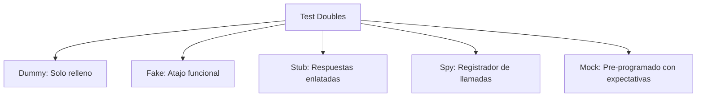

# 📘 Clase 7: Pruebas Unitarias Avanzadas — Test Doubles

**Materia:** Orientación a Objetos 2 (OO2) — UNLP  
**Temas:** Concepto de **Test Doubles** (Dobles de Prueba), taxonomía de Gerard Meszaros (Dummies, Fakes, Stubs, Spies, Mocks), verificación de estado vs verificación de comportamiento, y uso práctico de **Mockito** en JUnit 5.

---

## 🎯 ¿Por qué aislar los Tests de Unidad?

Los tests de unidad deben probar componentes en aislamiento absoluto. Sin embargo, los objetos reales interactúan con colaboradores (ej. pasarelas de pago, APIs externas, bases de datos o sistemas de archivos). Usar colaboradores reales en los tests de unidad introduce serios problemas:
*   **Velocidad:** Las llamadas de red o accesos a disco ralentizan los tests.
*   **Determinismo:** Si la API externa se cae o la base de datos cambia, el test falla aunque nuestro código funcione.
*   **Efectos Secundarios:** No queremos enviar mails reales o realizar cobros de tarjeta reales durante un test.

Para solucionar esto, reemplazamos a los colaboradores reales con **Test Doubles** (dobles de prueba).

---

## 👥 La Taxonomía de Test Doubles (Gerard Meszaros)

Según la clasificación formal de Gerard Meszaros (adoptada por Martin Fowler), existen 5 tipos de dobles de prueba según su complejidad e intención:



### 1. Dummy *(Muñeco)*
*   **Propósito:** Rellenar la lista de parámetros necesarios para invocar un método o constructor.
*   **Comportamiento:** Nunca se le envían mensajes dentro del cuerpo del test. Si se le envía un mensaje, suele fallar con un error.

### 2. Fake *(Falso)*
*   **Propósito:** Proveer una implementación funcional real pero simplificada o que toma atajos que la hacen no apta para producción.
*   **Ejemplo típico:** Una base de datos en memoria (ej. `H2` o un simple `Map` en lugar de una base de datos PostgreSQL real).

### 3. Stub *(Cabo / Respuesta Enlatada)*
*   **Propósito:** Responder con datos pre-programados ante las invocaciones que le haga la clase bajo prueba (SUT - *System Under Test*).
*   **Comportamiento:** Si el SUT le pregunta `getSaldo()`, el Stub responde un valor fijo (ej. `$5000`), sin realizar consultas reales.

### 4. Spy *(Espía)*
*   **Propósito:** Actuar como un Stub, pero registrando información sobre las llamadas que recibe para poder ser verificadas luego.
*   **Comportamiento:** Almacena cuántas veces fue llamado un método, qué parámetros recibió o el orden de ejecución.

### 5. Mock *(Simulador con Expectativas)*
*   **Propósito:** Representar un objeto pre-programado con **expectativas** de las llamadas que se planean recibir.
*   **Verificación:** El Mock verifica a sí mismo al final del test (comprobando que se hayan realizado exactamente las llamadas previstas y con los parámetros correctos).

---

## ⚔️ Verificación de Estado vs Verificación de Comportamiento

A la hora de validar los resultados de un test, existen dos enfoques:

| Característica | Verificación de Estado (Clásica) | Verificación de Comportamiento (Mockista) |
|---|---|---|
| **Enfoque** | Evaluar el valor final de las variables del objeto o el valor de retorno. | Evaluar las interacciones y mensajes enviados a los colaboradores del objeto. |
| **Herramienta** | Asserts tradicionales (ej. `assertEquals(x, y)`). | Mocks y validaciones de invocación (ej. `verify(...)` de Mockito). |
| **Doble Usado** | Stubs, Fakes, o el objeto real directamente. | Mocks y Spies. |
| **Riesgo** | Puede ser difícil verificar el estado si el objeto no expone sus variables (rompe encapsulamiento). | Puede acoplar el test a la estructura interna del código (si refactorizamos la llamada de un método, el test puede romperse aunque el resultado lógico sea el mismo). |

---

## 🤖 Uso Práctico de Mockito en JUnit 5

**Mockito** es la librería estándar de Java para la creación y manipulación de Test Doubles dinámicos en JUnit 5.

### Anotaciones Clave
*   `@Mock`: Crea un mock dinámico de una clase o interfaz.
*   `@Spy`: Envuelve un objeto real permitiendo espiar sus llamadas pero ejecutando su código real por defecto.
*   `@InjectMocks`: Crea una instancia de la clase bajo prueba e inyecta automáticamente los campos anotados con `@Mock` o `@Spy` en ella.

### Caso Práctico: Validador de Pagos

Queremos testear una clase `ProcesadorPedidos` que colabora con un servicio de cobro externo `PasarelaPago`.

```java
// PasarelaPago.java (Colaborador Externo)
public interface PasarelaPago {
    boolean cobrar(String tarjeta, double monto);
}

// ProcesadorPedidos.java (SUT - System Under Test)
public class ProcesadorPedidos {
    private PasarelaPago pasarelaPago;

    public ProcesadorPedidos(PasarelaPago pasarela) {
        this.pasarelaPago = pasarela;
    }

    public boolean procesarCompra(String tarjeta, double total) {
        if (total <= 0) {
            return false;
        }
        // Llamada al colaborador externo
        return this.pasarelaPago.cobrar(tarjeta, total);
    }
}
```

#### Test Unitario con Mockito y JUnit 5

```java
import static org.junit.jupiter.api.Assertions.*;
import static org.mockito.Mockito.*;

import org.junit.jupiter.api.BeforeEach;
import org.junit.jupiter.api.Test;
import org.junit.jupiter.api.extension.ExtendWith;
import org.mockito.Mock;
import org.mockito.junit.jupiter.MockitoExtension;

@ExtendWith(MockitoExtension.class) // Habilita las anotaciones de Mockito
public class ProcesadorPedidosTest {

    @Mock
    private PasarelaPago pasarelaPagoMock; // Doble de prueba dinámico

    private ProcesadorPedidos procesador; // SUT

    @BeforeEach
    public void setUp() {
        // Inicializar el SUT inyectando el Mock
        procesador = new ProcesadorPedidos(pasarelaPagoMock);
    }

    @Test
    public void testCompraExitosa() {
        // 1. Configurar comportamiento del Stub (enlatado de respuesta)
        when(pasarelaPagoMock.cobrar("1234-5678", 1500.0))
            .thenReturn(true);

        // 2. Ejecutar la acción en el SUT
        boolean resultado = procesador.procesarCompra("1234-5678", 1500.0);

        // 3. Verificación de Estado (Asserts)
        assertTrue(resultado);

        // 4. Verificación de Comportamiento (Verify)
        // Comprobar que se llamó exactamente 1 vez al método cobrar con los parámetros previstos
        verify(pasarelaPagoMock, times(1)).cobrar("1234-5678", 1500.0);
    }

    @Test
    public void testCompraConMontoInvalido() {
        // Ejecutar acción
        boolean resultado = procesador.procesarCompra("1234-5678", -50.0);

        // Verificación de Estado
        assertFalse(resultado);

        // Verificación de Comportamiento
        // Comprobar que NUNCA se llamó a cobrar ante montos inválidos
        verify(pasarelaPagoMock, never()).cobrar(anyString(), anyDouble());
    }
}
```
