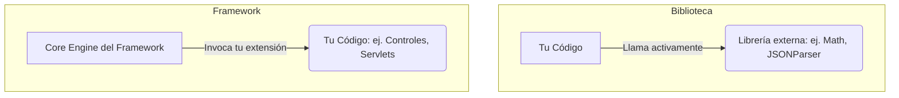

# 📘 Clase 10: Introducción a Frameworks (Parte I)

**Materia:** Orientación a Objetos 2 (OO2) — UNLP  
**Temas:** Definición de **Framework**, diferencias con una Biblioteca (Library), el principio de **Inversión de Control (IoC)**, y análisis práctico del servidor **SingleThreadEchoServer**.

---

## 🏗️ ¿Qué es un Framework?

> Un **Framework** es un conjunto de clases que cooperan entre sí para constituir un diseño reutilizable para una clase específica de software.
> — Ralph Johnson & Brian Foote.

Un framework provee una estructura arquitectónica predefinida y un flujo de ejecución por defecto. Facilita la creación de aplicaciones dentro de un dominio particular (ej. desarrollo web, persistencia, sockets, testing) al resolver la infraestructura repetitiva.

---

## ⚔️ Biblioteca (Library) vs Framework

La diferencia fundamental entre ambos radica en **quién tiene el control del flujo de ejecución**:



| Criterio | Biblioteca (Library) | Framework |
|---|---|---|
| **Control del flujo** | **Tu código** tiene el control. Decidís cuándo llamar a la función de la biblioteca. | **El Framework** tiene el control. Corre el ciclo principal y llama a tu código cuando lo necesita. |
| **Inversión de Control** | No posee IoC. | **Sí posee IoC** (Hollywood Principle). |
| **Acoplamiento** | Tu código depende de la biblioteca, pero es fácil de reemplazar en la arquitectura. | Tu código se inyecta o extiende las clases del framework, adaptándose a su arquitectura rígida. |

---

## 🎬 Inversión de Control (IoC) y Hollywood Principle

El principio de diseño clave de los frameworks es la **Inversión de Control (IoC)**, también conocido como el **Principio de Hollywood**:

> *"Don't call us, we'll call you"* *(No nos llames, nosotros te llamaremos).*

En lugar de que tu aplicación instancie y ejecute el ciclo principal del programa (por ejemplo, el bucle de escucha de sockets o el despachador de peticiones HTTP), el framework se encarga de ese trabajo pesado (bucle congelado) y delega la personalización de las acciones a tu código mediante la invocación de:
1.  **Hook Methods (Métodos Plantilla):** Métodos que sobreescribís en una subclase.
2.  **Callbacks / Listeners:** Interfaces que implementás y registrás en el framework para ser notificadas ante eventos.

---

## 🔌 Frozen Spots vs Hot Spots (Conceptos Clave)

El diseño de un framework divide el código en dos tipos de zonas:

| Zona | Descripción | Ejemplo |
|---|---|---|
| **Frozen Spots** *(Puntos Congelados)* | Partes fijas e inmutables del framework. Definen la arquitectura, el flujo del ciclo de vida y la infraestructura común que no varía de aplicación en aplicación. | Bucle `while(true)` de escucha de un servidor, apertura de conexiones de base de datos. |
| **Hot Spots** *(Puntos Calientes / Extensión)* | Puntos de variación diseñados intencionalmente para ser redefinidos o completados por el programador de la aplicación final. | La lógica de cómo procesar una petición HTTP específica o qué formato de respuesta enviar. |

---

## 📦 Caso Práctico: SingleThreadEchoServer

Analizamos la implementación de un framework sencillo de servidores de socket en Java de un solo hilo para comprender estos conceptos.

### Código del Core del Framework (Frozen Spot)

```java
import java.io.*;
import java.net.*;

public abstract class SocketServerFramework {
    private int puerto;

    public SocketServerFramework(int puerto) {
        this.puerto = puerto;
    }

    // CICLO PRINCIPAL (FROZEN SPOT)
    public final void iniciar() {
        System.out.println("Iniciando servidor en puerto " + puerto);
        try (ServerSocket serverSocket = new ServerSocket(puerto)) {
            while (true) {
                // Escucha de conexiones
                Socket clientSocket = serverSocket.accept();
                
                // Invocación al HOT SPOT (Inversión de Control)
                this.atenderCliente(clientSocket);
            }
        } catch (IOException e) {
            System.err.println("Error en el servidor: " + e.getMessage());
        }
    }

    // HOT SPOT: Operación primitiva que define la extensión
    protected abstract void atenderCliente(Socket socket) throws IOException;
}
```

### Código de la Aplicación Final (Hot Spot)

El desarrollador que utiliza nuestro framework no tiene que lidiar con la creación del `ServerSocket` ni el bucle infinito; solo extiende la clase e implementa el método `atenderCliente`.

```java
// EchoServerApp.java (Personalización del cliente)
public class EchoServerApp extends SocketServerFramework {

    public EchoServerApp(int puerto) {
        super(puerto);
    }

    @Override
    protected void atenderCliente(Socket socket) throws IOException {
        // Implementación de un servidor Echo (devuelve lo mismo que recibe)
        try (
            BufferedReader in = new BufferedReader(new InputStreamReader(socket.getInputStream()));
            PrintWriter out = new PrintWriter(socket.getOutputStream(), true)
        ) {
            String inputLine;
            while ((inputLine = in.readLine()) != null) {
                if (inputLine.equalsIgnoreCase("salir")) {
                    out.println("Adiós!");
                    break;
                }
                out.println("Echo: " + inputLine);
            }
        } finally {
            socket.close(); // Liberación
        }
    }

    public static void main(String[] args) {
        // Ejecución
        SocketServerFramework server = new EchoServerApp(8080);
        server.iniciar(); // Inicia el ciclo principal del framework
    }
}
```
