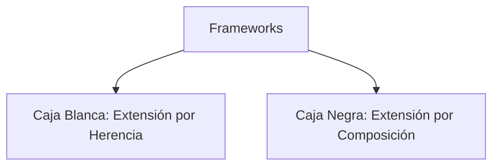

# 📘 Clase 11: Frameworks (Parte II) — Caja Blanca vs Caja Negra

**Materia:** Orientación a Objetos 2 (OO2) — UNLP  
**Temas:** Clasificación de frameworks según su forma de extensión: **Caja Blanca (White-box)** vs **Caja Negra (Black-box)**, comparación técnica y patrones de diseño utilizados en su construcción.

---

## 🎨 Tipologías de Frameworks

Los frameworks se clasifican principalmente en base a **cómo el programador extiende o personaliza los Hot Spots** para inyectar su lógica de negocio:



---

## 🏢 1. Frameworks de Caja Blanca (White-box)

La personalización se realiza mediante la **Herencia** y el polimorfismo de subclases.

*   **Mecanismo:** El desarrollador extiende una clase base provista por el framework y sobreescribe ciertos métodos abstractos (*operaciones primitivas*) o métodos gancho (*hook methods*).
*   **Patrón de diseño dominante:** **Template Method**.
*   **Características:**
    *   **Acoplamiento alto:** Las subclases de la aplicación están fuertemente acopladas a la estructura interna de la superclase del framework.
    *   **Estático:** Las extensiones se resuelven en tiempo de compilación. No se pueden alterar dinámicamente en runtime.
    *   **Facilidad de desarrollo inicial:** Es relativamente sencillo de diseñar para el creador del framework.

```java
// Ejemplo Caja Blanca: Extensión por Herencia
public class MiServicio extends ServicioBaseFramework {
    @Override
    protected void ejecutarPasoEspecifico() {
        // Lógica de negocio aquí
    }
}
```

---

## 🖤 2. Frameworks de Caja Negra (Black-box)

La personalización se realiza mediante la **Composición** y la delegación de objetos.

*   **Mecanismo:** El desarrollador define componentes independientes que implementan interfaces específicas provistas por el framework, y luego registra o inyecta estos componentes en el motor del framework (*plugs* o complementos).
*   **Patrón de diseño dominante:** **Strategy**, **State**, **Observer**.
*   **Características:**
    *   **Bajo acoplamiento:** Los componentes solo dependen de interfaces estables. No conocen el código interno de la clase que los invoca.
    *   **Dinámico:** Las estrategias o componentes se pueden registrar, intercambiar o reconfigurar en tiempo de ejecución (runtime).
    *   **Mayor abstracción:** Requiere un diseño de interfaces muy maduro y robusto.

```java
// Ejemplo Caja Negra: Extensión por Composición y Registro
public class MiAlgoritmoEspecifico implements AlgoritmoPlugin {
    @Override
    public void ejecutar() { ... }
}

// Registro dinámico en el framework
FrameworkEngine.registerPlugin(new MiAlgoritmoEspecifico());
```

---

## ⚔️ Tabla Comparativa: Caja Blanca vs Caja Negra

| Criterio | Caja Blanca (White-box) | Caja Negra (Black-box) |
|---|---|---|
| **Mecanismo de Extensión** | Herencia (subclassing). | Composición y delegación. |
| **Punto de acoplamiento** | Clase abstracta / Superclase. | Interfaces (contracts). |
| **Momento de configuración** | Tiempo de compilación (estático). | Tiempo de ejecución (dinámico / runtime). |
| **Facilidad de uso** | Requiere conocer y entender detalles de la superclase (acceso `protected`). | Más fácil de usar; solo requiere conocer la interfaz pública de registro. |
| **Facilidad de diseño** | Más fácil de diseñar e implementar en fases tempranas. | Muy difícil de diseñar; requiere identificar componentes estables y parametrizables. |
| **Flexibilidad** | Limitada por la jerarquía de herencia única de Java. | Alta; permite combinar múltiples interfaces y comportamientos libremente. |

> [!TIP]
> **Evolución Temporal de un Framework:** La mayoría de los frameworks exitosos nacen como frameworks de **caja blanca** (porque es más fácil escribir una superclase abstracta con Template Method) y, a medida que maduran y se refactorizan, evolucionan hacia frameworks de **caja negra** (reemplazando herencia por composición para ganar flexibilidad y desacoplamiento).

---

## 🧩 Patrones de Diseño Usados en la Arquitectura de Frameworks

La construcción de frameworks de nivel profesional se apoya fuertemente en patrones GoF para resolver la infraestructura de inversión de control de forma elegante:

1.  **Template Method:** El rey de los frameworks de caja blanca. Define la secuencia de llamadas y expone los hot spots abstractos.
2.  **Strategy:** Utilizado en caja negra para parametrizar algoritmos alternativos.
3.  **Observer:** Permite el registro dinámico de escuchas (*Listeners*) que reaccionan ante eventos del ciclo de vida del framework.
4.  **Factory Method:** Permite que el framework solicite la creación de objetos relacionados sin acoplarse a clases concretas (ej. crear el tipo de socket o formateador de respuestas correspondiente).
