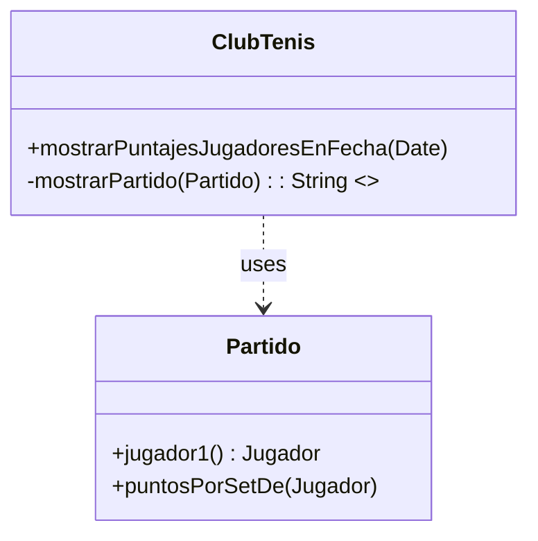
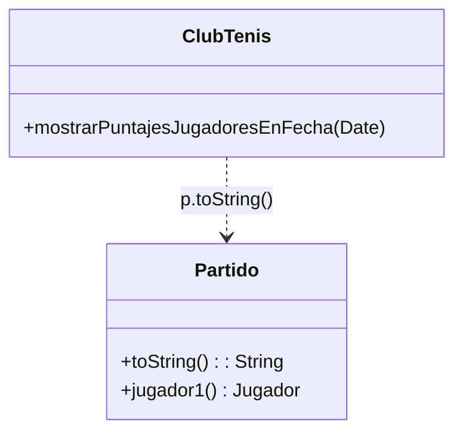
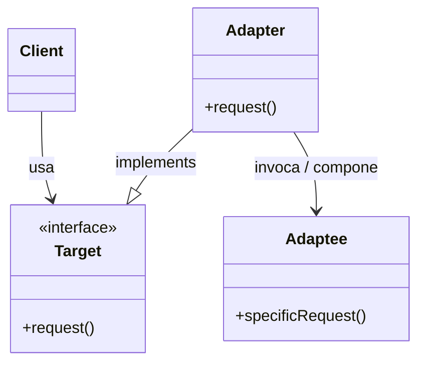
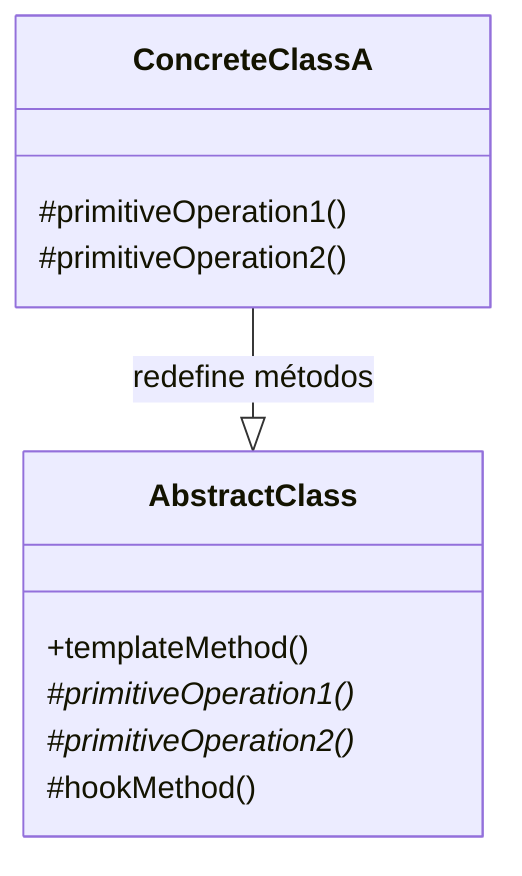

# Resumen: Refactoring y Patrones de Diseño (OO2)

Este documento es un resumen exhaustivo diseñado para estudiar los conceptos vistos en las primeras clases, enfocado en el código limpio (*Clean Code*), reestructuración y patrones orientados a objetos.

---

## Parte A: Teoría y Conceptos de Refactoring

Diseñar un buen software la primera vez es difícil e improbable. Por esto mismo, a medida que los requerimientos cambian, el sistema inevitablemente degrada si no trabajamos para evitarlo.

### 📜 Las Leyes de Lehman (Evolución del Software)
*   **Continuing Change (Cambio Continuo):** Los sistemas deben adaptarse continuamente a su contexto o se volverán insatisfactorios.
*   **Continuing Growth (Crecimiento Continuo):** La funcionalidad siempre se incrementa para mantener la satisfacción del cliente.
*   **Increasing Complexity (Complejidad Creciente):** A medida que un sistema evoluciona, su complejidad se incrementa a menos que se trabaje para evitarlo (deuda técnica).
*   **Declining Quality (Calidad Menguante):** La calidad interna declinará a menos que se aplique un mantenimiento riguroso.

### ♻️ ¿Qué es el Refactoring?
> **Refactoring (Sustantivo):** Es una transformación que se realiza en la estructura interna del código para hacerlo más fácil de entender y más barato de modificar, pero que **preserva el comportamiento observable**.

**Regla de Oro:** Si tras los cambios el sistema falla, rompe sus interfaces públicas o no pasan los tests de unidad, **NO fue un refactoring**.

### 🎩 La Metáfora de los "Dos Sombreros" (Kent Beck)
Durante el desarrollo, solemos cambiar entre dos actitudes/sombreros. **Solo podemos usar un sombrero a la vez:**
1.  **Sombrero de agregar funcionalidad:** Solo pensamos en cumplir con el requerimiento. Si agregamos código, validamos con nuevos tests.
2.  **Sombrero de refactorización:** **Exclusivamente con los tests en verde**. No cambiamos ni agregamos lógica, solamente reorganizamos y reestructuramos el código actual. Si un test falla y tenemos este sombrero, volvimos atrás y deshicimos el "bug" insertado.

### ⚙️ Herramientas Automáticas y el AST
Dado que el refactoring manual es propenso a errores, usamos herramientas que lo automatizan. El elemento clave que le permite a una IDE (como Eclipse o IntelliJ) comprobar que el cambio no romperá la compilación ni el comportamiento, es el **AST (Abstract Syntax Tree)** sumado a la **Symbol Table**. Las transformaciones se logran reescribiendo los nodos y ramas del AST.

### 👃 Code Smells (Malos olores)
Son síntomas en el código de que existe un problema de diseño o mala estructuración. Los más comunes son:
*   **Código Duplicado (*Duplicated Code*):** La misma lógica o porción está en varios lugares. Dificulta el cambio porque al corregir un bug hay que propagarlo a todos los clones. (Ej: Se cura con *Extract Method* o *Pull Up Method*).
*   **Clase Grande (*Large Class*):** Una clase intenta hacer demasiado, baja cohesión.
*   **Método Largo (*Long Method*):** Acumula mucha lógica y variables, dificultando la legibilidad e impidiendo la reusabilidad.
*   **Envidia de Atributo (*Feature Envy*):** Un método de la clase `A` se pasa consultando atributos o métodos de la clase `B` para hacer su trabajo. (Generalmente se soluciona moviendo el método a `B`).
*   **Condicionales y Switch (*Switch Statements*):** Estructuras como `if/else` que preguntan por el tipo u origen del objeto, revelando que en verdad hacen falta subclases y polimorfismo.

---

## Parte B: Catálogo y Mecánicas de Refactoring

Un *refactoring* viene siempre con sus **precondiciones** (qué me permite aplicarlo con seguridad) y su **mecánica** (el paso a paso necesario para no romper nada).

### 1. Extract Method (y Rename Method)
**Motivación:** Descomponer un método largo y recuperar piezas reusables.

*   **Mecánica:**
    1. Crear un método nuevo con nombre expresivo (no necesite comentarios).
    2. Copiar bloque problemático de código.
    3. Revisar variables locales originales: pasarlas como parámetro si se solo se consultan. Si modifican su valor, retornarlas.
    4. Reemplazar código original con la llamada y compilar.

**Ejemplo - Método Largo Original:**
```java
public class ClubTenis {
  public String mostrarPuntajesJugadoresEnFecha(LocalDate fecha) {
    // ... búsqueda de partidos ...
    for (Partido p : partidosFecha) {
      // INICIO BLOQUE LARGO, DIFÍCIL DE LEER //
      totalGames = 0;
      Jugador j1 = p.jugador1();
      result += "Partido: \n";
      result += "Puntaje del jugador: " + j1.nombre() + ": ";
      for (int gamesGanados : p.puntosPorSetDe(j1)) {
        result += Integer.toString(gamesGanados) + ";";
        totalGames += gamesGanados;
      }
      // FIN BLOQUE LARGO //
    }
    return result;
  }
}
```

**Ejemplo - Método Extraído:**
```java
public class ClubTenis {
  public String mostrarPuntajesJugadoresEnFecha(LocalDate fecha) {
    for (Partido p : partidosFecha) {
       result += this.mostrarPartido(p); // Llama al método extraído
    }
    return result;
  }

  // MÉTODO NUEVO EXTRAIDO
  private String mostrarPartido(Partido partido) {
    int totalGames = 0;
    Jugador j1 = partido.jugador1();
    String result = "Partido: \n Puntaje del jugador: " + j1.nombre() + ": ";
    for (int games : partido.puntosPorSetDe(j1)) { /* ... */ }
    return result;
  }
}
```

### 2. Move Method (Mover Método)
**Motivación:** Combatir la *Envidia de Atributo*. ¿Por qué un método en `ClubTenis` (como `mostrarPartido`) se la pasa pidiéndole estado a `Partido` en vez de pertenecer a `Partido`?

*   **Mecánica:** Declarar método en clase que posee la información. Ajustar parámetros y variables en el destino. Cambiar vieja implementación a delegación, o borrarla.

**EVOLUCIÓN ESTRUCTURAL Y DE DEPENDENCIAS:**

Se aplica **Move Method** y **Rename Method** (para transformarlo en un `toString()`):



### 3. Replace Conditional with Polymorphism (Reemplazar condicional)
**Motivación:** Cuando encontramos lógica tipo *IF* dependiendo del grupo u origen del objeto (e.g. Zona A, Zona B), debemos introducir superclase e hijos.

*   **Mecánica:** Armar jerarquía y un método que redefina en cada subclase la porción que estaba en la rama del `if`. Las ramas se borran de la superclase delegando la resolución en un método abstracto.

**Antes del Refactoring:**
```java
public class Jugador {
  public String puntosEnPartidoToString(Partido partido) {
    // ...
    // CODIGO SMELL: CONDICIONAL TIPO 'SWITCH' SUCIO E IMPOSIBLE DE MANTENER
    if (this.zona() == "A") 
       result += Integer.toString(totalGames * 2);
    if (this.zona() == "B") 
       result += Integer.toString(totalGames);
    if (this.zona() == "C") {
       if (partido.ganador() == this) result += Integer.toString(totalGames);
       else result += Integer.toString(0);
    }
    return result;
  }
}
```

**Después de aplicar jerarquía y Replace Temp With Query:**
Se aprovecha de extraer también la variable temperal de cálculos a un método *Query* `totalGamesEnPartido()`.

```java
public abstract class Jugador {
  public String puntosEnPartidoToString(Partido partido) {
    String result = "Puntaje del jugador: " + nombre() + ": ";
    for (int gamesGanados: partido.puntosPorSetDe(this)) 
      result += Integer.toString(gamesGanados) + ";";
    result += "Puntos del partido: " + Integer.toString(this.puntosGanadosEnPartido(partido));
    return result;   
  }
  
  public int totalGamesEnPartido(Partido partido) {
    int total = 0;
    for (int g: partido.puntosPorSetDe(this)) { total += g; }
    return total;
  }

  // MÉTODO ABSTRACTO EN REEMPLAZO DE LA LOGICA DEL IF
  public abstract int puntosGanadosEnPartido(Partido partido);
}

// NUEVA SUBCLASE
public class JugadorZonaA extends Jugador {
  @Override
  public int puntosGanadosEnPartido(Partido partido) {
    return totalGamesEnPartido(partido) * 2;
  }
}
```


---

## Parte C: Patrones de Diseño Relacionados a la Reutilización

Un patrón es una solución a un problema recurrente en el diseño orientado a objetos. 

### ⚙️ Patrón Adapter (Adaptador)
*   **Intención:** Convertir una interfaz actual de una clase en otra interfaz que sea exactamente lo que nuestros clientes esperan encontrar o invocar. Colabora cuando clases por defecto no son "enchufables".

**Estructura del Adapter:**


**Ejemplo (Sensores y Actuadores en IoT):**
Nuestra jerarquía de nuestro dominio solo entiende implementaciones de la clase `Actuador` que responda al mensaje `update(Sensor)`. Qué ocurre si queremos agregar envíos por Telegram (`TelegramNotifier`) el cual proviene del exterior y no nos respeta la firma? Lo molemos en un **Adapter**.

*   **Target:** `Actuador` abstracto.
*   **Adaptee:** `TelegramNotifier` (La biblioteca cerrada y externa).
*   **Adapter:** `TelegramAdapter`

```java
// Adapter
public class TelegramAdapter extends Actuador {
  private TelegramNotifier notifier; 
  
  // Encajamos la firma obligatoria 'Target' con lo específico de 'Adaptee'
  @Override
  public void update(Sensor sensor) {
    this.notifier.sendNotification("mi_chat_id", "Cambio en sensor a valor: " + sensor.getValor());
  }
}
```

### 🖼️ Patrón Template Method
*   **Intención:** Establecer de una vez y para todos el "esqueleto" e hilo de un algoritmo general en una operación (el *Template Method*), permitiéndole deferir los "agujeros" (sus pasos primitivos) para que lo completen las subclases sin pisar el molde ni alterarle el orden.

**Estructura del Template Method:**


**Ejemplo de Exportador:**
Varios exportadores de CSV o PDF repiten siempre la misma rutina de abrir un archivo, procesar filas abstractas, y de cerrarlo independientemente de quien es.

**Código Naive (Código Duplicado):**
```java
class CsvReportExporterNaive {
  public void export(ReportData data, String filePath) {
    System.out.println("Common: Preparing data...");
    System.out.println("Common: Opening file...");
    System.out.println("Specific: Writing CSV Header...");
    System.out.println("Specific: Writing CSV rows...");
    System.out.println("Common: Closing...");
  }
}
// Un PdfExporter duplicaría todos los mensajes "Common"...
```

**Solución Patrón Template Method:**
```java
// Abstract Class
public abstract class ReportExporter {
  
  // EL TEMPLATE METHOD (El cascarón / esqueleto con el flujo). Generalmente es FINAL.
  public final void export(ReportData data, String filePath) {
    prepareData();
    openFile(filePath);
    writeHeader();         // <--- Delega la responsabilidad en las subclases
    writeData(data);       // <--- 
    writeFooter();
    closeFile();
  }

  protected void prepareData() { /* Común */ }
  protected void openFile(String path) { /* Común */ }
  protected void closeFile() { /* Común */ }
  
  // primitive operations (Abstractas, forzando la implementación específica)
  protected abstract void writeHeader();
  protected abstract void writeData(ReportData data);
  protected void writeFooter() { /* Vacio u opcional, conocido como Hook */ }
}

// Concrete Class
public class CsvReportExporter extends ReportExporter {
  @Override
  protected void writeHeader() {
    System.out.println("Formateando header en CSV de coma sep...");
  }
  
  @Override
  protected void writeData(ReportData data) {
    System.out.println("Imprimiendo for loop para el CSV...");
  }
}
```
*   **Ventaja:** Inversión de control ("Don't call us, we'll call you"). Ahora las extensiones concretas nunca pueden saltear el "cerrar" o "abrir" el archivo general, la arquitectura padre te gobierna el flujo. 
